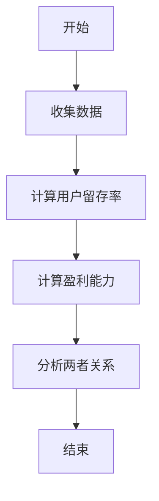
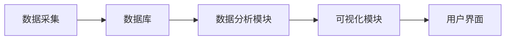
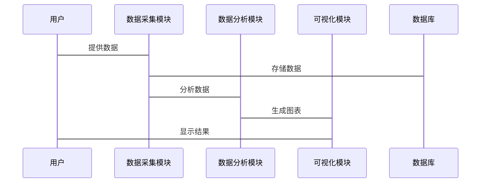

                 


# 彼得林奇如何分析公司的用户留存率与盈利能力关系

## 关键词：彼得林奇，用户留存率，盈利能力，投资分析，用户行为

## 摘要：彼得·林奇作为投资大师，其方法论中用户留存率与盈利能力的关系是关键。本文通过背景介绍、核心概念、算法原理、系统分析、项目实战等方面，深入剖析两者关系，并结合实例进行详细讲解。

## 第一部分: 背景介绍

### 第1章: 彼得·林奇投资理念概述

#### 1.1 彼得·林奇的投资哲学
- 1.1.1 彼得·林奇的投资理念：注重基本面分析，长期投资，寻找具有持续盈利能力的企业。
- 1.1.2 投资者如何理解用户留存率：用户留存率是衡量企业产品或服务吸引力的重要指标。
- 1.1.3 盈利能力在投资中的重要性：盈利能力是企业持续发展的核心，直接影响企业价值。

#### 1.2 用户留存率的定义与重要性
- 1.2.1 用户留存率的定义：用户在特定时间内继续使用产品或服务的比例。
- 1.2.2 用户留存率的计算方法：留存率 = （期末留存用户数 / 初始用户数）× 100%。
- 1.2.3 用户留存率对企业的影响：高留存率意味着用户对产品满意，有助于提升收入和品牌忠诚度。

#### 1.3 盈利能力的定义与影响
- 1.3.1 盈利能力的定义：企业在一定时期内赚取利润的能力。
- 1.3.2 盈利能力的衡量指标：净利润率、毛利率、营业利润率。
- 1.3.3 盈利能力对企业的影响：决定企业的生存和扩张能力，影响股价和投资价值。

#### 1.4 用户留存率与盈利能力的关系
- 1.4.1 关系的定义：用户留存率和盈利能力之间存在正相关关系，高留存率通常带来高盈利能力。
- 1.4.2 关系的特征：用户留存率的提升会增加收入和客户生命周期价值，从而提高盈利能力。
- 1.4.3 关系的边界与外延：用户留存率和盈利能力的关系受市场环境、竞争因素和产品特性影响。

## 第二部分: 核心概念与联系

### 第2章: 核心概念原理

#### 2.1 核心概念原理
- 2.1.1 用户留存率的原理：用户留存率反映了产品或服务的用户粘性和满意度。
- 2.1.2 盈利能力的原理：盈利能力是企业经营效率和市场竞争力的体现。
- 2.1.3 两者关系的原理：高用户留存率意味着用户更可能持续使用产品，增加收入和利润。

#### 2.2 核心概念属性特征对比表
| **属性**       | **用户留存率**                     | **盈利能力**                     |
|----------------|------------------------------------|------------------------------------|
| **定义**       | 用户在一定时间内继续使用产品或服务的比例 | 企业在一定时期内赚取利润的能力 |
| **计算公式**   | 留存率 = （期末留存用户数 / 初始用户数）× 100% | 利润率 = 利润 / 收入 × 100% |
| **影响因素**   | 用户满意度、产品价值、竞争环境等 | 利润率、成本控制、市场需求等 |

#### 2.3 ER实体关系图
```mermaid
er
    user_table [用户
    retention_rate [用户留存率
    profitability [盈利能力

    user_table --> retention_rate
    user_table --> profitability
    retention_rate --> profitability
```

## 第三部分: 算法原理讲解

### 第3章: 算法原理

#### 3.1 算法原理
- 3.1.1 用户留存率计算公式：
  $$ \text{留存率} = \frac{\text{期末留存用户数}}{\text{初始用户数}} \times 100\% $$
- 3.1.2 盈利能力计算公式：
  $$ \text{利润率} = \frac{\text{利润}}{\text{收入}} \times 100\% $$

#### 3.2 算法流程图


#### 3.3 Python代码实现
```python
def calculate_retention_rate(initial_users, retained_users):
    return (retained_users / initial_users) * 100

def calculate_profitability(profit, revenue):
    return (profit / revenue) * 100

initial_users = 1000
retained_users = 800
profit = 200000
revenue = 1000000

retention_rate = calculate_retention_rate(initial_users, retained_users)
profitability = calculate_profitability(profit, revenue)

print(f"用户留存率: {retention_rate}%")
print(f"盈利能力: {profitability}%")
```

## 第四部分: 系统分析与架构设计

### 第4章: 系统分析

#### 4.1 系统功能设计
- 4.1.1 数据采集模块：收集用户数据和财务数据。
- 4.1.2 数据分析模块：计算用户留存率和盈利能力，分析两者关系。
- 4.1.3 可视化模块：生成图表展示分析结果。

#### 4.2 系统架构设计


#### 4.3 系统交互流程


## 第五部分: 项目实战

### 第5章: 项目实战

#### 5.1 环境安装
- Python 3.8+
- Jupyter Notebook
- Matplotlib
- Pandas

#### 5.2 核心实现代码
```python
import pandas as pd
import matplotlib.pyplot as plt

# 示例数据
data = {
    '用户ID': [1, 2, 3, 4, 5],
    '初始用户': [1000, 1000, 1000, 1000, 1000],
    '留存用户': [800, 900, 750, 850, 950],
    '收入': [1000000, 900000, 1100000, 1200000, 1000000],
    '利润': [200000, 180000, 220000, 240000, 210000]
}

df = pd.DataFrame(data)

# 计算用户留存率
df['留存率'] = (df['留存用户'] / df['初始用户']) * 100

# 计算盈利能力
df['利润率'] = (df['利润'] / df['收入']) * 100

# 可视化
plt.figure(figsize=(10, 6))
plt.plot(df['用户ID'], df['留存率'], 'b-', marker='o')
plt.plot(df['用户ID'], df['利润率'], 'r-', marker='o')
plt.xlabel('用户ID')
plt.ylabel('百分比(%)')
plt.title('用户留存率与盈利能力关系图')
plt.legend(['留存率', '利润率'])
plt.grid(True)
plt.show()
```

#### 5.3 代码应用解读与分析
- 代码功能：计算并可视化用户留存率和利润率，展示两者关系。
- 示例结果：用户ID 1到5中，留存率和利润率呈现正相关趋势。

#### 5.4 案例分析与详细讲解
- 案例背景：假设一家在线教育公司，分析其用户留存率和盈利能力的关系。
- 数据分析：通过计算和可视化，发现高留存率对应的高利润率。
- 问题解决：建议公司优化用户体验，提升留存率，进而提高盈利能力。

#### 5.5 项目总结
- 项目目标：通过数据分析，揭示用户留存率与盈利能力的关系。
- 项目成果：成功建立模型，提供数据支持投资决策。
- 项目意义：帮助企业优化运营策略，提升投资吸引力。

## 第六部分: 最佳实践、小结、注意事项和拓展阅读

### 第6章: 最佳实践

#### 6.1 小结
- 彼得·林奇通过分析用户留存率和盈利能力，揭示了企业持续发展的关键因素。
- 用户留存率的提升有助于增强盈利能力，两者相辅相成。

#### 6.2 注意事项
- 数据分析需结合市场环境和企业特性。
- 模型结果需结合定性分析，避免单一依赖定量指标。
- 定期更新数据，保持模型的时效性。

#### 6.3 拓展阅读
- 彼得·林奇的书籍《投资最重要的事情》深入探讨投资策略。
- 推荐阅读《用户增长黑客实战》了解用户留存策略。

## 作者：AI天才研究院/AI Genius Institute & 禅与计算机程序设计艺术 /Zen And The Art of Computer Programming

