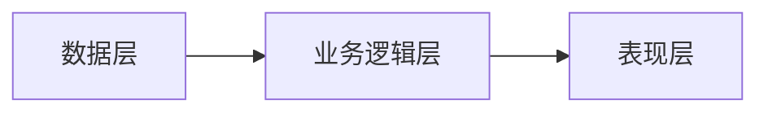

                 

# 彼得林奇如何分析公司的用户留存策略

> 关键词：用户留存策略、彼得·林奇、用户留存分析、用户生命周期、用户留存模型

> 摘要：本文从彼得·林奇的分析方法出发，详细探讨用户留存策略的核心概念、数学模型、系统架构设计及项目实战。通过实际案例和系统性分析，揭示用户留存策略在企业价值评估中的重要性，并结合具体步骤和代码示例，帮助读者掌握如何通过用户留存策略优化企业价值。

---

## 第一章：用户留存策略的背景与重要性

### 1.1 什么是用户留存策略

用户留存策略是指企业通过分析用户行为，优化用户体验，提高用户在产品或服务中的持续使用率和忠诚度的一系列策略。用户留存的核心目标是减少用户流失，延长用户生命周期，从而为企业创造更大的价值。

#### 1.1.1 用户留存的定义

用户留存通常指的是用户在某个时间段内持续使用产品或服务的行为。留存率是衡量用户留存效果的重要指标，公式为：

$$ 留存率 = \frac{实际留存用户数}{初始用户数} $$

其中，初始用户数是指在某个时间点接触到的用户总数，而实际留存用户数是指在后续时间段内仍然在使用产品或服务的用户数。

#### 1.1.2 用户留存与用户增长的关系

用户留存与用户增长密切相关。用户增长是企业获取新用户的阶段，而用户留存则是确保用户持续使用产品的阶段。用户留存率的高低直接影响企业的用户生命周期价值（Customer Lifetime Value，CLV）。如果用户留存率低，即使获取大量新用户，企业的整体价值也难以提升。

#### 1.1.3 用户留存在企业价值中的作用

用户留存是企业价值的核心驱动力之一。高留存率意味着用户对产品或服务的满意度较高，企业的市场竞争力更强，同时也更容易通过现有用户获取更多的收入和利润。

### 1.2 彼得·林奇的分析方法

彼得·林奇是美国著名的职业棒球运动员，以其在棒球界的历史地位和成就而闻名。然而，这里我们提到的“彼得·林奇”可能是指他在棒球领域的分析方法，而非投资领域。不过，这里我们主要讨论的是用户留存策略的分析方法。

#### 1.2.1 彼得·林奇的分析风格

彼得·林奇以其对棒球比赛的深入分析和对球员表现的精准预测而闻名。他的分析方法注重数据的深度挖掘和对球员表现的全面评估。将这种方法应用于用户留存策略分析，我们需要从用户行为数据中提取有价值的信息，从而优化用户留存策略。

#### 1.2.2 用户留存策略在投资分析中的重要性

在投资分析中，用户留存策略可以帮助投资者评估企业的市场竞争力和未来发展潜力。通过分析用户留存率，投资者可以更好地判断企业的用户忠诚度和市场地位，从而做出更明智的投资决策。

#### 1.2.3 如何通过用户留存策略评估企业价值

企业价值评估需要综合考虑多个因素，包括收入、利润、市场份额等。用户留存率是衡量企业用户忠诚度和市场竞争力的重要指标，可以通过用户留存率的分析，评估企业的持续发展能力和市场地位。

---

## 第二章：用户留存策略的核心模型与分析方法

### 2.1 用户留存的数学模型与分析方法

#### 2.1.1 用户留存的数学模型

用户留存的数学模型主要基于概率论和统计学。通过分析用户行为数据，我们可以构建用户留存的概率模型，预测用户的留存情况。

#### 2.1.2 留存率的计算公式

用户留存率的计算公式为：

$$ 留存率 = \frac{实际留存用户数}{初始用户数} $$

其中，初始用户数是指在某个时间点接触到的用户总数，而实际留存用户数是指在后续时间段内仍然在使用产品或服务的用户数。

#### 2.1.3 用户生命周期模型

用户生命周期模型将用户分为几个阶段：获取阶段、活跃阶段、衰退阶段和流失阶段。通过分析用户在不同阶段的行为数据，我们可以更好地理解用户留存的规律。

### 2.2 用户留存的漏斗模型

漏斗模型是一种常用的用户行为分析模型，可以帮助我们理解用户在不同阶段的流失情况。漏斗的每一层代表一个用户筛选阶段，用户在每一层中都有可能流失或继续前进。

#### 2.2.1 漏斗模型的构建

漏斗模型的构建通常包括以下几个阶段：

1. **用户获取**：用户首次接触到产品或服务。
2. **用户激活**：用户完成注册或首次使用产品。
3. **用户活跃**：用户在产品或服务中表现出活跃行为。
4. **用户付费**：用户进行付费行为。
5. **用户留存**：用户持续使用产品或服务。

#### 2.2.2 漏斗模型的优化

通过分析漏斗模型中每个阶段的用户流失情况，我们可以找到用户留存的关键瓶颈，并采取相应的优化措施。例如，如果用户在激活阶段流失率较高，我们可以优化激活流程，提高用户的留存率。

### 2.3 用户留存的马尔可夫链模型

马尔可夫链模型是一种用于描述系统状态转移的数学模型，可以用于分析用户在不同状态之间的转移情况。

#### 2.3.1 马尔可夫链模型的构建

马尔可夫链模型的构建包括以下几个步骤：

1. **定义状态**：根据用户行为数据，定义用户在不同阶段的状态。例如，用户可以处于新用户、活跃用户、付费用户和流失用户四种状态。
2. **定义转移概率矩阵**：根据用户行为数据，计算用户在不同状态之间的转移概率。
3. **构建马尔可夫链**：通过转移概率矩阵，构建马尔可夫链模型，分析用户在不同状态之间的转移情况。

#### 2.3.2 马尔可夫链模型的应用

马尔可夫链模型可以用于预测用户的未来行为，帮助我们更好地理解用户留存的规律。例如，通过分析用户在不同状态之间的转移概率，我们可以预测用户在未来某个时间段内的留存率。

---

## 第三章：用户留存策略的系统分析与架构设计

### 3.1 用户留存分析的系统架构设计

#### 3.1.1 系统功能设计

用户留存分析系统需要具备以下功能模块：

1. **数据采集模块**：负责采集用户行为数据，包括用户注册、登录、活跃、付费等行为。
2. **数据处理模块**：对采集到的数据进行清洗、转换和存储。
3. **数据分析模块**：对用户行为数据进行分析，计算用户留存率，构建用户留存模型。
4. **数据可视化模块**：将分析结果以图表形式展示，帮助用户更好地理解数据。

#### 3.1.2 系统架构设计

系统架构设计包括以下几个部分：

1. **数据层**：负责数据的存储和管理。
2. **业务逻辑层**：负责数据的处理和分析。
3. **表现层**：负责数据的展示和用户交互。

使用 Mermaid 绘制系统架构图如下：

#### 3.1.3 系统接口设计

系统接口设计包括以下几个部分：

1. **数据接口**：提供数据的读取和写入接口。
2. **分析接口**：提供用户留存率计算和模型构建的接口。
3. **可视化接口**：提供数据图表展示的接口。

---

## 第四章：用户留存策略的项目实战

### 4.1 项目背景

假设我们有一个在线教育平台，希望通过优化用户留存策略，提高用户的活跃度和付费率。

#### 4.1.1 项目目标

项目目标包括：

1. 提高用户的活跃度和留存率。
2. 优化用户付费流程，提高付费转化率。

#### 4.1.2 项目实施步骤

项目实施步骤包括：

1. **数据采集**：采集用户行为数据，包括用户注册、登录、活跃、付费等行为。
2. **数据处理**：对采集到的数据进行清洗和转换。
3. **数据分析**：计算用户留存率，构建用户留存模型。
4. **优化策略**：根据分析结果，优化用户留存策略，例如优化用户激活流程、提升用户体验等。
5. **效果验证**：通过A/B测试等方式，验证优化策略的效果。

### 4.2 项目核心实现

#### 4.2.1 数据采集与处理

数据采集可以通过埋点的方式实现，例如在用户注册、登录、活跃、付费等关键节点记录用户行为数据。数据处理包括数据清洗、特征提取等步骤。

#### 4.2.2 数据分析与建模

数据分析包括计算用户留存率，构建用户留存模型。马尔可夫链模型可以用来分析用户在不同状态之间的转移情况，帮助我们更好地理解用户留存的规律。

#### 4.2.3 数据可视化

数据可视化可以通过图表形式展示用户留存情况，例如使用折线图展示用户留存率的变化趋势，使用漏斗图展示用户在不同阶段的流失情况。

### 4.3 项目小结

通过实际项目的实施，我们可以看到用户留存策略分析的重要性和实际应用价值。通过数据分析和模型构建，我们可以找到用户留存的关键瓶颈，并采取相应的优化措施，从而提高用户的留存率和企业价值。

---

## 第五章：用户留存策略的最佳实践与总结

### 5.1 最佳实践

#### 5.1.1 数据驱动决策

用户留存策略的优化需要以数据为驱动，通过分析用户行为数据，找到用户留存的关键瓶颈，并采取相应的优化措施。

#### 5.1.2 持续优化

用户行为和市场环境是不断变化的，因此用户留存策略也需要持续优化。通过定期分析用户行为数据，我们可以不断调整策略，以适应市场变化。

#### 5.1.3 综合施策

用户留存策略的优化需要综合考虑多个因素，例如用户体验、产品功能、市场推广等。通过综合施策，我们可以更好地提高用户的留存率和忠诚度。

### 5.2 总结

用户留存策略是企业价值的核心驱动力之一。通过分析用户行为数据，构建用户留存模型，我们可以更好地理解用户留存的规律，并采取相应的优化措施，从而提高用户的留存率和企业价值。

---

## 作者信息

作者：AI天才研究院/AI Genius Institute & 禅与计算机程序设计艺术 /Zen And The Art of Computer Programming

