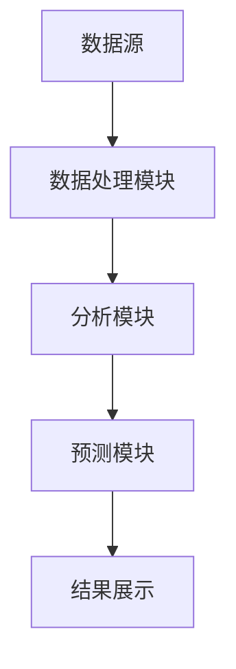

                 


# 彼得林奇如何分析公司的用户粘性与盈利能力的长期关系

## 关键词：
- 彼得林奇
- 用户粘性
- 盈利能力
- 投资分析
- 长期关系

## 摘要：
本文深入探讨了彼得林奇如何分析公司的用户粘性与盈利能力之间的长期关系。通过定义用户粘性和盈利能力，分析它们的影响因素和相互作用，建立数学模型和算法，结合系统架构设计和项目实战，提供投资分析的最佳实践。文章结构清晰，内容详实，旨在帮助读者理解并应用这些分析方法进行投资决策。

---

## 正文

### 第1章：用户粘性与盈利能力的背景介绍

#### 1.1 用户粘性的定义与影响因素
- **1.1.1 用户粘性的定义**
  - 用户粘性是指用户对某个产品或服务的持续使用意愿。
- **1.1.2 用户粘性的影响因素**
  - 产品价值：产品是否满足用户需求。
  - 用户体验：易用性、界面设计等。
  - 品牌忠诚度：用户对品牌的信任和忠诚度。
  - 替代品：市场上是否有更好的替代产品。

#### 1.2 盈利能力的定义与影响因素
- **1.2.1 盈利能力的定义**
  - 盈利能力是企业在一定时期内赚取利润的能力。
- **1.2.2 盈利能力的影响因素**
  - 成本控制：生产成本、运营成本。
  - 定价策略：产品定价是否合理。
  - 市场需求：市场需求量和价格弹性。
  - 管理效率：内部管理是否高效。

#### 1.3 用户粘性与盈利能力的关系
- **1.3.1 用户粘性对盈利能力的影响**
  - 高用户粘性意味着客户保留率高，收入稳定。
- **1.3.2 盈利能力对用户粘性的影响**
  - 盈利能力强的企业能持续改进产品，进一步增强用户粘性。
- **1.3.3 长期关系的动态分析**
  - 长期来看，用户粘性与盈利能力相互促进，形成良性循环。

### 第2章：用户粘性与盈利能力的核心概念联系

#### 2.1 核心概念的原理分析
- **2.1.1 用户粘性的形成机制**
  - 通过持续提供价值和优质体验，建立用户忠诚度。
- **2.1.2 盈利能力的驱动因素**
  - 高效运营和市场定位是关键。
- **2.1.3 两者关系的动态演变**
  - 用户粘性增强带来收入稳定，盈利能力提升进一步巩固用户粘性。

#### 2.2 核心概念属性特征对比
- **表2-1：用户粘性与盈利能力的属性对比**
  | 属性            | 用户粘性                          | 盈利能力                          |
  |-----------------|-----------------------------------|-----------------------------------|
  | 主要指标        | 用户留存率、复购率、满意度        | 净利润率、毛利率、ROE             |
  | 关键因素        | 产品价值、用户体验、品牌忠诚度    | 成本控制、定价策略、市场需求     |
  | 相关性          | 正相关                           | 正相关                           |

#### 2.3 用户粘性与盈利能力的ER实体关系图
```mermaid
er
  User
  Company
  User_Stickiness
  Profitability
  User_Stickiness --> Company
  Profitability --> Company
```

### 第3章：用户粘性与盈利能力的算法原理

#### 3.1 用户粘性与盈利能力的量化指标
- **3.1.1 用户粘性量化**
  - 使用用户留存率：$用户留存率 = \frac{返回用户数}{初始用户数}$
- **3.1.2 盈利能力量化**
  - 使用净利润率：$净利润率 = \frac{净利润}{营业收入} \times 100\%$

#### 3.2 算法原理的数学模型
- **3.2.1 用户粘性与盈利能力的关系模型**
  - 假设用户粘性指数为$S$，盈利能力指数为$P$，则有：
    $$P = \alpha S + \beta$$
    其中，$\alpha$是回归系数，$\beta$是截距。

#### 3.3 算法实现步骤
1. 收集用户粘性和盈利能力数据。
2. 计算用户粘性指数$S$和盈利能力指数$P$。
3. 使用线性回归模型建立关系模型。
4. 通过Python代码实现模型训练和预测。

#### 3.4 Python代码实现
```python
import numpy as np
import matplotlib.pyplot as plt

# 示例数据
user_stickiness = np.array([0.8, 0.7, 0.9, 0.6, 0.8])
profitability = np.array([0.7, 0.5, 0.8, 0.4, 0.6])

# 训练线性回归模型
slope, intercept = np.polyfit(user_stickiness, profitability, 1)

# 预测值
predicted_profitability = slope * user_stickiness + intercept

# 可视化
plt.scatter(user_stickiness, profitability)
plt.plot(user_stickiness, predicted_profitability, 'r')
plt.xlabel('User Stickiness')
plt.ylabel('Profitability')
plt.show()
```

### 第4章：用户粘性与盈利能力的系统分析

#### 4.1 系统功能设计
- **功能模块：**
  - 数据收集模块：收集用户行为数据和财务数据。
  - 分析模块：计算用户粘性和盈利能力指标。
  - 预测模块：使用算法预测盈利能力。

#### 4.2 系统架构设计


#### 4.3 接口设计与交互流程
- **用户交互流程：**
  1. 用户输入公司数据。
  2. 系统处理数据并进行分析。
  3. 展示分析结果和预测盈利能力。

### 第5章：用户粘性与盈利能力的项目实战

#### 5.1 环境安装
- 安装Python和相关库：`numpy`, `pandas`, `scikit-learn`。

#### 5.2 数据收集与预处理
- 使用公开数据集，清洗数据并提取相关特征。

#### 5.3 算法实现与结果分析
- 实现用户粘性与盈利能力的关系模型，分析结果并解释。

#### 5.4 案例分析
- 以某公司为例，展示如何通过分析用户粘性和盈利能力进行投资决策。

### 第6章：用户粘性与盈利能力的最佳实践

#### 6.1 关键点总结
- 定期监测用户粘性和盈利能力指标。
- 结合定量分析和定性分析做出投资决策。

#### 6.2 小结
- 本文通过理论分析和实际案例，展示了如何分析用户粘性与盈利能力的关系，为投资决策提供支持。

#### 6.3 注意事项
- 数据质量影响分析结果，需确保数据准确。
- 模型需定期更新，适应市场变化。

#### 6.4 拓展阅读
- 建议阅读彼得林奇的其他著作，深入了解投资策略。

---

# 作者：AI天才研究院/AI Genius Institute & 禅与计算机程序设计艺术 /Zen And The Art of Computer Programming

