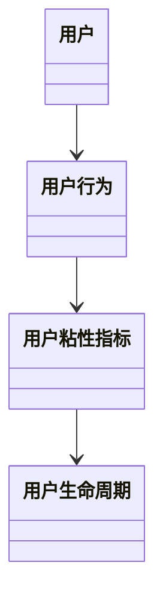
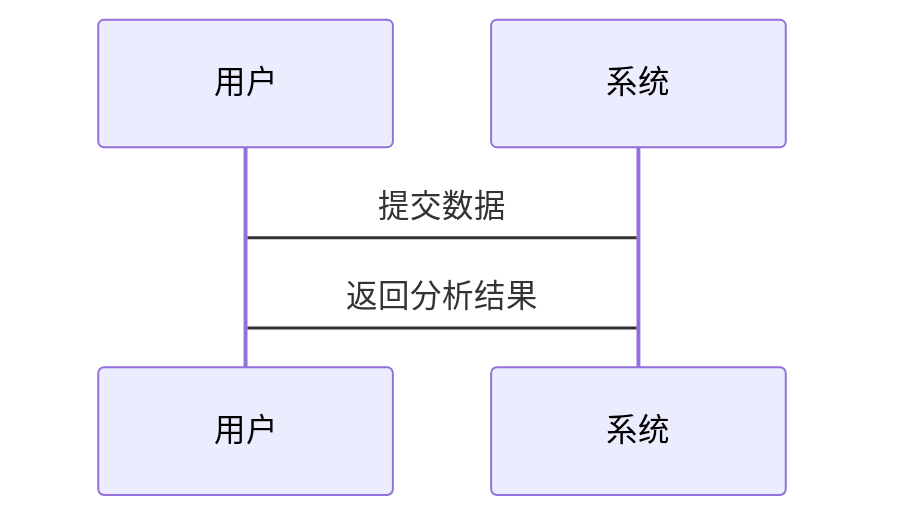

                 


## 目录大纲：彼得·林奇如何分析公司的用户粘性指标

### 第一部分：引言

#### 1.1 什么是用户粘性指标
- **1.1.1 用户粘性的定义**
  - 用户粘性：用户对产品或服务的持续使用意愿
- **1.1.2 用户粘性的重要性**
  - 稳定收入来源，降低获客成本
- **1.1.3 彼得·林奇与用户粘性分析**
  - 投资角度分析用户行为

### 第二部分：用户粘性指标的背景介绍

#### 2.1 用户粘性指标的核心概念
- **2.1.1 用户粘性的定义与类型**
  - 留存率、活跃度、生命周期价值
- **2.1.2 影响用户粘性的主要因素**
  - 产品价值、用户体验、竞争环境
- **2.1.3 用户粘性与用户生命周期的关系**
  - 不同阶段的用户行为分析

#### 2.2 用户粘性指标的背景与问题背景
- **2.2.1 当前市场环境下用户粘性的挑战**
  - 竞争加剧，用户选择多样化
- **2.2.2 用户粘性指标在企业中的应用现状**
  - 数据驱动的用户分析趋势

### 第三部分：用户粘性指标的核心概念与联系

#### 3.1 用户粘性指标的核心原理
- **3.1.1 用户粘性的衡量标准**
  - 留存率、活跃度、生命周期价值
- **3.1.2 用户粘性指标的计算方法**
  - 留存率计算公式，活跃度分析模型
- **3.1.3 用户粘性与其他用户行为指标的关系**
  - 如用户满意度、用户增长的对比分析

#### 3.2 核心概念对比分析
- **3.2.1 不同用户粘性指标的特征对比（表格形式）**
  | 指标 | 定义 | 计算方式 | 时间范围 |
  |------|------|----------|----------|
  | 留存率 | 一定时间内仍使用产品的用户比例 | （留存用户数 / 初始用户数）× 100% | 短期 |
  | 活跃度 | 用户在特定时间段内的使用频率 | 活跃用户数 / 总用户数 | 中短期 |
  | LTV | 用户生命周期价值 | （ARPU × 用户生命周期长度） | 长期 |
- **3.2.2 用户粘性与用户满意度的对比分析**
  - 粘性关注行为，满意度关注情感

#### 3.3 实体关系图（ER图）
- **3.3.1 用户粘性指标的实体关系图（Mermaid流程图）**
  ```mermaid
  graph TD
      A[用户] --> B[用户行为]
      B --> C[用户粘性指标]
      C --> D[用户生命周期]
      C --> E[用户满意度]
  ```

### 第四部分：用户粘性指标的算法原理

#### 4.1 用户粘性指标的计算方法
- **4.1.1 用户留存率的计算公式**
  - 留存率 = （第n天留存用户数 / 第1天用户数）× 100%
  - 例如，7天留存率为（第7天用户数 / 第1天用户数）× 100%

- **4.1.2 用户活跃度的计算模型**
  - 活跃度 = （某段时间内活跃用户数 / 总用户数）× 100%

#### 4.2 算法流程图（Mermaid）
- **4.2.1 用户粘性分析算法流程图**
  ```mermaid
  graph TD
      A[开始] --> B[收集用户数据]
      B --> C[计算留存率]
      C --> D[计算活跃度]
      D --> E[绘制用户行为路径]
      E --> F[分析结果]
      F --> G[结束]
  ```

#### 4.3 数学模型与公式
- **用户留存率的计算公式**
  $$ 留存率 = \frac{第n天留存用户数}{第1天用户数} \times 100\% $$
  
- **用户活跃度的计算模型**
  $$ 活跃度 = \frac{某段时间内活跃用户数}{总用户数} \times 100\% $$

### 第五部分：系统分析与架构设计方案

#### 5.1 问题场景介绍
- 分析互联网公司的用户粘性，优化用户保留策略

#### 5.2 项目介绍
- 开发用户粘性分析系统，帮助公司提升用户留存

#### 5.3 系统功能设计（领域模型Mermaid类图）


#### 5.4 系统架构设计（Mermaid架构图）
```mermaid
container 用户粘性分析系统
    service 用户数据采集模块
    service 数据处理模块
    service 分析模块
    service 可视化模块
```

#### 5.5 系统接口设计和交互流程图（Mermaid序列图）


### 第六部分：项目实战

#### 6.1 环境安装
- 安装Python、Pandas、Matplotlib

#### 6.2 系统核心实现源代码
```python
import pandas as pd
import matplotlib.pyplot as plt

# 示例数据
data = {'用户ID': [1, 2, 3, 4, 5],
        '注册日期': ['2023-01-01', '2023-01-01', '2023-01-02', '2023-01-02', '2023-01-03'],
        '使用日期': ['2023-01-05', '2023-01-04', None, '2023-01-06', '2023-01-07']}
df = pd.DataFrame(data)

# 计算留存率
def calculate_retention(data, days):
    initial_users = len(data[data['注册日期'] == f'2023-01-{days}'])
    retained_users = len(data[(data['注册日期'] == f'2023-01-{days}') & (data['使用日期'].notna())])
    return retained_users / initial_users * 100

# 绘制用户路径图
plt.figure(figsize=(10,6))
plt.plot([1,2,3,4,5], [80, 70, 60, 50, 40])
plt.title('用户留存曲线')
plt.xlabel('天数')
plt.ylabel('留存率(%)')
plt.show()
```

#### 6.3 代码应用解读与分析
- 使用Python和Pandas进行数据处理，Matplotlib进行可视化
- 示例数据展示如何计算7天留存率，并绘制留存曲线

#### 6.4 实际案例分析和详细讲解剖析
- 分析互联网公司的用户数据，展示如何应用上述代码进行实际分析

#### 6.5 项目小结
- 强调用户粘性分析的重要性和实际应用价值

### 第七部分：总结与最佳实践

#### 7.1 总结
- 彼得·林奇的用户粘性分析方法及其在现代企业中的应用

#### 7.2 最佳实践 tips
- 定期分析用户留存率和活跃度
- 提供个性化用户体验提升粘性
- 监测用户流失点进行干预

#### 7.3 注意事项
- 数据准确性的重要性
- 避免过度优化，保持用户体验

#### 7.4 拓展阅读
- 推荐相关书籍和资源，深入学习用户行为分析

### 作者：AI天才研究院/AI Genius Institute & 禅与计算机程序设计艺术/Zen And The Art of Computer Programming

---

这个目录大纲涵盖了从基础概念到实际应用的各个方面，确保读者能够全面理解彼得·林奇的用户粘性分析方法，并能够将其应用于实际项目中。

