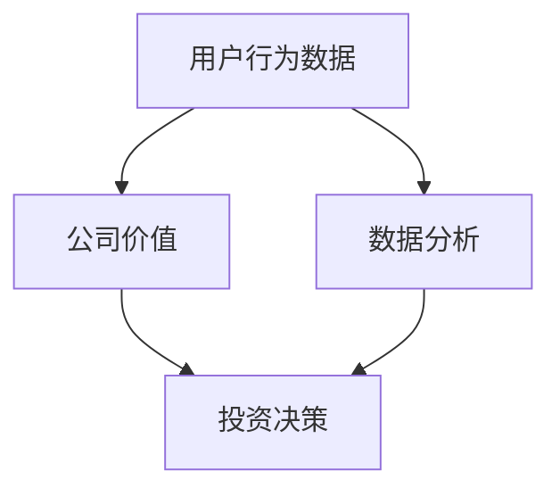
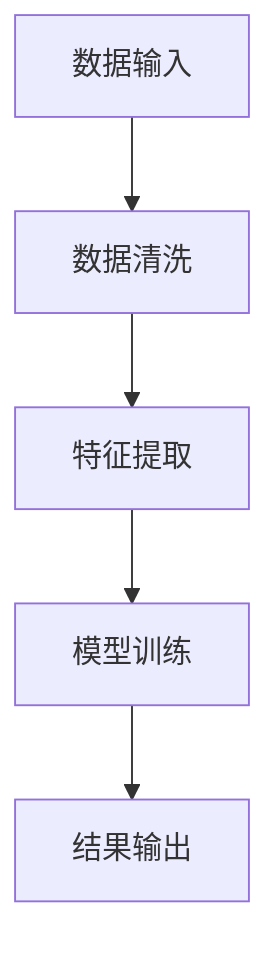
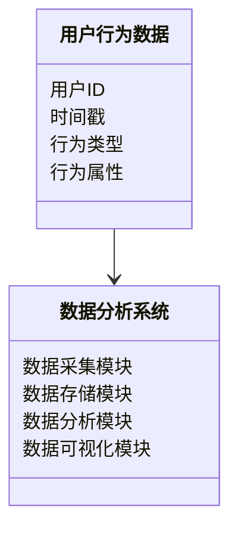

                 


# 彼得林奇如何分析公司的用户行为数据价值

## 关键词：用户行为数据，数据驱动投资，彼得·林奇，用户留存分析，投资决策，数据建模，数据可视化

## 摘要：本文章详细探讨了彼得·林奇如何通过分析用户行为数据来评估公司的价值，并优化投资决策。通过系统性的分析框架和数学模型，我们展示了用户行为数据在投资分析中的核心作用，并结合实际案例，提供了一套可操作的方法论。

---

### 第1章: 用户行为数据的背景与意义

#### 1.1 数据驱动投资的兴起
- 数据驱动投资的核心理念
- 彼得·林奇投资方法的数字化转型
- 用户行为数据在投资中的独特价值

#### 1.2 用户行为数据的经济学解释
- 用户行为数据的定义与分类
- 用户行为数据与公司价值的关系
- 数据分析在投资决策中的作用

#### 1.3 数据驱动投资的理论基础
- 用户行为数据的经济学价值
- 数据分析与投资决策的关系
- 彼得·林奇方法论的数字化重构

#### 1.4 本章小结
- 数据驱动投资的核心观点
- 用户行为数据的分析框架
- 数字化投资分析的未来趋势

---

### 第2章: 用户行为数据分析的核心概念与联系

#### 2.1 用户行为数据的定义与分类
- 用户行为数据的定义
- 数据的分类与特征
- 用户行为数据的经济学价值

#### 2.2 用户行为数据与公司价值的关系
- 用户行为数据如何影响公司估值
- 数据的量化方法与公司生命周期的关系

#### 2.3 用户行为数据分析框架
- 数据收集与预处理
- 数据分析与建模
- 数据可视化与洞察提取

#### 2.4 核心概念关系图（Mermaid）


#### 2.5 本章小结
- 核心概念的总结
- 数据分析框架的要点
- 用户行为数据与投资决策的关系

---

### 第3章: 用户行为数据分析的算法原理

#### 3.1 数据预处理与特征工程
- 数据清洗与标准化
- 特征提取与选择
- 时间序列数据处理

#### 3.2 用户行为分析算法
- 用户聚类分析
- 用户行为预测模型
- 用户流失预测

#### 3.3 算法实现流程图（Mermaid）


#### 3.4 本章小结
- 算法原理的总结
- 数据处理的关键步骤
- 算法选择的注意事项

---

### 第4章: 用户行为数据分析的数学模型与公式

#### 4.1 用户留存分析模型
- 留存率计算公式
  $$ 留存率 = \frac{初始用户数 - 退出用户数}{初始用户数} $$

#### 4.2 用户生命周期模型
- 用户生命周期阶段划分
- 用户生命周期价值计算公式
  $$ CLV = \sum_{t=1}^{n} (收入_t - 成本_t) $$

#### 4.3 用户行为预测模型
- 时间序列预测模型
  $$ \hat{y}_t = a + bt + ct^2 $$
- 逻辑回归模型
  $$ P(y=1) = \frac{1}{1 + e^{-(\beta_0 + \beta_1 x)}} $$

#### 4.5 本章小结
- 数学模型的核心公式
- 模型应用的注意事项
- 数据分析的数学基础

---

### 第5章: 用户行为数据分析的系统架构与设计

#### 5.1 问题场景介绍
- 用户行为数据的收集与管理
- 数据分析系统的功能需求
- 系统架构的设计目标

#### 5.2 系统功能设计（Mermaid类图）


#### 5.3 系统架构设计（Mermaid架构图）


#### 5.4 系统接口设计
- 数据接口定义
- API调用示例
- 接口设计注意事项

#### 5.5 本章小结
- 系统架构的核心组成部分
- 功能设计的关键模块
- 系统交互的流程总结

---

### 第6章: 用户行为数据分析的项目实战

#### 6.1 项目背景与目标
- 案例分析：某电商平台用户行为分析
- 项目目标
- 数据来源与处理

#### 6.2 项目核心实现（Python代码）
```python
import pandas as pd
from sklearn.cluster import KMeans

# 数据预处理
data = pd.read_csv('user_behavior.csv')
data_clean = data.dropna()

# 用户聚类分析
model = KMeans(n_clusters=3)
clusters = model.fit_predict(data_clean[['feature1', 'feature2']])

# 用户留存分析
retention_rate = (len(data_clean) - len(data_clean[data_clean['user_id'].duplicated()])) / len(data_clean)
```

#### 6.3 代码应用解读与分析
- 数据处理的具体实现
- 聚类分析的参数选择
- 留存率计算的实际应用

#### 6.4 实际案例分析
- 案例分析结果展示
- 投资决策的优化建议
- 数据分析的实践价值

#### 6.5 本章小结
- 项目实战的核心步骤
- 数据分析的实际应用
- 投资决策的优化路径

---

### 第7章: 用户行为数据分析的最佳实践与注意事项

#### 7.1 最佳实践 tips
- 数据质量的重要性
- 模型选择的注意事项
- 可视化结果的呈现技巧

#### 7.2 投资决策中的数据陷阱
- 数据偏差的风险
- 模型过拟合的防范
- 数据隐私与伦理问题

#### 7.3 项目小结
- 项目总结与经验分享
- 数据分析的未来趋势
- 投资决策的数字化转型

#### 7.4 拓展阅读
- 推荐书籍与资源
- 进一步学习的方向
- 数据分析领域的最新动态

---

### 作者：AI天才研究院 & 禅与计算机程序设计艺术

---

这篇文章通过系统化的分析和详细的代码示例，全面探讨了彼得·林奇如何利用用户行为数据进行投资分析，提供了从理论到实践的完整方法论。希望对读者在数据驱动的投资决策中提供有价值的指导。

