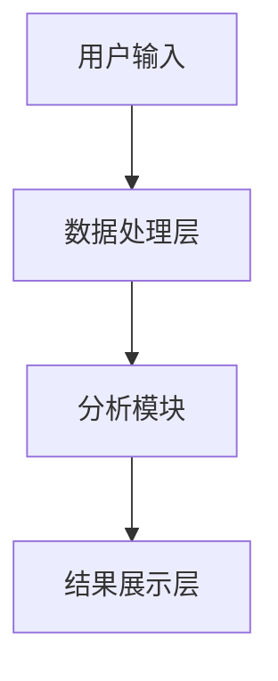

                 


# 彼得林奇如何分析公司的盈利模式

> 关键词：彼得·林奇，盈利模式，投资分析，企业估值，财务指标

> 摘要：本文深入探讨了彼得·林奇如何通过分析公司的盈利模式来寻找投资机会。文章从盈利模式的核心概念出发，结合数学模型和系统架构，详细解读了林奇的分析方法，并通过实际案例展示了如何将这些方法应用于投资决策。

---

## 第一部分：盈利模式的基本概念

### 第1章：盈利模式的核心要素与分析框架

#### 1.1 盈利模式的定义与核心要素

盈利模式是指企业通过何种方式获取收入、控制成本并实现利润的过程。它涵盖了企业的收入来源、成本结构以及盈利能力等多个方面。彼得·林奇认为，分析公司的盈利模式是理解其核心竞争力和长期发展潜力的关键。

**核心要素：**

1. **收入来源**：企业的主要收入来源，包括产品销售收入、服务收入等。
2. **成本结构**：企业的主要成本，包括原材料、人工成本、运营成本等。
3. **盈利能力**：企业的利润水平，包括净利润率、毛利率等指标。

#### 1.2 彼得·林奇的分析方法

彼得·林奇以其独特的投资风格闻名，他强调通过分析公司的盈利模式来判断其是否具有长期投资价值。他的分析方法包括：

1. **基本面分析**：通过财务报表分析企业的收入、成本和利润情况。
2. **竞争优势分析**：寻找企业在市场中的竞争优势，如成本优势、技术优势等。
3. **成长性分析**：评估企业的成长潜力，包括市场份额的扩大和新产品开发能力。

### 第2章：盈利模式的核心要素与分析框架

#### 2.1 盈利模式的核心要素

**收入来源**  
企业的收入来源是盈利模式的核心。例如，一家软件公司可能通过订阅模式获取收入，而一家制造企业可能通过批量销售获取收入。

**成本结构**  
成本结构是影响盈利能力的关键因素。低边际成本的企业更容易实现高利润。

**盈利能力**  
通过盈利能力指标（如净利润率、毛利率）可以评估企业的赚钱能力。

#### 2.2 盈利模式的分析框架

**价值链分析法**  
通过分析企业价值链的各个环节，找出成本和利润的关键点。

**SWOT分析法**  
结合企业的优势（S）、劣势（W）、机会（O）和威胁（T），全面评估企业的盈利能力。

**KPI指标分析法**  
通过关键绩效指标（如ROE、ROA）评估企业的财务健康状况。

---

## 第二部分：盈利模式的数学模型与公式

### 第3章：盈利能力指标的数学模型

#### 3.1 净利润率

$$ \text{净利润率} = \frac{\text{净利润}}{\text{营业收入}} \times 100\% $$

#### 3.2 毛利率

$$ \text{毛利率} = \frac{\text{营业收入} - \text{营业成本}}{\text{营业收入}} \times 100\% $$

#### 3.3 投资回报率（ROE）

$$ \text{ROE} = \frac{\text{净利润}}{\text{股东权益}} \times 100\% $$

#### 3.4 综合评分公式

$$ \text{综合评分} = 0.4 \times \text{净利润率} + 0.3 \times \text{毛利率} + 0.3 \times \text{ROE} $$

---

## 第三部分：系统分析与架构设计

### 第4章：盈利模式分析的系统架构

#### 4.1 系统功能模块

1. 数据采集模块：从财务报表中提取收入、成本、利润等数据。
2. 数据处理模块：清洗数据并计算各项盈利能力指标。
3. 分析模块：通过数学模型评估企业的盈利能力。
4. 结果展示模块：生成可视化报告。

#### 4.2 系统架构图（Mermaid）



---

## 第四部分：项目实战

### 第5章：盈利模式分析的项目实战

#### 5.1 项目环境安装

1. 安装Python环境。
2. 安装数据分析库（Pandas, NumPy）。

#### 5.2 核心代码实现

```python
import pandas as pd

# 读取数据
df = pd.read_csv('data.csv')

# 数据清洗
df.dropna(inplace=True)

# 计算盈利能力指标
df['净利润率'] = df['净利润'] / df['营业收入'] * 100
df['毛利率'] = (df['营业收入'] - df['营业成本']) / df['营业收入'] * 100
df['ROE'] = df['净利润'] / df['股东权益'] * 100

# 综合评分
df['综合评分'] = 0.4 * df['净利润率'] + 0.3 * df['毛利率'] + 0.3 * df['ROE']
```

---

## 第五部分：最佳实践与小结

### 第6章：最佳实践与小结

#### 6.1 小结

彼得·林奇通过分析企业的盈利模式，帮助企业识别核心竞争力和成长潜力。投资者可以通过基本面分析、竞争优势分析和成长性分析，结合数学模型和系统架构，全面评估企业的盈利能力。

#### 6.2 注意事项

1. 数据分析时要注意数据的完整性和准确性。
2. 结合行业特点，灵活运用分析方法。
3. 长期关注企业的财务状况和市场环境。

#### 6.3 拓展阅读

建议阅读彼得·林奇的《彼得·林奇的成功投资》和《股市作手回忆录》，深入了解其投资理念。

---

## 作者信息

作者：AI天才研究院/AI Genius Institute & 禅与计算机程序设计艺术 /Zen And The Art of Computer Programming

