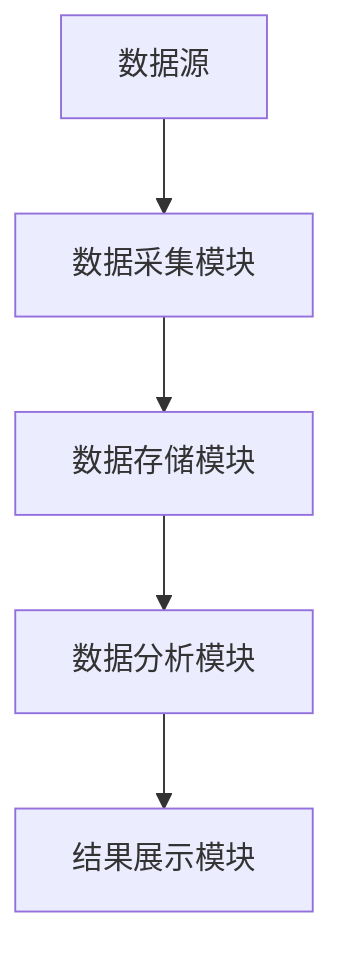

                 


```
# 彼得·林奇如何分析公司的竞争策略

> 关键词：彼得·林奇，竞争策略，投资分析，市场份额，竞争对手分析，财务指标

> 摘要：本文深入探讨了彼得·林奇分析公司竞争策略的方法，从背景介绍、核心概念、算法原理到系统设计、项目实战和最佳实践，全面解析了如何运用竞争策略分析来评估公司的投资价值。

## 第一部分: 竞争策略分析的背景与概念

### 第1章: 竞争策略分析的背景

#### 1.1 竞争策略分析的定义与核心要素
- **竞争策略**：公司为了在市场中获得竞争优势而采取的一系列战略举措。
- **核心要素**：
  - 市场定位
  - 产品差异化
  - 成本优势
  - 客户价值

#### 1.2 彼得·林奇的竞争策略分析方法
- **背景介绍**：彼得·林奇以其独特的竞争策略分析方法闻名，他通过深入研究公司的竞争环境和竞争对手，评估公司的长期投资价值。
- **分析框架**：
  - 竞争对手分析
  - 市场地位评估
  - 产品生命周期分析

#### 1.3 竞争策略分析的重要性
- **投资决策的核心因素**：竞争策略分析是评估公司投资价值的关键。
- **竞争优势的识别**：通过分析公司的竞争优势，投资者可以识别潜在的投资机会。
- **风险评估**：竞争策略分析有助于识别潜在的竞争风险。

### 第2章: 竞争策略分析的核心概念

#### 2.1 竞争对手分析的核心要素
- **市场份额**：公司占有的市场份额是衡量其竞争能力的重要指标。
- **竞争对手的产品与服务**：分析竞争对手的产品特性、定价策略、服务质量等。
- **竞争对手的财务状况**：分析竞争对手的财务健康状况，包括收入、利润、资产负债表等。

#### 2.2 竞争策略分析的步骤与流程
- **确定分析目标**：明确分析的目标和范围。
- **数据收集与整理**：收集与竞争策略相关的数据，包括市场份额、竞争对手的财务数据、市场趋势等。
- **分析与评估**：对收集到的数据进行分析，评估公司的竞争策略。
- **结果应用与优化**：将分析结果应用于投资决策，并根据市场变化进行优化。

#### 2.3 竞争策略分析的数学模型
- **市场份额预测模型**：用于预测公司未来的市场份额。
  $$ 市场份额 = \frac{产品销量}{市场总销量} $$
- **竞争优势评估模型**：用于评估公司的竞争优势。
  $$ 竞争优势 = \frac{产品价格}{市场竞争度} $$

### 第3章: 竞争策略分析的系统架构与实现

#### 3.1 竞争策略分析系统的功能模块
- **数据采集模块**：负责收集与竞争策略相关的数据。
- **数据分析模块**：对收集到的数据进行分析，评估公司的竞争策略。
- **结果展示模块**：将分析结果以图表、报告等形式展示出来。

#### 3.2 竞争策略分析系统的架构图


### 第4章: 竞争策略分析的项目实战

#### 4.1 项目背景与目标
- **项目背景**：以某零售公司为例，分析其竞争策略。
- **项目目标**：评估该公司的竞争策略，识别其竞争优势和潜在风险。

#### 4.2 项目实施步骤
- **数据收集**：收集该公司的市场份额、竞争对手的财务数据、市场趋势等。
- **数据分析**：使用上述数学模型分析公司的竞争策略。
- **结果展示**：生成分析报告，展示公司的竞争优势和潜在风险。

### 第5章: 竞争策略分析的最佳实践与小结

#### 5.1 小结
- **核心内容回顾**：竞争策略分析是评估公司投资价值的重要方法。
- **关键点总结**：通过分析公司的市场份额、竞争对手的产品与服务、财务状况等，可以识别公司的竞争优势和潜在风险。

#### 5.2 注意事项
- **数据准确性**：数据的准确性和完整性是竞争策略分析的关键。
- **模型选择**：选择合适的数学模型和工具，提高分析的准确性。
- **持续优化**：根据市场变化和公司战略调整，持续优化竞争策略分析。

#### 5.3 拓展阅读
- **推荐书籍**：彼得·林奇的《击败华尔街》。
- **推荐阅读**：其他竞争策略分析的经典书籍和文献。

## 作者：AI天才研究院/AI Genius Institute & 禅与计算机程序设计艺术 /Zen And The Art of Computer Programming
```

