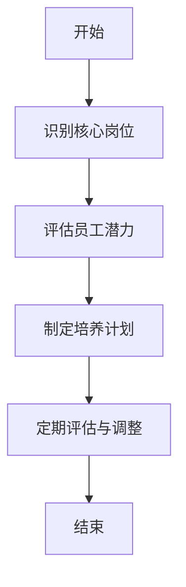
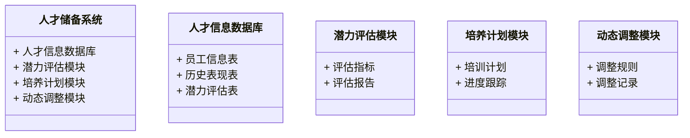
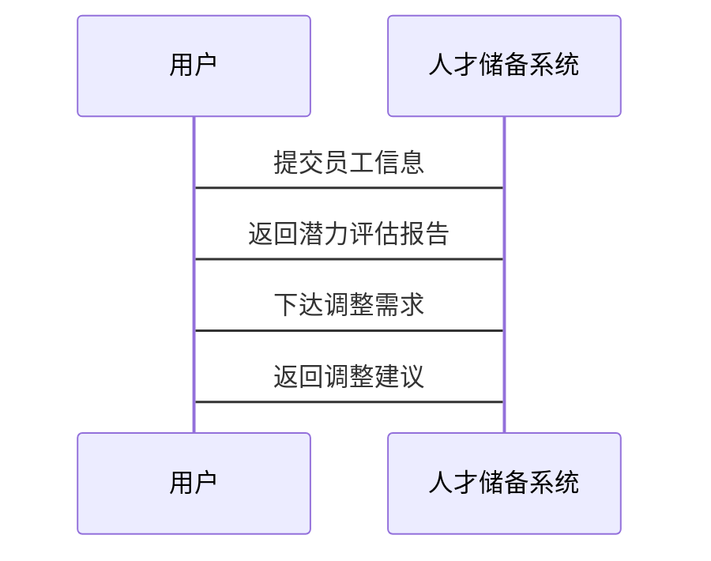

                 


# 彼得林奇如何看待公司的人才储备策略

## 关键词：彼得·林奇、人才储备、投资策略、企业价值、人才管理

## 摘要：本文从彼得·林奇的投资哲学出发，分析他如何看待公司的人才储备策略。通过详细阐述人才储备的核心概念、策略模型、算法原理、系统架构以及实际案例，为读者提供一个全面的视角，帮助企业在人才管理中做出明智的决策。

---

# 第一部分：彼得·林奇投资理念与人才储备的背景

## 第1章：彼得·林奇的投资理念概述

### 1.1 彼得·林奇的个人背景与投资风格

#### 1.1.1 彼得·林奇的生平简介
彼得·林奇（Peter Lynch）是美国著名的投资专家，被誉为“共同基金先生”。他在富达投资管理公司管理麦哲伦基金期间，取得了卓越的投资业绩。林奇的投资哲学强调对企业基本面的深入研究，尤其是对管理层的信任和关注。他认为，企业的人才是实现长期价值的核心。

#### 1.1.2 林奇的投资哲学与方法论
林奇的投资策略以“购买并持有”为核心，他注重分析企业的财务状况、管理层能力和市场地位。他强调，优秀的企业管理层能够为企业创造持续的价值，而人才储备则是企业长期成功的关键。

#### 1.1.3 林奇对企业的独特见解
林奇认为，企业的价值不仅仅体现在财务数据上，更重要的是团队的凝聚力和员工的创造力。他将企业的人才储备视为企业的“无形资产”，认为优秀的人才储备能够为企业带来持续的竞争优势。

### 1.2 人才储备在企业投资中的重要性

#### 1.2.1 人才储备与企业价值的关系
人才储备是企业价值的重要组成部分。优秀的人才能够提高企业的生产力，推动创新，从而提升企业的市场地位和盈利能力。

#### 1.2.2 人才储备对企业长期发展的意义
人才储备决定了企业的可持续发展能力。一个拥有深厚人才储备的企业，能够在市场变化中快速调整，抓住机遇，应对挑战。

#### 1.2.3 人才储备在企业估值中的作用
在企业估值时，人才储备是一个不可忽视的因素。拥有优秀人才储备的企业，往往能够获得更高的估值，因为投资者认为这些企业具有更强的未来盈利能力。

---

## 第2章：人才储备策略的核心概念与背景

### 2.1 人才储备的核心概念

#### 2.1.1 人才储备的定义与范围
人才储备是指企业在不同发展阶段，为确保核心岗位和关键业务的连续性，而储备的具有潜力和能力的员工。

#### 2.1.2 人才储备与企业战略的关系
人才储备是企业战略的重要组成部分。通过合理的人才储备，企业能够确保战略目标的实现，应对市场变化和内部调整。

#### 2.1.3 人才储备的边界与外延
人才储备的边界在于企业的核心业务和关键岗位。外延则包括对潜在人才的挖掘、培养和储备。

### 2.2 人才储备的关键要素

#### 2.2.1 核心人才的识别与筛选
识别核心人才是人才储备的第一步。企业需要通过绩效评估、潜力分析和岗位匹配度等指标，筛选出具有潜力和能力的员工。

#### 2.2.2 人才梯队的构建与优化
人才梯队的构建需要根据企业的战略需求，分层次储备不同岗位和不同能力的人才。通过定期评估和优化，确保人才梯队的合理性和有效性。

#### 2.2.3 人才储备的动态调整机制
人才储备需要根据企业战略变化和市场环境的调整，进行动态优化。通过定期评估和调整，确保人才储备能够满足企业的长期发展需求。

### 2.3 人才储备的关键成功因素

#### 2.3.1 人才储备的系统性
人才储备需要系统性地规划和实施。从识别、培养到储备，每个环节都需要精心设计和执行。

#### 2.3.2 人才储备的长期性
人才储备是一个长期的过程。企业需要投入时间和资源，培养和储备优秀人才，以应对未来的发展需求。

#### 2.3.3 人才储备的灵活性
人才储备需要具备灵活性，能够根据企业战略变化和市场环境的调整，及时进行优化和调整。

---

## 第3章：彼得·林奇视角下的人才储备挑战与机遇

### 3.1 当前人才储备的主要挑战

#### 3.1.1 人才市场的竞争加剧
随着经济全球化和技术进步，人才市场的竞争日益激烈。企业需要付出更多努力，才能吸引和留住优秀人才。

#### 3.1.2 技术变革对企业人才需求的影响
技术变革不断推动企业转型，对人才的需求也在不断变化。企业需要及时调整人才储备策略，以适应新的技术要求。

#### 3.1.3 企业内部人才流失的风险
优秀人才的流失是企业人才储备的一大挑战。企业需要通过良好的激励机制和职业发展路径，减少人才流失的风险。

### 3.2 人才储备的未来趋势

#### 3.2.1 数字化时代对人才储备的影响
数字化时代要求企业更加注重技术型人才的储备。数据科学家、人工智能工程师等新兴岗位的需求不断增加。

#### 3.2.2 创业型人才与职业化人才的平衡
企业需要在创业型人才和职业化人才之间找到平衡。创业型人才能够推动创新，而职业化人才则能够确保企业日常运营的稳定。

#### 3.2.3 企业人才储备的全球化趋势
随着全球经济一体化，企业的人才储备也需要全球化。企业需要在全球范围内吸引和储备人才，以应对跨国竞争。

---

# 第二部分：彼得·林奇的人才储备策略分析

## 第4章：彼得·林奇的人才储备核心概念

### 4.1 人才储备的核心原理

#### 4.1.1 人才储备的长期视角
林奇认为，人才储备是一个长期的过程。企业需要投入时间和资源，培养和储备优秀人才，以应对未来的发展需求。

#### 4.1.2 人才储备的系统性与结构性
人才储备需要系统性地规划和实施。从识别、培养到储备，每个环节都需要精心设计和执行。结构性的人才储备能够确保企业在不同岗位和不同层次上都有合适的人才。

#### 4.1.3 人才储备的动态平衡机制
人才储备需要根据企业战略变化和市场环境的调整，进行动态优化。通过定期评估和调整，确保人才储备能够满足企业的长期发展需求。

### 4.2 核心概念的对比分析

#### 4.2.1 人才储备与人力资源管理的对比
人才储备是人力资源管理的重要组成部分。人力资源管理注重员工的招聘、培训和绩效评估，而人才储备则更注重员工的潜力挖掘和长期培养。

#### 4.2.2 人才储备与组织发展之间的关系
人才储备是组织发展的基础。组织发展需要不断优化结构和流程，而人才储备则是确保组织发展顺利进行的关键。

#### 4.2.3 人才储备与企业绩效的关联性
人才储备与企业绩效密切相关。优秀的人才储备能够提升企业的生产力和创新能力，从而提高企业的市场竞争力和盈利能力。

---

## 第5章：彼得·林奇的人才储备策略模型

### 5.1 人才储备策略的数学模型

#### 5.1.1 人才储备的量化评估公式
$$ 人才潜力 = \alpha \times 绩效表现 + \beta \times 潜力评估 + \gamma \times 培训效果 $$

其中，$\alpha$、$\beta$、$\gamma$是权重系数，分别表示绩效表现、潜力评估和培训效果的权重。

#### 5.1.2 人才储备与企业价值的数学关系
$$ 企业价值 = \sum_{i=1}^{n} \text{人才潜力}_i \times \text{岗位贡献}_i $$

其中，$\text{人才潜力}_i$是第$i$个人才的潜力评估，$\text{岗位贡献}_i$是该岗位对企业的贡献。

#### 5.1.3 人才储备的动态调整模型
$$ \Delta \text{人才储备} = \sum_{i=1}^{m} \text{调整因子}_i \times \text{调整幅度}_i $$

其中，$\text{调整因子}_i$是影响人才储备调整的因素，$\text{调整幅度}_i$是调整的具体幅度。

### 5.2 人才储备策略的流程图



---

## 第6章：彼得·林奇的人才储备系统架构

### 6.1 人才储备系统的需求分析

#### 6.1.1 系统目标
构建一个高效的人才储备系统，实现人才的识别、培养、储备和动态调整。

#### 6.1.2 系统功能需求
- 人才信息管理
- 潜力评估与筛选
- 培养计划制定
- 动态调整与优化

### 6.2 人才储备系统的架构设计



### 6.3 人才储备系统的接口设计

#### 6.3.1 系统接口
- 输入接口：员工信息、评估指标、调整规则
- 输出接口：评估报告、培养计划、调整建议

#### 6.3.2 交互流程


---

## 第7章：彼得·林奇的人才储备策略的项目实战

### 7.1 项目背景与目标

#### 7.1.1 项目背景
某科技公司希望优化其人才储备策略，确保核心岗位和关键业务的连续性。

#### 7.1.2 项目目标
- 建立系统化的人才储备机制
- 优化人才梯队的构建与管理
- 提高人才储备的动态调整能力

### 7.2 环境安装与配置

#### 7.2.1 系统环境
- 操作系统：Linux/Windows
- 开发工具：Python 3.8+
- 数据库：MySQL 8+

#### 7.2.2 依赖安装
```bash
pip install numpy pandas scikit-learn matplotlib
```

### 7.3 核心代码实现

#### 7.3.1 人才潜力评估模块
```python
import numpy as np
import pandas as pd

def calculate_potential(row):
    alpha = 0.5
    beta = 0.3
    gamma = 0.2
    return alpha * row['绩效表现'] + beta * row['潜力评估'] + gamma * row['培训效果']

# 示例数据
data = pd.DataFrame({
    '员工ID': [1, 2, 3],
    '绩效表现': [85, 90, 88],
    '潜力评估': [70, 80, 75],
    '培训效果': [80, 75, 85]
})

data['人才潜力'] = data.apply(calculate_potential, axis=1)
print(data)
```

#### 7.3.2 人才储备调整模块
```python
def adjust_reserve(current_reserve, performance_change):
    adjustment_factor = 0.1
    return current_reserve * (1 + adjustment_factor * performance_change)

# 示例数据
current_reserve = [10, 15, 20]
performance_change = [0.1, -0.05, 0.08]

adjusted_reserve = [adjust_reserve(reserve, change) for reserve, change in zip(current_reserve, performance_change)]
print(adjusted_reserve)
```

### 7.4 实际案例分析与解读

#### 7.4.1 案例分析
某科技公司通过实施人才储备系统，成功优化了其人才梯队。通过潜力评估和动态调整，公司不仅保留了核心人才，还提升了整体团队的绩效表现。

#### 7.4.2 案例解读
- 通过潜力评估，公司识别出一批具有潜力的员工，并制定了针对性的培养计划。
- 动态调整模块帮助公司及时应对市场变化，优化了人才储备的结构和层次。

### 7.5 项目小结

#### 7.5.1 项目成果
- 建立了系统化的人才储备机制
- 提高了人才储备的效率和准确性
- 增强了企业的核心竞争力

#### 7.5.2 项目经验总结
- 系统化的实施过程是关键
- 数据分析和动态调整是成功的核心
- 员工的积极参与和反馈是优化的重要依据

---

## 第8章：彼得·林奇人才储备策略的最佳实践

### 8.1 最佳实践 tips

#### 8.1.1 核心岗位的人才储备优先
企业应优先关注核心岗位的人才储备，确保关键业务的连续性。

#### 8.1.2 持续关注人才发展
人才储备是一个持续的过程。企业需要定期评估和优化，确保人才储备策略的有效性。

#### 8.1.3 重视员工的职业发展
通过提供良好的职业发展路径和激励机制，吸引和留住优秀人才。

### 8.2 小结

彼得·林奇的人才储备策略强调系统性、长期性和动态调整。通过科学的评估和优化，企业能够构建一个高效的人才储备体系，为企业的长期发展提供坚实的基础。

### 8.3 注意事项

- 人才储备需要结合企业的实际情况，避免一刀切。
- 动态调整需要根据市场环境和企业战略的变化，及时进行优化。
- 员工的参与和反馈是优化人才储备策略的重要依据。

### 8.4 拓展阅读

- 《彼得·林奇的投资哲学》
- 《企业人才管理的系统性方法》
- 《数字化时代的人才储备策略》

---

## 作者：AI天才研究院/AI Genius Institute & 禅与计算机程序设计艺术 /Zen And The Art of Computer Programming

