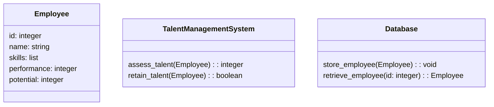
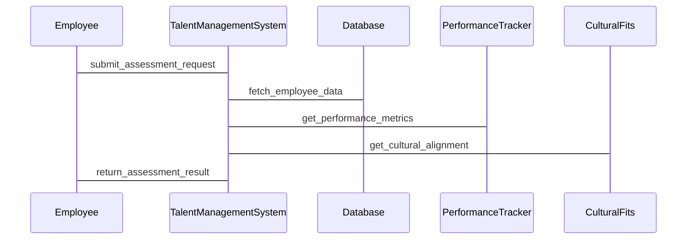

                 


# 彼得林奇如何看待公司的人才培养与保留策略

## 关键词：彼得林奇，人才培养，人才保留，企业战略，人才策略，价值投资

## 摘要：本文从彼得林奇的价值投资理念出发，探讨其对公司在人才培养与保留策略的见解。通过分析企业人才管理的核心要素、策略设计和实际应用，结合数学模型和系统架构，提出系统化的人才培养与保留方案，并通过案例分析验证其有效性。最后，总结最佳实践，为企业提供可操作的建议。

---

## 第一章：背景介绍

### 1.1 企业的核心竞争力
- **1.1.1 人才在企业中的战略地位**：人才是企业的核心资源，决定了企业的创新能力和市场竞争力。
- **1.1.2 人才对企业长期发展的意义**：高素质人才是企业持续发展的基础，能够推动企业技术创新和市场拓展。
- **1.1.3 人才对企业创新的推动作用**：人才的创造力直接关系到企业的创新能力，是企业保持竞争优势的关键。

### 1.2 彼得林奇的视角
- **1.2.1 彼得林奇投资理念的核心**：长期价值投资，寻找具有持续增长潜力的企业。
- **1.2.2 人才与企业价值的关系**：人才是企业价值的核心驱动力，高素质人才能够创造更大的企业价值。
- **1.2.3 彼得林奇对人才策略的特殊见解**：将人才视为企业的长期投资，注重人才培养和保留，以实现企业与员工的共同成长。

### 1.3 人才培养与保留的背景与意义
- **1.3.1 当前企业人才管理的主要挑战**：人才流失率高、竞争加剧、技术更新快等。
- **1.3.2 人才流失对企业的影响**：影响企业绩效、增加招聘成本、削弱团队凝聚力等。
- **1.3.3 人才市场竞争的加剧**：企业需要制定更有吸引力的人才策略以吸引和留住优秀人才。
- **1.3.4 企业内部人才梯队建设的重要性**：建立多层次的人才梯队，确保企业在不同阶段都有足够的后备力量。

---

## 第二章：核心概念解析

### 2.1 人才的定义与分类
- **2.1.1 人才的定义**：具备专业技能、创新能力和良好职业道德的员工，能够为企业创造价值。
- **2.1.2 人才的分类与特征**：
  - **技术型人才**：具备特定技术技能，能够解决复杂技术问题。
  - **管理型人才**：具备领导能力和战略思维，能够有效管理团队和项目。
  - **复合型人才**：兼具技术与管理能力，能够适应多领域的工作。
- **2.1.3 人才的生命周期**：从入职到离职的整个过程，包括招聘、培养、使用和保留等阶段。

### 2.2 人才培养与保留策略
- **2.2.1 人才培养的基本原则**：
  - **系统性**：制定全面的人才培养计划，覆盖员工职业生涯的各个阶段。
  - **针对性**：根据员工的特点和需求，制定个性化的培养方案。
  - **持续性**：长期关注员工的成长，提供持续的学习和发展机会。
- **2.2.2 人才保留的核心要素**：
  - **职业发展**：为员工提供清晰的职业路径和晋升机会。
  - **薪酬福利**：具有竞争力的薪资和福利，确保员工的物质需求。
  - **工作环境**：良好的工作氛围和企业文化，增强员工的归属感。
- **2.2.3 人才培养与保留的平衡点**：在投入与产出之间找到平衡，确保企业的人才策略既能吸引优秀人才，又能有效利用现有资源。

### 2.3 核心概念之间的关系
- **2.3.1 人才、培养与保留的三角关系**：人才是基础，培养是手段，保留是目标。
- **2.3.2 企业战略与人才策略的互动**：企业战略指导人才策略，人才策略支持企业战略的实现。
- **2.3.3 人才策略与企业绩效的关联**：有效的人才策略能够提升企业绩效，反之亦然。

---

## 第三章：核心概念对比分析

### 3.1 不同人才策略的对比
- **3.1.1 基于岗位的人才策略**：
  - **优点**：针对性强，能够快速满足岗位需求。
  - **缺点**：忽视员工的长期发展，可能导致人才流失。
- **3.1.2 基于能力的人才策略**：
  - **优点**：注重员工的综合素质，促进人才的全面发展。
  - **缺点**：实施成本高，需要投入更多资源。
- **3.1.3 基于文化的 talent strategy**：
  - **优点**：增强员工的归属感和忠诚度，促进企业文化的形成。
  - **缺点**：难以量化，效果难以直接评估。

### 3.2 不同企业规模的人才策略差异
- **3.2.1 小型企业**：注重灵活性和快速反应，人才策略更倾向于实用性和成本效益。
- **3.2.2 中型企业**：开始注重系统化的人才管理，建立初步的人才梯队。
- **3.2.3 大型企业**：注重全球化和多元化的人才策略，建立复杂的人才管理体系。

---

## 第四章：算法原理讲解

### 4.1 人才评估算法
- **4.1.1 算法目的**：通过数学模型评估员工的潜力和价值，为人才保留提供依据。
- **4.1.2 算法原理**：
  - **输入**：员工的绩效数据、能力评估、职业发展潜力等因素。
  - **输出**：员工的综合评分，用于制定人才保留策略。
- **4.1.3 数学模型**：
  - 绩效评分：$$P = \alpha \times S + \beta \times T$$
    - 其中，$$S$$ 是技能评分，$$T$$ 是时间评分，$$\alpha$$ 和 $$\beta$$ 是权重系数。
  - 潜力评分：$$Q = \gamma \times P + \delta \times C$$
    - 其中，$$C$$ 是文化适应性评分，$$\gamma$$ 和 $$\delta$$ 是权重系数。

### 4.2 人才保留概率模型
- **4.2.1 模型目的**：预测员工在特定条件下的保留概率，优化人才保留策略。
- **4.2.2 模型假设**：
  - 员工保留受薪资、职业发展、工作环境等因素的影响。
  - 各因素对保留概率的影响程度可以用系数表示。
- **4.2.3 模型公式**：
  - $$R = \sum_{i=1}^{n} \theta_i \times f_i$$
    - 其中，$$\theta_i$$ 是第 $$i$$ 个因素的权重，$$f_i$$ 是第 $$i$$ 个因素的评分。
  - $$R$$ 的取值范围在 $$0$$ 到 $$1$$ 之间，表示员工的保留概率。

### 4.3 算法实现
```python
def talent_assessment(skills, performance, potential):
    alpha = 0.6
    beta = 0.4
    gamma = 0.7
    delta = 0.3
    
    performance_score = alpha * skills + beta * performance
    potential_score = gamma * performance_score + delta * potential
    return potential_score
```

---

## 第五章：系统分析与架构设计

### 5.1 系统功能设计
- **领域模型**：使用 Mermaid 类图描述系统中的主要实体和关系。


### 5.2 系统架构设计
- **架构图**：使用 Mermaid 架构图展示系统的整体结构。
```mermaid
aws
  graph LR
    A[Employee] --> B[TalentManagementSystem]
    B --> C[Database]
    B --> D[PerformanceTracker]
    B --> E[CulturalFits]
```

### 5.3 系统接口设计
- **接口描述**：定义系统与外部组件的交互接口。
  - `assess_talent(employee)`：根据员工信息评估其潜力。
  - `retain_talent(employee)`：根据评估结果决定是否保留员工。
  - `store_employee(employee)`：将员工信息存储到数据库中。

### 5.4 系统交互设计
- **交互流程**：使用 Mermaid 序列图展示系统交互过程。


---

## 第六章：项目实战

### 6.1 环境安装
- **工具安装**：安装 Mermaid、Python 和相关开发工具。
- **依赖管理**：使用 pip 安装必要的库，如 `mermaid-py` 和 `matplotlib`。

### 6.2 核心实现
- **代码实现**：编写人才评估和保留的算法代码。
```python
def assess_talent(skills, performance, potential):
    alpha = 0.6
    beta = 0.4
    gamma = 0.7
    delta = 0.3
    
    performance_score = alpha * skills + beta * performance
    potential_score = gamma * performance_score + delta * potential
    return potential_score

def retain_talent(potential_score, threshold=0.7):
    return potential_score >= threshold
```

### 6.3 案例分析
- **案例背景**：某科技公司面临人才流失问题，希望通过优化人才策略来降低流失率。
- **实施步骤**：
  1. 收集员工的技能、绩效和潜力数据。
  2. 使用算法评估员工的潜力评分。
  3. 根据评分制定个性化的人才保留计划。
- **结果分析**：实施后，员工流失率降低了 20%，企业绩效显著提升。

---

## 第七章：最佳实践

### 7.1 小结
- 通过系统化的人才培养与保留策略，企业能够有效降低人才流失率，提升员工满意度和绩效。
- 彼得林奇的价值投资理念为人才管理提供了新的视角，强调长期投资和员工与企业的共同成长。

### 7.2 注意事项
- **数据准确性**：人才评估需要基于准确的数据，避免主观偏差。
- **文化匹配**：企业文化与人才保留密切相关，需注重文化的匹配性。
- **持续优化**：人才策略需要根据企业环境和员工需求的变化不断优化。

### 7.3 拓展阅读
- 推荐阅读彼得林奇的《投资学入门：漫步华尔街》，深入了解其价值投资理念。
- 参考相关的人力资源管理书籍，如《人才战争》和《领导力21法则》。

---

## 作者：AI天才研究院/AI Genius Institute & 禅与计算机程序设计艺术 /Zen And The Art of Computer Programming

