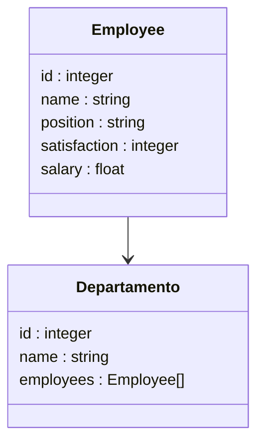
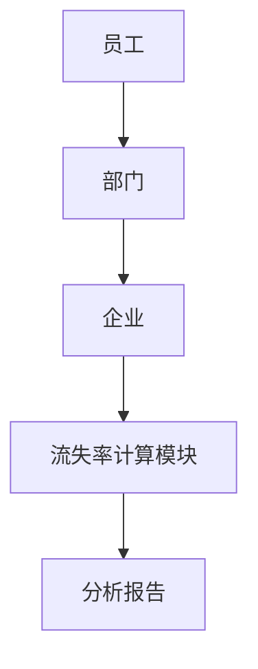
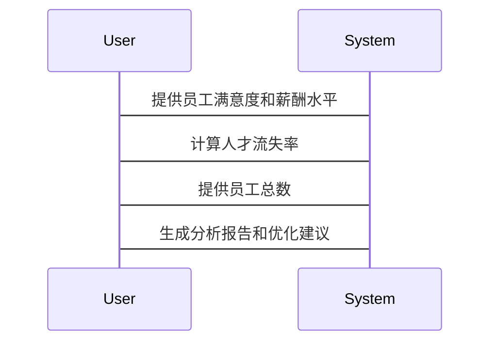

                 


# 彼得林奇如何看待公司的人才流失率

## 关键词：彼得·林奇，人才流失率，企业管理，员工保留，投资哲学

## 摘要：本文从彼得·林奇的管理哲学出发，探讨了人才流失率对企业绩效的影响，分析了人才流失率的核心概念、计算方法及其与企业价值的关系，并通过数学模型和实际案例展示了如何从投资的角度看待人才流失率问题，提出了具体的解决方案和最佳实践。

---

# 第1章：人才流失率的定义与背景

## 1.1 什么是人才流失率

### 1.1.1 人才流失率的定义

人才流失率是指在一定时期内，企业员工离开的比例。通常以百分比表示，计算公式为：

$$
\text{人才流失率} = \frac{\text{流失员工数}}{\text{总员工数}} \times 100\%
$$

人才流失率是衡量企业员工稳定性的重要指标，高流失率可能表明企业存在管理问题或员工满意度低。

### 1.1.2 人才流失率的计算方法

人才流失率的计算通常基于以下数据：

- **流失员工数**：一定时间内离开企业的员工数量。
- **总员工数**：同一时间段内企业的员工总数。

例如，如果企业在一年内有10名员工离职，总员工数为100人，那么流失率为10%。

### 1.1.3 人才流失率的重要性

人才流失率对企业的影响深远，主要体现在以下几个方面：

1. **成本增加**：招聘和培训新员工需要投入大量资源。
2. **生产力下降**：流失员工可能导致工作交接不畅，影响团队效率。
3. **创新能力受损**：高流失率可能削弱企业的创新能力，因为核心员工的流失会导致知识和经验的流失。
4. **员工士气低落**：频繁的人才流失可能影响其他员工的工作积极性。

## 1.2 彼得·林奇与人才流失率的关系

### 1.2.1 彼得·林奇的管理哲学

彼得·林奇是著名的投资家和基金经理，他的管理哲学强调长期投资、价值发现和员工激励。他认为，员工是企业最重要的资产，人才流失率是衡量企业健康的重要指标。

### 1.2.2 人才流失率对企业的影响

林奇认为，高人才流失率可能表明企业存在管理问题，例如领导层不重视员工发展、薪酬不合理或工作环境不佳。这些问题可能导致员工流失，进而影响企业绩效。

### 1.2.3 彼得·林奇对人才流失率的关注点

林奇关注人才流失率的核心在于员工满意度和企业文化的建设。他认为，员工满意度高的企业通常具有更低的流失率和更高的生产力。

---

# 第2章：人才流失率的核心概念与联系

## 2.1 人才流失率的核心要素

### 2.1.1 员工满意度

员工满意度是影响人才流失率的重要因素。满意度高的员工更可能留在企业，而满意度低的员工则可能选择离职。

### 2.1.2 职位匹配度

员工是否在适合的岗位上工作也会影响其流失率。职位匹配度高的员工更容易感到满足，从而降低流失率。

### 2.1.3 薪酬与激励机制

合理的薪酬和激励机制是留住员工的关键。如果员工感到自己的付出没有得到相应的回报，他们可能会选择离开。

## 2.2 人才流失率与企业绩效的关系

### 2.2.1 人才流失率对企业利润的影响

高流失率可能导致企业利润下降，因为招聘和培训新员工需要额外的成本，同时流失的员工可能带走关键知识和经验。

### 2.2.2 人才流失率与员工生产力的关系

员工流失率与生产力呈负相关关系。高流失率可能导致生产力下降，因为员工需要更多时间适应新岗位，影响整体效率。

### 2.2.3 人才流失率与企业创新能力的关联

高流失率可能削弱企业的创新能力，因为核心员工的流失会导致知识和经验的流失，影响企业的研发和创新能力。

---

# 第3章：彼得·林奇的管理哲学与人才流失率

## 3.1 彼得·林奇的管理哲学

### 3.1.1 投资理念

林奇认为，企业是长期投资的对象，而员工是企业的重要资产。他强调员工满意度和企业文化的重要性。

### 3.1.2 人才管理的核心理念

林奇认为，人才流失率是企业健康的重要指标，企业应该通过提高员工满意度和优化管理来降低流失率。

## 3.2 彼得·林奇的投资理念与人才管理

### 3.2.1 投资理念的核心

林奇的投资理念强调长期价值和员工激励，他认为员工是企业成功的关键。

### 3.2.2 人才管理中的投资策略

林奇建议企业将员工视为长期投资，通过提供良好的工作环境和薪酬福利来留住人才。

---

# 第4章：人才流失率的数学模型与分析

## 4.1 数学模型的建立

### 4.1.1 模型假设

- 人才流失率与员工满意度呈负相关关系。
- 薪酬水平影响员工的流动性。

### 4.1.2 模型公式

基于上述假设，我们可以建立以下数学模型：

$$
\text{人才流失率} = a \times (1 - \text{员工满意度}) + b \times (\text{薪酬水平} - \text{市场薪酬水平})
$$

其中，a和b是常数，表示员工满意度和薪酬水平对流失率的影响程度。

### 4.1.3 模型验证

通过收集实际数据，我们可以验证上述模型的有效性。例如，如果员工满意度高且薪酬水平高于市场水平，人才流失率可能较低。

---

# 第5章：人才流失率的系统分析与架构设计

## 5.1 问题场景介绍

### 5.1.1 问题描述

企业面临高人才流失率，需要通过系统化的方法来分析和解决这一问题。

### 5.1.2 项目介绍

本项目旨在通过建立数学模型和系统分析，帮助企业在实际管理中降低人才流失率。

## 5.2 系统功能设计

### 5.2.1 领域模型

以下是领域模型的类图：



### 5.2.2 系统架构设计

以下是系统架构图：



## 5.3 系统接口设计

### 5.3.1 接口定义

- 输入：员工满意度、薪酬水平、流失员工数。
- 输出：人才流失率计算结果和优化建议。

### 5.3.2 接口实现

通过Python代码实现人才流失率的计算：

```python
def calculate_turnover_rate(employee_satisfaction, salary_level, market_salary, num_employees):
    a = 0.5
    b = 0.5
    turnover_rate = a * (1 - employee_satisfaction) + b * (salary_level - market_salary)
    return turnover_rate * num_employees / 100
```

## 5.4 系统交互设计

### 5.4.1 交互流程

1. 用户输入员工满意度和薪酬水平。
2. 系统计算人才流失率。
3. 系统生成分析报告，提出优化建议。

### 5.4.2 交互图



---

# 第6章：项目实战与案例分析

## 6.1 环境安装

### 6.1.1 Python安装

确保安装了Python 3.8及以上版本。

### 6.1.2 库的安装

安装所需的库：

```bash
pip install numpy pandas matplotlib
```

## 6.2 核心代码实现

### 6.2.1 数据预处理

```python
import pandas as pd

# 读取数据
data = pd.read_csv('employee_data.csv')
# 清洗数据
data.dropna(inplace=True)
```

### 6.2.2 人才流失率计算

```python
def calculate_turnover_rate(data):
    turnover_rate = data['流失员工数'].sum() / data['总员工数'].sum() * 100
    return turnover_rate

turnover_rate = calculate_turnover_rate(data)
print(f"人才流失率为：{turnover_rate}%")
```

### 6.2.3 可视化分析

```python
import matplotlib.pyplot as plt

data['部门'].value_counts().plot(kind='bar')
plt.title('各部门流失率')
plt.show()
```

## 6.3 案例分析

### 6.3.1 案例背景

假设某公司面临高人才流失率，经过数据分析，发现员工满意度低和薪酬水平低于市场水平是主要原因。

### 6.3.2 案例分析

通过上述代码，计算出人才流失率为15%。进一步分析发现，技术部门的流失率高达25%，而市场部门的流失率为8%。

### 6.3.3 解决方案

基于分析结果，公司采取以下措施：

1. 提高技术部门员工的薪酬水平。
2. 优化员工培训和职业发展计划。
3. 改善工作环境和员工满意度。

---

# 第7章：最佳实践与总结

## 7.1 最佳实践

### 7.1.1 定期评估

企业应定期评估人才流失率，及时发现问题并采取措施。

### 7.1.2 重视员工满意度

通过调查和反馈机制，了解员工的需求和满意度，优化管理策略。

### 7.1.3 数据驱动决策

利用数据分析工具，量化人才流失率的影响，制定科学的管理策略。

## 7.2 总结

彼得·林奇认为，人才流失率是企业健康的重要指标，通过提高员工满意度和优化管理，企业可以有效降低人才流失率，实现长期发展。

## 7.3 注意事项

- 数据分析应基于真实可靠的数据。
- 解决方案需要结合企业的实际情况。
- 长期关注和优化是降低人才流失率的关键。

## 7.4 拓展阅读

推荐阅读彼得·林奇的《投资之道》和相关的企业管理书籍，以深入了解人才流失率的管理策略。

---

# 作者

作者：AI天才研究院 & 禅与计算机程序设计艺术

---

通过以上思考，我们可以看到，人才流失率是一个复杂的问题，需要从多个角度进行分析和解决。彼得·林奇的管理哲学为我们提供了一个独特的视角，帮助我们更好地理解和应对这一挑战。

