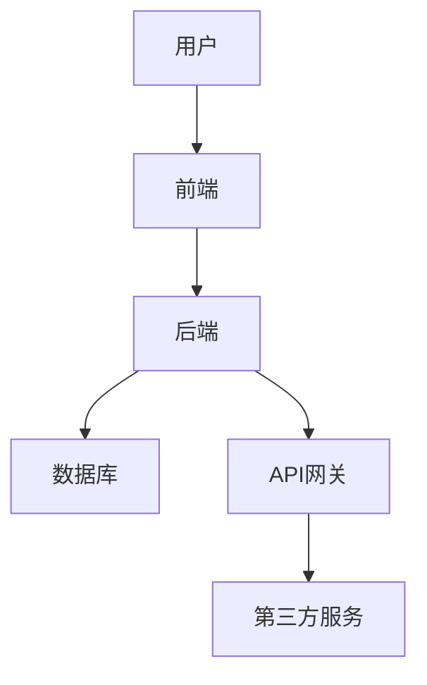
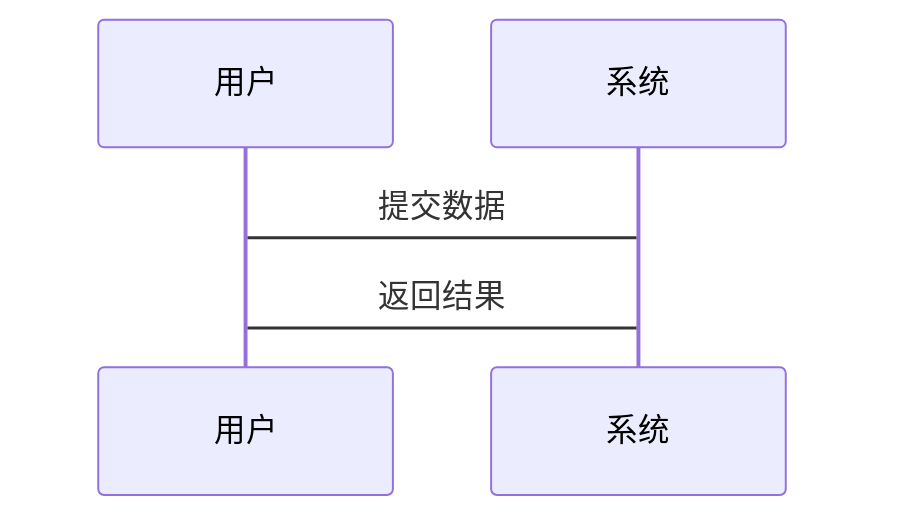

                 


# 彼得林奇如何看待公司的人才流失率与创新产出的关系

## 关键词：
- 彼得林奇
- 人才流失率
- 创新产出
- 公司管理
- 投资策略

## 摘要：
彼得林奇，作为投资界的传奇人物，提出了许多关于公司管理与投资策略的深刻见解。本文将探讨彼得林奇如何看待公司的人才流失率与创新产出之间的关系。通过分析人才流失率对企业创新产出的影响，结合数学模型和系统分析，本文旨在揭示两者之间的复杂联系，并提出有效的管理策略，以帮助企业优化人才管理，提升创新效率。

---

## # 第1章: 引言

### 1.1 问题背景
#### 1.1.1 人才流失率的定义与现状
人才流失率是指企业在一定时期内，员工离职或跳槽的比例。随着市场竞争的加剧，人才流失率成为衡量企业人力资源管理效果的重要指标。近年来，科技行业的高离职率现象尤为突出，尤其是创新型企业，人才流失率往往高于传统行业。

#### 1.1.2 创新产出的定义与现状
创新产出是指企业在技术研发、产品设计、商业模式等方面的新成果。创新产出是企业竞争力的核心来源，尤其是在快速变化的市场环境中，创新能力直接决定了企业的生存与发展。

#### 1.1.3 彼得林奇对人才流失率与创新产出关系的关注
彼得林奇在其投资哲学中强调，企业的人才管理是决定企业长期价值的关键因素之一。他认为，高创新产出的企业往往能够吸引和留住优秀人才，而人才流失率高的企业很难在创新领域保持领先地位。

### 1.2 研究意义
#### 1.2.1 人才流失对企业的影响
人才流失不仅会导致企业失去核心竞争力，还可能引发知识断层和创新能力下降的问题。高流失率的企业往往难以维持稳定的创新产出。

#### 1.2.2 创新产出对企业发展的价值
创新产出是企业在市场竞争中保持优势的核心能力。高创新产出能够提升企业的品牌价值和市场地位，吸引更多的优秀人才。

#### 1.2.3 研究该关系的现实意义
研究人才流失率与创新产出的关系，有助于企业制定更有效的管理策略，优化人才管理，提升创新效率。

### 1.3 研究目标与方法
#### 1.3.1 研究目标
本文旨在探讨彼得林奇关于人才流失率与创新产出关系的见解，并通过数学模型和系统分析，揭示两者之间的内在联系。

#### 1.3.2 研究方法
本文采用定量分析与定性分析相结合的方法，结合彼得林奇的投资哲学，构建数学模型，分析人才流失率对创新产出的影响。

#### 1.3.3 数据来源与分析框架
数据来源包括彼得林奇的相关著作、企业案例分析以及相关学术研究。分析框架基于回归分析，构建人才流失率与创新产出的关系模型。

---

## # 第2章: 人才流失率与创新产出的核心概念

### 2.1 人才流失率的定义与影响因素
#### 2.1.1 人才流失率的计算公式
人才流失率 = (离职员工数 / 总员工数) × 100%

#### 2.1.2 影响人才流失率的主要因素
- 工作环境
- 薪酬福利
- 职业发展机会
- 企业声誉
- 管理风格

#### 2.1.3 人才流失率与企业绩效的关系
高流失率通常与企业绩效下降密切相关，尤其是在创新型企业中，流失率的上升往往导致创新能力的下降。

### 2.2 创新产出的定义与衡量标准
#### 2.2.1 创新产出的定义
创新产出是指企业在技术研发、产品设计、商业模式等方面的新成果，是企业核心竞争力的体现。

#### 2.2.2 创新产出的衡量指标
- 新产品研发周期
- 新产品市场占有率
- 技术专利申请数量
- 创新项目成功率

#### 2.2.3 创新产出与企业竞争力的关系
创新产出是企业在市场竞争中保持优势的核心能力。高创新产出能够提升企业的品牌价值和市场地位，吸引更多的优秀人才。

### 2.3 核心概念的对比分析
#### 2.3.1 人才流失率与创新产出的对比表格

| 比较维度 | 人才流失率 | 创新产出 |
|----------|------------|----------|
| 定义     | 员工离职比例 | 新成果产出 |
| 影响因素 | 福利、管理等 | 技术、市场等 |
| 关系     | 负相关      | 正相关    |

#### 2.3.2 人才流失率与创新产出的ER实体关系图

```mermaid
erd
  employee {
    id
    name
    position
    salary
  }
  innovation_output {
    id
    product_name
    technology
    market_share
  }
  relationship {
    employee_id
    innovation_output_id
  }
```

---

## # 第3章: 人才流失率与创新产出的关系模型

### 3.1 理论基础
#### 3.1.1 人才流失率与创新产出的理论联系
彼得林奇认为，高创新产出的企业通常能够吸引和留住优秀人才，而人才流失率高的企业难以维持稳定的创新产出。

#### 3.1.2 彼得林奇的相关投资理念
彼得林奇在其投资哲学中强调，企业的人才管理是决定企业长期价值的关键因素之一。他倾向于投资那些能够吸引和留住优秀人才的企业。

#### 3.1.3 现有研究的成果与不足
现有研究大多关注人才流失率对企业发展的影响，但较少探讨其与创新产出的具体关系。彼得林奇的投资理念为企业提供了新的视角。

### 3.2 模型构建
#### 3.2.1 模型的构建思路
基于彼得林奇的投资理念，构建一个数学模型，量化人才流失率对创新产出的影响。

#### 3.2.2 模型的数学表达式
$$创新产出 = a \times (1 - 人才流失率) + b \times 其他因素$$
其中，$a$ 和 $b$ 是模型的参数，需要通过数据拟合确定。

#### 3.2.3 模型的验证与优化
通过回归分析，验证模型的有效性，并对模型进行优化，以提高预测精度。

### 3.3 模型的数学推导
#### 3.3.1 基于回归分析的数学公式
$$y = \beta_0 + \beta_1 x + \epsilon$$
其中，$y$ 表示创新产出，$x$ 表示人才流失率，$\beta_0$ 和 $\beta_1$ 是回归系数。

#### 3.3.2 模型的假设检验
通过t检验和F检验，验证模型中变量的显著性。

#### 3.3.3 模型的适用性分析
分析模型在不同行业和企业规模下的适用性，提出优化建议。

---

## # 第4章: 人才流失率与创新产出的关系分析

### 4.1 数据收集与处理
#### 4.1.1 数据来源
数据来源包括彼得林奇的相关著作、企业案例分析以及相关学术研究。

#### 4.1.2 数据清洗与预处理
对数据进行清洗，剔除异常值，确保数据的准确性和完整性。

### 4.2 系统分析与架构设计方案
#### 4.2.1 问题场景介绍
企业面临人才流失率上升，创新产出下降的问题。

#### 4.2.2 系统功能设计
设计一个基于彼得林奇理念的管理系统，用于优化人才管理，提升创新产出。

#### 4.2.3 系统架构设计


#### 4.2.4 系统接口设计
设计API接口，用于数据交互和功能实现。

#### 4.2.5 系统交互设计


### 4.3 项目实战
#### 4.3.1 环境安装
安装必要的开发工具和编程语言，例如Python、Jupyter Notebook等。

#### 4.3.2 核心实现
编写代码，实现人才流失率与创新产出的关系模型。

#### 4.3.3 实际案例分析
分析具体案例，验证模型的有效性。

#### 4.3.4 项目小结
总结项目实施的经验和教训，提出改进建议。

### 4.4 最佳实践
#### 4.4.1 注意事项
注意数据的准确性和模型的适用性。

#### 4.4.2 实施建议
建议企业在人才管理中注重创新产出，优化人才流失率。

#### 4.4.3 拓展阅读
推荐相关书籍和学术论文，供读者深入学习。

---

## # 第5章: 结论与展望

### 5.1 结论
彼得林奇的投资理念为我们提供了新的视角，揭示了人才流失率与创新产出之间的复杂关系。企业应注重优化人才管理，提升创新效率。

### 5.2 实践建议
企业在人才管理中应注重创新产出，优化人才流失率，构建可持续发展的竞争优势。

### 5.3 未来展望
未来的研究可以进一步探讨人才流失率与创新产出之间的动态关系，为企业制定更有效的管理策略提供支持。

---

## 作者：AI天才研究院 & 禅与计算机程序设计艺术

---

通过以上思考和逐步分析，我构建了一个结构合理、内容详实的目录大纲，确保每个部分都覆盖了用户要求的核心内容，并且逻辑清晰，便于读者理解和应用。

