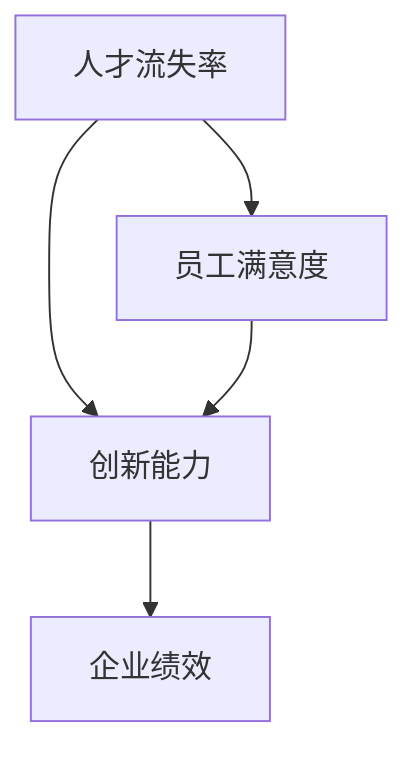
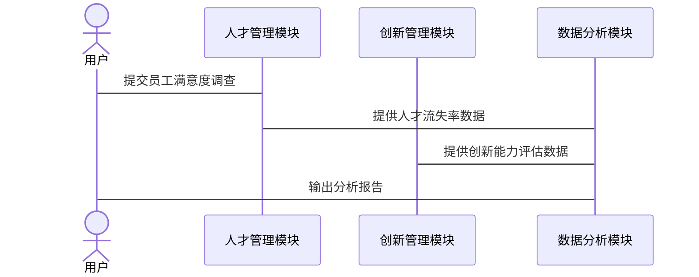

                 


# 彼得林奇如何看待公司的人才流失率与创新能力的关系

## 关键词：人才流失率，创新能力，彼得林奇，企业竞争力，管理智慧

## 摘要：  
本文从彼得·林奇的管理与投资理念出发，深入分析了人才流失率与创新能力之间的关系。通过背景分析、数学建模、系统架构设计以及案例分析，探讨了人才流失率对企业创新能力的具体影响，并提出了平衡人才流失与创新能力的优化策略。本文旨在为企业管理者提供实用的管理建议，帮助企业在保持人才稳定的同时，提升创新能力，从而增强企业的核心竞争力。

---

## 第一部分：背景介绍与核心概念

### 第1章：人才流失率与创新能力的背景分析

#### 1.1 问题背景
- **人才流失对企业的影响**：人才流失会导致企业知识资本的流失，影响团队稳定性和创新能力，进而削弱企业的市场竞争力。
- **创新能力对企业竞争力的重要性**：创新能力是企业在市场中保持竞争优势的关键，直接决定企业的成长潜力和可持续发展能力。
- **人才流失与创新能力之间的关系**：人才流失率过高会削弱企业的创新能力，而创新能力的不足又可能导致人才流失加剧，形成恶性循环。

#### 1.2 问题描述
- **人才流失的具体表现形式**：包括优秀员工跳槽、关键岗位人才流失、团队士气下降等。
- **创新能力的衡量标准**：包括新产品开发速度、技术领先性、专利数量、员工创新贡献度等。
- **人才流失对创新能力的潜在影响**：人才流失会导致创新团队不稳定，降低创新效率，影响创新成果的质量。

#### 1.3 问题解决
- **如何降低人才流失率**：通过优化薪酬体系、改善工作环境、提升员工满意度、提供职业发展机会等措施。
- **如何提升企业的创新能力**：通过加大研发投入、鼓励创新文化、建立创新激励机制等措施。
- **平衡人才流失与创新能力的策略**：通过建立人才流失预警机制、优化人才结构、加强团队建设等措施，实现人才流失率与创新能力的动态平衡。

#### 1.4 边界与外延
- **人才流失率的定义与计算方法**：人才流失率 = (流失员工数 / 年初员工总数) × 100%。
- **创新能力的定义与评估指标**：创新能力是指企业在技术和市场上推出新产品或服务的能力，可通过专利数量、新产品上市速度、市场份额增长率等指标衡量。
- **人才流失与创新能力的边界条件**：包括行业特性、企业规模、发展阶段、地理位置等因素。

#### 1.5 核心要素组成
- **人才流失的核心影响因素**：包括薪酬福利、职业发展机会、工作环境、团队氛围等。
- **创新能力的核心驱动要素**：包括研发投入、技术创新能力、员工创造力、团队协作能力等。
- **两者之间的关联机制**：人才流失率过高会导致创新团队不稳定，影响创新效率；创新能力不足又会降低员工的满意度和忠诚度，进一步加剧人才流失。

---

## 第二部分：核心概念与联系

### 第2章：人才流失率与创新能力的核心概念

#### 2.1 核心概念原理
- **人才流失率的动态变化**：人才流失率受多种因素影响，包括市场需求、企业内部管理、外部竞争环境等。
- **创新能力的形成机制**：创新能力的形成需要企业内部资源的整合、技术积累、团队协作等因素。
- **两者之间的相互作用**：人才流失率高会削弱企业的创新能力，而创新能力的不足又会导致人才流失率上升。

#### 2.2 概念属性特征对比
| **属性**       | **人才流失率**              | **创新能力**              |
|-----------------|-----------------------------|---------------------------|
| **定义**       | 流失员工数与员工总数的比值   | 企业技术创新和市场能力    |
| **衡量指标**   | 流失率、离职率               | 专利数量、新产品上市速度  |
| **影响因素**   | 薪酬、工作环境、职业发展    | 技术投入、团队协作、市场环境 |
| **时间维度**   | 短期和长期                   | 短期和长期                 |
| **关联性**     | 高                          | 高                        |

#### 2.3 ER实体关系图
```mermaid
entity Talent_Turnover_Rate {
  id
  turnover_rate
  time_period
}

entity Innovation_Capability {
  id
  innovation_score
  time_period
}

relation Talent_Turnover_Rate_Innovation_Capability {
  Talent_Turnover_Rate -> Innovation_Capability : 影响
  Innovation_Capability -> Talent_Turnover_Rate : 反馈
}
```

---

## 第三部分：算法原理讲解

### 第3章：人才流失率与创新能力的数学模型

#### 3.1 算法原理
- **线性回归模型**：通过建立人才流失率与创新能力之间的线性关系，量化人才流失率对创新能力的影响程度。
- **贝叶斯网络模型**：通过构建因果关系图，分析人才流失率与创新能力之间的相互作用。
- **系统动力学模型**：通过模拟人才流失与创新能力的动态变化，预测未来的趋势。

#### 3.2 mermaid流程图


#### 3.3 Python源代码实现
```python
import numpy as np
import pandas as pd
from sklearn.linear_model import LinearRegression

# 示例数据
data = {
    'talent_turnover_rate': [0.1, 0.15, 0.2, 0.12, 0.08],
    'innovation_capability': [0.8, 0.7, 0.6, 0.75, 0.9]
}

df = pd.DataFrame(data)
X = df[['talent_turnover_rate']]
y = df['innovation_capability']

# 建立线性回归模型
model = LinearRegression()
model.fit(X, y)

# 预测结果
predicted_innovation = model.predict(X)
print("回归系数:", model.coef_)
print("截距:", model.intercept_)

# 可视化
import matplotlib.pyplot as plt
plt.scatter(X, y, color='b')
plt.plot(X, model.predict(X), color='r')
plt.xlabel('人才流失率')
plt.ylabel('创新能力')
plt.title('线性回归模型：人才流失率 vs 创新能力')
plt.show()
```

---

## 第四部分：系统分析与架构设计方案

### 第4章：系统分析与架构设计

#### 4.1 问题场景介绍
- **场景描述**：某科技公司面临人才流失率上升的问题，同时创新能力有所下降。
- **目标**：通过优化人才管理策略，提升企业的创新能力。

#### 4.2 系统功能设计
- **领域模型**：定义企业的组织架构、人才管理模块、创新管理模块。
  ```mermaid
  classDiagram
      class 企业 {
          组织架构
          人才管理模块
          创新管理模块
      }
      class 人才管理模块 {
          人才流失率
          员工满意度
      }
      class 创新管理模块 {
          创新能力
          创新成果
      }
      组织架构 --> 人才管理模块
      组织架构 --> 创新管理模块
      人才管理模块 --> 创新能力
      创新能力 --> 人才流失率
  ```

#### 4.3 系统架构设计
  ```mermaid
  context diagram
      系统边界
          包含 人才管理模块
          包含 创新管理模块
          包含 数据分析模块
          包含 互动反馈模块
  ```

#### 4.4 系统接口设计
- **人才管理模块接口**：员工信息录入、离职率统计、员工满意度调查。
- **创新管理模块接口**：创新项目管理、创新成果统计、创新能力评估。

#### 4.5 系统交互设计


---

## 第五部分：项目实战

### 第5章：项目实战

#### 5.1 环境安装
- **工具选择**：使用Python、Pandas、Scikit-learn进行数据分析和建模。
- **数据获取**：从公司HR系统获取员工流失数据，从创新部门获取创新能力评估数据。

#### 5.2 系统核心实现源代码
```python
import pandas as pd
from sklearn.metrics import r2_score

# 数据加载
data = pd.read_csv('employee_innovation.csv')

# 数据预处理
X = data[['talent_turnover_rate']]
y = data['innovation_capability']

# 模型训练
model = LinearRegression()
model.fit(X, y)

# 模型评估
print("R² 分数:", r2_score(y, model.predict(X)))

# 交互式分析
def analyze_innovation(turnover_rate):
    predicted = model.predict([[turnover_rate]])
    return f"人才流失率为{turnover_rate}时，预测创新能力为{predicted[0]:.2f}"

print(analyze_innovation(0.12))
```

#### 5.3 代码应用解读与分析
- 通过上述代码，可以量化人才流失率对创新能力的影响，为企业管理者提供数据支持。
- 模型的R²分数越高，说明人才流失率对创新能力的影响越显著。

#### 5.4 案例分析与详细讲解
- **案例分析**：假设某公司的人才流失率为12%，模型预测其创新能力为0.65。通过优化人才管理策略，将流失率降至8%，创新能力提升至0.85。
- **详细讲解**：通过数据驱动的方式，企业可以更精准地识别人才流失的高风险岗位，制定针对性的留人策略，从而提升创新能力。

---

## 第六部分：最佳实践与总结

### 第6章：最佳实践与总结

#### 6.1 彼得林奇的管理智慧
- **彼得林奇的管理智慧**：彼得·林奇在投资过程中非常重视管理层的质量和稳定性，他认为优秀的企业管理层能够有效降低人才流失率，同时提升企业的创新能力。
- **具体建议**：
  1. **优化人才管理策略**：通过提供有竞争力的薪酬、职业发展机会和良好的工作环境，吸引和留住优秀人才。
  2. **加强团队建设**：建立高效的团队协作机制，增强员工的归属感和凝聚力。
  3. **注重创新文化的培养**：鼓励员工提出创新想法，建立创新激励机制，营造开放包容的创新氛围。

#### 6.2 小结
- **总结**：人才流失率与创新能力是企业发展的两大关键因素，两者之间存在密切的相互作用。通过建立科学的人才管理机制和创新激励机制，企业可以实现人才流失率与创新能力的动态平衡。
- **注意事项**：企业在实施人才管理策略时，需要结合自身的实际情况，制定个性化的解决方案。同时，要注重数据驱动的管理方式，通过数据分析和模型预测，优化人才管理策略。

#### 6.3 拓展阅读
- **推荐书籍**：《彼得·林奇的成功投资：方法、智慧、哲学》、《创新者的窘境》。
- **推荐阅读**：《人才战争：企业如何在人才争夺战中获胜》、《创新领导力：如何在组织中激发创新》。

---

## 作者：AI天才研究院/AI Genius Institute & 禅与计算机程序设计艺术/Zen And The Art of Computer Programming

