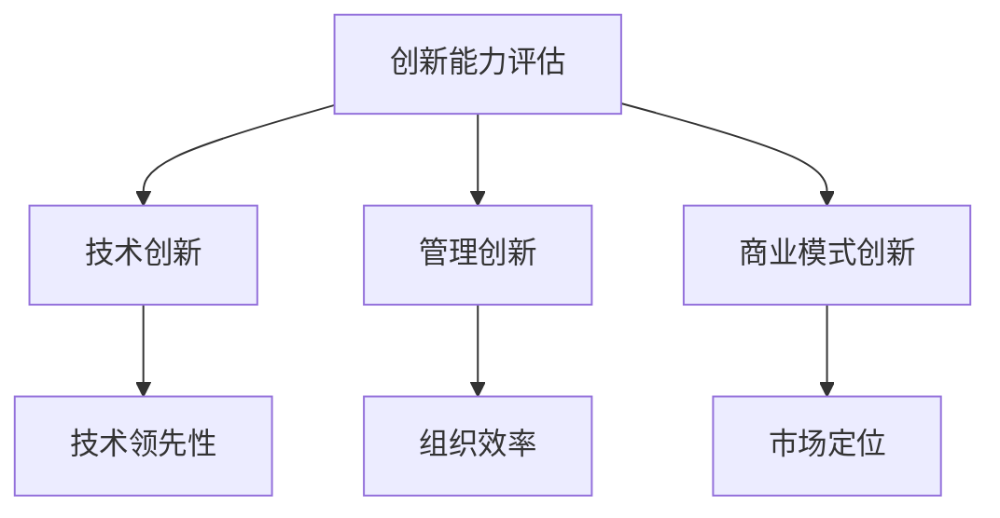

                 


# 彼得林奇如何看待公司的创新能力

## 关键词：彼得林奇、公司创新能力、投资理念、创新评估、企业绩效

## 摘要：本文从彼得林奇的投资理念出发，分析其如何看待公司的创新能力。通过定义创新能力的核心概念，探讨创新在企业中的重要性，结合具体的评估方法和数学模型，详细阐述彼得林奇视角下的创新能力与企业绩效的关系。文章还包括实际案例分析和系统架构设计，旨在为企业提供创新管理的最佳实践。

---

# 第一部分: 创新能力的背景与重要性

## 第1章: 创新能力的定义与背景

### 1.1 创新能力的基本概念

#### 1.1.1 创新的定义与内涵
创新是推动企业发展的核心动力，通常指将新的想法、技术或方法引入现有系统或流程。创新能力是企业在市场中保持竞争力的关键。

#### 1.1.2 创新能力的核心要素
创新能力的核心要素包括技术创新、管理创新和商业模式创新。这些要素共同构成了企业的创新体系。

#### 1.1.3 创新能力与企业绩效的关系
创新能力直接影响企业绩效，包括利润增长、市场份额扩展和品牌价值提升。企业通过创新可以实现可持续发展。

### 1.2 彼得·林奇的投资理念

#### 1.2.1 彼得·林奇的投资哲学
彼得·林奇认为，投资的核心在于选择具有持续创新能力的公司。他强调长期增长和内在价值的重要性。

#### 1.2.2 彼得·林奇对创新公司的关注点
林奇关注公司的技术创新能力、管理效率和商业模式的创新。他认为这些因素决定了公司的长期发展潜力。

#### 1.2.3 彼得·林奇的成功案例分析
通过分析可口可乐和微软等公司的案例，林奇展示了创新能力在投资决策中的重要性。

### 1.3 公司创新能力的重要性

#### 1.3.1 创新在企业竞争中的作用
创新是企业在竞争中脱颖而出的关键。通过创新，企业可以提供差异化的产品和服务，吸引更多的客户。

#### 1.3.2 创新驱动企业增长的机制
创新通过优化流程、降低成本和提高效率，直接推动企业的增长。创新还能开拓新的市场和客户群体。

#### 1.3.3 创新与企业可持续发展的关系
创新是企业实现可持续发展的核心。通过创新，企业可以减少资源消耗、提高效率并降低环境影响。

## 1.4 本章小结
本章介绍了创新能力的基本概念，探讨了彼得·林奇的投资理念，并分析了创新能力在企业绩效中的重要性。创新不仅是企业的生存之本，也是投资成功的关键。

---

## 第2章: 创新能力的核心概念

### 2.1 创新能力的构成要素

#### 2.1.1 技术创新
技术创新是创新能力的核心。通过引入新技术，企业可以提升产品性能和用户体验。

#### 2.1.2 管理创新
管理创新涉及优化企业流程和组织结构。高效的管理可以显著提高企业的运营效率。

#### 2.1.3 商业模式创新
商业模式创新关注企业如何创造价值和获取收益。新的商业模式可以为企业带来新的增长点。

### 2.2 创新能力与企业绩效的关系

#### 2.2.1 创新能力对企业利润的影响
创新能力直接影响企业的利润。通过创新，企业可以降低成本、提高效率和增加收入。

#### 2.2.2 创新能力对市场份额的影响
创新能力强的企业更容易在市场中占据领先地位。创新产品和服务吸引了更多的客户。

#### 2.2.3 创新能力对品牌价值的影响
强大的创新能力提升了企业的品牌价值。创新使企业成为行业的领导者，增强了品牌影响力。

### 2.3 彼得·林奇视角下的创新要素

#### 2.3.1 技术创新在林奇投资中的权重
林奇认为技术创新是决定投资价值的重要因素。他倾向于投资具有技术优势的企业。

#### 2.3.2 管理创新对林奇投资决策的影响
高效的管理团队和流程是林奇投资决策的关键。他关注企业如何通过管理创新提高效率。

#### 2.3.3 商业模式创新对林奇投资价值的判断
林奇重视商业模式的创新。他倾向于投资那些能够持续创造价值的企业。

### 2.4 本章小结
本章分析了创新能力的核心构成要素，探讨了这些要素如何影响企业绩效。从彼得·林奇的视角出发，技术创新、管理创新和商业模式创新是投资决策的关键因素。

---

## 第3章: 创新能力的评估与分析

### 3.1 创新能力的评估指标

#### 3.1.1 技术创新的评估指标
技术创新的评估指标包括技术领先性、研发投入和专利数量。这些指标反映了企业的技术实力。

#### 3.1.2 管理创新的评估指标
管理创新的评估指标包括组织效率、管理团队能力和流程优化。这些指标衡量企业的管理创新能力。

#### 3.1.3 商业模式创新的评估指标
商业模式创新的评估指标包括市场定位、客户满意度和收入增长。这些指标反映了商业模式的创新程度。

### 3.2 创新能力的定性评估

#### 3.2.1 技术创新的定性分析
定性分析包括评估技术的独特性和市场潜力。企业需要展示其技术如何解决实际问题。

#### 3.2.2 管理创新的定性分析
定性分析包括评估管理团队的能力和组织结构的灵活性。高效的管理团队能够推动创新。

#### 3.2.3 商业模式创新的定性分析
定性分析包括评估商业模式的创新性和可持续性。新的商业模式需要能够持续创造价值。

### 3.3 彼得·林奇视角下的创新评估

#### 3.3.1 林奇对技术创新的评估标准
林奇关注技术创新的实用性和市场潜力。他倾向于投资那些能够将技术转化为实际收益的企业。

#### 3.3.2 林奇对管理创新的评估标准
林奇重视管理团队的能力和组织结构的灵活性。他相信高效的管理能够推动企业的持续创新。

#### 3.3.3 林奇对商业模式创新的评估标准
林奇关注商业模式的创新性和可持续性。他倾向于投资那些能够通过创新商业模式实现增长的企业。

## 3.4 本章小结
本章探讨了创新能力的评估指标，分析了定性评估的重要性。从彼得·林奇的视角出发，技术创新、管理创新和商业模式创新是评估公司创新能力的关键指标。

---

## 第4章: 创新能力的数学模型与算法分析

### 4.1 创新能力的数学模型

#### 4.1.1 层次分析法（AHP）
层次分析法是一种常用的评估方法。通过构建层次结构，评估各创新要素的权重和影响。

$$ AHP模型：W_i = \frac{w_i}{\sum w_i} $$

#### 4.1.2 创新能力综合评估模型
创新能力的综合评估模型将技术创新、管理创新和商业模式创新纳入考虑。

$$ C = \alpha T + \beta M + \gamma B $$

其中，$C$ 表示创新能力，$T$ 表示技术创新，$M$ 表示管理创新，$B$ 表示商业模式创新，$\alpha$、$\beta$、$\gamma$ 表示各要素的权重。

### 4.2 创新能力的算法实现

#### 4.2.1 算法实现步骤
1. 收集各创新要素的数据。
2. 构建层次结构。
3. 计算各要素的权重。
4. 综合评估创新能力。

#### 4.2.2 代码实现
```python
import numpy as np

def calculate创新能力(weights):
    return np.dot(weights, np.array([T, M, B]))

weights = [0.4, 0.3, 0.3]
T = 0.8
M = 0.7
B = 0.6

创新能力 = calculate创新能力(weights)
print("创新能力:", 创新能力)
```

### 4.3 本章小结
本章通过数学模型和算法分析，展示了如何量化创新能力。层次分析法和综合评估模型为评估公司创新能力提供了理论依据。

---

## 第5章: 创新能力的系统架构与设计

### 5.1 系统架构设计

#### 5.1.1 系统功能设计
系统功能包括创新能力评估、创新过程管理、创新成果展示和创新数据分析。

#### 5.1.2 系统架构图
使用 Mermaid 绘制系统架构图，展示各模块之间的关系。



### 5.2 创新过程管理

#### 5.2.1 创新问题识别
识别创新机会和挑战，明确创新目标。

#### 5.2.2 创新方案设计
设计创新方案，评估其可行性和潜在价值。

#### 5.2.3 创新实施与监控
实施创新方案，监控其执行情况并及时调整。

### 5.3 本章小结
本章通过系统架构设计，展示了创新能力评估和管理的系统化方法。创新过程管理为企业的持续创新提供了框架。

---

## 第6章: 创新能力的项目实战

### 6.1 项目背景与目标

#### 6.1.1 项目背景
以一家科技公司为例，分析其创新能力。

#### 6.1.2 项目目标
评估公司的创新能力，提出改进建议。

### 6.2 项目实施

#### 6.2.1 环境安装
安装必要的工具和软件，如数据分析工具和项目管理软件。

#### 6.2.2 系统核心实现
实现创新能力评估模型，收集和分析数据。

#### 6.2.3 代码实现
编写代码，实现创新能力评估和数据分析。

```python
import pandas as pd

data = pd.read_csv('创新数据.csv')
创新评估 = data.apply(lambda x: x['技术创新']*0.4 + x['管理创新']*0.3 + x['商业模式创新']*0.3)
print(创新评估.head())
```

### 6.3 实际案例分析

#### 6.3.1 苹果公司的创新能力分析
分析苹果公司的技术创新、管理创新和商业模式创新，评估其创新能力。

#### 6.3.2 创新能力评估结果
根据评估模型，得出苹果公司的创新能力得分。

### 6.4 本章小结
本章通过项目实战，展示了如何在实际中应用创新能力评估模型。案例分析提供了具体的操作步骤和结果解读。

---

## 第7章: 创新能力的最佳实践与小结

### 7.1 彼得·林奇观点总结

#### 7.1.1 创新能力是投资成功的关键
林奇认为，创新能力是投资成功的关键。他倾向于投资那些具有持续创新能力的企业。

#### 7.1.2 创新能力与企业绩效的关系
林奇强调，创新能力直接影响企业绩效，包括利润增长和市场份额扩展。

#### 7.1.3 创新能力的持续提升
林奇认为，企业需要不断优化创新能力，以应对市场的变化和挑战。

### 7.2 创新能力管理的 tips

#### 7.2.1 设定创新目标
企业应设定明确的创新目标，确保创新活动的有序进行。

#### 7.2.2 建立创新文化
企业应建立创新文化，鼓励员工提出新想法和解决方案。

#### 7.2.3 投资创新资源
企业应加大对创新的投入，包括资金、时间和人力资源。

### 7.3 小结与注意事项

#### 7.3.1 创新能力的动态性
创新能力是一个动态过程，需要企业不断优化和调整。

#### 7.3.2 创新能力的外部环境影响
外部环境的变化对创新能力有重要影响，企业需灵活应对。

#### 7.3.3 创新能力的长期性
创新能力的提升需要长期努力，企业应制定长期的创新战略。

### 7.4 拓展阅读

#### 7.4.1 创新管理的经典著作
推荐一些创新管理的经典著作，供读者深入学习。

#### 7.4.2 彼得·林奇的投资策略
进一步了解彼得·林奇的投资策略，提升对创新能力的理解。

---

## 作者：AI天才研究院 & 禅与计算机程序设计艺术

