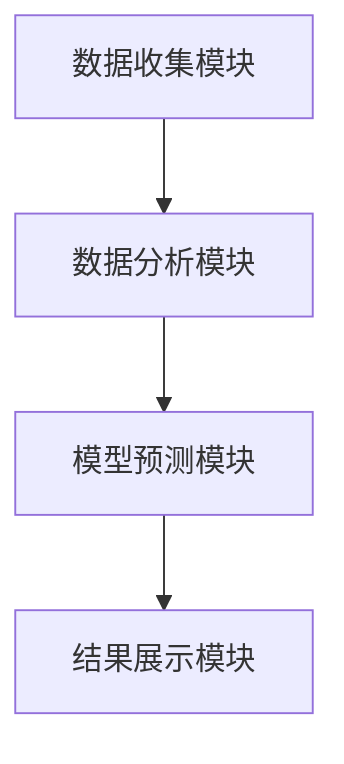

                 


# 彼得林奇如何看待公司的员工保留率

> 关键词：员工保留率，彼得·林奇，员工满意度，企业价值，投资分析，预测模型

> 摘要：本文从彼得·林奇的投资视角探讨员工保留率对企业价值的影响，详细分析员工保留率的定义、关键指标、数学模型、系统设计及项目实战，帮助投资者和管理者从新角度理解员工保留率的重要性。

---

## 第一部分：员工保留率的背景与重要性

### 第1章：员工保留率的定义与影响

#### 1.1 员工保留率的基本概念
员工保留率是指企业在一定时间内留住员工的比例，是衡量企业员工稳定性的重要指标。高保留率意味着企业能够有效吸引和留住人才，降低招聘和培训成本，同时提高员工满意度和企业绩效。

#### 1.2 彼得·林奇视角下的员工保留率
彼得·林奇认为，员工保留率是企业价值的重要组成部分。他认为，一个公司如果能够保持较高的员工保留率，通常意味着公司管理良好，员工满意度高，进而推动公司绩效和股价上涨。

---

## 第二部分：员工保留率的关键指标

### 第2章：员工保留率的核心概念与分析框架

#### 2.1 员工满意度与保留率
员工满意度是影响保留率的关键因素。高满意度的员工更可能留在公司，而低满意度的员工则容易离职。

#### 2.2 员工流失率与保留率
员工流失率是员工离开公司的比例，高流失率意味着公司可能需要不断招聘新员工，增加成本。

---

## 第三部分：员工保留率的数学模型与算法

### 第3章：员工保留率的预测模型

#### 3.1 基于统计学的员工保留率预测
逻辑回归模型常用于预测员工流失概率，公式如下：
$$ P(\text{流失}) = \frac{1}{1 + e^{-\beta x}} $$
其中，$x$ 是影响因素，$\beta$ 是回归系数。

#### 3.2 基于机器学习的员工保留率预测
随机森林模型通过集成多个决策树进行预测，代码示例如下：
```python
from sklearn.ensemble import RandomForestClassifier
model = RandomForestClassifier(n_estimators=100)
model.fit(X_train, y_train)
```

---

## 第四部分：员工保留率的系统分析与架构设计

### 第4章：员工保留率分析系统的功能设计

#### 4.1 系统功能模块划分
- 数据收集模块：收集员工数据和流失记录。
- 数据分析模块：计算保留率和流失率。
- 模型预测模块：预测未来员工流失情况。

#### 4.2 系统架构设计
系统架构图展示各模块之间的交互，使用Mermaid图表如下：


---

## 第五部分：员工保留率的项目实战

### 第5章：员工保留率分析系统的实现

#### 5.1 环境安装与配置
安装Python和必要的库：
```bash
pip install pandas numpy scikit-learn matplotlib
```

#### 5.2 系统核心实现
使用逻辑回归模型预测员工流失：
```python
import pandas as pd
from sklearn.linear_model import LogisticRegression
from sklearn.model_selection import train_test_split

# 加载数据
data = pd.read_csv('employee.csv')

# 划分训练集和测试集
X_train, X_test, y_train, y_test = train_test_split(data.drop('left', axis=1), data['left'], test_size=0.2)

# 训练模型
model = LogisticRegression()
model.fit(X_train, y_train)

# 预测
predictions = model.predict(X_test)
print("准确率:", accuracy_score(y_test, predictions))
```

---

## 第六部分：最佳实践与总结

### 第6章：总结与小结
彼得·林奇从投资角度强调员工保留率的重要性，企业应通过提高员工满意度和优化管理来提升保留率，从而增强企业价值。

---

## 作者：AI天才研究院

通过本文的详细分析，我们从投资和管理双重视角理解员工保留率的重要性，并通过数学模型和系统设计提供实用的解决方案。希望本文能为投资者和管理者提供新的视角和工具，帮助他们更好地管理员工保留率。

