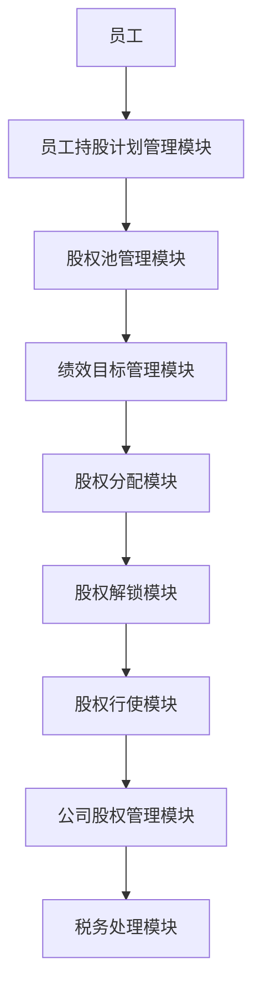
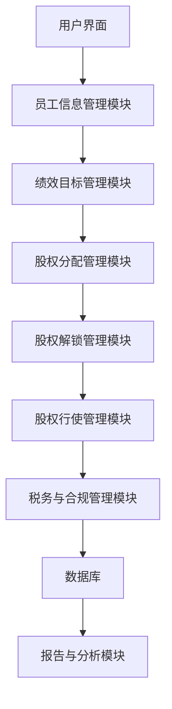
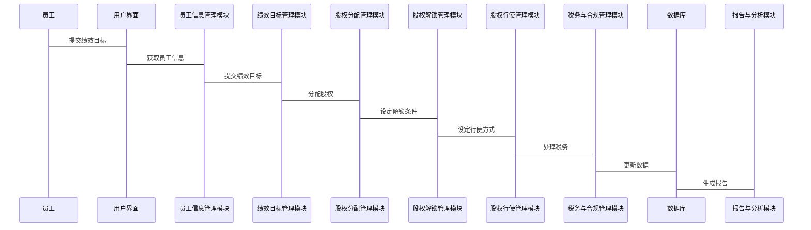
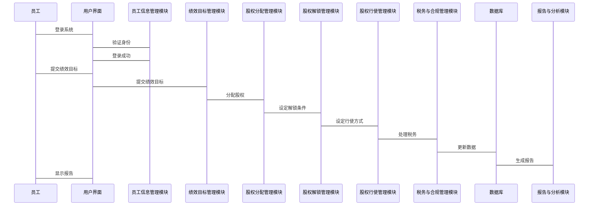

                 

<think>
好，我现在需要根据用户提供的任务和要求，撰写一篇关于彼得·林奇如何看待公司员工持股计划的详细技术博客文章。用户已经提供了文章的目录大纲和一些初始内容，但文章并未完成，我需要根据这个框架继续完成后续内容。

首先，我会回顾用户提供的内容，确认每一章的内容是否完整，是否符合逻辑和结构要求。接着，我会按照目录的顺序逐步撰写每一章的详细内容，确保每一部分都涵盖必要的知识点，并且符合技术博客的风格。

在撰写过程中，我需要特别注意以下几点：
1. **逻辑清晰**：每一章的内容要有明确的主题，逻辑连贯，层次分明。
2. **技术深度**：在分析ESOP的结构、运作机制以及彼得·林奇的投资策略时，要深入探讨相关理论和实践，提供具体的案例和数据支持。
3. **语言风格**：使用专业但易懂的技术语言，避免过于复杂的术语，确保读者能够轻松理解。
4. **格式要求**：严格按照用户的要求，使用markdown格式，包括标题、子标题、列表、代码块等，同时插入mermaid图表和latex公式。
5. **最佳实践**：在每一章的结尾，加入相关的最佳实践、小结、注意事项和拓展阅读，帮助读者更好地理解和应用所学知识。

接下来，我会开始逐章撰写内容，确保每一部分内容详实，结构合理。

---

## 第一部分: 公司员工持股计划的背景与概述

### 第1章: 员工持股计划的基本概念

#### 1.1 员工持股计划的定义与起源

##### 1.1.1 什么是员工持股计划（ESOP）
员工持股计划（Employee Stock Ownership Plan，简称ESOP）是一种通过让公司员工持有公司股权，以激励员工、增强团队凝聚力并促进公司长期发展的制度。ESOP的核心在于将员工的利益与公司的成功紧密绑定，使员工不仅是公司的员工，更是公司的部分所有者。

##### 1.1.2 ESOP的历史发展与现状
ESOP的概念起源于20世纪60年代的美国。当时，企业管理者意识到，通过让员工持有公司股权，可以激发员工的工作积极性，同时也能吸引和留住优秀人才。随着时间的推移，ESOP逐渐成为现代公司治理和激励机制中的重要组成部分。

目前，ESOP在世界各地得到了广泛应用，尤其是在美国、欧洲和亚洲的一些国家。许多大型企业都将ESOP作为核心激励工具之一，以应对日益激烈的市场竞争。

##### 1.1.3 ESOP在公司治理中的作用
ESOP在公司治理中扮演着多重角色：
- **激励员工**：通过股权分配，员工对公司业绩的关注度提高，工作积极性增强。
- **增强团队凝聚力**：员工共同持有公司股权，增强了团队合作精神。
- **吸引和留住人才**：ESOP作为一种长期激励工具，有助于吸引和保留优秀员工。
- **促进公司长期发展**：员工与公司利益一致，更关注公司的长期发展。

#### 1.2 ESOP的核心要素与结构

##### 1.2.1 ESOP的主要组成部分
ESOP通常包括以下几个关键部分：
1. **股权分配**：公司向员工分配一定比例的股权，通常以股票或期权的形式。
2. **激励机制**：通过设定绩效目标，员工在实现目标后才能获得股权。
3. **约束机制**：确保员工在特定时间内不得随意转让股权，以避免短期行为。
4. **资金来源**：公司可以通过多种形式为员工提供资金支持，如直接分配、贷款或员工自筹。

##### 1.2.2 ESOP的参与范围与分配方式
- **参与范围**：通常包括公司中高层管理人员、核心技术团队和优秀员工。
- **分配方式**：公司可以根据员工的贡献、绩效或职位高低分配股权，确保公平与效率的结合。

##### 1.2.3 ESOP的激励机制与约束机制
激励机制：
- **股权奖励**：员工在完成特定绩效目标后获得股权。
- **分红与增值收益**：员工通过持有股权分享公司分红和股价增值收益。

约束机制：
- **锁定期**：员工获得的股权在一定时间内不得转让，以防止短期套利。
- **退出机制**：员工离职后，股权的处理方式需明确，确保公司股权结构的稳定。

#### 1.3 ESOP的法律与税务框架

##### 1.3.1 ESOP的法律依据
在许多国家，ESOP的实施需要遵循特定的法律法规。例如，在美国，ESOP需要遵循《员工退休收入保障法》（ERISA）的相关规定。这些法律确保了ESOP的合法性和合规性。

##### 1.3.2 ESOP的税务处理与优惠政策
许多国家对ESOP提供税收优惠政策。例如，员工获得的股权激励可以在一定条件下享受资本利得税的优惠，或者公司可以享受企业所得税的抵扣。

##### 1.3.3 ESOP的合规性与监管要求
公司必须确保ESOP的实施符合相关法律法规，包括信息披露、股权分配的公平性以及员工权益的保护。这需要公司在实施ESOP时，聘请专业的法律和税务顾问。

### 第2章: ESOP的核心概念与联系

#### 2.1 ESOP的核心概念原理

##### 2.1.1 ESOP的激励理论基础
ESOP的激励理论基础主要来源于以下几点：
- **马斯洛需求层次理论**：员工不仅追求物质报酬，还追求归属感和成就感。ESOP通过股权分配满足员工的高层次需求。
- **目标设置理论**：通过设定明确的绩效目标，员工有更高的动力去实现这些目标。
- **股权激励理论**：员工持有公司股权后，会更加关注公司的发展，努力实现公司目标。

##### 2.1.2 ESOP的股权分配逻辑
ESOP的股权分配通常遵循以下原则：
- **公平性**：确保股权分配的公平性，避免员工之间的不满。
- **绩效导向**：根据员工的绩效表现进行股权分配，激励优秀员工。
- **长期性**：股权分配注重长期激励，避免短期行为。

##### 2.1.3 ESOP与公司绩效的关系
研究表明，ESOP的有效实施能够显著提升公司绩效。员工持有股权后，会更加关注公司的盈利能力和股价表现，从而推动公司实现更高的业绩目标。

#### 2.2 ESOP的核心概念对比分析

##### 2.2.1 ESOP与股票期权的对比
股票期权允许员工在特定条件下以固定价格购买公司股票。与ESOP相比，股票期权的风险和收益结构有所不同：
- **风险**：股票期权的风险较低，因为员工只需支付行权价与市价的差额。
- **收益**：收益取决于股价的上涨幅度，但员工通常需要自筹资金购买期权。
- **约束机制**：股票期权通常有锁定期，防止员工在短期内套利。

##### 2.2.2 ESOP与限制性股票的对比
限制性股票是指员工在特定条件下才能获得的股票。与ESOP相比，限制性股票的特点在于：
- **分配方式**：通常以赠与或低价出售的方式分配给员工。
- **约束机制**：员工必须在公司服务一定期限后才能获得股票。
- **激励效果**：限制性股票的激励效果较为直接，但员工的归属感可能不如ESOP强。

##### 2.2.3 ESOP与其他激励工具的对比
除了股票期权和限制性股票，ESOP还可以与其他激励工具（如现金奖金、绩效奖金）进行对比。ESOP的独特之处在于其长期性和员工所有权，能够更好地绑定员工与公司利益。

#### 2.3 ESOP的实体关系图

##### 2.3.1 ESOP的ER实体关系图
以下是一个简化的ESOP实体关系图，展示了ESOP的主要实体及其关系：

```mermaid
erDiagram
    participant 员工
    participant 公司
    participant 股权池
    participant 绩效目标
    participant 股权分配方案
    participant 股票市场
    participant 税务部门
    employee -> 股权池 : 获得股权
    公司 -> 股权池 : 提供股权
    公司 -> 绩效目标 : 设定目标
    股权分配方案 -> 员工 : 根据绩效分配
    股票市场 -> 公司 : 影响股价
    税务部门 -> 公司 : 税务处理
```

##### 2.3.2 ESOP的流程图分析
以下是一个ESOP的流程图，展示了ESOP的主要流程：

```mermaid
graph TD
    A[开始] -> B[确定参与员工]
    B -> C[设定绩效目标]
    C -> D[分配股权]
    D -> E[员工持有股权]
    E -> F[实现绩效目标]
    F -> G[解锁股权]
    G -> H[员工行使权利]
    H -> I[公司回购或转让股权]
    I -> J[结束]
```

##### 2.3.3 ESOP的系统架构图
以下是一个ESOP的系统架构图，展示了系统的主要组成部分：



### 第3章: 彼得·林奇的ESOP分析框架

#### 3.1 彼得·林奇的投资理念与ESOP

##### 3.1.1 彼得·林奇的投资哲学
彼得·林奇是一位著名的基金经理，他的投资哲学以基本面分析和长期投资为主。他认为，投资的成功取决于对公司基本面的深入研究和对管理层的信任。

##### 3.1.2 ESOP在彼得·林奇投资策略中的地位
在彼得·林奇看来，ESOP是一种有效的激励工具，能够帮助公司吸引和留住优秀人才，同时增强员工与公司之间的利益一致性。他倾向于投资那些实施了ESOP的公司，因为这些公司的管理层和员工更加注重公司的长期发展。

##### 3.1.3 彼得·林奇如何看待员工持股计划的价值
彼得·林奇认为，ESOP的价值取决于以下几个方面：
- **公司基本面**：公司的财务状况、盈利能力和发展前景是决定ESOP价值的核心因素。
- **股权分配机制**：ESOP的股权分配是否公平、合理，是否真正激励了员工。
- **管理层的承诺**：管理层是否真正将员工的利益与公司的利益绑定在一起。

#### 3.2 ESOP对股价的影响分析

##### 3.2.1 ESOP对股价的正面影响
ESOP通常对股价有正面影响，主要体现在以下几个方面：
- **提升公司治理**：ESOP增强了公司治理的透明度和效率，吸引了更多的投资者。
- **激励员工**：员工持股计划激发了员工的工作热情，提升了公司的整体绩效。
- **增强投资者信心**：投资者看到公司实施了有效的ESOP，会更加信任公司的管理层和未来发展。

##### 3.2.2 ESOP对股价的负面影响
尽管ESOP通常对股价有正面影响，但也存在一些潜在的负面影响：
- **短期股价波动**：在ESOP实施初期，由于市场对公司ESOP的反应不一，股价可能出现短期波动。
- **稀释现有股东权益**：大规模的ESOP可能会稀释现有股东的权益，影响股价表现。
- **管理不善的风险**：如果公司管理层在ESOP实施过程中管理不善，可能会导致公司绩效下降，进而影响股价。

##### 3.2.3 彼得·林奇对ESOP股价影响的总结
彼得·林奇认为，ESOP对股价的影响是多方面的，关键在于公司如何实施ESOP以及管理层如何管理ESOP。如果公司能够合理设计和管理ESOP，ESOP通常会对股价产生积极影响。

#### 3.3 彼得·林奇的ESOP估值方法

##### 3.3.1 ESOP的内在价值评估
ESOP的内在价值取决于以下几个因素：
- **公司基本面**：包括公司的盈利能力、财务状况和行业前景。
- **股权分配机制**：包括股权分配的公平性和激励效果。
- **管理层的承诺**：管理层是否真正致力于公司和员工的利益。

##### 3.3.2 ESOP的市场价值评估
ESOP的市场价值可以通过以下几个步骤进行评估：
1. **确定ESOP的股权价值**：根据公司股价和股权分配比例，计算ESOP的市场价值。
2. **考虑锁定期和退出机制**：根据ESOP的锁定期和退出机制，评估股权的流动性风险。
3. **分析市场对ESOP的反应**：研究市场对类似公司的ESOP实施情况的反应，预测市场对当前公司ESOP的反应。

##### 3.3.3 彼得·林奇的ESOP估值公式与案例
彼得·林奇没有公开具体的ESOP估值公式，但他强调，ESOP的估值需要结合公司基本面和市场反应进行综合分析。以下是一个简单的ESOP估值案例：

假设某公司计划实施ESOP，向员工分配总股本的10%。公司当前股价为每股50美元，总股本为1000万股，那么ESOP的总价值为：
$$
10\% \times 1000万 \times 50 = 5000万美元
$$

如果公司未来三年的年均净利润增长率为15%，那么ESOP的价值将随之增长，具体增长幅度取决于市场对公司的估值。

### 第4章: ESOP的系统分析与架构设计

#### 4.1 ESOP的系统分析

##### 4.1.1 ESOP的系统目标与范围
ESOP的系统目标是实现员工与公司利益的绑定，通过股权分配激励员工，促进公司长期发展。系统范围包括股权分配、绩效管理、股权解锁和股权行使等模块。

##### 4.1.2 ESOP的系统目标与范围
系统目标：
- 实现员工股权的分配与管理。
- 监测员工绩效，确保股权分配与绩效挂钩。
- 管理股权的解锁和行使过程。
- 处理与ESOP相关的税务和法律问题。

系统范围：
- 员工信息管理。
- 绩效目标设定与管理。
- 股权分配与管理。
- 股权解锁与行使管理。
- 税务处理与合规性管理。

##### 4.1.3 ESOP的系统功能设计
以下是ESOP系统的功能模块设计：


#### 4.2 ESOP的系统架构设计

##### 4.2.1 ESOP的系统架构设计
以下是ESOP系统的架构设计：



##### 4.2.2 ESOP的系统架构设计
系统架构主要包括以下几个部分：
- **用户界面**：员工和管理员通过用户界面进行操作。
- **员工信息管理模块**：管理员工的基本信息和绩效记录。
- **绩效目标管理模块**：设定和管理绩效目标。
- **股权分配管理模块**：根据绩效目标分配股权。
- **股权解锁管理模块**：管理股权的解锁过程。
- **股权行使管理模块**：管理股权的行使过程。
- **税务与合规管理模块**：处理与ESOP相关的税务和法律问题。
- **数据库**：存储所有数据，支持系统的运行。
- **报告与分析模块**：生成报告和分析结果，帮助管理层决策。

#### 4.3 ESOP的系统接口设计

##### 4.3.1 ESOP的系统接口设计
以下是ESOP系统的接口设计：



#### 4.4 ESOP的系统交互设计

##### 4.4.1 ESOP的系统交互设计
以下是ESOP系统的交互设计：



---

## 第二部分: 彼得·林奇的投资策略与ESOP

### 第5章: 彼得·林奇的ESOP投资策略

#### 5.1 彼得·林奇的ESOP投资策略

##### 5.1.1 彼得·林奇的ESOP投资哲学
彼得·林奇认为，ESOP不仅仅是激励工具，更是公司治理和长期发展的核心要素。他倾向于投资那些实施了ESOP的公司，因为这些公司的管理层和员工更加注重公司的长期发展。

##### 5.1.2 彼得·林奇的ESOP投资策略
彼得·林奇的ESOP投资策略主要包括以下几个方面：
- **选择具有潜力的公司**：投资那些具有良好发展前景的公司，尤其是那些实施了ESOP的公司。
- **关注公司治理**：确保公司治理结构合理，管理层能够有效管理ESOP。
- **分析ESOP的实施效果**：通过分析公司实施ESOP后的绩效表现，评估ESOP的实际效果。

##### 5.1.3 彼得·林奇对ESOP投资的总结
彼得·林奇认为，ESOP是一种有效的激励工具，能够帮助公司吸引和留住优秀人才，同时增强员工与公司之间的利益一致性。因此，他倾向于投资那些实施了ESOP的公司，尤其是那些能够有效管理ESOP的公司。

### 第6章: ESOP的系统实施与最佳实践

#### 6.1 ESOP的系统实施步骤

##### 6.1.1 确定ESOP的目标与范围
在实施ESOP之前，公司需要明确ESOP的目标和范围，包括：
- **目标**：ESOP的主要目标是什么？是为了激励员工、吸引人才还是增强公司治理？
- **范围**：哪些员工可以参与ESOP？是所有员工，还是仅限于管理层和核心技术团队？

##### 6.1.2 设计ESOP的股权分配机制
设计ESOP的股权分配机制是实施ESOP的关键步骤。公司需要根据员工的绩效、职位和贡献设计合理的股权分配机制，确保公平与效率的结合。

##### 6.1.3 制定ESOP的锁定期和退出机制
为了确保员工的长期承诺，公司需要制定合理的锁定期和退出机制。锁定期通常为3-5年，员工在锁定期内不得转让股权。退出机制则规定了员工在离职后的股权处理方式。

##### 6.1.4 实施ESOP的合规性管理
在实施ESOP的过程中，公司需要确保ESOP的合规性，包括遵守相关法律法规、税务处理和信息披露等。

#### 6.2 ESOP的最佳实践

##### 6.2.1 ESOP的最佳实践案例
以下是一个ESOP的最佳实践案例：

**案例背景**：某高科技公司计划实施ESOP，以吸引和留住优秀人才，同时增强员工的归属感。

**实施步骤**：
1. **确定ESOP的目标与范围**：公司决定向所有员工提供ESOP，重点激励管理层和核心技术团队。
2. **设计股权分配机制**：根据员工的绩效、职位和贡献设计股权分配机制，确保公平与效率的结合。
3. **制定锁定期和退出机制**：锁定期为5年，员工在锁定期内不得转让股权。员工离职后，公司有权回购股权。
4. **实施ESOP的合规性管理**：公司聘请专业顾问，确保ESOP的实施符合相关法律法规和税务优惠政策。

**实施效果**：通过实施ESOP，公司成功吸引了和留住了优秀人才，员工的工作积极性显著提高，公司绩效也得到了显著提升。

##### 6.2.2 ESOP实施中的注意事项
在实施ESOP的过程中，公司需要注意以下几点：
- **公平性**：确保股权分配的公平性，避免员工之间的不满。
- **透明性**：向员工充分披露ESOP的实施细节，增强员工的信任感。
- **合规性**：确保ESOP的实施符合相关法律法规和税务政策。
- **长期性**：ESOP是一种长期激励工具，公司需要长期管理ESOP的实施效果。

##### 6.2.3 ESOP实施中的常见问题及解决方案
在实施ESOP的过程中，公司可能会遇到以下问题：
- **员工参与度低**：部分员工对ESOP缺乏兴趣，导致实施效果不佳。
  **解决方案**：加强员工沟通与培训，提高员工对ESOP的认知和参与度。
- **股权分配不合理**：股权分配不公，导致员工不满。
  **解决方案**：根据员工的绩效、职位和贡献设计合理的股权分配机制。
- **合规性问题**：ESOP的实施不符合相关法律法规，导致法律风险。
  **解决方案**：聘请专业顾问，确保ESOP的实施符合相关法律法规。

---

## 第三部分: 结论与展望

### 第7章: 结论与展望

#### 7.1 ESOP的现状与未来趋势

##### 7.1.1 ESOP的现状分析
目前，ESOP在全球范围内得到了广泛应用，尤其是在美国、欧洲和亚洲的一些国家。许多大型企业都将ESOP作为核心激励工具之一，以应对日益激烈的市场竞争。

##### 7.1.2 ESOP的未来发展趋势
随着全球经济的不断发展和公司治理结构的不断完善，ESOP的未来发展趋势主要体现在以下几个方面：
- **全球化**：随着全球经济的进一步一体化，ESOP将在全球范围内得到更广泛的应用。
- **技术驱动**：随着信息技术的不断发展，ESOP的实施将更加依赖于技术手段，如股权管理系统的应用。
- **创新化**：ESOP的形式和内容将不断创新，以适应不同行业和公司的需求。

#### 7.2 对投资者和公司的建议

##### 7.2.1 对投资者的建议
- **关注公司治理**：投资者在选择投资标的时，应关注公司的治理结构，尤其是是否实施了ESOP。
- **分析ESOP的实施效果**：投资者应分析公司实施ESOP后的绩效表现，评估ESOP的实际效果。
- **长期投资**：ESOP是一种长期激励工具，投资者应采取长期投资策略，分享公司发展的长期收益。

##### 7.2.2 对公司的建议
- **合理设计ESOP**：公司应根据自身情况合理设计ESOP，确保公平与效率的结合。
- **加强ESOP的管理**：公司应加强ESOP的管理，确保ESOP的实施符合相关法律法规和税务政策。
- **注重员工沟通与培训**：公司应注重员工沟通与培训，提高员工对ESOP的认知和参与度。

---

## 作者：AI天才研究院/AI Genius Institute & 禅与计算机程序设计艺术 /Zen And The Art of Computer Programming

---

### 总结
通过以上内容，我们全面分析了彼得·林奇如何看待公司员工持股计划（ESOP），从ESOP的基本概念、核心要素、系统架构设计，到彼得·林奇的投资策略与ESOP的实施，再到ESOP的现状与未来趋势，为读者提供了全面而深入的分析。希望这篇文章能够帮助读者更好地理解和应用ESOP，为公司治理和投资决策提供有价值的参考。

