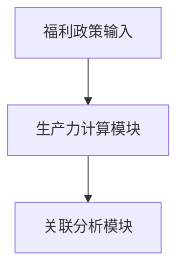

                 

# 彼得林奇如何看待公司的员工福利政策对生产力的影响

## 关键词：员工福利政策、生产力、彼得·林奇、公司管理、激励理论

## 摘要：员工福利政策是公司管理中的重要组成部分，对员工生产力有着直接影响。本文从彼得·林奇的视角出发，分析员工福利政策如何影响员工的满意度、激励水平和工作效率，探讨如何通过优化福利政策来提升公司整体生产力。通过理论分析、数学建模和实际案例，本文为公司管理者提供了有效的指导和建议。

---

# 第1章: 背景介绍

## 1.1 员工福利政策的定义与重要性

### 1.1.1 员工福利政策的核心概念
员工福利政策是指公司为员工提供的额外薪酬和福利，包括健康保险、退休计划、弹性工作时间、教育培训、奖金等。这些政策旨在满足员工的物质和精神需求，提升员工的工作满意度和忠诚度。

### 1.1.2 员工福利政策在现代企业中的作用
员工福利政策不仅是员工收入的重要组成部分，更是企业吸引和留住人才的关键因素。有效的福利政策可以提高员工的工作积极性，降低员工流失率，增强企业的竞争力。

### 1.1.3 彼得·林奇视角下的员工福利政策
彼得·林奇认为，员工福利政策是企业吸引和留住优秀员工的重要手段。他强调，福利政策的设计应与员工的实际需求相结合，同时要考虑企业的经济承受能力。林奇认为，合理的福利政策能够激发员工的潜力，从而提高企业的生产力。

## 1.2 生产力的定义与衡量标准

### 1.2.1 生产力的基本定义
生产力是指在一定时间内，员工完成工作的效率和质量。它是企业绩效的重要指标，通常通过单位时间内的产出量来衡量。

### 1.2.2 生产力的衡量指标
常见的生产力衡量指标包括：
- 每人每小时的产出量
- 产品或服务的合格率
- 员工的绩效评分
- 员工的创新贡献

### 1.2.3 彼得·林奇对生产力的特殊见解
林奇认为，生产力不仅取决于员工的工作能力，还与员工的工作积极性密切相关。他强调，企业应通过合理的福利政策激发员工的内在动力，从而提高生产力。

## 1.3 员工福利政策与生产力的关系

### 1.3.1 福利政策如何影响员工积极性
员工福利政策通过满足员工的需求，增强员工的归属感和满意度，从而提高员工的工作积极性。

### 1.3.2 福利政策与员工绩效的直接联系
研究表明，合理的福利政策能够显著提高员工的绩效。例如，健康保险可以减少员工因病缺勤的情况，弹性工作时间可以提高员工的工作满意度。

### 1.3.3 彼得·林奇的理论框架
林奇提出了一个员工福利与生产力的关系模型，认为福利政策通过影响员工的满意度、激励水平和忠诚度，最终影响企业的生产力。

---

# 第2章: 员工福利政策的核心要素分析

## 2.1 常见员工福利类型

### 2.1.1 健康保险与福利
健康保险是员工福利的重要组成部分，能够减轻员工的医疗负担，提高员工的健康水平，从而减少因病缺勤的情况。

### 2.1.2 退休计划与公积金
退休计划和公积金是员工长期福利的重要形式，能够为员工的退休生活提供保障，增强员工的归属感。

### 2.1.3 弹性工作时间与带薪休假
弹性工作时间和带薪休假能够提高员工的工作满意度，减少员工的工作压力，从而提高员工的生产力。

### 2.1.4 教育培训与职业发展
教育培训和职业发展计划能够帮助员工提升技能，增强员工的职业竞争力，从而提高员工的工作积极性。

### 2.1.5 其他福利形式
其他福利形式包括奖金、股票期权、交通补贴等，这些福利形式能够满足员工的不同需求，增强员工的满意度。

## 2.2 各类福利政策的优缺点对比

### 2.2.1 健康保险的优势与局限性
健康保险的优势在于能够有效降低员工的医疗负担，但其局限性在于保险费用较高，且部分员工可能对健康保险的需求较低。

### 2.2.2 退休计划的长期激励作用
退休计划的长期激励作用显著，但其见效周期较长，且需要员工长期在职才能享受福利。

### 2.2.3 弹性工作时间的灵活性与管理挑战
弹性工作时间的灵活性能够提高员工的工作满意度，但其管理挑战较大，需要企业投入更多的资源进行协调。

### 2.2.4 教育培训的投入产出分析
教育培训的投入产出分析显示，教育培训能够显著提高员工的技能水平，但其投入成本较高，且部分员工可能缺乏学习动力。

### 2.2.5 股票期权的激励效果与风险
股票期权的激励效果显著，但其风险较高，且需要企业具备一定的资金实力。

## 2.3 彼得·林奇对不同福利政策的评价

### 2.3.1 健康保险：彼得·林奇的观点
林奇认为，健康保险是员工福利的重要组成部分，但企业应根据自身经济实力选择合适的健康保险方案。

### 2.3.2 退休计划：彼得·林奇的建议
林奇建议企业为员工提供合理的退休计划，但应避免过度承诺，确保退休计划的可持续性。

### 2.3.3 弹性工作时间：彼得·林奇的看法
林奇认为，弹性工作时间能够提高员工的工作满意度，但企业应合理安排，确保不影响团队的协作效率。

### 2.3.4 教育培训：彼得·林奇的见解
林奇认为，教育培训能够提高员工的技能水平，但企业应注重培训的实际效果，避免形式化。

### 2.3.5 股票期权：彼得·林奇的独特观点
林奇认为，股票期权是有效的激励工具，但应结合员工的绩效表现进行分配，确保公平性和激励效果。

---

# 第3章: 员工福利政策对生产力的理论分析

## 3.1 基本理论框架

### 3.1.1 马斯洛需求层次理论在福利政策中的应用
马斯洛需求层次理论认为，人类的需求从低到高分为生理需求、安全需求、社交需求、尊重需求和自我实现需求。员工福利政策能够满足员工的生理和安全需求，从而提高员工的工作满意度。

### 3.1.2 赫茨伯格的双因素理论对福利政策的启示
赫茨伯格的双因素理论认为，激励因素和保健因素对员工的工作满意度有不同影响。员工福利政策属于保健因素，能够满足员工的基本需求，从而提高员工的工作满意度。

### 3.1.3 其他相关理论的简要介绍
其他相关理论包括期望理论、公平理论等，这些理论也为员工福利政策的设计提供了理论支持。

## 3.2 彼得·林奇的理论模型

### 3.2.1 林奇模型的核心要素
林奇模型认为，员工福利政策通过影响员工的满意度、激励水平和忠诚度，最终影响企业的生产力。

### 3.2.2 林奇模型与传统理论的对比
林奇模型与传统理论的对比显示，林奇模型更加注重福利政策的经济性和可行性，强调企业在设计福利政策时应考虑自身的经济实力。

### 3.2.3 林奇模型的数学表达式
林奇模型可以用以下公式表示：
$$
\text{生产力} = f(\text{员工满意度}, \text{激励水平}, \text{忠诚度})
$$

其中，员工满意度、激励水平和忠诚度是福利政策的主要影响因素。

## 3.3 福利政策对员工生产力的影响机制

### 3.3.1 经济激励的作用
经济激励通过提高员工的收入水平，增强员工的经济安全感，从而提高员工的工作积极性。

### 3.3.2 员工满意度与生产力的关系
员工满意度是影响生产力的重要因素，满意度高的员工通常具有更高的工作效率和质量。

### 3.3.3 福利政策对员工忠诚度的影响
合理的福利政策能够增强员工的归属感和忠诚度，从而降低员工的流失率，提高企业的生产力。

---

# 第4章: 福利政策与生产力的数学建模分析

## 4.1 福利政策对生产力的数学模型

### 4.1.1 模型设计
我们可以通过回归分析来量化福利政策对生产力的具体影响。模型如下：
$$
\text{生产力} = \beta_0 + \beta_1 \times \text{福利政策} + \epsilon
$$

其中，$\beta_1$ 表示福利政策对生产力的影响系数，$\epsilon$ 是误差项。

### 4.1.2 数据收集与分析
我们需要收集企业员工的福利政策数据和 productivity 数据，通过回归分析来估计 $\beta_1$ 的值。

### 4.1.3 案例分析
以某公司为例，假设其员工的福利政策得分为 80，回归分析结果显示 $\beta_1 = 0.5$，说明福利政策每增加 1 分，生产力提高 0.5 个单位。

## 4.2 福利政策对生产力的系统架构设计

### 4.2.1 系统功能设计
系统功能设计包括：
- 福利政策的输入模块
- 生产力的计算模块
- 福利政策与生产力的关联分析模块

### 4.2.2 系统架构图
以下是系统架构的 mermaid 图：

### 4.2.3 系统交互设计
系统交互设计包括：
1. 用户输入福利政策数据
2. 系统计算生产力得分
3. 系统输出福利政策与生产力的关联分析结果

---

# 第5章: 福利政策优化与生产力提升的最佳实践

## 5.1 优化福利政策的策略

### 5.1.1 根据员工需求设计福利政策
企业应根据员工的实际需求设计福利政策，例如，提供健康保险、弹性工作时间等。

### 5.1.2 考虑企业的经济承受能力
企业在设计福利政策时，应充分考虑自身的经济实力，避免过度承诺。

### 5.1.3 定期评估和调整福利政策
企业应定期评估福利政策的实施效果，根据反馈调整福利政策，以确保其有效性。

## 5.2 福利政策优化的案例分析

### 5.2.1 某科技公司的案例
某科技公司通过优化健康保险和弹性工作时间的福利政策，显著提高了员工的工作满意度和生产力。

### 5.2.2 某制造公司的案例
某制造公司通过提供退休计划和教育培训福利，有效提高了员工的忠诚度和工作效率。

## 5.3 提升生产力的具体措施

### 5.3.1 加强员工培训
通过加强员工培训，提高员工的技能水平，从而提高员工的生产力。

### 5.3.2 优化工作环境
通过优化工作环境，提高员工的工作舒适度，从而提高员工的工作效率。

### 5.3.3 建立激励机制
通过建立激励机制，激发员工的工作积极性，从而提高员工的生产力。

---

# 第6章: 结论与未来展望

## 6.1 研究总结
本文从彼得·林奇的视角，分析了员工福利政策对生产力的影响，提出了优化福利政策的具体策略。

## 6.2 未来研究方向
未来的研究可以进一步探讨不同类型福利政策对不同岗位员工生产力的影响，以及如何通过技术手段优化福利政策的设计和实施。

---

# 作者：AI天才研究院/AI Genius Institute & 禅与计算机程序设计艺术 /Zen And The Art of Computer Programming

