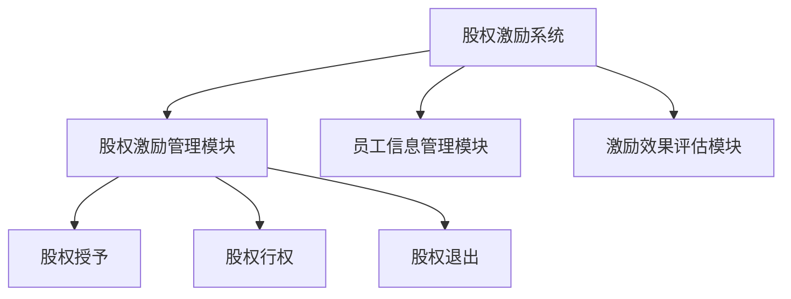
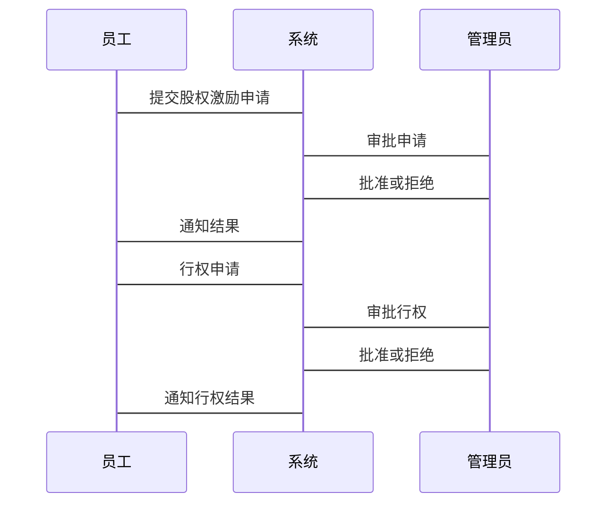

                 


# 彼得·林奇如何看待公司的员工股权激励

> **关键词**：员工股权激励、彼得·林奇、股权激励模型、系统架构设计、期权定价  
> **摘要**：本文深入分析了彼得·林奇对员工股权激励的看法，探讨了股权激励的实施细节，包括股权激励的数学模型、系统架构设计以及实际案例分析。通过分析彼得·林奇的价值投资理念，本文揭示了股权激励在企业中的重要作用，并提供了详细的实施建议。

---

## 第1章: 股权激励的基本概念

### 1.1 股权激励的定义与特点

股权激励是一种通过给予员工公司股权或期权，将员工的个人利益与公司利益绑定的激励机制。其核心特点包括：

- **长期性**：股权激励通常与员工的长期绩效挂钩。
- **风险共担**：员工与公司共同承担市场风险。
- **利益共享**：通过股权分配，员工分享公司增值的收益。

### 1.2 股权激励的起源与发展

股权激励起源于20世纪60年代的美国，随着公司治理结构的完善和股东权益保护意识的增强，股权激励逐渐成为现代企业吸引和留住核心人才的重要工具。

### 1.3 股权激励在现代企业中的重要性

- **增强员工忠诚度**：员工通过持有股权，成为公司的一部分，增强了对公司的归属感。
- **提升绩效**：股权激励将员工的个人目标与公司目标紧密结合，激发员工的创造力和积极性。
- **吸引优秀人才**：通过股权激励，企业能够吸引和留住高素质的核心人才。

---

## 第2章: 股权激励的机制与原理

### 2.1 股权激励的核心机制

- **授予机制**：员工通过协议或期权计划获得公司股权。
- **行权机制**：员工在满足特定条件（如服务期限、绩效目标）后，可以行使股权，获得实际收益。
- **退出机制**：员工在特定条件下（如离职、公司并购）退出股权激励计划，实现收益或转让。

### 2.2 股权激励的参与者

- **公司所有者**：负责制定股权激励计划并提供股权。
- **核心员工**：通过参与股权激励计划获得股权。
- **中介机构**：包括律师事务所、会计师事务所等，负责法律合规和税务筹划。

### 2.3 股权激励的实施流程

1. **确定激励目标**：明确股权激励的目的，如吸引人才、提升绩效。
2. **设计激励方案**：制定股权分配、行权条件和时间表。
3. **实施与监控**：通过系统监控激励效果，调整激励计划。

---

## 第3章: 股权激励的数学模型与公式

### 3.1 股权激励的基本数学模型

股权激励的预期收益可以通过以下公式计算：

$$ \text{预期收益} = \text{行权价} \times \text{股权数量} \times (\text{行权价} - \text{授予价}) $$

### 3.2 股权激励的期权定价模型

使用Black-Scholes期权定价公式：

$$ C = S_0 \Phi(d_1) - K e^{-rT} \Phi(d_2) $$

其中：
- \( S_0 \)：标的资产当前价格
- \( K \)：行权价
- \( r \)：无风险利率
- \( T \)：时间至到期
- \( \Phi \)：标准正态分布的累积分布函数
- \( d_1 = \frac{\ln(S_0/K) + (r + \sigma^2/2)T}{\sigma \sqrt{T}} \)
- \( d_2 = d_1 - \sigma \sqrt{T} \)

### 3.3 股权激励的数学模型应用

- **案例分析**：假设某公司授予员工100股股票期权，行权价为50元，授予价为40元，行权期限为5年。使用Black-Scholes模型计算期权的公允价值。
- **实际应用步骤**：包括数据收集、模型选择、参数估计和结果验证。

---

## 第4章: 股权激励的系统架构设计

### 4.1 系统功能设计

- **股权激励管理模块**：负责股权授予、行权、转让和退出的管理。
- **员工信息管理模块**：记录员工基本信息和股权激励参与情况。
- **激励效果评估模块**：通过数据分析评估股权激励的效果。

### 4.2 系统架构设计

使用mermaid图展示股权激励系统的架构：



### 4.3 系统接口设计

- **股权授予接口**：员工信息接口、股权分配接口。
- **股权行权接口**：行权申请接口、收益计算接口。

### 4.4 系统交互流程

使用mermaid序列图展示系统交互流程：



---

## 第5章: 股权激励的项目实战

### 5.1 环境安装

- **开发环境**：建议使用Python、MySQL、Django框架。
- **工具安装**：安装必要的开发工具和库，如numpy、pandas、scipy。

### 5.2 核心代码实现

```python
import numpy as np
from scipy.stats import norm

def black_scholes(S, K, r, sigma, T):
    d1 = (np.log(S/K) + (r + sigma**2/2)*T) / (sigma*np.sqrt(T))
    d2 = d1 - sigma*np.sqrt(T)
    C = S*norm.cdf(d1) - K*np.exp(-r*T)*norm.cdf(d2)
    return C

# 示例参数
S = 100  # 标的价格
K = 50   # 行权价
r = 0.05  # 无风险利率
sigma = 0.2  # 波动率
T = 5  # 时间至到期（年）

result = black_scholes(S, K, r, sigma, T)
print("期权公允价值：", result)
```

### 5.3 案例分析

以某科技公司为例，分析股权激励计划的实施效果。通过数据分析，展示员工绩效与公司绩效的提升关系。

---

## 第6章: 总结与展望

### 6.1 彼得·林奇的总结

彼得·林奇认为，股权激励是将员工利益与公司利益绑定的有效工具，能够激发员工的创造力和积极性，为公司创造长期价值。

### 6.2 实施股权激励的最佳实践

- **明确目标**：股权激励计划应与公司战略目标一致。
- **公平分配**：确保股权分配的公平性，避免员工之间的矛盾。
- **持续优化**：根据公司发展和市场环境，动态调整股权激励计划。

### 6.3 注意事项

- **避免短期行为**：股权激励应注重长期激励效果。
- **合规性**：确保股权激励计划符合相关法律法规。
- **透明性**：向员工清晰传达股权激励的条件和规则。

### 6.4 拓展阅读

推荐相关书籍和文献，帮助读者深入理解股权激励的理论与实践。

---

## 作者：AI天才研究院/AI Genius Institute & 禅与计算机程序设计艺术 /Zen And The Art of Computer Programming

---

以上是完整的《彼得·林奇如何看待公司的员工股权激励》技术博客文章大纲，涵盖了从基础概念到数学模型、系统设计和实际案例的详细分析。通过本文，读者可以全面了解股权激励的实施细节，并掌握如何在实际中应用这些知识。

