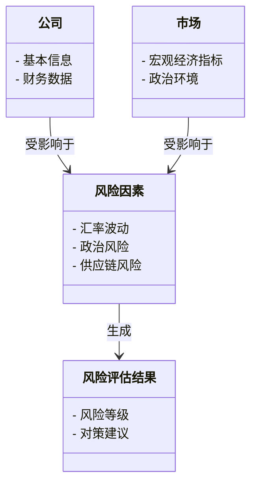
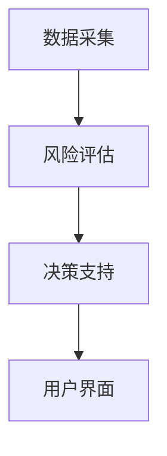

                 


# 彼得林奇如何看待公司的国际化风险

## 关键词：彼得·林奇，国际化风险，投资策略，风险管理，价值投资

## 摘要：本文从彼得·林奇的投资哲学出发，探讨他在面对公司国际化风险时的分析方法和应对策略。通过详细分析国际化风险的类型、影响因素以及管理策略，结合实际案例，为读者提供深度的见解和实用的建议。

---

## 第一部分：国际化风险的背景与概述

### 第1章：国际化风险的定义与背景

#### 1.1 国际化风险的定义

- **1.1.1 国际化风险的定义**  
  国际化风险是指公司在跨国经营过程中，由于不同国家或地区的经济、政治、法律、文化等因素差异，可能导致的财务损失、业务中断或其他负面影响的风险。

- **1.1.2 国际化风险的核心要素**  
  - 经济环境：汇率波动、通货膨胀等。  
  - 政治环境：政策变化、贸易壁垒等。  
  - 法律环境：税收政策、劳动法规等。  
  - 文化差异：消费习惯、商业习俗等。

- **1.1.3 国际化风险的分类与特征**  
  - **市场风险**：价格波动、需求变化等。  
  - **汇率风险**：货币贬值或升值导致的损失。  
  - **政治风险**：政府政策变化、战争等。  
  - **法律风险**：税收调整、知识产权保护等。  

#### 1.2 彼得·林奇的背景与投资理念

- **1.2.1 彼得·林奇的生平简介**  
  彼得·林奇（Peter Lynch）是美国著名投资经理人，曾任富达麦哲伦基金的经理，以其长期优异的投资业绩闻名。

- **1.2.2 彼得·林奇的投资哲学**  
  - 长期投资：寻找具有持续增长潜力的公司。  
  - 价值投资：关注公司的基本面，寻找被市场低估的投资标的。  
  - 分散投资：通过多样化投资降低风险。  

- **1.2.3 彼得·林奇与国际化投资的关系**  
  林奇在其职业生涯中，虽然主要关注美国市场，但也对国际化投资的风险和机会有所涉猎，他的投资理念为分析国际化风险提供了重要参考。

#### 1.3 为什么研究国际化风险？

- **1.3.1 国际化投资的重要性**  
  全球化背景下，企业通过国际化扩展市场，获取更高的增长潜力。

- **1.3.2 国际化风险对企业的影响**  
  - 经济波动可能导致利润下降。  
  - 政治动荡可能影响业务稳定性。  
  - 文化差异可能导致管理失误。  

- **1.3.3 彼得·林奇视角下的国际化风险**  
  林奇认为，国际化投资虽然潜力大，但也伴随着更高的风险，需要投资者具备深入的分析能力和风险管理能力。

---

## 第二部分：国际化风险的核心概念与分析

### 第2章：国际化风险的类型与影响因素

#### 2.1 国际化风险的主要类型

- **2.1.1 市场风险**  
  - 宏观经济波动：GDP增长、利率变化等。  
  - 行业竞争：市场进入壁垒、竞争对手策略等。  

- **2.1.2 汇率风险**  
  - 货币贬值导致出口企业利润下降。  
  - 外汇波动影响跨国并购成本。  

- **2.1.3 政治风险**  
  - 政府政策变化：贸易限制、税收调整等。  
  - 地缘政治冲突：战争、制裁等。  

- **2.1.4 法律风险**  
  - 知识产权保护不力。  
  - 劳动法差异导致的管理成本增加。  

- **2.1.5 供应链风险**  
  - 关键原材料供应中断。  
  - 跨国物流成本上升。  

#### 2.2 彼得·林奇视角下的风险特征

- **2.2.1 风险的可预测性**  
  - 通过基本面分析，部分风险是可以预测的。  
  - 不可预测的黑天鹅事件是投资中的主要风险。  

- **2.2.2 风险的可控性**  
  - 通过分散投资降低市场风险。  
  - 使用金融工具对冲汇率风险。  

- **2.2.3 风险的长期影响**  
  - 长期来看，企业需要适应不同国家的市场环境。  
  - 短期波动可能影响股价，但长期价值取决于基本面。  

#### 2.3 国际化风险的管理策略

- **2.3.1 风险评估与量化**  
  - 使用风险评估模型（如层次分析法）量化风险。  
  - 通过数据收集和分析，识别高风险区域和行业。  

- **2.3.2 风险分散与对冲**  
  - 分散投资：避免将所有资金投入单一市场。  
  - 使用金融工具：如期权、期货对冲部分风险。  

- **2.3.3 风险监控与预警**  
  - 建立风险监控系统，实时跟踪市场变化。  
  - 设置预警指标，及时发现潜在风险。  

---

## 第三部分：彼得·林奇的投资策略与风险分析

### 第3章：彼得·林奇的投资哲学与国际化风险

#### 3.1 彼得·林奇的投资策略

- **3.1.1 长期投资与价值投资**  
  - 选择具有持续增长潜力的公司。  
  - 关注公司的财务健康状况和管理团队。  

- **3.1.2 风险控制与安全边际**  
  - 设置止损点，控制投资损失。  
  - 留有安全边际，避免过度投资。  

- **3.1.3 行业分析与公司基本面**  
  - 选择具有竞争优势的行业。  
  - 关注公司的盈利能力、成长性和财务状况。  

#### 3.2 彼得·林奇视角下的国际化投资

- **3.2.1 国际化投资的优势与挑战**  
  - 优势：开拓新市场，获取增长机会。  
  - 挑战：文化差异、政策风险、经济波动。  

- **3.2.2 彼得·林奇对国际化市场的看法**  
  - 林奇认为，国际化投资需要深入研究当地市场，了解文化、法律和经济环境。  
  - 他强调分散投资的重要性，以降低单一市场风险。  

---

## 第四部分：系统分析与架构设计

### 第4章：国际化风险的系统架构设计

#### 4.1 问题场景介绍

- 公司计划拓展国际市场，面临多种风险，需要建立一套系统化的风险管理机制。

#### 4.2 系统功能设计

- **领域模型类图**  
  - 实体：公司、市场、风险因素、风险评估结果。  
  - 关系：公司受市场和风险因素的影响，生成风险评估结果。  



#### 4.3 系统架构设计

- **系统架构图**  
  - 层次：数据层、业务逻辑层、用户界面层。  
  - 组件：数据采集、风险评估、决策支持。  



---

## 第五部分：项目实战与总结

### 第5章：项目实战

#### 5.1 项目背景

- 某科技公司计划进入新兴市场，面临汇率波动、政策风险等挑战。

#### 5.2 核心实现

- 使用层次分析法（AHP）评估风险，量化各风险因素的权重。

```latex
$$
\text{综合风险评分} = \sum (\text{权重}_i \times \text{风险值}_i)
$$
```

#### 5.3 案例分析

- **数据收集**：收集目标市场的GDP增长率、政治稳定性评分等数据。  
- **风险评估**：计算各风险因素的权重，生成风险评估报告。  
- **决策支持**：根据评估结果制定风险管理策略，如对冲货币风险。  

#### 5.4 项目小结

- 通过系统化的方法，公司能够有效识别和管理国际化风险。  
- 彼得·林奇的投资哲学为风险管理和投资决策提供了重要参考。

---

## 第六部分：总结与最佳实践

### 第6章：总结与最佳实践

#### 6.1 小结

- 国际化风险是企业拓展国际市场必须面对的挑战。  
- 彼得·林奇的投资哲学和风险管理策略为应对这些风险提供了宝贵的启示。

#### 6.2 注意事项

- **数据准确性**：确保风险评估数据的可靠性和准确性。  
- **持续监控**：建立持续的风险监控机制，及时应对市场变化。  
- **团队合作**：国际化投资需要多部门协作，确保信息共享和风险共担。  

#### 6.3 拓展阅读

- 《彼得·林奇的投资智慧》  
- 《风险管理与投资组合优化》  

---

## 作者：AI天才研究院 & 禅与计算机程序设计艺术

---

本文从彼得·林奇的投资哲学出发，系统分析了国际化风险的类型、影响因素及其管理策略，结合实际案例和系统架构设计，为读者提供了深入的见解和实用的建议。通过本文，读者可以更好地理解国际化风险的本质，并掌握如何运用彼得·林奇的策略来应对这些风险。

