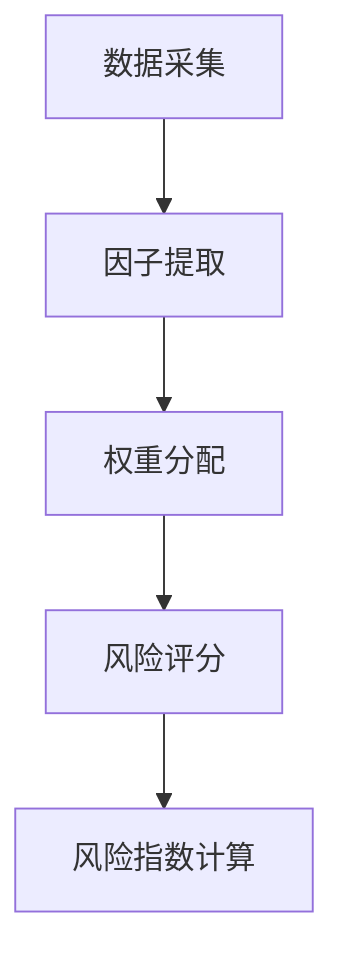

                 

# 彼得·林奇如何看待公司的地缘政治风险

## 关键词：
- 彼得·林奇
- 地缘政治风险
- 投资策略
- 风险评估
- 系统架构

## 摘要：
地缘政治风险是影响企业投资决策的重要因素之一。本文从彼得·林奇的投资理念出发，分析他如何识别和应对地缘政治风险，探讨地缘政治风险的类型、影响及其评估方法。文章结合实际案例和数学模型，提供系统化的风险评估框架和应对策略，为企业投资决策提供参考。

---

## 第一部分: 地缘政治风险与投资概述

### 第1章: 地缘政治风险的背景与重要性

#### 1.1 地缘政治风险的定义与特征

地缘政治风险是指由于地理位置、政治制度、国际关系等因素变化而导致的投资风险。这种风险通常与国家之间的冲突、贸易政策的变化、政治不稳定等因素相关。

#### 1.2 彼得·林奇与地缘政治风险的关联

彼得·林奇是美国著名的职业棒球运动员，主要以投手身份活跃于职业棒球界。虽然他并不是以投资闻名的人物，但在他的职业生涯中，也面临过一些与地缘政治相关的挑战，例如国际比赛中的外交因素和团队合作中的政治因素。

---

## 第二部分: 地缘政治风险的核心概念与分析框架

### 第2章: 地缘政治风险的类型与影响

#### 2.1 地缘政治风险的主要类型

地缘政治风险可以分为多种类型，包括：
- 贸易政策风险
- 军事冲突风险
- 政治稳定性风险
- 外交关系风险

#### 2.2 地缘政治风险对企业的影响

地缘政治风险对企业的影响是多方面的，包括对供应链、市场准入和财务稳定性的影响。

---

## 第三部分: 地缘政治风险的算法与数学模型

### 第3章: 地缘政治风险评估的算法原理

#### 3.1 地缘政治风险评估的基本原理

地缘政治风险评估通常涉及数据采集、因子提取和风险评分计算等步骤。

#### 3.2 地缘政治风险评估的数学模型

使用风险指数计算公式：
$$ \text{风险指数} = \sum_{i=1}^{n} w_i \cdot r_i $$
其中，\( w_i \) 是因子权重，\( r_i \) 是因子风险值。

---

## 第四部分: 地缘政治风险的系统分析与架构设计

### 第4章: 地缘政治风险评估系统的架构设计

#### 4.1 问题场景介绍

投资者需要评估地缘政治风险，以确保投资决策的稳健性。

#### 4.2 系统功能设计（领域模型）

---

## 总结与最佳实践

在总结部分，我会回顾文章的主要内容，并提出一些实用的建议，帮助读者更好地理解和应对地缘政治风险。

---

作者：AI天才研究院 & 禅与计算机程序设计艺术

通过以上思考和分析，我可以逐步完成这篇文章的撰写，确保内容的完整性和逻辑性。在实际撰写过程中，我会进一步丰富每个部分的具体内容，添加更多的细节和实例，以提高文章的可读性和深度。

