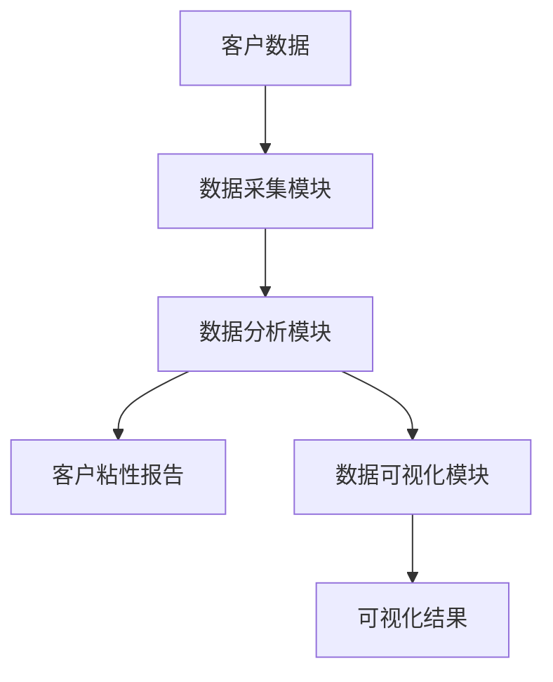

                 


# 彼得林奇如何看待公司的客户粘性

## 关键词：客户粘性，彼得林奇，投资策略，企业价值，品牌忠诚度，客户体验，长期投资

## 摘要：  
客户粘性是企业在市场竞争中保持长期优势的关键因素。本文从彼得林奇的投资哲学出发，分析客户粘性的定义、关键因素及其对企业和投资者的影响。通过系统分析和实际案例，探讨如何评估和提升客户粘性，为企业制定有效的客户保留策略提供指导。

---

## 第一部分: 背景介绍

### 第1章: 客户粘性的定义与重要性

#### 1.1 什么是客户粘性
客户粘性是指客户对企业产品或服务的依赖程度，衡量客户持续购买或使用企业产品或服务的意愿。高客户粘性意味着客户更可能长期选择该企业，而非转向竞争对手。

#### 1.2 客户粘性的重要性
客户粘性直接影响企业的市场份额、客户保留成本和长期盈利能力。高客户粘性的企业通常能以更低的成本获取稳定收入，增强财务表现。

#### 1.3 彼得林奇对客户粘性的看法
彼得林奇认为，客户粘性是企业竞争优势的核心。他强调选择那些客户对其产品或服务高度依赖的公司进行投资，这些公司具备更强的定价权和市场地位。

---

### 第2章: 彼得林奇的投资哲学

#### 2.1 长期投资的重要性
彼得林奇倡导长期投资策略，认为短期市场波动不应影响投资决策。他更关注企业的长期增长潜力和内在价值。

#### 2.2 选择优质公司的标准
彼得林奇倾向于投资那些在市场中具有竞争优势、财务健康、管理团队优秀的企业。客户粘性是衡量企业竞争优势的重要指标。

#### 2.3 客户粘性在投资中的作用
高客户粘性的企业通常能有效抵御竞争压力，保持稳定的收入来源。彼得林奇认为，这种稳定性是企业长期增长的关键因素。

---

## 第二部分: 客户粘性的关键因素

### 第3章: 产品与服务的客户粘性

#### 3.1 产品特性对客户粘性的影响
- **产品独特性**：独特的产品设计或功能使客户更依赖企业。
- **产品质量**：高质量的产品能提升客户满意度和忠诚度。
- **产品创新性**：持续创新的产品能吸引客户，保持市场竞争力。

#### 3.2 客户粘性与产品生命周期
产品的生命周期影响客户粘性。企业应通过持续创新延长产品生命周期，增强客户粘性。

---

### 第4章: 客户体验与客户粘性

#### 4.1 客户体验的核心要素
- **服务质量**：高效的客服能解决客户问题，提升满意度。
- **售后服务**：优质的售后服务增强客户信任，促进长期合作。
- **用户界面设计**：直观友好的界面提升用户体验，增加客户粘性。

#### 4.2 客户体验的量化评估
通过客户满意度调查、净推荐值（NPS）等指标量化客户体验，帮助企业识别改进方向。

---

### 第5章: 品牌忠诚度与客户粘性

#### 5.1 品牌忠诚度的定义
品牌忠诚度指客户对品牌的一贯支持和偏好，是客户粘性的重要组成部分。

#### 5.2 品牌忠诚度与客户粘性的关系
高品牌忠诚度的客户更可能选择企业的产品或服务，即使面对竞争，他们也更倾向于保持忠诚。

#### 5.3 影响品牌忠诚度的因素
- **品牌认知度**：高知名度的品牌更易获得客户信任。
- **品牌声誉**：良好的声誉增强客户对品牌的信任和忠诚。
- **品牌承诺**：企业通过兑现承诺建立客户信任，提升忠诚度。

---

## 第三部分: 客户粘性的系统分析

### 第6章: 客户粘性评估模型

#### 6.1 评估模型的构建
- **数据收集**：收集客户行为数据、满意度数据等。
- **关键指标**：客户留存率、客户生命周期价值（CLV）、客户满意度（CSAT）等。
- **模型验证**：通过历史数据验证模型准确性。

#### 6.2 客户粘性评估公式
客户生命周期价值（CLV）计算公式：
$$ CLV = (收入 - 成本) \times 客户留存率 $$

---

### 第7章: 系统架构设计

#### 7.1 系统功能模块
- **数据采集模块**：收集客户行为数据。
- **数据分析模块**：分析数据，生成客户粘性报告。
- **可视化模块**：以图表形式展示分析结果。

#### 7.2 系统架构图（Mermaid）


---

### 第8章: 客户粘性提升策略

#### 8.1 提升客户粘性的方法
- **改进产品和服务**：持续优化产品功能和用户体验。
- **提升客户体验**：通过高效服务和个性化互动增强客户满意度。
- **加强品牌建设**：通过营销和公关活动提升品牌知名度和忠诚度。

---

## 第四部分: 项目实战

### 第9章: 客户粘性评估实战

#### 9.1 项目背景与目标
假设我们为一家SaaS公司进行客户粘性评估，目标是识别高价值客户并制定 retention策略。

#### 9.2 数据收集与分析
- 数据来源：客户使用数据、支付记录、客户调查。
- 数据分析：使用Python进行客户分群和流失预测。

#### 9.3 客户分群与流失预测
使用聚类分析将客户分为高粘性、中粘性、低粘性三类，预测客户流失风险。

---

### 第10章: 使用Python进行客户粘性分析

#### 10.1 数据处理与清洗
```python
import pandas as pd

# 读取数据
df = pd.read_csv('customer_data.csv')

# 数据清洗
df.dropna(inplace=True)
df = df[~df['customer_id'].duplicated()]
```

#### 10.2 客户生命周期价值计算
```python
def calculate_clv(customers, revenue, cost, retention_rate):
    return (revenue - cost) * retention_rate

# 示例计算
customers = 1000
revenue = 100
cost = 50
retention_rate = 0.8

clv = calculate_clv(customers, revenue, cost, retention_rate)
print(f"客户生命周期价值：{clv}")
```

---

## 第五部分: 最佳实践与总结

### 第11章: 总结与小结

#### 11.1 核心观点回顾
- 客户粘性是企业长期竞争优势的关键。
- 彼得林奇的投资哲学强调选择高客户粘性的公司。
- 提升客户粘性需要从产品、服务和品牌三方面入手。

#### 11.2 小结
企业应通过持续创新和优化客户体验，增强客户粘性。投资者应关注客户粘性高的企业，以获得长期稳定的回报。

---

## 作者：AI天才研究院 & 禅与计算机程序设计艺术

