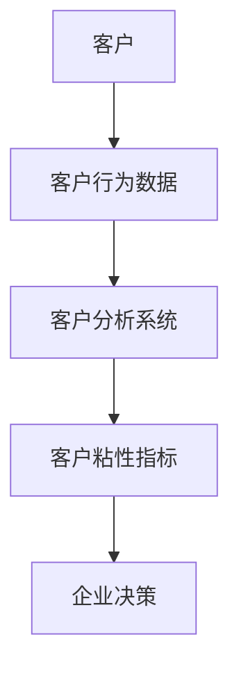
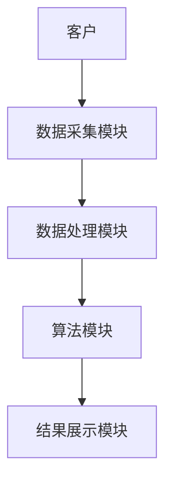
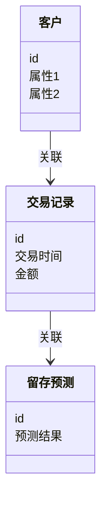
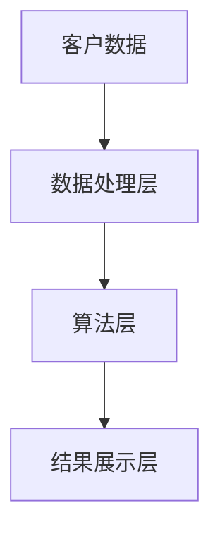

                 


# 彼得林奇如何看待公司的客户粘性

## 关键词：客户粘性，彼得·林奇，投资策略，客户忠诚度，客户满意度，企业价值

## 摘要：客户粘性是企业在竞争激烈的市场中保持长期成功的关键因素。本文从彼得·林奇的视角出发，分析客户粘性的定义、影响因素、衡量指标、提升策略，并通过系统架构和实际案例探讨如何在企业中有效提升客户粘性。文章结合理论与实践，提供详细的分析和解决方案，帮助读者理解客户粘性在企业价值中的重要性。

---

## # 引言

在商业竞争日益激烈的今天，客户粘性（Customer Churn）成为企业成功的关键因素。彼得·林奇，这位传奇的共同基金经理，以其独特的投资策略闻名，他深刻认识到客户粘性对企业的价值。本文将从客户粘性的定义、影响因素、衡量方法、提升策略等方面展开分析，探讨如何通过系统化的方法提升客户粘性，从而为企业创造长期价值。

---

## # 第一部分：客户粘性的核心概念

### ## 2.1 客户粘性的定义与属性

#### ### 2.1.1 客户粘性的定义

客户粘性是指客户对企业产品或服务的依赖程度，衡量客户持续使用企业产品或服务的概率。客户粘性越高，客户流失的可能性越小，企业的市场地位越稳固。

#### ### 2.1.2 客户粘性的核心属性

- **客户满意度**：客户对产品或服务的满意程度直接影响其粘性。
- **客户忠诚度**：客户对企业品牌或产品的忠诚度越高，粘性越强。
- **替代品可获得性**：市场中替代品的丰富程度影响客户粘性。
- **客户使用成本**：包括时间和金钱成本，成本越高，客户粘性可能越低。
- **客户感知价值**：客户认为产品或服务带来的价值，感知价值越高，粘性越强。

#### ### 2.1.3 客户粘性与其他相关概念的对比

| 概念         | 定义                                                                 | 关联性           |
|--------------|----------------------------------------------------------------------|------------------|
| 客户忠诚度   | 客户对企业品牌或产品的长期支持和偏好                                   | 高相关           |
| 客户满意度   | 客户对产品或服务的满意程度                                             | 中度相关         |
| 客户保留率   | 在一定时间内保持客户的比率                                             | 高相关           |
| 客户生命周期 | 客户从初次接触到最终流失的全过程                                       | 高相关           |

### ## 2.2 客户粘性的关键影响因素

#### ### 2.2.1 产品质量与服务

- **产品质量**：高质量的产品能够提高客户满意度和忠诚度，从而增强客户粘性。
- **服务质量**：优质的服务能够解决客户问题，提升客户体验，降低流失率。

#### ### 2.2.2 客户体验与满意度

- **客户体验**：从初次接触到售后服务的整体体验直接影响客户粘性。
- **客户满意度**：通过调查和反馈收集客户满意度数据，识别改进点。

#### ### 2.2.3 品牌忠诚度与认知度

- **品牌忠诚度**：客户对品牌的忠诚度越高，越倾向于长期使用该品牌的产品或服务。
- **品牌认知度**：高知名度的品牌更容易在客户心中占据重要位置，提升粘性。

### ## 2.3 客户粘性的衡量指标

#### ### 2.3.1 客户保留率

客户保留率 = (期初客户数 - 期末流失客户数) / 期初客户数 × 100%

#### ### 2.3.2 客户生命周期价值

客户生命周期价值（CLV）= 客户平均收入 × 客户生命周期 × 利润率

#### ### 2.3.3 客户净推荐值（NPS）

NPS = (推荐客户的比例 - 抱怨客户的比例) × 100%

---

## # 第二部分：客户粘性的算法原理

### ## 3.1 客户粘性分析的系统模型

#### ### 3.1.1 系统架构概述



#### ### 3.1.2 算法实现代码

```python
import pandas as pd
from sklearn.tree import DecisionTreeClassifier
from sklearn.model_selection import train_test_split

# 数据预处理
data = pd.read_csv('customer_data.csv')
X = data.drop('churn', axis=1)
y = data['churn']

# 划分训练集和测试集
X_train, X_test, y_train, y_test = train_test_split(X, y, test_size=0.2, random_state=42)

# 训练模型
model = DecisionTreeClassifier()
model.fit(X_train, y_train)

# 预测客户流失概率
y_pred = model.predict(X_test)
```

#### ### 3.1.3 数学模型

客户流失概率模型：
$$ P(\text{流失}) = f(X) $$
其中，$X$ 是客户特征向量。

客户粘性预测模型：
$$ S = 1 - P(\text{流失}) $$

---

## # 第三部分：客户粘性的系统分析与架构设计

### ## 4.1 问题场景介绍

- **问题背景**：企业需要预测客户流失，优化客户保留策略。
- **项目目标**：构建客户粘性分析系统，预测客户流失，制定 retention策略。

### ## 4.2 系统架构设计



### ## 4.3 系统功能设计

#### ### 4.3.1 领域模型类图



#### ### 4.3.2 系统架构图



---

## # 第四部分：项目实战

### ## 5.1 项目背景与目标

- **项目背景**：某互联网公司希望降低客户流失率，提升客户粘性。
- **项目目标**：构建客户粘性分析模型，预测流失客户，制定 retention策略。

### ## 5.2 项目实施

#### ### 5.2.1 环境安装

安装必要的库：
```bash
pip install pandas scikit-learn matplotlib
```

#### ### 5.2.2 核心代码实现

```python
import pandas as pd
from sklearn.ensemble import RandomForestClassifier
from sklearn.metrics import accuracy_score

# 加载数据
data = pd.read_csv('customer_churn.csv')

# 数据分割
X = data.drop('churn', axis=1)
y = data['churn']

X_train, X_test, y_train, y_test = train_test_split(X, y, test_size=0.2, random_state=42)

# 模型训练
model = RandomForestClassifier()
model.fit(X_train, y_train)

# 预测
y_pred = model.predict(X_test)

# 评估
print("准确率:", accuracy_score(y_test, y_pred))
```

---

## # 第五部分：最佳实践与总结

### ## 6.1 最佳实践

- **数据质量**：确保数据准确性和完整性。
- **模型优化**：通过调参和特征工程提升模型性能。
- **实时监控**：实时跟踪客户行为，及时干预。

### ## 6.2 小结

客户粘性是企业长期成功的关键，通过系统化的方法和工具，企业可以有效预测和管理客户流失，提升客户满意度和忠诚度。

### ## 6.3 注意事项

- 定期更新模型，适应市场变化。
- 结合业务场景，选择合适的算法。

### ## 6.4 拓展阅读

- 《Data Mining: Concepts and Techniques》
- 《客户关系管理：理论与实践》

---

## # 结论

客户粘性是企业在市场竞争中保持优势的重要因素。通过系统化的分析和策略实施，企业可以有效提升客户粘性，实现长期价值增长。

---

## # 作者

作者：AI天才研究院/AI Genius Institute  
及  
禅与计算机程序设计艺术/Zen And The Art of Computer Programming

