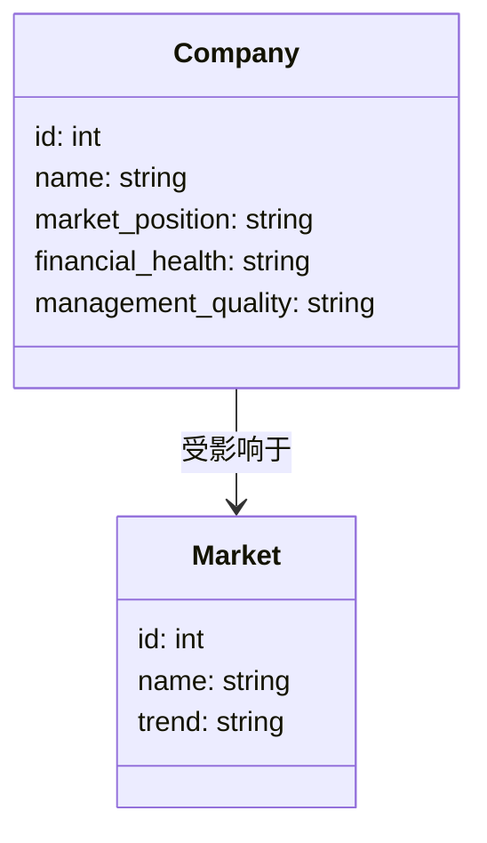
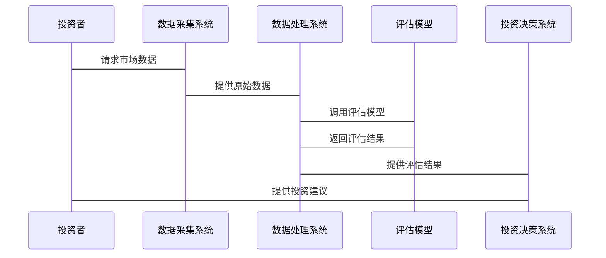

                 


# 彼得林奇如何看待公司的市场适应能力

> 关键词：彼得·林奇，市场适应能力，投资分析，价值投资，企业战略，风险管理

> 摘要：本文将从彼得·林奇的投资理念出发，详细分析市场适应能力的核心要素，包括战略灵活性、产品创新能力、成本控制能力和客户关系管理能力。通过实例分析和系统设计，探讨如何在实际投资中应用这些概念，最后总结最佳实践和注意事项。

---

## 第一章: 彼得·林奇投资理念概述

### 1.1 彼得·林奇与市场适应能力

#### 1.1.1 彼得·林奇的生平简介

彼得·林奇（Peter Lynch）是美国著名的职业棒球运动员和投资家，以其在棒球界和投资界的双重成就闻名。他在棒球界曾效力于波士顿红袜队，后转型成为基金经理，管理富达麦哲伦基金（Fidelity Magellan Fund），取得了卓越的投资业绩。

#### 1.1.2 市场适应能力的核心概念

市场适应能力是指公司在不断变化的市场环境中，能够灵活调整战略、产品和运营模式，以保持竞争力和盈利能力的能力。彼得·林奇认为，这种能力是企业长期成功的关键。

#### 1.1.3 市场适应能力的重要性

市场适应能力的重要性体现在以下几个方面：
1. **应对市场变化**：公司能够快速响应市场趋势，抓住机会，避免危机。
2. **保持竞争优势**：通过持续创新和优化，公司在市场上更具竞争力。
3. **实现可持续发展**：适应能力强的公司更有可能在长期发展中保持稳定。

### 1.2 市场适应能力的定义与背景

#### 1.2.1 市场适应能力的定义

市场适应能力是指公司在面对市场环境变化时，能够迅速调整战略、产品和运营模式，以满足市场需求并实现可持续发展的能力。

#### 1.2.2 市场适应能力的背景与演变

随着全球化和科技的发展，市场环境变得越来越复杂和不确定。企业需要具备更强的适应能力，以应对技术进步、竞争加剧和消费者需求变化等挑战。

#### 1.2.3 市场适应能力的边界与外延

市场适应能力的边界包括公司的战略调整、产品创新和成本控制。其外延则涉及客户关系管理、供应链优化和企业文化建设等方面。

### 1.3 彼得·林奇投资理念的核心要素

#### 1.3.1 价值投资的核心要素

彼得·林奇强调价值投资，即寻找被市场低估的股票。他关注公司的基本面，如财务状况、管理团队和市场地位。

#### 1.3.2 市场适应能力的构成要素

市场适应能力的构成要素包括：
1. **战略灵活性**：公司能够根据市场变化调整战略。
2. **产品创新能力**：公司能够不断推出符合市场需求的产品。
3. **成本控制能力**：公司能够有效控制成本，提高盈利能力。
4. **客户关系管理能力**：公司能够维护和提升客户关系。

---

## 第二章: 市场适应能力的核心要素分析

### 2.1 战略灵活性

#### 2.1.1 战略灵活性的定义

战略灵活性是指公司在面对市场变化时，能够快速调整战略方向的能力。

#### 2.1.2 战略灵活性与市场适应能力的关系

战略灵活性是市场适应能力的重要组成部分。公司只有具备战略灵活性，才能在市场变化中迅速调整，抓住机会。

#### 2.1.3 战略灵活性的评估指标

1. **战略调整速度**：公司调整战略所需的时间。
2. **战略一致性**：战略调整是否一致，是否符合公司长期目标。
3. **战略效果**：战略调整是否有效提升了公司绩效。

### 2.2 产品创新能力

#### 2.2.1 产品创新的定义

产品创新是指公司推出新产品或改进现有产品的过程。

#### 2.2.2 产品创新与市场适应能力的关系

产品创新是市场适应能力的重要表现。只有不断创新，公司才能在竞争激烈的市场中保持优势。

#### 2.2.3 产品创新的评估指标

1. **新产品推出速度**：公司推出新产品的频率。
2. **产品生命周期**：产品从推出到退出市场的周期长度。
3. **产品成功率**：新产品是否成功进入市场并获得收益。

### 2.3 成本控制能力

#### 2.3.1 成本控制的定义

成本控制是指公司在运营过程中，通过优化资源配置和管理流程，降低生产成本。

#### 2.3.2 成本控制与市场适应能力的关系

成本控制是市场适应能力的重要支撑。通过降低成本，公司可以提高利润率，增强市场竞争力。

#### 2.3.3 成本控制的评估指标

1. **单位成本**：单位产品的生产成本。
2. **成本节约**：通过成本控制实现的成本节省。
3. **成本结构**：公司成本的构成比例。

### 2.4 客户关系管理能力

#### 2.4.1 客户关系管理的定义

客户关系管理（CRM）是指公司通过建立和维护与客户的关系，提升客户满意度和忠诚度。

#### 2.4.2 客户关系管理与市场适应能力的关系

客户关系管理是市场适应能力的重要组成部分。良好的客户关系管理有助于公司更好地理解客户需求，提供更优质的服务。

#### 2.4.3 客户关系管理的评估指标

1. **客户满意度**：客户对公司产品或服务的满意程度。
2. **客户保留率**：客户在一定时间内继续购买产品或服务的比例。
3. **客户忠诚度**：客户对公司的忠诚程度。

---

## 第三章: 彼得·林奇的投资方法论

### 3.1 选股标准

#### 3.1.1 选股标准的核心要素

彼得·林奇选股的核心要素包括：
1. **财务状况**：关注公司的盈利能力、资产负债表和现金流。
2. **管理团队**：公司管理层的素质和能力。
3. **市场地位**：公司在市场中的竞争地位。

#### 3.1.2 选股标准与市场适应能力的关系

彼得·林奇的选股标准与市场适应能力密切相关。他注重选择那些具备市场适应能力的公司，即能够应对市场变化并保持增长的公司。

#### 3.1.3 选股标准的实施步骤

1. **分析公司财务报表**：评估公司的盈利能力、资产负债情况和现金流。
2. **研究公司管理层**：了解管理层的背景和能力。
3. **评估市场地位**：分析公司在市场中的竞争地位。

### 3.2 投资分析方法

#### 3.2.1 基本面分析

基本面分析是指通过分析公司的财务状况、行业地位和管理团队等基本面因素，评估公司的投资价值。

#### 3.2.2 技术分析

技术分析是指通过分析股票价格走势和成交量等技术指标，预测股票价格的变化趋势。

### 3.3 投资策略

#### 3.3.1 长期投资策略

彼得·林奇主张长期投资，避免频繁交易，以降低交易成本和税务负担。

#### 3.3.2 分散投资策略

分散投资是指将资金分散投资于多个不同的股票或资产类别，以降低风险。

---

## 第四章: 市场适应能力的评估方法

### 4.1 评估指标体系

#### 4.1.1 财务指标

财务指标包括：
1. **净利润率**：净利润与收入的比率。
2. **毛利率**：毛利与收入的比率。
3. **周转率**：库存周转速度。

#### 4.1.2 非财务指标

非财务指标包括：
1. **创新能力**：公司创新能力的评估。
2. **客户满意度**：客户对公司产品或服务的满意程度。
3. **员工满意度**：员工对公司的工作环境和管理的满意程度。

### 4.2 评估模型

#### 4.2.1 财务指标评估模型

$$ 净利润率 = \frac{净利润}{收入} $$

#### 4.2.2 非财务指标评估模型

$$ 创新能力 = \frac{新产品数量}{时间} $$

---

## 第五章: 系统分析与架构设计

### 5.1 问题场景介绍

在实际投资过程中，投资者需要分析多个公司的市场适应能力，以做出最优的投资决策。

### 5.2 系统功能设计

#### 5.2.1 领域模型设计



### 5.3 系统架构设计


### 5.4 接口设计

接口设计包括：
1. 数据采集接口：从市场获取公司数据。
2. 数据处理接口：对数据进行清洗和转换。
3. 模型调用接口：调用评估模型进行计算。

### 5.5 交互序列图



---

## 第六章: 项目实战

### 6.1 环境安装

安装所需的工具和环境：
1. Python编程语言
2. 数据分析库（Pandas、NumPy）
3. 可视化工具（Matplotlib、Seaborn）

### 6.2 核心代码实现

```python
import pandas as pd
import numpy as np

def calculate_profit_margin(net_income, revenue):
    return net_income / revenue

# 示例数据
data = {
    '公司': ['A', 'B', 'C'],
    '净利润': [100, 200, 150],
    '收入': [500, 1000, 600]
}

df = pd.DataFrame(data)

# 计算净利润率
df['净利润率'] = df.apply(lambda x: calculate_profit_margin(x['净利润'], x['收入']), axis=1)

print(df)
```

### 6.3 案例分析

以某公司为例，分析其市场适应能力，并提供投资建议。

### 6.4 项目小结

总结项目实施过程中的经验和教训，提出改进建议。

---

## 第七章: 最佳实践与注意事项

### 7.1 最佳实践

1. **持续学习**：投资者需要不断学习新的知识和技能。
2. **分散投资**：避免将所有资金投入到单一资产中。
3. **关注长期**：投资需要关注长期收益，避免短期波动的影响。

### 7.2 小结

彼得·林奇的投资理念强调市场适应能力的重要性。投资者需要从多个维度分析公司的市场适应能力，以做出明智的投资决策。

### 7.3 注意事项

1. **风险控制**：投资者需要注重风险控制，避免过度投资。
2. **信息获取**：投资者需要获取准确的信息，避免因信息不对称而做出错误决策。
3. **持续监控**：投资者需要持续监控市场的变化，及时调整投资策略。

---

## 第八章: 拓展阅读

### 8.1 关键词解释

1. **价值投资**：寻找被市场低估的股票进行投资。
2. **市场适应能力**：公司应对市场变化的能力。
3. **风险管理**：识别、评估和控制风险的过程。

### 8.2 推荐书目

1. 《彼得·林奇的成功投资法则》
2. 《投资学基础》

---

## 作者：AI天才研究院/AI Genius Institute & 禅与计算机程序设计艺术 /Zen And The Art of Computer Programming

---

以上是完整的文章结构，每个章节都详细阐述了彼得·林奇的投资理念和市场适应能力分析方法，结合了理论与实践，适合投资者和研究人员参考。

