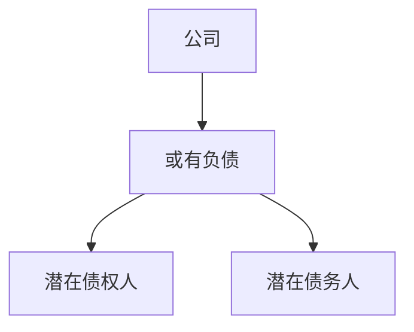
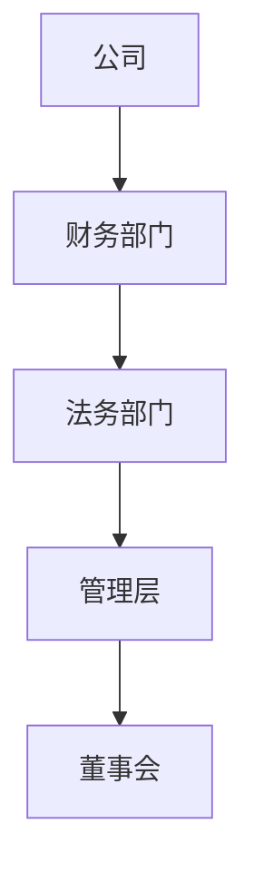
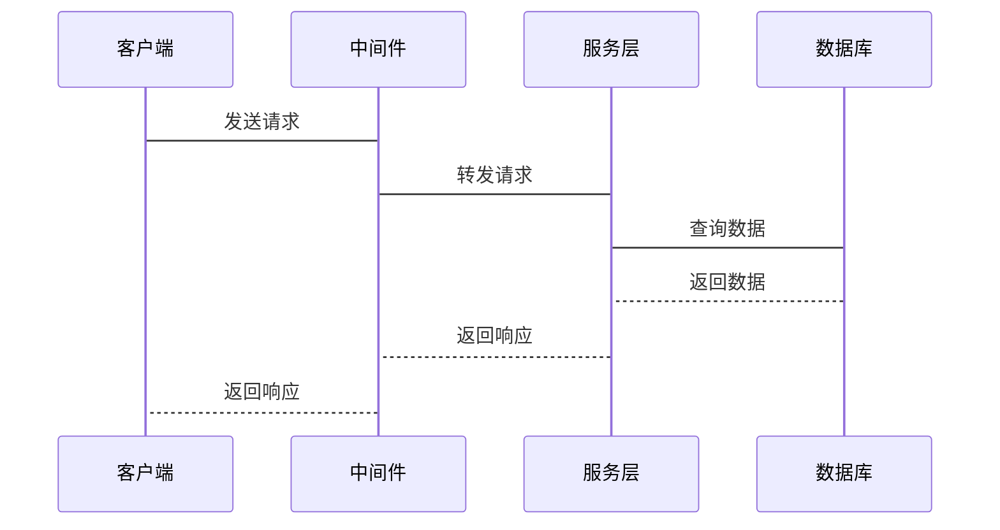

                 

# 彼得林奇如何看待公司的或有负债对长期价值的影响

> 关键词：彼得·林奇，或有负债，长期价值，投资决策，财务健康，风险管理

> 摘要：本文深入探讨了彼得·林奇对或有负债的看法，分析了或有负债对公司的长期价值、财务健康和投资决策的影响。通过实际案例分析和理论模型，结合系统的架构设计，详细阐述了或有负债的风险管理策略和投资决策框架。本文旨在帮助投资者更好地理解和应对或有负债带来的挑战，为长期投资决策提供有价值的参考。

---

# 第一部分: 背景介绍

## 第1章: 或有负债的核心概念与问题背景

### 1.1 或有负债的定义与特征

#### 1.1.1 什么是或有负债
- 或有负债的定义
- 或有负债的特征
- 或有负债与确认性负债的区别

#### 1.1.2 或有负债的分类
- 担保类或有负债
- 未决诉讼类或有负债
- 或有债务工具
- 其他形式的或有负债

#### 1.1.3 或有负债与公司长期价值的关系
- 或有负债的潜在影响
- 或有负债的隐蔽性与长期风险
- 或有负债对股东权益的影响

### 1.2 彼得·林奇与投资分析方法

#### 1.2.1 彼得·林奇的投资理念概述
- 极简主义投资策略
- 长期投资与价值发现
- 风险控制与安全边际

#### 1.2.2 彼得·林奇对财务报表的分析方法
- 财务报表分析的核心要素
- 重点考察的财务指标
- 财务报表分析的逻辑框架

#### 1.2.3 彼得·林奇对风险的关注与管理
- 风险的分类与评估
- 风险管理的核心原则
- 风险与收益的平衡艺术

---

## 第2章: 或有负债对长期价值的影响

### 2.1 或有负债对财务健康的影响

#### 2.1.1 或有负债对资产负债表的影响
- 或有负债对资产总额的影响
- 或有负债对负债结构的影响
- 或有负债对所有者权益的影响

#### 2.1.2 或有负债对利润表的影响
- 或有负债对收入的影响
- 或有负债对费用的影响
- 或有负债对净利润的影响

#### 2.1.3 或有负债对现金流的影响
- 或有负债对经营活动现金流的影响
- 或有负债对投资活动现金流的影响
- 或有负债对筹资活动现金流的影响

### 2.2 或有负债对投资决策的影响

#### 2.2.1 或有负债在企业估值中的作用
- 或有负债对企业价值的潜在影响
- 或有负债对市盈率、市净率的影响
- 或有负债对股息率的影响

#### 2.2.2 或有负债对投资风险的评估
- 或有负债的可变现性分析
- 或有负债的法律风险评估
- 或有负债的财务影响概率

#### 2.2.3 或有负债对投资机会成本的影响
- 或有负债对企业扩张的影响
- 或有负债对研发投入的影响
- 或有负债对资本支出的影响

### 2.3 或有负债对市场信任与企业声誉的影响

#### 2.3.1 或有负债对企业信用评级的影响
- 或有负债对信用评级的直接冲击
- 或有负债对融资成本的影响
- 或有负债对市场信心的影响

#### 2.3.2 或有负债对投资者信心的影响
- 或有负债对股价的短期影响
- 或有负债对投资者预期的影响
- 或有负债对投资者决策的影响

#### 2.3.3 或有负债对品牌价值的潜在影响
- 或有负债对企业形象的损害
- 或有负债对客户信任的影响
- 或有负债对合作伙伴关系的影响

---

# 第二部分: 核心概念与联系

## 第3章: 或有负债的核心概念与属性特征

### 3.1 或有负债的核心概念对比

#### 3.1.1 或有负债与确认性负债的区别
- 或有负债的不确定性
- 确认性负债的确定性
- 两者的区别对财务分析的影响

#### 3.1.2 或有负债与潜在收益的关系
- 或有负债对潜在收益的抑制作用
- 或有负债对潜在收益的转化可能性
- 或有负债对收益质量的影响

#### 3.1.3 或有负债与企业未来现金流的关联
- 或有负债对现金流的潜在影响
- 或有负债对现金流质量的影响
- 或有负债对现金流预测的难度

### 3.2 或有负债的属性特征对比

#### 3.2.1 确定性与不确定性对比
- 确定性负债的已知性
- 或有负债的不确定性
- 两者的区别对风险管理的影响

#### 3.2.2 时间跨度与金额大小对比
- 短期或有负债与长期或有负债的区分
- 或有负债金额的可变性
- 时间跨度对风险评估的影响

#### 3.2.3 表达方式与会计处理对比
- 或有负债的会计处理原则
- 确认性负债的会计处理方式
- 两者的差异对财务报表分析的影响

---

## 第4章: 或有负债的实体关系与架构

### 4.1 实体关系图

#### 4.1.1 或有负债的实体关系图（Mermaid图）

### 4.2 系统架构图

#### 4.2.1 或有负债的系统架构图（Mermaid图）

### 4.3 实体关系图的详细说明

#### 4.3.1 实体关系图的节点与边
- 公司与或有负债的关系
- 或有负债与潜在债权人、债务人的关系
- 实体关系图的动态变化

#### 4.3.2 实体关系图的业务流程
- 从公司到或有负债的形成过程
- 或有负债对管理层和董事会的影响
- 或有负债对债权人和债务人关系的影响

---

# 第三部分: 算法原理讲解

## 第5章: 或有负债的数学模型与算法

### 5.1 或有负债的概率分析模型

#### 5.1.1 概率论基础
- 概率的基本概念
- 或有负债发生的概率分布
- 概率在风险评估中的应用

#### 5.1.2 期望值模型
- 或有负债的期望值计算
- 期望值对长期价值的影响
- 期望值模型的应用案例

#### 5.1.3 方差与标准差分析
- 或有负债的风险程度
- 方差与标准差的计算
- 风险对投资决策的影响

### 5.2 或有负债的财务影响算法

#### 5.2.1 净现值模型
- 或有负债对净现值的影响
- 净现值的计算公式
- 净现值模型的应用

#### 5.2.2 内部收益率模型
- 或有负债对内部收益率的影响
- 内部收益率的计算
- 内部收益率模型的应用

#### 5.2.3 股东权益影响模型
- 或有负债对股东权益的影响
- 股东权益的计算
- 股东权益影响模型的应用

---

## 第6章: 或有负债的风险管理算法

### 6.1 风险识别与评估算法

#### 6.1.1 风险识别的步骤
- 确定风险来源
- 评估风险的可能性
- 评估风险的影响程度

#### 6.1.2 风险评估模型
- 风险矩阵模型
- 风险概率与影响矩阵
- 风险评估模型的应用

### 6.2 风险应对策略算法

#### 6.2.1 风险规避算法
- 风险规避的条件
- 风险规避的实施步骤
- 风险规避算法的优缺点

#### 6.2.2 风险转移算法
- 风险转移的机制
- 风险转移的实施步骤
- 风险转移算法的优缺点

#### 6.2.3 风险缓解算法
- 风险缓解的策略
- 风险缓解的实施步骤
- 风险缓解算法的优缺点

---

# 第四部分: 系统分析与架构设计方案

## 第7章: 系统分析与架构设计

### 7.1 问题场景介绍

#### 7.1.1 或有负债的识别与评估
- 问题背景
- 问题目标
- 问题范围

#### 7.1.2 投资决策支持系统
- 系统目标
- 系统范围
- 系统边界

### 7.2 系统功能设计

#### 7.2.1 领域模型设计

#### 7.2.2 系统架构设计

### 7.3 系统接口设计

#### 7.3.1 API接口设计
- API接口的功能描述
- API接口的请求格式
- API接口的响应格式

#### 7.3.2 接口交互流程
- 请求发起
- 服务处理
- 响应返回

### 7.4 系统交互设计

#### 7.4.1 交互流程图

---

# 第五部分: 项目实战

## 第8章: 项目实战与案例分析

### 8.1 环境安装与配置

#### 8.1.1 系统环境
- 操作系统要求
- JDK安装
- 数据库安装
- 开发工具安装

#### 8.1.2 依赖管理
- 使用Maven或Gradle管理依赖
- 配置环境变量
- 确保所有依赖正确安装

### 8.2 系统核心实现

#### 8.2.1 或有负债识别模块
- 代码实现
- 代码解释
- 代码测试

#### 8.2.2 风险评估模块
- 代码实现
- 代码解释
- 代码测试

#### 8.2.3 投资决策支持模块
- 代码实现
- 代码解释
- 代码测试

### 8.3 代码应用解读与分析

#### 8.3.1 代码结构分析
- 项目结构
- 主要文件
- 核心算法实现

#### 8.3.2 代码功能分析
- 功能模块划分
- 每个模块的功能描述
- 模块之间的交互

### 8.4 实际案例分析

#### 8.4.1 案例一：XYZ公司的或有负债分析
- 案例背景
- 数据分析
- 结论与建议

#### 8.4.2 案例二：ABC公司的投资决策支持
- 案例背景
- 数据分析
- 结论与建议

### 8.5 项目小结

#### 8.5.1 项目成果
- 实现的核心功能
- 系统的性能表现
- 用户反馈

#### 8.5.2 项目经验总结
- 成功经验
- 挑战与解决方案
- 未来改进方向

---

# 第六部分: 最佳实践与总结

## 第9章: 最佳实践与投资策略

### 9.1 投资策略与风险管理

#### 9.1.1 投资策略
- 长期投资策略
- 价值投资策略
- 风险控制策略

#### 9.1.2 风险管理
- 风险识别与评估
- 风险应对策略
- 风险监控与调整

### 9.2 投资组合优化

#### 9.2.1 投资组合构建
- 资产配置原则
- 股票与债券的配置
- 其他资产的配置

#### 9.2.2 投资组合优化
- 优化目标
- 优化方法
- 优化结果

### 9.3 或有负债的长期影响

#### 9.3.1 长期价值评估
- 企业价值评估模型
- 股东权益评估
- 股票估值方法

#### 9.3.2 长期风险管理
- 长期风险的识别
- 长期风险的应对
- 长期风险的监控

---

## 第10章: 总结与展望

### 10.1 总结

#### 10.1.1 本文的主要内容
- 或有负债的核心概念
- 或有负债对长期价值的影响
- 或有负债的风险管理

#### 10.1.2 本文的主要结论
- 彼得·林奇对或有负债的看法
- 或有负债对投资决策的影响
- 风险管理的重要性

### 10.2 展望

#### 10.2.1 未来的研究方向
- 或有负债的动态变化
- 或有负债的国际比较
- 或有负债的新形式与新风险

#### 10.2.2 未来实践方向
- 或有负债的数字化管理
- 或有负债的智能化评估
- 或有负债的全球化应对

---

# 作者：AI天才研究院/AI Genius Institute & 禅与计算机程序设计艺术 /Zen And The Art of Computer Programming

