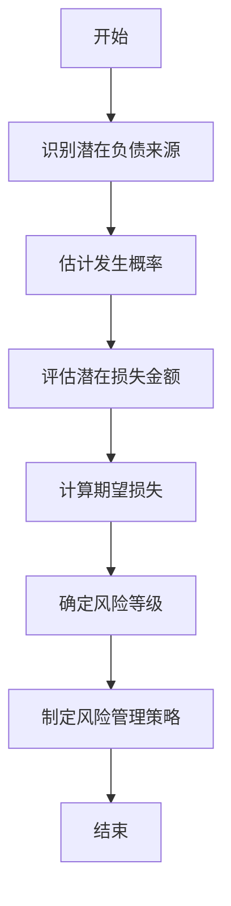
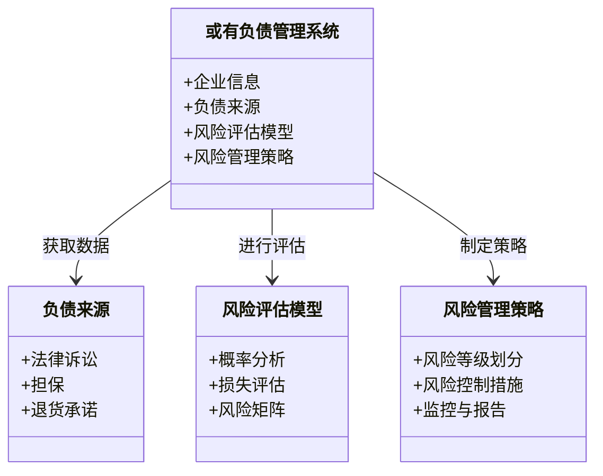
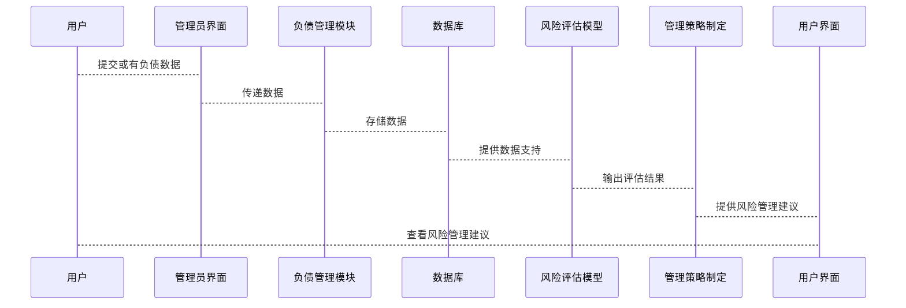

                 


# 彼得林奇如何看待公司的或有负债风险

---

## 关键词：彼得林奇，或有负债，财务风险，企业风险管理，投资分析

---

## 摘要：  
本文深入探讨了彼得·林奇在其投资分析框架中对“或有负债”的独特见解。通过分析或有负债的定义、分类、评估方法及其对公司财务健康的影响，本文揭示了彼得林奇如何将或有负债作为评估企业风险和投资价值的重要指标。文章结合理论与实际案例，详细阐述了如何识别和管理或有负债风险，为投资者和企业管理者提供了实用的策略和工具。

---

## 第一部分: 或有负债的基本概念与背景

### 第1章: 或有负债的基本概念与背景

#### 1.1 或有负债的定义与分类

##### 1.1.1 或有负债的基本定义  
或有负债（Contingent Liabilities）是指企业在未来某一特定条件下可能产生的债务或损失。与直接负债（如应付账款、银行贷款等）不同，或有负债的出现取决于某些不确定的条件，例如法律诉讼、担保、承诺、退货条款等。这些条件可能涉及法律、商业合同或企业承诺，使得或有负债具有不确定性。

##### 1.1.2 或有负债的主要分类  
根据其产生的原因和性质，或有负债可以分为以下几类：
1. **法律诉讼相关负债**：由于未决诉讼或潜在的法律纠纷而产生的负债。
2. **担保和承诺相关负债**：由于企业为其他方提供担保、信用承诺或类似安排而产生的潜在负债。
3. **退货和保修相关负债**：由于产品退货、服务保修等条款而可能产生的负债。
4. **其他或有负债**：包括其他可能的负债来源，如环境污染赔偿、员工赔偿计划等。

##### 1.1.3 或有负债与公司财务健康的关系  
或有负债是公司财务健康状况的重要组成部分。高比例的或有负债可能意味着公司面临较大的潜在风险，尤其是在法律诉讼、担保或退货方面。然而，适当的或有负债反映了企业的商业信用和市场承诺，关键在于其规模和潜在影响是否可控。

#### 1.2 或有负债的产生背景

##### 1.2.1 经济环境对或有负债的影响  
经济环境的波动（如经济衰退、市场不确定性）通常会增加企业的或有负债风险。例如，在经济低迷时期，企业可能面临更多的法律诉讼或违约风险，从而导致或有负债增加。

##### 1.2.2 企业经营中的或有负债风险  
企业经营过程中涉及的担保、承诺、退货条款等都可能成为或有负债的来源。例如，一家制造企业可能因为产品质量问题而承诺退货或保修，从而形成潜在的负债。

##### 1.2.3 投资者视角下的或有负债  
从投资者角度来看，或有负债是评估企业风险的重要指标。高比例的或有负债可能意味着企业未来可能面临较大的财务压力，从而影响其投资价值。

#### 1.3 或有负债与财务报表的关系

##### 1.3.1 或有负债在资产负债表中的体现  
尽管或有负债通常不会直接反映在资产负债表中，但它们可能通过相关披露或潜在的财务影响间接影响企业的财务状况。例如，未决诉讼可能影响企业的流动资金或信用评级。

##### 1.3.2 或有负债对损益表的影响  
或有负债的潜在损失可能通过损益表中的“预计负债”或“营业外支出”等方式体现。这些支出可能对企业的净利润产生直接影响。

##### 1.3.3 或有负债与公司信用评级的关联  
信用评级机构在评估企业信用时，通常会考虑其或有负债的规模和潜在影响。高比例的或有负债可能导致信用评级下降，从而增加融资成本。

---

## 第二部分: 或有负债的核心概念与联系

### 第2章: 或有负债的核心概念与联系

#### 2.1 或有负债的核心概念原理

##### 2.1.1 或有负债的不确定性分析  
或有负债的不确定性是其核心特征之一。企业需要通过概率分析和风险评估来量化其潜在影响。例如，可以通过历史数据和统计模型来估计或有负债的发生概率及其潜在损失。

##### 2.1.2 或有负债的潜在损失评估  
潜在损失评估是衡量或有负债风险的关键指标。企业需要通过定性和定量分析来估计或有负债可能造成的损失，并将其纳入财务规划和风险管理。

##### 2.1.3 或有负债的法律与财务双重属性  
或有负债既涉及法律问题（如合同履行、法律责任），又涉及财务问题（如潜在损失、财务影响）。因此，企业在处理或有负债时需要综合考虑法律和财务两方面的因素。

#### 2.2 或有负债与相关概念的对比

##### 2.2.1 或有负债与直接负债的对比  
| 比较维度 | 或有负债 | 直接负债 |
|----------|----------|----------|
| 定义     | 潜在的、不确定的债务 | 确定的、当前存在的债务 |
| 时间性   | 未来可能发生的 | 当前已存在的 |
| 可能性   | 不确定 | 确定 |

##### 2.2.2 或有负债与或有资产的对比  
| 比较维度 | 或有负债 | 或有资产 |
|----------|----------|----------|
| 影响     | 可能增加企业的负债 | 可能增加企业的资产 |
| 风险     | 增加财务压力 | 提高企业价值 |

##### 2.2.3 或有负债与预期负债的对比  
预期负债（Recognized Liabilities）是基于企业当前的合同义务或法律义务而确认的负债，而或有负债则是基于未来可能发生的事件。预期负债通常是确定的，而或有负债具有较高的不确定性。

#### 2.3 实体关系图分析

##### 2.3.1 或有负债的ER实体关系图  
以下是一个简单的ER实体关系图，展示了或有负债与其他相关实体的关系：

```mermaid
erDiagram
    actor 企业 {
        string 名称
        string 行业
    }
    actor 潜在负债来源 {
        string 条款内容
        string 潜在金额
    }
    actor 或有负债 {
        string 类型
        string 发生概率
    }
    actor 财务影响 {
        number 潜在损失
        number 发生概率
    }
    actor 风险评估 {
        number 风险等级
        string 评估结果
    }
    企业 --> 潜在负债来源: 提供
    潜在负债来源 --> 或有负债: 导致
    或有负债 --> 财务影响: 影响
    财务影响 --> 风险评估: 评估
```

##### 2.3.2 关键实体之间的关系描述  
- **企业**：企业是或有负债的主体，可能通过担保、承诺等方式产生或有负债。
- **潜在负债来源**：包括法律诉讼、担保、退货条款等可能引发或有负债的事件。
- **或有负债**：企业未来可能承担的债务或损失。
- **财务影响**：或有负债可能对企业的财务状况、信用评级和投资价值产生影响。
- **风险评估**：通过评估或有负债的风险等级，企业可以制定相应的风险管理策略。

##### 2.3.3 实体关系图的分析与解释  
上述ER实体关系图展示了或有负债的来源、影响和评估过程。企业通过识别潜在负债来源，评估或有负债的发生概率和潜在损失，并根据风险等级制定相应的风险管理策略。

---

## 第三部分: 或有负债的评估与分析方法

### 第3章: 或有负债的评估与分析方法

#### 3.1 或有负债的评估原理

##### 3.1.1 或有负债的识别方法  
识别或有负债的关键在于分析企业的合同、承诺和潜在的法律纠纷。例如，企业可以通过审查其担保合同、退货政策和未决诉讼来识别潜在的或有负债。

##### 3.1.2 或有负债的概率分析  
概率分析是评估或有负债风险的核心方法之一。企业可以通过历史数据和统计模型来估计或有负债的发生概率，并根据概率计算其对财务状况的影响。

##### 3.1.3 或有负债的损失评估模型  
损失评估模型是衡量或有负债潜在影响的重要工具。企业可以通过以下步骤来构建损失评估模型：
1. 确定或有负债的类型和来源。
2. 估计或有负债的发生概率。
3. 评估或有负债的潜在损失金额。
4. 计算或有负债的期望损失（期望值）。

#### 3.2 或有负债的风险矩阵评估

##### 3.2.1 风险矩阵的构建  
风险矩阵是一种将或有负债的风险等级可视化的方法。通常，风险矩阵包括以下几个维度：
- **可能性**：或有负债发生的概率（低、中、高）。
- **影响**：或有负债对财务状况的影响（低、中、高）。

##### 3.2.2 风险矩阵的应用  
通过风险矩阵，企业可以将或有负债分为不同的风险等级，并根据风险等级制定相应的管理策略。例如：
- **低风险**：可以忽略或仅进行常规监控。
- **中风险**：需要制定风险管理计划。
- **高风险**：需要立即采取措施，降低风险。

##### 3.2.3 风险矩阵的案例分析  
以下是一个简单的风险矩阵示例：

| 可能性 \ 影响 | 低    | 中    | 高    |
|----------------|-------|-------|-------|
| 低             | 低风险 | 中风险 | 高风险 |
| 中             | 中风险 | 中风险 | 高风险 |
| 高             | 高风险 | 高风险 | 高风险 |

#### 3.3 算法原理与流程图

##### 3.3.1 或有负债风险评估算法的步骤  
1. 识别潜在的或有负债来源。
2. 估计或有负债的发生概率。
3. 评估或有负债的潜在损失金额。
4. 计算或有负债的期望损失。
5. 根据风险矩阵确定风险等级。
6. 制定相应的风险管理策略。

##### 3.3.2 使用mermaid绘制的算法流程图  



---

## 第四部分: 或有负债的数学模型与公式

### 第4章: 或有负债的数学模型与公式

#### 4.1 或有负债的概率分析

##### 4.1.1 概率分布模型  
或有负债的发生概率可以通过概率分布模型来估计。常见的概率分布模型包括：
- **二项分布**：适用于仅有两种可能结果的事件（如诉讼胜诉或败诉）。
- **泊松分布**：适用于事件发生次数较少的场景。

##### 4.1.2 概率计算公式  
假设某或有负债的发生的概率为 \( p \)，则其不发生的概率为 \( 1 - p \)。对于 \( n \) 次独立事件，或有负债至少发生一次的概率为：
$$ P(\text{至少发生一次}) = 1 - (1 - p)^n $$

##### 4.1.3 案例分析  
假设某企业面临一项法律诉讼，诉讼败诉的概率为 \( p = 0.3 \)，诉讼金额为 $100,000。则：
- 诉讼败诉的概率为 \( 0.3 \)。
- 诉讼胜诉的概率为 \( 0.7 \)。
- 若诉讼败诉，企业的预期损失为：
$$ \text{预期损失} = 0.3 \times 100,000 = 30,000 $$

#### 4.2 或有负债的损失评估模型

##### 4.2.1 损失金额的估计  
损失金额的估计通常基于历史数据和具体情况。例如，可以通过以下公式计算期望损失：
$$ \text{期望损失} = \sum_{i=1}^{n} P_i \times L_i $$
其中，\( P_i \) 是第 \( i \) 种情况的发生概率，\( L_i \) 是第 \( i \) 种情况下的损失金额。

##### 4.2.2 风险调整后的资本资产定价模型（RAPM）  
风险调整后的资本资产定价模型（RAPM）可以用于评估或有负债对投资价值的影响。其公式为：
$$ R = R_f + \beta (R_m - R_f) + \text{风险溢价} $$
其中，\( R \) 是资产的预期回报率，\( R_f \) 是无风险利率，\( \beta \) 是资产的贝塔系数，\( R_m \) 是市场预期回报率，风险溢价反映了或有负债带来的额外风险。

---

## 第五部分: 或有负债的系统分析与架构设计方案

### 第5章: 或有负债的系统分析与架构设计方案

#### 5.1 系统分析

##### 5.1.1 问题场景介绍  
假设某制造企业面临多项或有负债，包括法律诉讼、担保和退货承诺。企业需要通过系统化的方法来评估这些或有负债的风险，并制定相应的管理策略。

##### 5.1.2 系统功能设计  
以下是系统功能设计的领域模型：



##### 5.1.3 系统架构设计  


#### 5.2 接口设计与交互

##### 5.2.1 系统交互流程  



---

## 第六部分: 或有负债的项目实战

### 第6章: 或有负债的项目实战

#### 6.1 环境安装与工具准备

##### 6.1.1 环境要求  
- 操作系统：Windows、MacOS 或 Linux
- 开发工具：Python、Jupyter Notebook、Mermaid 工具（如 VS Code 插件）
- 数据库：MySQL 或 PostgreSQL

##### 6.1.2 安装步骤  
1. 安装 Python 和 pip。
2. 安装 Mermaid CLI：`pip install mermaid-cli`
3. 安装 Jupyter Notebook：`pip install jupyter`

#### 6.2 核心实现与代码示例

##### 6.2.1 或有负债风险评估算法实现  

```python
import random

def calculate_probability(n, p):
    return 1 - (1 - p) ** n

def calculate_expected_loss(loss_amount, probability):
    return loss_amount * probability

n = 5  # 独立试验次数
p = 0.2  # 单次试验的成功概率
expected_loss = calculate_expected_loss(100000, 0.2)
print(f"期望损失：{expected_loss}")
```

##### 6.2.2 风险矩阵实现  

```python
def risk_assessment(probability, impact):
    if probability < 0.2 and impact < 0.2:
        return "低风险"
    elif probability < 0.5 and impact < 0.5:
        return "中风险"
    else:
        return "高风险"

probability = 0.6
impact = 0.7
risk_level = risk_assessment(probability, impact)
print(f"风险等级：{risk_level}")
```

#### 6.3 应用解读与分析  

##### 6.3.1 应用场景分析  
假设某企业面临一项法律诉讼，诉讼金额为 $500,000，发生的概率为 0.4。根据上述代码，计算其期望损失为：
$$ \text{期望损失} = 500,000 \times 0.4 = 200,000 $$

##### 6.3.2 实际案例分析  
以下是一个实际案例的分析：
- **公司名称**：XYZ 制造公司
- **或有负债来源**：未决诉讼
- **发生概率**：0.3
- **损失金额**：$200,000
- **风险等级**：中风险

##### 6.3.3 解决方案  
1. 评估或有负债的风险等级。
2. 制定相应的风险管理策略（如增加诉讼准备金、寻求法律援助）。
3. 定期监控或有负债的变化，并及时调整风险管理策略。

#### 6.4 项目小结  

通过上述代码和案例分析，我们可以看到，或有负债的评估和管理需要结合概率分析、风险矩阵和实际案例分析等多种方法。企业可以通过系统化的方法来识别和管理或有负债，从而降低其对财务健康的影响。

---

## 第七部分: 最佳实践与总结

### 第7章: 最佳实践与总结

#### 7.1 最佳实践

##### 7.1.1 定期评估或有负债  
企业应定期评估其或有负债，尤其是在经营环境发生变化时。

##### 7.1.2 制定风险管理策略  
根据或有负债的风险等级，制定相应的风险管理策略（如风险控制、风险转移、风险缓解）。

##### 7.1.3 加强内部控制系统  
通过加强内部控制系统，减少或有负债的潜在来源，降低其对财务健康的影响。

##### 7.1.4 提高透明度与披露  
企业应提高财务报告的透明度，充分披露或有负债的相关信息，以便投资者和债权人做出更明智的决策。

#### 7.2 小结  
本文从彼得·林奇的投资分析视角，详细探讨了或有负债的定义、分类、评估方法及其对企业财务健康的影响。通过理论分析、公式推导和实际案例，本文为投资者和企业管理者提供了实用的策略和工具，帮助其更好地识别和管理或有负债风险。

#### 7.3 注意事项  

- **数据准确性**：在进行概率分析和损失评估时，确保数据的准确性和完整性。
- **模型适用性**：根据具体情况选择合适的概率模型和风险评估模型。
- **持续监控**：或有负债的风险是动态变化的，企业需要持续监控其变化并及时调整风险管理策略。

#### 7.4 拓展阅读  
- 彼得·林奇的《投资学入门：股票的入门与技巧》
- 《企业风险管理：或有负债的识别与管理》
- 《财务报表分析：识别或有负债的关键指标》

---

## 作者：AI天才研究院/AI Genius Institute & 禅与计算机程序设计艺术/Zen And The Art of Computer Programming

