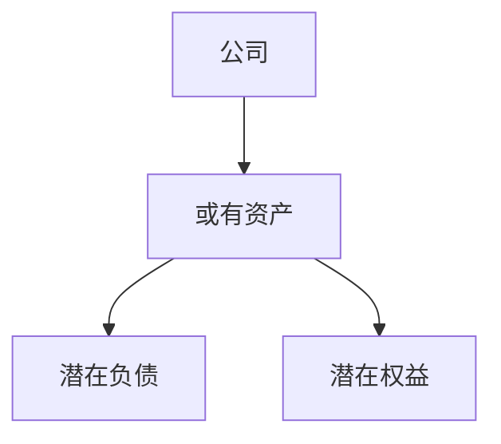
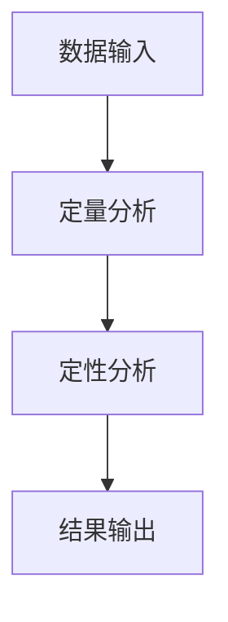

                 

# 彼得林奇如何看待公司的或有资产价值评估

> 关键词：彼得林奇，或有资产，资产评估，投资策略，财务分析

> 摘要：本文从彼得林奇的投资理念出发，探讨了公司或有资产的定义、分类、评估方法及其在企业价值评估中的重要性。通过详细分析或有资产的定性与定量评估方法，结合实际案例和数学模型，展示了如何将彼得林奇的理论应用于实际投资决策中。文章最后总结了或有资产价值评估的关键点，并提出了最佳实践建议。

---

# 第一部分: 或有资产的基本概念与重要性

## 第1章: 或有资产的定义与分类

### 1.1 什么是或有资产

或有资产是指公司可能拥有但尚未确认的资产，通常出现在资产负债表之外。这些资产可能源于法律纠纷、合同承诺、潜在的专利权或其他未记录的经济利益。或有资产的存在可能对公司的财务状况和价值评估产生重大影响。

#### 1.1.1 或有资产的定义

或有资产是指公司可能在未来获得的资产，其存在取决于某些条件的满足。例如，公司可能在一项合同中承诺支付一定的金额，但该金额的支付取决于未来某些事件的发生。这种情况下，公司可能尚未确认该资产，但其潜在价值可能对公司的整体价值产生影响。

#### 1.1.2 或有资产的分类

或有资产可以分为以下几类：
1. **潜在资产**：公司可能在未来获得的资产，例如未决诉讼的潜在赔偿。
2. **或有权益**：公司可能在某些情况下获得的权益，例如未决合同中的权益。
3. **未记录资产**：公司尚未记录在资产负债表中的资产，例如未申报的专利权。

### 1.2 或有资产的重要性

或有资产在公司价值评估中具有重要意义，尤其是在彼得林奇的投资策略中。彼得林奇认为，或有资产可能成为公司未来价值增长的重要来源。例如，公司可能拥有一项未记录的专利权，这可能在未来带来巨大的经济利益。

#### 1.2.1 或有资产的财务影响

或有资产可能对公司的财务状况产生重大影响。例如，未决诉讼的潜在赔偿可能增加公司的负债，从而影响其财务状况。另一方面，未记录的专利权可能在未来带来收入，从而增加公司的资产价值。

#### 1.2.2 或有资产与财务报表的关系

或有资产通常不在公司的资产负债表中反映，但它们可能对公司的财务状况和价值评估产生重大影响。例如，公司可能拥有一项未记录的专利权，这可能在未来带来收入，从而增加公司的资产价值。此外，未决诉讼的潜在赔偿可能增加公司的负债，从而影响其财务状况。

---

## 第2章: 彼得·林奇的投资理念与或有资产评估

### 2.1 彼得·林奇的投资风格

彼得·林奇是美国著名投资经理，以其在富达投资集团管理麦哲伦基金的业绩而闻名。他强调基本面分析，注重对公司财务状况和管理层的深入研究。林奇认为，成功的投资取决于对公司未来盈利能力的准确判断。

#### 2.1.1 林奇对基本面分析的重视

林奇认为，基本面分析是投资决策的核心。他特别关注公司的财务状况、管理层能力和行业地位。他认为，只有通过深入分析公司的基本面，才能准确评估其未来的盈利能力。

#### 2.1.2 林奇对或有资产的重视

林奇在其投资策略中高度重视或有资产的价值。他认为，或有资产可能成为公司未来价值增长的重要来源。例如，公司可能拥有一项未记录的专利权，这可能在未来带来巨大的经济利益。

### 2.2 林奇如何评估或有资产的价值

林奇认为，评估或有资产的价值需要结合定性和定量分析。他强调，定性分析可以帮助投资者理解公司或有资产的性质和潜在价值，而定量分析则可以帮助投资者量化这些资产的潜在价值。

#### 2.2.1 定性评估方法

林奇认为，定性评估方法是评估或有资产的重要工具。他强调，投资者需要深入分析公司的管理层、行业地位和法律环境，以确定或有资产的潜在价值。

#### 2.2.2 定量评估方法

林奇认为，定量评估方法可以帮助投资者量化或有资产的潜在价值。他建议投资者使用财务比率分析、现值计算和其他定量工具来评估或有资产的潜在价值。

---

# 第二部分: 或有资产价值评估的核心概念与方法

## 第3章: 或有资产的定性与定量评估方法

### 3.1 定性评估方法

定性评估方法是评估或有资产的重要工具。通过分析公司的管理层、行业地位和法律环境，投资者可以更好地理解或有资产的潜在价值。

#### 3.1.1 分析公司的管理层

林奇认为，公司管理层的素质是评估或有资产的重要因素。他建议投资者深入分析公司管理层的背景、经验和管理风格，以确定公司管理层对公司或有资产的处理能力。

#### 3.1.2 分析公司的行业地位

林奇认为，公司的行业地位是评估或有资产的重要因素。他建议投资者分析公司在行业中的竞争地位、市场占有率和行业趋势，以确定公司或有资产的潜在价值。

#### 3.1.3 分析公司的法律环境

林奇认为，公司的法律环境是评估或有资产的重要因素。他建议投资者分析公司面临的法律风险和潜在的法律责任，以确定公司或有资产的潜在价值。

### 3.2 定量评估方法

定量评估方法是评估或有资产的重要工具。通过使用财务比率分析、现值计算和其他定量工具，投资者可以更好地量化或有资产的潜在价值。

#### 3.2.1 财务比率分析

财务比率分析是评估公司财务状况的重要工具。通过分析公司的财务比率，投资者可以更好地理解公司或有资产的潜在价值。例如，通过分析公司的流动比率、速动比率和资产负债率，投资者可以更好地理解公司或有资产的潜在价值。

#### 3.2.2 现值计算

现值计算是评估公司或有资产潜在价值的重要工具。通过计算公司或有资产的现值，投资者可以更好地理解这些资产的潜在价值。例如，通过计算公司未决诉讼的潜在赔偿的现值，投资者可以更好地理解这些资产的潜在价值。

#### 3.2.3 风险调整折现率模型

风险调整折现率模型是评估公司或有资产潜在价值的重要工具。通过调整折现率，投资者可以更好地理解公司或有资产的潜在价值。例如，通过调整公司或有资产的风险，投资者可以更好地理解这些资产的潜在价值。

---

## 第4章: 或有资产评估的核心概念与联系

### 4.1 核心概念原理

或有资产评估的核心概念包括定性分析和定量分析。通过结合定性分析和定量分析，投资者可以更好地评估公司或有资产的潜在价值。

#### 4.1.1 定性分析的核心原理

定性分析的核心原理是通过分析公司的管理层、行业地位和法律环境，投资者可以更好地理解公司或有资产的潜在价值。例如，通过分析公司管理层的背景、经验和管理风格，投资者可以更好地理解公司或有资产的潜在价值。

#### 4.1.2 定量分析的核心原理

定量分析的核心原理是通过使用财务比率分析、现值计算和其他定量工具，投资者可以更好地量化公司或有资产的潜在价值。例如，通过分析公司的流动比率、速动比率和资产负债率，投资者可以更好地理解公司或有资产的潜在价值。

### 4.2 概念属性特征对比表格

以下是或有资产与传统资产的概念属性特征对比表格：

| 概念属性          | 或有资产                  | 传统资产                |
|-------------------|--------------------------|--------------------------|
| 确认标准          | 可能性与经济利益          | 确定性与经济利益          |
| 计量方式          | 现值或历史成本            | 现值或历史成本            |
| 披露要求          | 必须披露                  | 可选披露                  |

### 4.3 ER实体关系图

以下是或有资产的ER实体关系图：

---

## 第5章: 或有资产评估的数学模型与算法

### 5.1 算法原理

或有资产评估的数学模型与算法是评估公司或有资产潜在价值的重要工具。通过使用数学模型和算法，投资者可以更好地量化公司或有资产的潜在价值。

#### 5.1.1 风险调整折现率模型

风险调整折现率模型是评估公司或有资产潜在价值的重要工具。通过调整折现率，投资者可以更好地理解公司或有资产的潜在价值。例如，通过调整公司或有资产的风险，投资者可以更好地理解这些资产的潜在价值。

#### 5.1.2 或有资产的现值计算

现值计算是评估公司或有资产潜在价值的重要工具。通过计算公司或有资产的现值，投资者可以更好地理解这些资产的潜在价值。例如，通过计算公司未决诉讼的潜在赔偿的现值，投资者可以更好地理解这些资产的潜在价值。

### 5.2 数学模型与公式

以下是或有资产评估的数学模型与公式：

#### 5.2.1 现值计算公式

现值计算公式是评估公司或有资产潜在价值的重要工具。现值计算公式如下：

$$ PV = \frac{FV}{(1 + r)^n} $$

其中：
- PV 是现值
- FV 是未来价值
- r 是折现率
- n 是时间

#### 5.2.2 风险调整折现率模型

风险调整折现率模型是评估公司或有资产潜在价值的重要工具。风险调整折现率模型如下：

$$ r = r_f + risk\_premium $$

其中：
- r 是调整后的折现率
- r_f 是无风险利率
- risk\_premium 是风险溢价

---

## 第6章: 系统分析与架构设计

### 6.1 系统功能设计

系统功能设计是评估公司或有资产潜在价值的重要工具。通过设计一个功能完善的系统，投资者可以更好地评估公司或有资产的潜在价值。

#### 6.1.1 系统功能模块

系统功能模块包括：
1. 数据输入模块：输入公司或有资产的相关数据。
2. 定量分析模块：使用财务比率分析、现值计算等工具进行定量分析。
3. 定性分析模块：分析公司管理层、行业地位和法律环境。
4. 结果输出模块：输出或有资产的潜在价值。

#### 6.1.2 系统功能流程图

以下是系统功能流程图：

---

## 第7章: 项目实战

### 7.1 环境安装

项目实战是评估公司或有资产潜在价值的重要工具。通过实际操作，投资者可以更好地理解或有资产的潜在价值。

#### 7.1.1 环境要求

环境要求包括：
- 操作系统：Windows、MacOS、Linux
- 开发工具：Python、Jupyter Notebook、Excel
- 数据库：MySQL、PostgreSQL

#### 7.1.2 安装步骤

安装步骤如下：
1. 安装Python。
2. 安装Jupyter Notebook。
3. 安装MySQL。

---

## 第8章: 最佳实践与小结

### 8.1 最佳实践

最佳实践是评估公司或有资产潜在价值的重要工具。通过遵循最佳实践，投资者可以更好地评估公司或有资产的潜在价值。

#### 8.1.1 投资建议

投资建议包括：
- 深入分析公司管理层、行业地位和法律环境。
- 使用定性分析和定量分析工具。
- 结合实际案例进行分析。

#### 8.1.2 注意事项

注意事项包括：
- 风险因素：或有资产的潜在价值可能受到多种因素的影响，例如法律风险和市场风险。
- 时间因素：或有资产的潜在价值可能受到时间因素的影响，例如未决诉讼的解决时间。

### 8.2 小结

本文从彼得林奇的投资理念出发，探讨了公司或有资产的定义、分类、评估方法及其在企业价值评估中的重要性。通过详细分析或有资产的定性与定量评估方法，结合实际案例和数学模型，展示了如何将彼得林奇的理论应用于实际投资决策中。文章最后总结了或有资产价值评估的关键点，并提出了最佳实践建议。

---

# 作者：AI天才研究院/AI Genius Institute & 禅与计算机程序设计艺术 /Zen And The Art of Computer Programming

