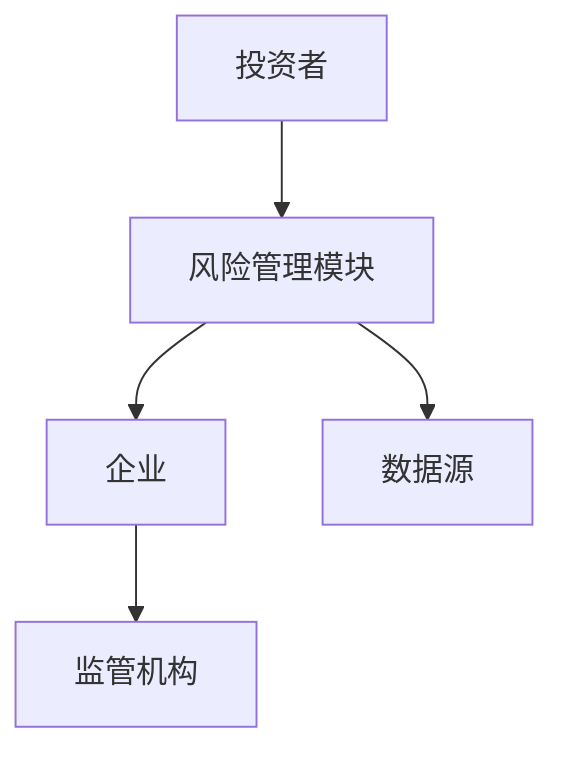
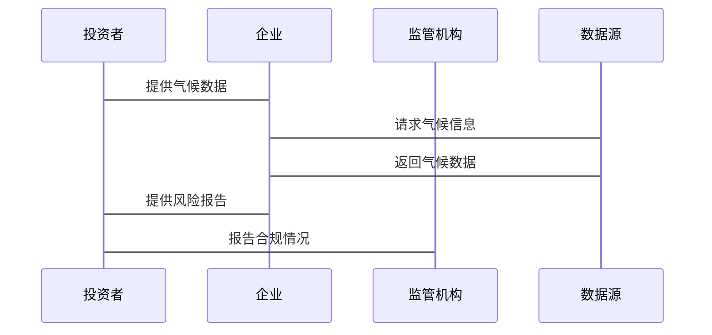

                 


# 彼得·林奇如何看待公司的气候变化风险管理

## 关键词：气候变化风险管理、彼得·林奇、投资风险管理、气候变化影响、企业风险管理策略

## 摘要：
本文从投资风险管理的角度，深入探讨彼得·林奇如何看待公司面临的气候变化风险管理。文章首先介绍气候变化对全球经济的影响，然后分析彼得·林奇的投资理念及其对气候变化风险管理的启示。通过数学模型和实际案例，详细阐述气候变化风险管理的核心概念、算法原理、系统架构及项目实战。最后，总结最佳实践，提出投资建议和风险管理策略，展望未来发展趋势。

---

## 第一部分：引言

### 第1章：引言

#### 1.1 气候变化对全球经济的影响
气候变化不仅是环境问题，更是经济和投资领域的重大挑战。极端天气事件频发、政策法规趋严、企业声誉受损等都可能影响公司的财务状况和投资价值。近年来，气候变化已成为投资者关注的核心议题之一。

#### 1.2 彼得·林奇与投资风险管理
彼得·林奇是全球著名投资专家，以其对市场的深刻洞察和长期投资策略闻名。他认为，投资者必须关注影响公司长期价值的各种因素，包括环境风险。在气候变化背景下，企业如何管理气候相关风险，成为投资者评估公司价值的重要考量。

#### 1.3 本书的目的与结构
本文旨在通过分析彼得·林奇的投资理念，探讨气候变化风险管理对企业的意义，并为企业和投资者提供实用的策略建议。文章结构清晰，从背景、核心概念、算法原理到系统设计和案例分析，层层递进，最终总结最佳实践。

---

## 第二部分：气候变化风险管理的背景与核心概念

### 第2章：气候变化风险管理的背景

#### 2.1 气候变化的定义与关键问题
气候变化是指全球气候系统长期的变化，包括温度上升、降水模式改变等。关键问题包括极端天气事件、海平面上升、生态系统破坏等，这些都可能对企业运营和财务状况造成重大影响。

#### 2.2 气候变化对企业的财务影响
气候变化可能导致企业面临物理风险（如极端天气对企业资产的破坏）、监管风险（如碳排放限制政策）和声誉风险（如环保形象受损）。这些风险可能直接或间接影响企业的财务表现和投资价值。

#### 2.3 相关法规与政策背景
全球范围内，越来越多的政策法规要求企业披露碳排放信息并采取减排措施。例如，欧盟的碳边境调节机制、美国的气候法案等，都对企业气候风险管理提出了更高要求。

### 第3章：核心概念与联系

#### 3.1 气候变化风险管理的定义
气候变化风险管理是指企业识别、评估和应对与气候变化相关的风险，以确保其业务的可持续性和财务稳定性。

#### 3.2 气候变化风险管理的核心要素
核心要素包括：风险识别、风险评估、风险缓解、风险监控和风险报告。

#### 3.3 气候变化风险管理的实体关系图（ER图）

```mermaid
erDiagram
    actor 投资者 {
        string 资产
        string 风险
        string 价值
    }
    actor 企业 {
        string 资产
        string 风险
        string 价值
    }
    actor 监管机构 {
        string 法规
        string 政策
        string 监督
    }
    relation 气候变化风险 {
        投资者 --> 气候变化风险
        企业 --> 气候变化风险
        监管机构 --> 气候变化风险
    }
```

---

## 第三部分：气候变化风险管理的算法原理

### 第4章：气候变化风险管理的算法原理

#### 4.1 气候变化风险评估模型
常用模型包括情景分析法和蒙特卡洛模拟。

#### 4.2 情景分析法（Scenario Analysis）
情景分析通过设定不同气候情景（如最乐观、最悲观、中性）来评估企业可能面临的气候变化风险。

#### 4.3 蒙特卡洛模拟（Monte Carlo Simulation）
蒙特卡洛模拟通过随机抽样方法，评估气候变化对资产价值的影响，帮助企业在不确定性中做出决策。

### 第5章：数学模型与公式

#### 5.1 气候变化风险评估的数学模型
$$
\text{风险值} = \sum_{i=1}^{n} (P_i \times I_i)
$$
其中，\( P_i \) 是情景 \( i \) 的概率，\( I_i \) 是情景 \( i \) 的影响。

#### 5.2 气候变化对资产价值的影响公式
$$
\text{资产价值} = \text{当前价值} - \sum_{i=1}^{m} (C_i \times R_i)
$$
其中，\( C_i \) 是气候事件 \( i \) 的成本，\( R_i \) 是发生概率。

---

## 第四部分：系统分析与架构设计方案

### 第6章：系统分析与架构设计

#### 6.1 气候变化风险管理的系统功能设计
系统需具备风险识别、评估、监控和报告功能。

#### 6.2 系统架构设计



#### 6.3 系统接口设计与交互流程



---

## 第五部分：项目实战与案例分析

### 第7章：项目实战

#### 7.1 环境安装与工具配置
安装Python、数据分析库（如Pandas）和可视化工具（如Matplotlib）。

#### 7.2 核心代码实现与解读

```python
import pandas as pd
import numpy as np

# 示例数据
data = {'资产': [100, 200, 300], '风险': [0.1, 0.2, 0.3]}
df = pd.DataFrame(data)

# 风险评估
def calculate_risk(df):
    return df['资产'].apply(lambda x: x * df['风险'])

result = calculate_risk(df)
print(result)
```

#### 7.3 案例分析与详细解读
以某制造企业为例，分析其在不同气候情景下的资产风险，并通过代码实现风险评估。

### 第8章：案例分析

#### 8.1 案例背景介绍
某制造企业面临洪水风险，需评估气候变化对其资产的影响。

#### 8.2 案例分析过程
通过蒙特卡洛模拟评估洪水对企业资产的潜在损失。

#### 8.3 案例结果与启示
结果表明，企业需加强资产保护措施，并优化风险管理策略。

---

## 第六部分：总结与最佳实践

### 第9章：总结与最佳实践

#### 9.1 本书的核心观点总结
气候变化风险管理是企业可持续发展的重要组成部分，投资者需关注气候相关风险对企业价值的影响。

#### 9.2 投资者的最佳实践建议
1. 评估企业气候风险管理能力。
2. 关注政策法规对企业的影响。
3. 选择具备气候风险管理能力的企业进行投资。

#### 9.3 企业的风险管理策略
1. 建立气候风险管理框架。
2. 定期评估和更新风险管理策略。
3. 加强与投资者和监管机构的沟通。

#### 9.4 未来趋势与展望
随着气候变化问题的加剧，相关法规和市场机制将不断完善，企业需提前布局，增强气候风险管理能力。

---

## 作者：AI天才研究院/AI Genius Institute & 禅与计算机程序设计艺术 /Zen And The Art of Computer Programming

