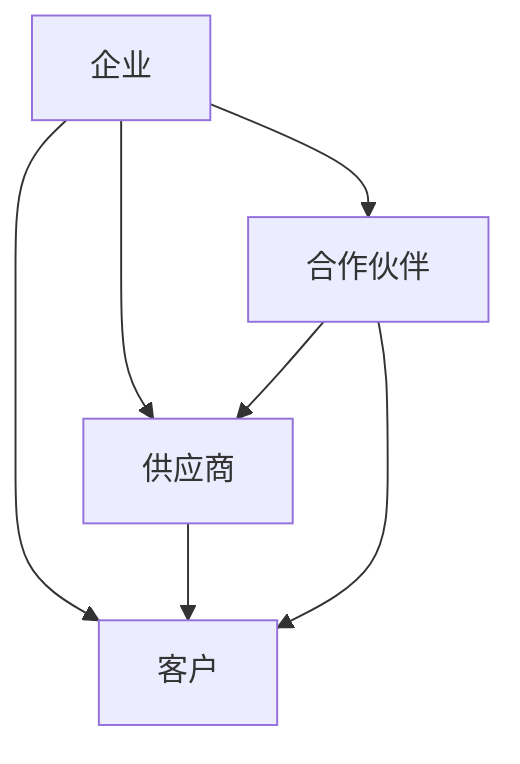
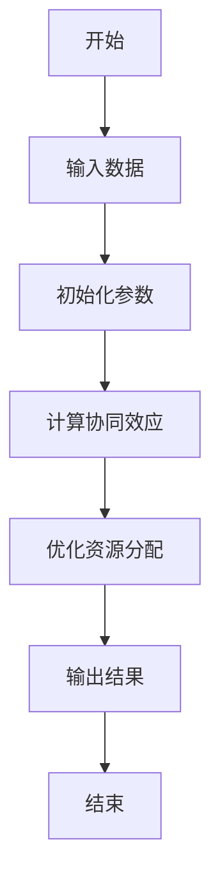
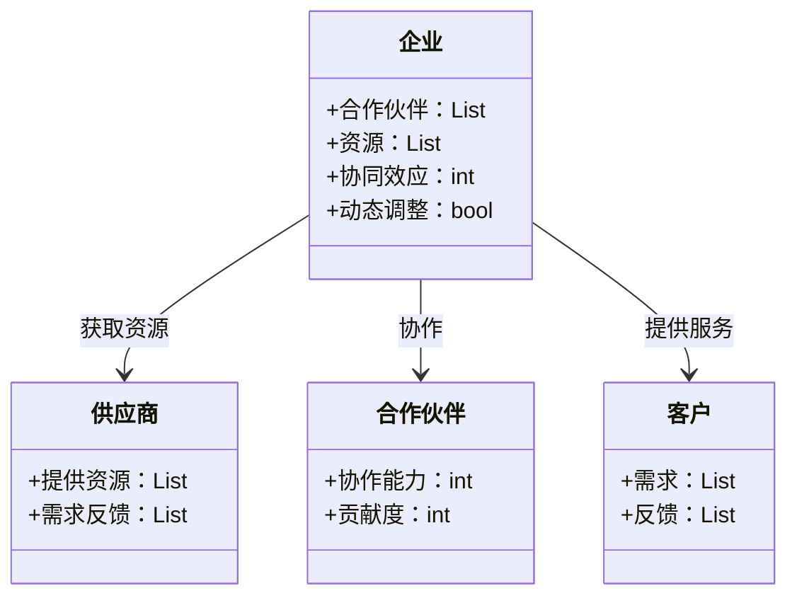

                 


# 彼得林奇如何看待公司的生态系统构建能力

**关键词**：彼得·林奇，公司生态系统，构建能力，投资哲学，协同效应

**摘要**：本文从彼得·林奇的投资哲学出发，探讨公司生态系统构建的核心要素及其重要性。通过分析生态系统构建的背景、核心概念、算法原理、系统架构以及项目实战，结合最佳实践，为读者提供全面的见解。

---

## 第一章：公司的生态系统构建能力概述

### 1.1 公司生态系统构建的背景

#### 1.1.1 当今商业环境的变化
当代商业环境正经历着从单一企业竞争向生态系统协作的重大转变。数字化转型、跨界合作和技术创新使得企业间的协作愈发重要，生态系统成为企业长期竞争优势的关键。

#### 1.1.2 生态系统概念的引入
生态系统在商业中的应用源于生物学的类比，指企业与其合作伙伴、供应商、客户等共同构建的互惠互利的商业网络。这种模式强调多方协作，而非单一企业独立运作。

#### 1.1.3 生态系统在企业中的重要性
生态系统构建不仅提升了企业的协同效应，还增强了其在市场中的适应能力和创新能力。通过资源整合和价值共创，企业能够更高效地应对复杂多变的市场环境。

### 1.2 彼得·林奇的视角

#### 1.2.1 彼得·林奇的投资哲学
彼得·林奇以基本面分析和长期投资著称，他认为企业的长期成功依赖于其商业模式和管理团队。在投资决策中，他特别关注企业的生态系统构建能力，认为这能带来持续的增长和竞争优势。

#### 1.2.2 生态系统构建的核心要素
林奇认为，成功的生态系统构建需要整合资源、能力互补和持续创新。企业应注重与合作伙伴的关系，确保各方利益一致，从而形成稳定的协作机制。

#### 1.2.3 彼得·林奇对生态系统构建的见解
林奇强调，生态系统构建不仅仅是战略选择，更是企业生存和发展的必要条件。通过构建强大的生态系统，企业能够更好地应对市场变化，实现长期价值。

### 1.3 生态系统构建与企业竞争力

#### 1.3.1 生态系统对企业竞争力的影响
生态系统构建显著提升了企业的协同效应和创新能力，使企业在竞争中更具灵活性和响应速度。

#### 1.3.2 生态系统构建的长期价值
通过生态系统构建，企业能够实现资源的最优配置，增强市场渗透力，从而在长期发展中占据优势。

#### 1.3.3 生态系统构建的挑战与机遇
尽管生态系统构建面临复杂性和协调难度的挑战，但其带来的协同效应和创新机会为企业提供了显著的机遇。

---

## 第二章：生态系统构建的核心概念与联系

### 2.1 生态系统构建的定义与特点

#### 2.1.1 生态系统构建的定义
公司生态系统构建是指企业与其利益相关者（如供应商、合作伙伴、客户）共同构建的互惠互利的商业网络，旨在通过协作实现价值共创。

#### 2.1.2 生态系统构建的核心特点
- **多样性**：包含多种角色和资源。
- **协作性**：各成员之间协同合作。
- **动态性**：能够适应市场变化。

### 2.2 生态系统构建的核心要素

#### 2.2.1 资源与能力的整合
企业应整合内部资源和外部资源，形成互补能力，提升整体竞争力。

#### 2.2.2 协同效应的实现
通过协作，企业能够实现1+1>2的效果，提升整体效率和创新速度。

#### 2.2.3 生态系统的动态性与适应性
生态系统需具备快速响应市场变化的能力，通过灵活调整策略确保长期稳定。

### 2.3 生态系统构建的ER实体关系图



---

## 第三章：生态系统构建的算法原理

### 3.1 算法原理概述

#### 协同效应的计算公式
$$协同效应 = \sum_{i=1}^{n} (a_i \cdot b_i)$$

#### 资源优化模型
$$优化目标 = \max \sum_{i=1}^{m} c_i$$

### 3.2 算法流程图



### 3.3 Python实现

```python
def calculate_synergy(partners, resources):
    synergy = 0
    for i in range(len(partners)):
        synergy += partners[i] * resources[i]
    return synergy

partners = [5, 3, 2]
resources = [4, 6, 8]
print(calculate_synergy(partners, resources))
```

---

## 第四章：系统分析与架构设计

### 4.1 系统分析

#### 问题场景介绍
公司希望通过构建生态系统提升竞争力，面临资源整合和协作机制设计的挑战。

#### 系统功能设计



---

## 第五章：项目实战

### 5.1 项目概述

#### 环境安装
- Python 3.8+
- 安装必要的库：numpy, matplotlib

### 5.2 核心代码实现

```python
import numpy as np

def calculate_synergy_matrix(partners, resources):
    return np.dot(partners, resources)

partners = np.array([5, 3, 2])
resources = np.array([4, 6, 8])
synergy_matrix = calculate_synergy_matrix(partners, resources)
print(synergy_matrix)
```

### 5.3 案例分析

#### 案例：科技公司生态构建
通过与供应商和合作伙伴协作，该公司实现了资源优化和协同效应最大化，显著提升了市场表现。

---

## 第六章：最佳实践与总结

### 6.1 最佳实践

#### 注意事项
- 确保利益一致
- 加强沟通协调
- 注重长期合作

### 6.2 小结
彼得·林奇的投资哲学强调生态系统构建的重要性，企业需通过资源整合和协作实现可持续发展。

### 6.3 拓展阅读
- 《投资之道》
- 《商业生态系统构建指南》

---

**作者**：AI天才研究院 & 禅与计算机程序设计艺术

