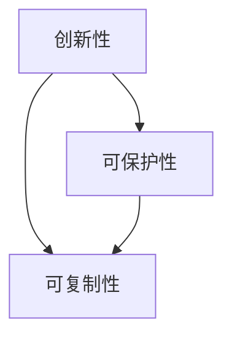

                 

# 彼得林奇如何看待公司的知识产权战略

## 关键词：彼得林奇，知识产权，公司战略，投资理念，创新保护，风险控制

## 摘要：  
彼得林奇作为世界著名投资家，他如何看待公司的知识产权战略？本文将从知识产权的基本概念、战略重要性、评估与实施、风险管理以及成功案例等方面进行深入分析。通过结合彼得林奇的投资理念，探讨知识产权在企业中的价值和作用，帮助企业制定有效的知识产权战略，提升核心竞争力。

---

## 第1章：知识产权的基本概念与重要性

### 1.1 知识产权的定义与核心要素  
知识产权是指人类在智力活动领域中创造的成果所享有的权利，主要包括专利权、商标权、版权、商业秘密等。知识产权的核心要素包括：  
- **创新性**：知识产权必须具有新颖性、创造性和实用性。  
- **可复制性**：知识产权可以通过技术手段快速复制和传播。  
- **可保护性**：知识产权可以通过法律手段进行保护，防止他人未经授权的使用。  

**图1-1：知识产权的核心要素关系图**  

### 1.2 知识产权在企业中的作用  
知识产权是企业的核心竞争力之一，具有以下重要作用：  
- **市场保护**：通过知识产权保护企业的产品和服务，防止竞争对手的模仿。  
- **价值创造**：知识产权可以带来直接的经济收益，如专利授权、商标许可等。  
- **品牌建设**：强大的知识产权布局可以提升企业的品牌形象和市场地位。  

### 1.3 彼得林奇与知识产权战略的关系  
彼得林奇的投资理念强调长期价值创造，他认为知识产权是企业长期竞争优势的重要来源。他倾向于投资那些在技术、品牌或商业模式上具有强大知识产权布局的企业。例如，他对科技企业的专利储备和医药企业的研发成果特别关注。

---

## 第2章：知识产权的评估与价值分析

### 2.1 知识产权的定量评估方法  
知识产权的价值评估需要结合定量和定性方法。以下是一个简单的专利价值评估模型：  

**公式1-1：专利价值评估公式**  
$$ V = \frac{R}{n} $$  
其中，\( V \) 表示每项专利的平均价值，\( R \) 表示总收益，\( n \) 表示专利数量。  

例如，假设某公司有10项专利，年收益为500万美元，则每项专利的平均价值为50万美元。  

### 2.2 知识产权的定性评估方法  
定性评估主要关注专利的质量和技术先进性。以下是专利质量评估标准：  

**表2-1：专利质量评估标准**  

| 评估维度       | 评估指标                 |  
|----------------|--------------------------|  
| 技术先进性       | 发明的创新性、技术复杂性   |  
| 市场适用性       | 专利的市场应用前景       |  
| 法律保护力度     | 专利的法律稳定性、保护范围 |  

### 2.3 知识产权与企业财务指标的关系  
知识产权对企业的财务表现有直接影响。例如：  
- **营业收入**：知识产权可以提高产品的市场竞争力，从而增加收入。  
- **净利润**：知识产权的授权使用可以带来额外的利润。  
- **股价**：强大的知识产权布局通常会提升投资者对企业的信心，从而推高股价。  

---

## 第3章：知识产权保护与风险管理

### 3.1 知识产权保护的法律框架  
知识产权的保护需要遵循相关法律法规。以下是主要的法律框架：  
- **专利法**：保护发明和实用新型。  
- **商标法**：保护品牌标识。  
- **版权法**：保护文学、艺术和软件作品。  

### 3.2 知识产权风险管理策略  
企业应采取以下措施应对知识产权风险：  
- **风险识别**：定期进行知识产权审计，识别潜在风险。  
- **风险应对**：通过法律手段保护知识产权，例如专利申请、商标注册等。  
- **风险管理**：建立知识产权风险管理机制，及时应对侵权行为。  

### 3.3 知识产权的全球布局  
随着全球化的发展，企业需要在国际范围内保护知识产权。以下是国际知识产权保护的主要机制：  
- **PCT国际专利申请**：通过世界知识产权组织提交国际专利申请。  
- **马德里商标国际注册**：通过马德里体系进行商标国际注册。  

---

## 第4章：彼得林奇投资中的知识产权战略案例

### 4.1 技术创新型企业的知识产权战略  
彼得林奇倾向于投资那些在技术领域具有强大知识产权布局的企业。例如，他对硅谷的科技企业特别关注其专利储备和技术创新能力。  

### 4.2 商业模式创新与知识产权保护  
彼得林奇认为，商业模式的创新同样需要知识产权保护。例如，他对互联网企业的商业模式和软件著作权给予高度关注。  

### 4.3 知识产权收购与整合  
彼得林奇还关注企业通过并购获取知识产权的行为。例如，他分析某公司通过收购一家技术公司获得其核心专利，从而增强了市场竞争力。  

---

## 第5章：知识产权战略与企业创新

### 5.1 知识产权战略如何促进企业创新  
知识产权战略可以激励企业进行技术创新，例如通过专利保护激励研发人员的积极性。  

### 5.2 企业创新中的知识产权管理  
企业需要在创新过程中同步进行知识产权管理，例如在研发阶段就开始进行专利布局。  

### 5.3 知识产权与企业核心竞争力  
知识产权是企业核心竞争力的重要组成部分，通过知识产权战略可以提升企业的市场地位和盈利能力。  

---

## 结语  
彼得林奇如何看待公司的知识产权战略？答案是：知识产权是企业长期竞争优势的重要来源。通过有效的知识产权战略，企业可以保护自身创新成果，提升市场竞争力，实现可持续发展。

---

## 作者：  
**AI天才研究院（AI Genius Institute）**  
专注于人工智能与计算机程序设计的研究与实践。  
如需进一步交流，请联系：[contact@aigeniusinstitute.com](mailto:contact@aigeniusinstitute.com)  
[LinkedIn](https://www.linkedin.com/company/aigeniusinstitute) | [Twitter](https://twitter.com/aigeniusinstitute)

