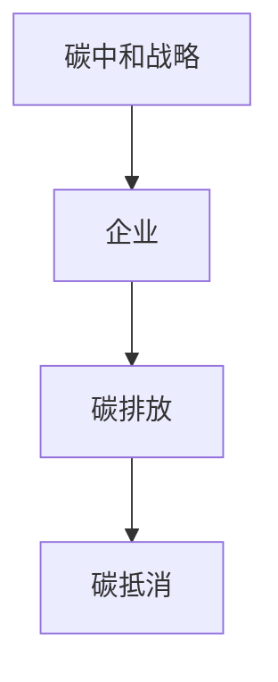
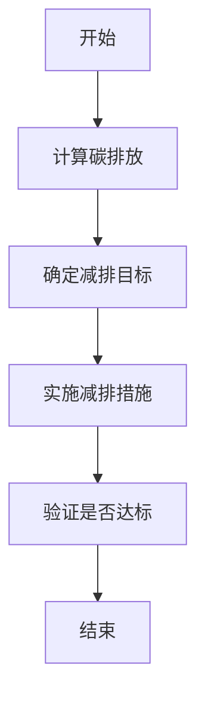
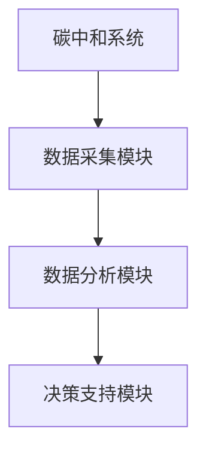

                 


# 彼得林奇如何看待公司的碳中和战略

## 关键词：碳中和战略，彼得林奇，企业社会责任，投资视角，风险管理

## 摘要：  
本文从彼得林奇的投资视角出发，深入分析了公司在制定碳中和战略时的关键因素，包括碳中和战略的核心概念、算法原理、数学模型、系统架构设计以及实际项目案例。文章结合技术背景和投资策略，为读者提供了全面的视角，帮助企业在实现碳中和的同时，提升投资回报和风险管理能力。

---

## 第一部分: 碳中和战略的背景与重要性

### 第1章: 碳中和战略的背景与核心概念

#### 1.1 碳中和的定义与背景  
- **碳中和的定义**：碳中和是指通过减少温室气体排放、增加碳汇等方式，使碳排放量与碳汇量相抵消，达到“净零排放”的目标。  
- **全球气候变化的背景**：全球气候变化导致极端天气频发，企业面临越来越大的环境压力和监管要求。  
- **碳中和对企业的意义**：碳中和不仅是企业社会责任的体现，也是提升企业竞争力的重要手段。  

#### 1.2 碳中和战略的核心要素  
- **减少碳排放的目标**：企业需要制定明确的减排目标，并通过技术创新和管理优化实现这些目标。  
- **可再生能源的利用**：通过增加风能、太阳能等可再生能源的使用比例，减少化石能源的依赖。  
- **碳抵消机制**：通过购买碳信用额或投资碳汇项目，抵消企业无法完全避免的碳排放。  

#### 1.3 彼得林奇的投资视角  
- **投资者的责任**：作为投资者，彼得林奇认为企业应该将碳中和纳入战略规划，以降低长期风险。  
- **碳中和对企业价值的影响**：碳中和不仅能够减少环境风险，还能提升企业的品牌形象和市场竞争力。  
- **碳风险与投资决策**：碳风险可能影响企业的财务状况和投资价值，投资者需要关注企业的碳中和进展。  

---

### 第2章: 碳中和战略的核心概念与联系

#### 2.1 碳中和战略的核心概念  
- **碳排放的计算**：碳排放量的计算需要考虑企业能源消耗、运输、供应链等多个方面。  
- **碳足迹的分析**：碳足迹是企业在整个生命周期中产生的温室气体排放的总和。  
- **碳中和的实现路径**：包括减少排放、增加碳汇、购买碳信用等多种方式。  

#### 2.2 核心概念的联系  
- **碳排放与企业运营的关系**：碳排放是企业运营的副产品，减少碳排放需要从生产流程、能源使用等方面入手。  
- **可持续发展与碳中和的关联**：碳中和是实现可持续发展的重要组成部分，两者相辅相成。  
- **碳中和战略的实施步骤**：包括制定目标、优化流程、引入新技术、监测和报告等。  

#### 2.3 ER实体关系图  


---

## 第二部分: 碳中和战略的算法原理

### 第3章: 碳中和战略的算法原理  

#### 3.1 碳排放计算模型  
- **碳排放的计算公式**：  
  $$ \text{碳排放} = \text{能源消耗} \times \text{排放因子} $$  
  例如，如果企业消耗100万千瓦时的电力，且排放因子为0.5（每千瓦时排放0.5公斤二氧化碳），则总碳排放为500公斤。  

#### 3.2 碳中和算法流程  


---

### 第4章: 数学模型与公式  

#### 4.1 碳排放强度模型  
- **碳排放强度公式**：  
  $$ \text{碳排放强度} = \frac{\text{总碳排放}}{\text{总产值}} $$  
  例如，企业年排放1000吨二氧化碳，年收入为10亿元，则碳排放强度为0.1吨/万元。  

#### 4.2 投资回报模型  
- **投资回报公式**：  
  $$ \text{投资回报} = \text{碳中和成本} \times \text{节约的环境成本} $$  
  例如，企业投资100万元用于可再生能源，节约环境成本50万元，则投资回报率为50%。  

---

### 第5章: 系统分析与架构设计  

#### 5.1 问题场景介绍  
- **问题场景**：企业需要制定碳中和战略，但缺乏数据支持和系统化的管理工具。  
- **项目介绍**：开发一个碳中和管理系统，帮助企业实现碳排放监测、分析和优化。  

#### 5.2 系统功能设计  


---

### 第6章: 项目实战  

#### 6.1 环境安装  
- **环境要求**：需要安装Python、数据库和相关开发工具。  

#### 6.2 核心实现代码  
```python
import pandas as pd
import numpy as np

# 计算碳排放
def calculate_carbon_emission(energy_consumption, emission_factor):
    return energy_consumption * emission_factor

# 确定减排目标
def set_emission_target(current_emission, reduction_target):
    return current_emission * (1 - reduction_target)

# 验证是否达标
def check_emission_goal(actual_emission, target_emission):
    return actual_emission <= target_emission
```

#### 6.3 代码解读与分析  
- **数据采集模块**：从企业运营数据中提取能源消耗和运输数据。  
- **数据分析模块**：计算碳排放并生成优化建议。  
- **决策支持模块**：提供减排措施和投资回报分析。  

#### 6.4 实际案例分析  
- **案例分析**：某制造企业通过引入可再生能源和优化生产流程，成功将碳排放降低了20%。  

---

## 第三部分: 最佳实践与总结

### 7章: 最佳实践与总结  

#### 7.1 最佳实践  
- **风险管理**：企业需要将碳风险纳入整体风险管理框架。  
- **技术创新**：通过技术创新降低碳排放成本。  
- **利益相关者沟通**：定期向投资者和公众披露碳中和进展。  

#### 7.2 小结  
彼得林奇的投资视角提醒我们，碳中和不仅是企业社会责任，也是提升企业竞争力的重要手段。  

#### 7.3 注意事项  
- **数据准确性**：碳排放计算需要准确的数据支持。  
- **持续改进**：碳中和是一个长期过程，需要持续优化。  

#### 7.4 拓展阅读  
建议阅读彼得林奇的相关著作，深入理解投资与可持续发展的关系。  

---

## 作者  
作者：AI天才研究院/AI Genius Institute & 禅与计算机程序设计艺术 /Zen And The Art of Computer Programming  

---

通过以上思考，我们系统地分析了彼得林奇如何看待公司的碳中和战略，结合技术背景和投资策略，为企业提供了实用的指导和建议。

