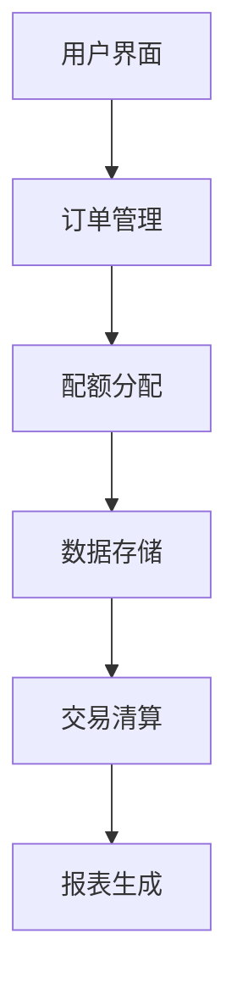

                 


# 彼得·林奇如何看待公司的碳交易策略

> 关键词：碳交易，彼得·林奇，投资策略，碳配额，碳信用，风险管理

> 摘要：本文从彼得·林奇的投资视角出发，分析碳交易策略的核心要素、算法原理、系统架构与实现，并通过项目实战与案例分析，深入探讨碳交易对企业战略的影响。文章结合理论与实践，提供详细的数学模型、系统架构图和代码实现，帮助读者全面理解碳交易的经济价值与风险管理。

---

## 第一部分：碳交易与公司战略的背景介绍

### 第1章：碳交易的基本概念与现状

#### 1.1 碳交易的定义与背景

##### 1.1.1 碳交易的定义
碳交易是指通过买卖碳配额或碳信用，实现碳排放权的市场化分配和交易。企业或个人可以通过购买碳配额或碳信用，抵消其碳排放量，从而达到减排目标。

##### 1.1.2 碳交易的起源与发展
碳交易起源于《京都议定书》的签订，该议定书要求发达国家减少温室气体排放，碳交易成为实现减排目标的重要工具。随着全球气候变化问题的加剧，碳交易市场规模迅速扩大。

##### 1.1.3 碳交易的全球现状与趋势
目前，全球碳交易市场规模已超过 trillion，主要集中在欧盟（EU Emissions Trading System）和美国（Regional Greenhouse Gas Initiative）。未来，碳交易将更加规范化，市场参与者将更加多元化。

#### 1.2 碳交易的核心要素

##### 1.2.1 碳排放与碳配额
碳排放是指企业或个人在生产或生活中产生的温室气体排放量。碳配额是政府或监管机构分配给企业的排放额度，企业可以买卖碳配额以满足减排目标。

##### 1.2.2 碳信用与碳抵消
碳信用是指通过实施减排项目（如植树造林、可再生能源项目）产生的碳减排量，可以用作碳抵消。碳抵消是指通过购买碳信用来抵消自身的碳排放量。

##### 1.2.3 碳市场的参与主体
碳市场的参与主体包括政府、企业、金融机构和个人。其中，企业是碳交易的主要参与者，金融机构则提供碳金融产品和服务。

#### 1.3 碳交易的经济与环境意义

##### 1.3.1 碳交易的经济价值
碳交易为企业提供了灵活的减排方式，降低减排成本。同时，碳交易也为金融机构提供了新的投资机会。

##### 1.3.2 碳交易对环境保护的作用
碳交易通过市场化手段激励企业减排，促进绿色技术的研发和应用，推动全球气候变化问题的解决。

##### 1.3.3 碳交易与企业社会责任
碳交易是企业履行社会责任的重要方式，通过减排行动，企业可以提升品牌形象，增强社会认可度。

---

### 第2章：碳交易的数学模型与算法原理

#### 2.1 碳定价模型

##### 2.1.1 碳配额价格的计算公式
碳配额价格可以通过以下公式计算：
$$ P = \alpha \times Q + \beta $$
其中，$P$ 是碳配额价格，$Q$ 是需求量，$\alpha$ 是价格弹性系数，$\beta$ 是基准价格。

##### 2.1.2 碳信用的评估模型
碳信用的价值可以通过以下公式评估：
$$ V = \gamma \times A + \delta \times T $$
其中，$V$ 是碳信用价值，$A$ 是减排项目成本，$T$ 是时间因素。

#### 2.2 碳交易的优化算法

##### 2.2.1 碳配额分配的线性规划模型
碳配额分配可以通过以下线性规划模型实现：
$$ \text{Minimize} \quad \sum_{i} c_i x_i $$
$$ \text{Subject to} \quad \sum_{i} x_i = D $$
其中，$c_i$ 是碳配额的成本，$x_i$ 是分配量，$D$ 是总需求。

##### 2.2.2 碳信用交易的动态规划算法
碳信用交易可以通过以下动态规划算法实现：
$$ V(t) = \max_{a} \{ R(a) + \beta V(t+1) \} $$
其中，$V(t)$ 是当前状态的价值，$R(a)$ 是行动收益，$\beta$ 是贴现率。

---

### 第3章：碳交易的系统架构与实现

#### 3.1 碳交易系统的功能模块

##### 3.1.1 碳配额管理模块
碳配额管理模块负责碳配额的分配、调整和监控。

##### 3.1.2 碳信用交易模块
碳信用交易模块负责碳信用的交易、结算和风险管理。

##### 3.1.3 数据分析与预测模块
数据分析与预测模块负责碳市场的数据收集、分析和预测，为企业提供决策支持。

#### 3.2 碳交易系统的架构设计

##### 3.2.1 系统架构图


#### 3.3 系统接口设计

##### 3.3.1 API接口定义
API接口定义包括碳配额查询、交易订单提交、结算通知等功能。

##### 3.3.2 接口安全设计
接口安全设计包括身份认证、权限控制和数据加密。

##### 3.3.3 接口性能优化
接口性能优化包括负载均衡、缓存机制和数据库优化。

---

### 第4章：碳交易的项目实战与案例分析

#### 4.1 项目环境安装

##### 4.1.1 系统环境要求
系统环境要求包括操作系统、编程语言和数据库版本。

##### 4.1.2 开发工具安装
开发工具安装包括Python、Jupyter Notebook、Git等工具的安装。

##### 4.1.3 数据库搭建
数据库搭建包括关系型数据库（如MySQL）和非关系型数据库（如MongoDB）的搭建。

#### 4.2 碳交易系统核心代码实现

##### 4.2.1 碳配额分配算法实现
```python
import numpy as np

def calculate_carbon_price(demand, alpha, beta):
    return alpha * demand + beta

# 示例数据
demand = 1000
alpha = 0.05
beta = 20

carbon_price = calculate_carbon_price(demand, alpha, beta)
print("Carbon Price:", carbon_price)
```

##### 4.2.2 碳信用评估模型实现
```python
import pandas as pd

def calculate_carbon_credit_value(cost, time_factor, gamma, delta):
    return gamma * cost + delta * time_factor

# 示例数据
cost = 1000
time_factor = 0.8
gamma = 0.5
delta = 0.3

carbon_credit_value = calculate_carbon_credit_value(cost, time_factor, gamma, delta)
print("Carbon Credit Value:", carbon_credit_value)
```

#### 4.3 案例分析

##### 4.3.1 案例背景介绍
某企业需要减少碳排放，通过碳交易购买碳配额或碳信用。

##### 4.3.2 案例实现步骤
1. 确定碳排放目标。
2. 选择碳配额或碳信用。
3. 计算碳配额价格或碳信用价值。
4. 实施碳交易。

##### 4.3.3 案例分析与总结
通过案例分析，企业可以优化碳交易策略，降低减排成本。

---

## 第五部分：最佳实践与总结

### 第5章：碳交易策略的优化与风险管理

#### 5.1 碳交易的最佳实践

##### 5.1.1 碳配额分配的优化策略
根据市场需求和企业实际情况，动态调整碳配额分配量。

##### 5.1.2 碳信用交易的风险管理
通过 diversification 和 hedging 等手段，降低碳信用交易的风险。

#### 5.2 碳交易的未来趋势

##### 5.2.1 碳交易的数字化与智能化
随着技术的发展，碳交易将更加依赖于人工智能和大数据技术。

##### 5.2.2 碳交易的全球化与合作
未来，碳交易将更加全球化，跨国合作将更加紧密。

### 第6章：总结与展望

#### 6.1 碳交易的核心价值
碳交易是实现全球气候变化目标的重要工具，具有经济和环境双重价值。

#### 6.2 碳交易的挑战与机遇
碳交易面临市场不完善、监管不力等挑战，但也为企业和个人提供了新的投资机会。

#### 6.3 未来的研究方向
未来的研究方向包括碳交易的数学模型优化、系统架构创新以及风险管理技术的提升。

---

## 作者信息

作者：AI天才研究院/AI Genius Institute & 禅与计算机程序设计艺术/Zen And The Art of Computer Programming

---

通过本文的详细分析，读者可以全面理解彼得·林奇看待碳交易策略的核心观点，并掌握碳交易的数学模型、系统架构与实现方法。希望本文能够为企业的碳交易策略提供有价值的参考和指导。

