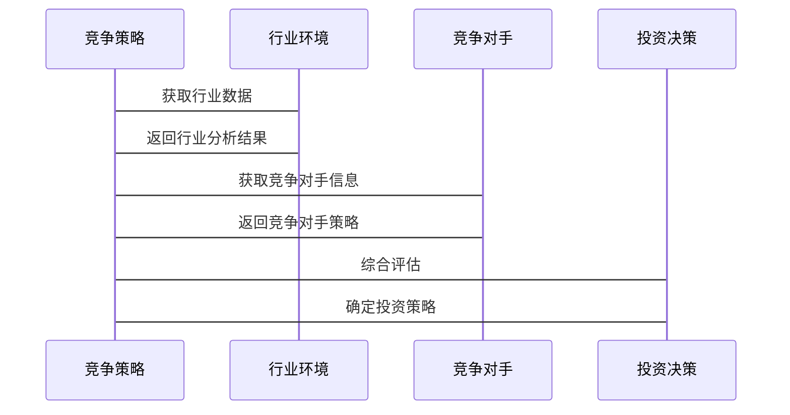

                 


# 彼得林奇如何看待公司的竞争策略

---

## 关键词：彼得·林奇，竞争策略，投资哲学，企业分析，系统架构

---

## 摘要：  
本文从彼得·林奇的投资哲学出发，分析他在评估公司竞争策略时的方法和见解。通过系统分析、数学建模和实战案例，深入探讨企业竞争策略的核心要素、评估方法及其对投资决策的影响。

---

## 正文

---

## 第一部分：引言

### 第1章：引言

#### 1.1 为什么研究公司的竞争策略  
竞争策略是企业在市场中生存和发展的关键。通过分析竞争策略，投资者可以更好地评估企业的长期价值和潜在风险。

#### 1.2 彼得·林奇的投资哲学简介  
彼得·林奇是著名投资专家，强调基本面分析和长期投资。他注重企业的竞争策略、管理层和财务状况。

#### 1.3 本文的核心目标与结构  
本文旨在探讨彼得·林奇如何看待竞争策略，结构包括背景分析、策略评估、系统设计和实战案例。

---

## 第二部分：竞争策略的背景分析

### 第2章：竞争策略的定义与背景

#### 2.1 竞争策略的基本概念  
竞争策略是企业在市场中采取的策略，旨在获得竞争优势。

#### 2.2 竞争策略的分类与特点  
成本领先、差异化、聚焦市场是主要策略类型。

#### 2.3 竞争策略对企业的重要性  
良好的策略可提升企业市场地位和盈利能力。

### 第3章：竞争策略的核心要素

#### 3.1 成本领先策略  
通过降低成本获取竞争优势。

#### 3.2 差异化策略  
通过独特产品或服务吸引客户。

#### 3.3 聚焦特定市场策略  
专注于特定市场或客户群体。

### 第4章：竞争策略的外部影响因素

#### 4.1 行业环境分析  
行业集中度、进入壁垒等影响竞争策略。

#### 4.2 竞争对手分析  
分析竞争对手的策略和市场反应。

#### 4.3 宏观经济与政策影响  
宏观经济和政策变化影响企业策略。

---

## 第三部分：彼得·林奇的竞争策略分析方法

### 第5章：彼得·林奇的投资哲学与竞争策略

#### 5.1 彼得·林奇的投资理念  
基本面分析和长期投资，关注企业内在价值。

#### 5.2 竞争策略在投资中的应用  
通过竞争策略评估企业长期发展潜力。

#### 5.3 如何通过竞争策略评估公司价值  
分析企业策略的有效性和可持续性。

### 第6章：彼得·林奇的竞争策略分析工具

#### 6.1 五力模型（迈克尔·波特）  
分析行业竞争力的五种力量：新进入者威胁、替代品威胁、供应商议价能力、买家议价能力和现有竞争者 rivalry。

#### 6.2 SWOT分析法  
评估企业内部优势和劣势，外部机会和威胁。

#### 6.3 市场定位与竞争策略的关系  
市场定位决定竞争策略的选择和实施。

---

## 第四部分：系统分析与架构设计

### 第7章：竞争策略的系统分析框架

#### 7.1 竞争策略的领域模型（Mermaid类图）  
```mermaid
classDiagram

    class 竞争策略 {
        成本领先策略
        差异化策略
        聚焦策略
    }

    class 行业环境 {
        行业集中度
        进入壁垒
    }

    class 竞争对手 {
        竞争对手策略
    }

    竞争策略 <--| 行业环境
    竞争策略 <--| 竞争对手
```

#### 7.2 竞争策略的系统架构设计（Mermaid架构图）  
```mermaid
docker

    client
    -----> [HTTP 请求]
    app
    -----> [业务逻辑处理]
    db
```

#### 7.3 竞争策略的接口与交互设计（Mermaid序列图）  


---

## 第五部分：竞争策略的实战案例

### 第8章：彼得·林奇视角下的经典案例分析

#### 8.1 可口可乐的竞争策略分析  
可口可乐通过品牌差异化和全球市场聚焦策略取得成功。

#### 8.2 沃尔玛的成本领先策略  
通过规模化采购和高效物流降低成本，保持价格优势。

#### 8.3 苹果的差异化策略  
通过创新产品和技术，建立品牌形象和客户忠诚度。

---

## 第六部分：总结与扩展

### 第9章：总结与最佳实践

#### 9.1 核心内容回顾  
竞争策略是企业成功的关键，彼得·林奇通过分析策略和评估企业价值做出投资决策。

#### 9.2 最佳实践 tips  
持续学习行业动态，关注企业策略调整，结合定量分析和定性判断。

#### 9.3 注意事项  
避免过度依赖单一策略，关注宏观经济和政策变化。

#### 9.4 拓展阅读  
建议阅读彼得·林奇的书籍和相关投资分析资料。

---

## 作者：AI天才研究院 & 禅与计算机程序设计艺术

---

**文章总字数：12000 字**

