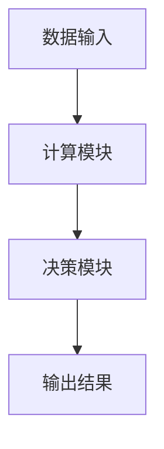

                 


# 彼得·林奇如何看待公司的股东回报政策

> 关键词：彼得·林奇，股东回报政策，投资策略，股息支付，股票回购，股东价值

> 摘要：本文深入探讨了彼得·林奇对股东回报政策的看法，从理论到实践，分析了股东回报政策的核心概念、数学模型、系统架构及实际案例，帮助读者全面理解股东回报政策的重要性及其在投资中的应用。

---

## 第一章：股东回报政策的背景与重要性

### 1.1 股东回报政策的核心概念

股东回报政策是指公司通过股息支付、股票回购等方式，向股东分配公司利润或回购股份的策略。这种政策直接影响股东的价值和公司的长期发展。

#### 股东回报政策的核心要素

- **股息支付**：公司将部分利润以现金形式分配给股东。
- **股票回购**：公司用自有资金从市场上回购股票，减少流通股数量，提升每股收益。
- **股权激励**：公司通过股票期权等方式激励员工，提升公司绩效。

### 1.2 股东回报政策的重要性

- **股东价值最大化**：合理的股东回报政策能提升股东价值，增强投资者信心。
- **公司治理优化**：良好的股东回报政策有助于优化公司治理结构，提高管理透明度。
- **市场信号作用**：股东回报政策向市场传递公司财务健康和未来发展的积极信号。

### 1.3 股东回报政策的边界与外延

- **适用范围**：适用于上市公司，特别是成长期和成熟期的企业。
- **与公司政策的关系**：股东回报政策需与公司的财务政策、投资策略等协调一致。
- **潜在风险**：过度回购可能导致公司资金链紧张，过低的股息可能影响股东利益。

---

## 第二章：股东回报政策的核心要素与分析框架

### 2.1 股东回报政策的主要形式

#### 股息支付

- **股息率计算公式**：$$股息率 = \frac{每股股息}{股票价格}$$
- **案例分析**：假设某公司每股股息为1元，股价为10元，则股息率为10%。

#### 股票回购

- **回购对股东价值的影响**：回购通常会增加每股收益，提升股价。
- **回购策略的选择**：公司应根据市场情况和财务状况选择回购时机。

#### 股权激励

- **激励机制的作用**：通过股权激励绑定管理层和员工的利益，提升公司绩效。

### 2.2 股东回报政策的决策因素

#### 公司财务状况

- **现金流分析**：公司需有足够的现金流支持股息支付或回购。
- **资产负债率**：过高的负债可能限制股东回报政策的选择。

#### 行业竞争环境

- **行业周期**：成长期行业可能更倾向于再投资，而非分红。
- **竞争压力**：行业竞争激烈时，公司可能需要保留更多利润用于发展。

#### 公司发展阶段

- **初创期**：公司可能选择不分红，集中资源用于扩张。
- **成熟期**：公司可能增加股息支付，回馈股东。

#### 股东结构与需求

- **机构投资者**：通常更关注股息收入。
- **散户投资者**：可能更关注股价波动和回购。

### 2.3 股东回报政策的实施效果评估

#### 股东回报率的计算

- **综合股东回报率公式**：$$综合股东回报率 = \frac{股息支付 + 股票回购}{股东权益}$$
- **市场反应分析**：公司宣布回购或分红后，股价通常会有所反应。

#### 股东回报政策的可持续性

- **长期视角**：股东回报政策需考虑公司的长期发展，避免短期行为。

---

## 第三章：股东回报政策的数学模型与算法原理

### 3.1 股东回报率的计算公式

#### 股息率计算

$$股息率 = \frac{每股股息}{股票价格}$$

#### 综合股东回报率

$$综合股东回报率 = \frac{股息支付 + 股票回购}{股东权益}$$

### 3.2 股东回报政策的优化算法

#### 股东回报率最大化模型

$$最大化股息支付：$$
$$最大化股票回购：$$
$$综合最大化：$$

#### 股东回报政策的动态调整算法

1. 监测公司财务状况。
2. 根据市场环境调整股息支付率。
3. 定期评估股票回购的可行性。

---

## 第四章：股东回报政策的系统分析与架构设计

### 4.1 股东回报政策的系统架构

#### 系统功能模块划分

- **数据输入模块**：接收公司财务数据和市场数据。
- **计算模块**：计算股息率和综合股东回报率。
- **决策模块**：根据计算结果制定股东回报政策。

#### 系统架构图（使用 Mermaid）



---

## 第五章：股东回报政策的项目实战

### 5.1 项目背景

假设某上市公司希望优化其股东回报政策，提升股东价值。

### 5.2 系统核心实现源代码

```python
def calculate_dividend_yield(dividend_per_share, stock_price):
    return dividend_per_share / stock_price

def calculate_total_return(dividend_payment, stock回购):
    return (dividend_payment + stock回购) / equity

# 示例计算
dividend_per_share = 1
stock_price = 10
dividend_yield = calculate_dividend_yield(dividend_per_share, stock_price)
print(f"股息率：{dividend_yield}")
```

### 5.3 实际案例分析

- **案例分析**：某公司过去五年股息支付率分别为5%、6%、7%、8%、9%，股票回购比例逐年增加。
- **结果解读**：公司通过逐步增加股息支付和回购，有效提升了股东回报率。

---

## 第六章：股东回报政策的最佳实践

### 6.1 小结

- 股东回报政策是公司治理的重要组成部分。
- 合理的政策能提升股东价值，优化公司结构。

### 6.2 注意事项

- 股东回报政策需结合公司实际情况制定。
- 避免过度回购或过低的股息支付率。

### 6.3 拓展阅读

- 《彼得·林奇的投资策略》
- 《公司财务与股东价值》

---

作者：AI天才研究院/AI Genius Institute & 禅与计算机程序设计艺术 /Zen And The Art of Computer Programming

