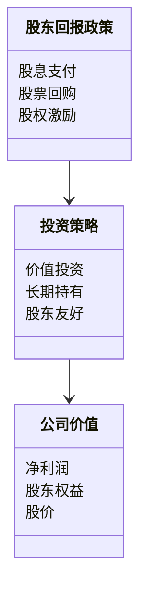
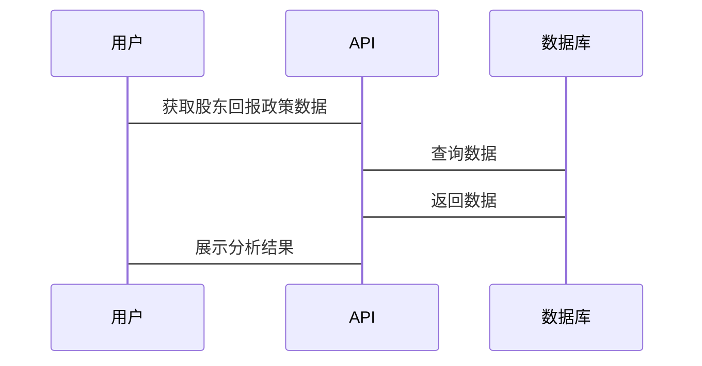
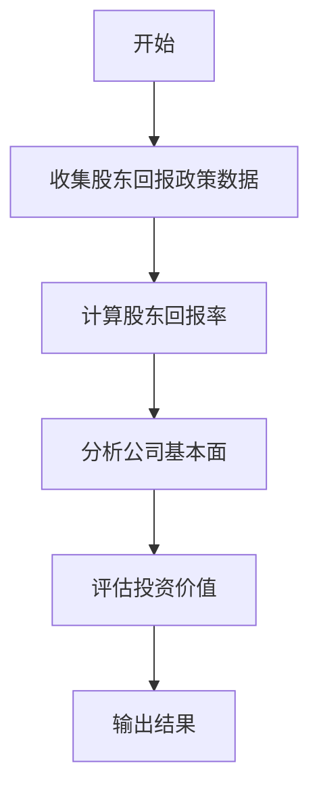

                 


# 彼得林奇如何看待公司的股东回报政策演变

## 关键词：彼得·林奇，股东回报政策，投资策略，公司治理，股票回购，股息支付

## 摘要：本文深入分析了彼得·林奇对股东回报政策的演变及其影响，结合其投资理念，探讨股东回报政策的类型、影响因素及未来趋势。通过实际案例和系统架构设计，揭示股东回报政策对公司价值和投资者决策的关键作用。

---

## 第1章: 股东回报政策的基本概念

### 1.1 股东回报政策的定义

#### 1.1.1 股东回报的定义
股东回报是指公司向股东分配的收益，包括股息、股票回购、股权激励等形式。这些回报直接反映了公司对股东价值的重视。

#### 1.1.2 股东回报政策的分类
- 股息支付：公司定期向股东分配利润。
- 股票回购：公司用自有资金从市场上回购股票，减少流通股数量。
- 股权激励：公司通过授予员工股票期权或限制性股票等方式激励员工。

#### 1.1.3 股东回报政策的重要性
股东回报政策是公司治理的核心内容之一，直接影响股东的满意度和公司的市场价值。

### 1.2 股东回报政策的核心要素

#### 1.2.1 股东回报的来源
- 净利润：公司盈利是股东回报的主要来源。
- 现金流：健康的现金流支持持续的股东回报。

#### 1.2.2 股东回报政策的制定主体
- 董事会：负责制定和调整股东回报政策。
- 管理层：执行董事会的决策，确保政策的实施。

#### 1.2.3 股东回报政策的实施方式
- 定期股息支付：按季度或年度分配利润。
- 特殊股息支付：在特定事件下进行一次性分配。
- 股票回购计划：定期从市场上回购股票，减少流通股。

### 1.3 股东回报政策与公司治理的关系

#### 1.3.1 公司治理的基本概念
公司治理是确保公司有效运作和股东利益最大化的制度安排，包括董事会结构、高管职责和股东权利。

#### 1.3.2 股东回报政策在公司治理中的地位
股东回报政策是公司治理的重要组成部分，反映了公司对股东责任的履行。

#### 1.3.3 股东回报政策对公司价值的影响
有效的股东回报政策可以提升公司市值，增强投资者信心，进而促进公司长期发展。

---

## 第2章: 彼得·林奇的投资理念

### 2.1 彼得·林奇的生平简介

#### 2.1.1 彼得·林奇的早期经历
彼得·林奇是美国著名投资家，曾管理富达麦哲伦基金，创造了卓越的投资业绩。

#### 2.1.2 彼得·林奇的投资生涯
他以价值投资闻名，注重基本面分析，寻找被低估的股票。

#### 2.1.3 彼得·林奇的投资哲学
- 长期投资：避免频繁交易，追求长期稳定的回报。
- 价值投资：寻找基本面良好、估值合理的公司。

### 2.2 彼得·林奇的投资策略

#### 2.2.1 价值投资的基本原则
- 选择具有持续盈利能力的公司。
- 关注公司财务健康状况。
- 考虑行业地位和竞争优势。

#### 2.2.2 彼得·林奇的选股标准
- 低市盈率：寻找价格低于内在价值的股票。
- 高ROE：关注股东权益回报率高的公司。
- 稳定的盈利能力：公司收入和利润持续增长。

#### 2.2.3 彼得·林奇对股东回报的重视
- 股息支付：他倾向于选择能够稳定支付股息的公司。
- 股票回购：公司回购股票可以提高股东回报。

### 2.3 彼得·林奇对股东回报政策的看法

#### 2.3.1 股东回报政策的重要性
彼得·林奇认为，合理的股东回报政策能够提升公司股价，增强投资者信心。

#### 2.3.2 彼得·林奇对股息政策的态度
他倾向于选择那些能够稳定支付股息的公司，认为这反映了公司的财务健康和管理者的股东友好态度。

#### 2.3.3 彼得·林奇对股票回购的看法
他认可股票回购作为回报股东的一种方式，但强调要与公司的财务状况和未来发展相结合。

---

## 第3章: 股东回报政策的演变

### 3.1 股东回报政策的历史发展

#### 3.1.1 早期股东回报政策的特点
早期公司更注重留存收益，股东回报较少，主要通过股息支付。

#### 3.1.2 20世纪80年代至90年代的演变
随着资本市场的成熟，股票回购和多样化的股东回报方式逐渐兴起。

#### 3.1.3 21世纪以来的新趋势
技术进步和全球化背景下，股东回报政策更加灵活，注重股东价值的最大化。

### 3.2 彼得·林奇时代股东回报政策的特点

#### 3.2.1 股息支付的调整
彼得·林奇在其投资生涯中，关注那些能够稳定支付股息的公司。

#### 3.2.2 股票回购的兴起
随着公司现金流的充裕，股票回购成为重要的股东回报方式。

#### 3.2.3 股东回报与公司成长的平衡
彼得·林奇强调，在回报股东的同时，公司需要保持持续的盈利能力。

### 3.3 股东回报政策的未来趋势

#### 3.3.1 全球化背景下的股东回报政策
跨国公司需要考虑不同市场的股东需求，制定全球统一的回报政策。

#### 3.3.2 数字经济时代的新挑战
数字技术改变了企业的盈利模式，股东回报政策需要适应新的经济环境。

#### 3.3.3 可持续发展与股东回报的关系
可持续发展理念的兴起，使得股东回报政策更加注重长期价值创造。

---

## 第4章: 股东回报政策的类型与分析

### 4.1 股东回报的主要形式

#### 4.1.1 股息支付
股息支付是最传统的股东回报方式，反映了公司对股东的直接回报。

#### 4.1.2 股票回购
股票回购通过减少流通股数量，提高每股收益，间接增加股东价值。

#### 4.1.3 股权激励
股权激励通过授予员工股票期权，将员工利益与公司价值绑定，提升公司凝聚力。

#### 4.1.4 其他形式的股东回报
包括特别股息、资产剥离等，用于在特定情况下回报股东。

### 4.2 股东回报政策的优缺点分析

#### 4.2.1 股息支付的优缺点
- 优点：直接回报股东，增强股东信心。
- 缺点：可能影响公司再投资能力。

#### 4.2.2 股票回购的优缺点
- 优点：提高每股收益，增强股价吸引力。
- 缺点：可能增加财务杠杆，影响公司抗风险能力。

#### 4.2.3 股权激励的优缺点
- 优点：激励员工，提升公司绩效。
- 缺点：可能导致短期行为，忽视长期发展。

### 4.3 股东回报政策的比较与选择

#### 4.3.1 不同回报形式的适用场景
- 股息支付适用于盈利稳定的企业。
- 股票回购适用于现金流充裕的企业。
- 股权激励适用于成长期的科技企业。

#### 4.3.2 如何选择最适合的回报政策
结合公司财务状况、发展阶段和市场环境，综合考虑不同回报形式的优缺点。

#### 4.3.3 彼得·林奇的偏好与实践
彼得·林奇倾向于选择那些能够稳定支付股息且具备回购股票能力的公司。

---

## 第5章: 影响股东回报政策的因素

### 5.1 公司财务状况的影响

#### 5.1.1 净利润与股东回报的关系
净利润是股东回报的主要来源，净利润越高，股东回报能力越强。

#### 5.1.2 资产负债率与股东回报的关联
过高的资产负债率可能限制公司的股息支付和股票回购能力。

#### 5.1.3 现金流对股东回报的影响
健康的现金流是持续回报股东的基础。

### 5.2 行业特点与竞争环境的影响

#### 5.2.1 不同行业股东回报政策的差异
成熟行业更倾向于股息支付，而成长行业可能更注重股票回购。

#### 5.2.2 竞争环境对公司回报政策的影响
激烈的竞争可能迫使公司减少股东回报，优先投入研发和市场拓展。

#### 5.2.3 行业周期对股东回报的影响
行业周期波动会影响公司的盈利能力和股东回报政策。

### 5.3 宏观经济环境的影响

#### 5.3.1 经济周期与股东回报的关系
经济繁荣时，股东回报政策可能更加慷慨；经济衰退时，可能需要调整。

#### 5.3.2 利率政策对股东回报的影响
低利率环境可能降低股票回购成本，增加股东回报。

#### 5.3.3 财政政策对股东回报的影响
税收政策的变化会影响股东回报的实际收益。

---

## 第6章: 彼得林奇投资策略的系统架构设计

### 6.1 问题场景介绍

#### 6.1.1 问题背景
分析彼得·林奇如何通过股东回报政策选择投资标的，构建投资组合。

#### 6.1.2 问题目标
设计一个系统，模拟彼得·林奇的投资策略，分析股东回报政策对公司价值的影响。

### 6.2 项目介绍

#### 6.2.1 项目目标
模拟彼得·林奇的投资策略，分析股东回报政策对公司价值的影响。

#### 6.2.2 项目范围
包括数据收集、模型构建、案例分析和结果展示。

### 6.3 系统功能设计

#### 6.3.1 领域模型（Mermaid 类图）


#### 6.3.2 系统架构设计（Mermaid 架构图）


#### 6.3.3 系统接口设计
- 输入：股东回报政策数据
- 输出：投资价值评估结果
- 接口：RESTful API

#### 6.3.4 系统交互设计（Mermaid 序列图）


### 6.4 核心算法实现

#### 6.4.1 算法原理（Mermaid 流程图）


#### 6.4.2 算法实现代码
```python
import pandas as pd
import numpy as np

def calculate_return_policy(company_data):
    # 计算股息支付率
    dividend_yield = company_data['股息'] / company_data['净利润']
    # 计算股票回购率
    stock_repurchase = company_data['回购金额'] / company_data['流通股']
    # 计算股权激励比例
    equity_incentive = company_data['激励支出'] / company_data['净利润']
    return dividend_yield, stock_repurchase, equity_incentive

# 示例数据
company_data = {
    '股息': 10,
    '净利润': 50,
    '回购金额': 20,
    '流通股': 100,
    '激励支出': 15
}

dividend_yield, stock_repurchase, equity_incentive = calculate_return_policy(company_data)
print(f"股息支付率: {dividend_yield}")
print(f"股票回购率: {stock_repurchase}")
print(f"股权激励比例: {equity_incentive}")
```

#### 6.4.3 数学公式
股东回报率计算公式：
$$
\text{股东回报率} = \frac{\text{股息} + \text{回购金额} + \text{激励支出}}{\text{总股本}}
$$

### 6.5 实际案例分析

#### 6.5.1 案例背景
以彼得·林奇投资的某公司为例，分析其股东回报政策。

#### 6.5.2 数据分析
使用上述算法计算股东回报率，评估投资价值。

#### 6.5.3 结果展示
通过图表展示股东回报政策对公司股价的影响。

---

## 第7章: 结论与展望

### 7.1 结论

#### 7.1.1 彼得·林奇的股东回报政策观点总结
彼得·林奇重视股东回报政策，倾向于选择那些能够稳定支付股息且具备回购股票能力的公司。

#### 7.1.2 股东回报政策的重要性
股东回报政策是公司治理的重要组成部分，直接影响公司价值和投资者信心。

#### 7.1.3 本文的主要发现
通过系统架构设计和算法分析，揭示了股东回报政策对公司价值的深远影响。

### 7.2 未来展望

#### 7.2.1 股东回报政策的创新
随着技术进步和全球经济的变化，股东回报政策将更加多样化和灵活。

#### 7.2.2 可持续发展与股东回报的结合
未来，股东回报政策将更加注重可持续发展，平衡短期回报与长期价值创造。

#### 7.2.3 技术在股东回报分析中的应用
人工智能和大数据技术将被广泛应用于股东回报政策的分析和优化。

---

## 作者：AI天才研究院/AI Genius Institute & 禅与计算机程序设计艺术 /Zen And The Art of Computer Programming

