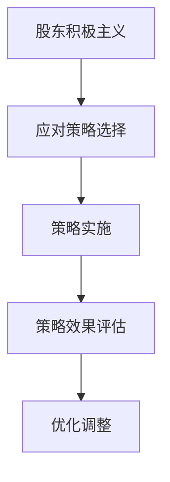
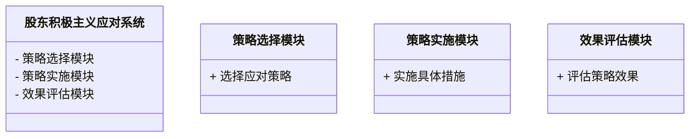
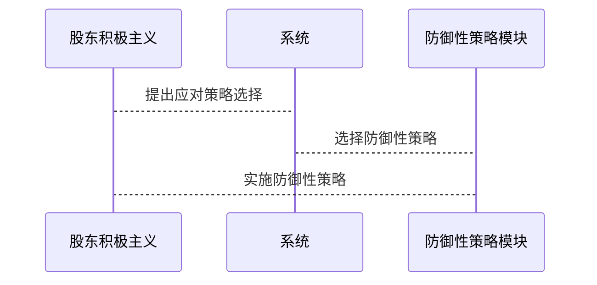

                 

# 彼得林奇如何看待公司的股东积极主义应对策略有效性

> 关键词：彼得·林奇，股东积极主义，公司治理，投资策略，股东价值，企业战略

> 摘要：本文从彼得·林奇的视角出发，分析股东积极主义的定义、核心概念、策略分析、有效性评估、应对策略及系统架构设计。通过详细讲解股东积极主义的背景、理论基础、实现路径和数学模型，结合实际案例分析，探讨企业如何制定有效的应对策略以最大化股东价值。文章最后总结了股东积极主义的实践经验和未来研究方向。

---

## 第1章: 股东积极主义的背景与发展

### 1.1 股东积极主义的定义与背景

股东积极主义是指股东通过主动参与公司治理，推动企业实现战略目标、优化治理结构、提升企业价值的一种投资策略。其核心在于股东不仅仅是资本提供者，更是企业治理的积极参与者。

#### 1.1.1 股东积极主义的定义

股东积极主义强调股东在企业治理中的主动角色，通过行使投票权、参与董事会决策、推动管理层变革等方式，实现企业价值的最大化。这种策略不同于传统的被动投资，更注重长期价值的创造。

#### 1.1.2 股东积极主义的历史发展

股东积极主义起源于20世纪60年代，随着机构投资者的崛起，逐渐成为企业治理的重要组成部分。近年来，随着环境、社会和治理（ESG）投资的兴起，股东积极主义的重要性愈发凸显。

#### 1.1.3 当前股东积极主义的现状

当前，股东积极主义已成为全球投资领域的热点话题。越来越多的投资者通过行使股东权利，推动企业在可持续发展、公司治理和股东价值等方面实现改进。

---

### 1.2 股东积极主义的核心概念

股东积极主义涉及多个核心概念，包括股东权利、企业治理、投资策略等。

#### 1.2.1 股东积极主义的主体与客体

- **主体**：股东，尤其是机构投资者和大型基金。
- **客体**：公司董事会、管理层和公司政策。

#### 1.2.2 股东积极主义的主要目标

- 提升企业治理水平。
- 优化公司战略。
- 实现股东价值最大化。

#### 1.2.3 股东积极主义的边界与外延

- 边界：股东积极主义不干预企业的日常运营，仅限于战略层面的参与。
- 外延：涵盖公司治理、ESG投资、股东权益保护等多个方面。

---

### 1.3 股东积极主义与股东activism的区别

#### 1.3.1 股东积极主义的特征

- 长期导向。
- 通过合作推动变革。
- 强调企业治理的优化。

#### 1.3.2 股东activism的特点

- 短期导向。
- 通过对抗推动变革。
- 强调股东权益的直接实现。

#### 1.3.3 两者的核心区别与联系

- 区别：股东积极主义注重长期合作，股东activism注重短期对抗。
- 联系：两者都强调股东在企业治理中的作用，但策略和目标不同。

---

## 第2章: 股东积极主义的有效性分析

### 2.1 股东积极主义的策略分析

#### 2.1.1 股东积极主义的主要策略

- 提案提交：推动特定议案的通过。
- 股东提议：通过股东大会提出改进建议。
- 股东协商：与管理层直接沟通，推动变革。

#### 2.1.2 各种策略的优缺点对比

| 策略 | 优点 | 缺点 |
|------|------|------|
| 提案提交 | 影响力大 | 成本高 |
| 股东提议 | 成本低 | 影响力有限 |
| 股东协商 | 高效 | 易受管理层抵制 |

---

### 2.2 股东积极主义的案例分析

#### 2.2.1 成功案例分析

以某知名科技公司为例，股东通过提交提案，成功推动了公司治理结构的优化，提升了企业价值。

#### 2.2.2 失败案例分析

某制造公司因股东提议未得到管理层支持，最终未能实现预期目标。

#### 2.2.3 案例总结与启示

成功的股东积极主义案例通常需要股东与管理层的良好沟通和合作。

---

### 2.3 股东积极主义对企业价值的影响

#### 2.3.1 正面影响分析

- 提升企业治理水平。
- 优化公司战略。
- 提高股东信心。

#### 2.3.2 负面影响分析

- 增加企业治理成本。
- 可能引发管理层与股东的冲突。

#### 2.3.3 综合影响评估

股东积极主义总体上对企业价值有正面影响，但需注意策略的选择和实施。

---

## 第3章: 股东积极主义的应对策略

### 3.1 应对策略的分类

#### 3.1.1 防御性策略

- 提前制定公司章程，限制股东提议的空间。
- 建立董事会多数席位，确保控制权。

#### 3.1.2 协作性策略

- 与股东保持良好沟通，理解其诉求。
- 主动提出改进方案，降低股东提议的可能性。

#### 3.1.3 抵制性策略

- 对股东提议进行抵制，通过法律途径解决问题。
- 聘请专业顾问团队，制定应对方案。

---

### 3.2 应对策略的实施步骤

#### 3.2.1 策略制定

- 分析股东诉求，制定应对方案。
- 确定策略类型，如防御、协作或抵制。

#### 3.2.2 策略执行

- 实施具体措施，如与股东协商或提交反驳提案。
- 监测策略效果，及时调整。

#### 3.2.3 策略评估与优化

- 定期评估策略效果，总结经验教训。
- 根据市场变化，优化应对策略。

---

### 3.3 应对策略的数学模型与分析

#### 图3-1: 应对策略的数学模型图

---

## 第4章: 股东积极主义的系统分析与架构设计

### 4.1 问题场景介绍

#### 4.1.1 问题背景

股东积极主义已成为企业治理的重要挑战，企业需要制定有效的应对策略。

#### 4.1.2 问题目标

通过系统设计，为企业提供应对股东积极主义的有效解决方案。

#### 4.1.3 问题约束

- 系统需具备灵活性和可扩展性。
- 需考虑不同企业的具体需求。

---

### 4.2 系统功能设计

#### 图4-1: 系统功能领域模型图

---

### 4.3 系统架构设计

#### 图4-2: 系统架构设计图

---

### 4.4 系统接口设计

#### 图4-3: 系统接口设计图

---

## 第5章: 项目实战——股东积极主义应对策略的实现

### 5.1 项目背景与目标

以某制造公司为例，应对股东积极主义的挑战，制定有效的应对策略。

### 5.2 项目实施步骤

1. 分析股东诉求，制定应对方案。
2. 实施协作性策略，与股东保持良好沟通。
3. 定期评估策略效果，优化调整。

---

## 第6章: 总结与展望

### 6.1 总结

股东积极主义是企业治理的重要组成部分，企业需制定有效的应对策略，以最大化股东价值。

### 6.2 未来研究方向

- 研究股东积极主义在不同行业中的应用。
- 探讨技术手段在股东积极主义中的应用。

---

## 作者信息

作者：AI天才研究院/AI Genius Institute & 禅与计算机程序设计艺术 /Zen And The Art of Computer Programming

---

通过以上分析，我们可以得出结论：股东积极主义的有效性取决于企业的应对策略，企业应根据自身情况选择合适的策略，以实现长期价值最大化。

