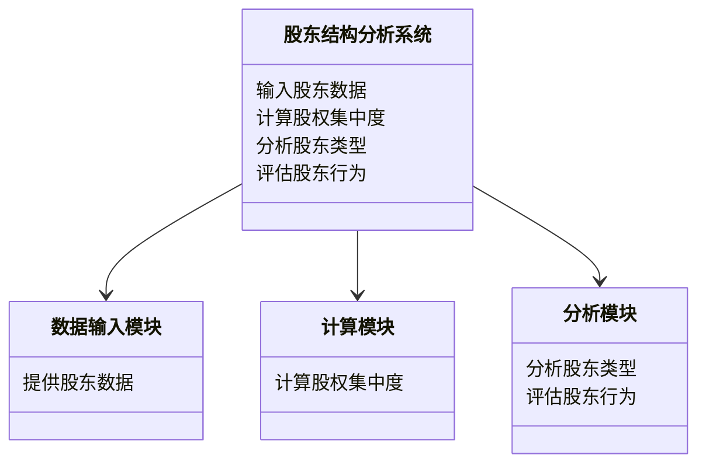

                 


# 彼得林奇如何看待公司的股东结构

## 关键词
- 彼得·林奇
- 股东结构
- 公司治理
- 股权分析
- 投资策略

## 摘要
本文探讨了彼得·林奇如何分析公司的股东结构，从背景、核心概念到数学模型和实际案例，详细解析其分析方法和投资策略。文章通过定义、分析工具、数学模型、系统架构和项目实战，展示了如何利用股东结构信息评估公司价值。

---

# 第一部分：股东结构的基本概念与背景

## 第1章：股东结构的定义与背景

### 1.1 股东结构的基本概念

#### 1.1.1 股东的定义与分类
- **股东**：公司的一部分所有者，按持有股份享有权利和承担义务。
- **分类**：
  - **大股东**：持股比例高，对公司治理有重大影响。
  - **小股东**：持股比例低，对公司治理影响较小。
  - **机构股东**：如基金、保险公司等，注重长期投资。
  - **个人股东**：散户投资者，关注短期收益。

#### 1.1.2 股东结构的定义与特征
- **定义**：公司股东的构成、比例和分布。
- **特征**：
  - 股权集中度：反映大股东的影响力。
  - 股东多样性：涵盖不同类型投资者。

#### 1.1.3 股东结构在公司治理中的重要性
- 影响公司决策、战略制定和管理效率。
- 股权集中度高可能导致控制权集中，分散则可能引发治理混乱。

### 1.2 彼得·林奇的背景介绍

#### 1.2.1 彼得·林奇的生平与投资理念
- 著名投资家，管理富达麦哲伦基金，创造卓越业绩。
- 重视基本面分析，关注公司财务状况和管理团队。

#### 1.2.2 彼得·林奇与股东结构研究的关联
- 股东结构影响公司稳定性，是其分析的重要部分。

#### 1.2.3 彼得·林奇的投资哲学与股东结构分析的关系
- 通过分析股东结构，评估公司的稳定性和管理质量。

---

## 第2章：股东结构的核心要素

### 2.1 股东结构的核心组成

#### 2.1.1 大股东与小股东的定义与区别
- **大股东**：持股比例高，对公司治理有直接影响。
- **小股东**：持股比例低，对公司治理影响有限。

#### 2.1.2 股权集中与分散的特征分析
- **股权集中**：大股东比例高，决策权集中。
- **股权分散**：小股东比例高，决策权分散。

#### 2.1.3 股东权利与义务的结构化分析
- **权利**：投票权、分红权、剩余收益权。
- **义务**：遵守公司章程，承担有限责任。

### 2.2 股东类型与特征对比

#### 2.2.1 国内股东与国际股东的对比
- **国内股东**：受本地法规影响，关注市场稳定性。
- **国际股东**：关注全球市场，投资策略国际化。

#### 2.2.2 机构股东与个人股东的特征分析
- **机构股东**：理性投资，注重长期收益。
- **个人股东**：感性投资，关注短期收益。

#### 2.2.3 战略投资者与财务投资者的区别
- **战略投资者**：长期投资，寻求战略协同。
- **财务投资者**：短期投资，追求财务回报。

### 2.3 股东结构与公司治理的关系

#### 2.3.1 股东结构对公司治理的影响
- 股权集中度高，治理效率高，但可能引发关联交易风险。

#### 2.3.2 股东结构与公司治理效率的关系
- 高股权集中度可能提高效率，但也可能引发权力滥用。

#### 2.3.3 股东结构对公司战略的影响
- 股东结构影响公司战略选择和执行。

---

## 第3章：彼得·林奇视角下的股东结构分析方法

### 3.1 彼得·林奇的股东结构分析框架

#### 3.1.1 分析框架的构建逻辑
- 从股权集中度、股东类型、股东行为等方面分析。

#### 3.1.2 分析框架的核心要素
- 股权集中度、股东类型、股东行为。

#### 3.1.3 分析框架的应用场景
- 判断公司治理风险，评估公司稳定性。

### 3.2 彼得·林奇的股东结构分析工具

#### 3.2.1 股东结构分析的常用工具
- 股权集中度指标、股东分类分析、股东行为分析。

#### 3.2.2 工具选择的注意事项
- 根据公司特点选择合适的工具。

### 3.3 彼得·林奇的股东结构分析流程

#### 3.3.1 分析流程的步骤分解
1. 收集股东信息。
2. 计算股权集中度。
3. 分析股东类型。
4. 评估股东行为。

#### 3.3.2 流程中的关键节点
- 股权集中度计算、股东分类、股东行为评估。

#### 3.3.3 流程优化的建议
- 结合具体公司情况调整分析步骤。

---

# 第二部分：股东结构分析的数学模型与算法

## 第4章：股东结构分析的数学模型

### 4.1 股权集中度的数学模型

#### 4.1.1 股权集中度的定义与计算公式
- **定义**：公司前几大股东的持股比例之和。
- **公式**：$$\text{股权集中度} = \sum_{i=1}^{n} \frac{s_i}{S}$$
  - \(s_i\)：第i大股东的持股数。
  - \(S\)：公司总股本。

#### 4.1.2 股权集中度的指标体系
- 单一最大股东比例、前五大股东比例。

#### 4.1.3 股权集中度与公司治理效率的关系
- 高集中度可能提高效率，但也可能引发治理问题。

### 4.2 股东价值评估的数学模型

#### 4.2.1 股东价值评估的定义与方法
- **定义**：评估股东的长期价值。
- **方法**：DCF模型、市盈率法。

#### 4.2.2 股东价值的计算公式
- DCF模型：$$\text{企业价值} = \sum_{t=1}^{n} \frac{CF_t}{(1 + r)^t}$$
  - \(CF_t\)：第t年的自由现金流。
  - \(r\)：折现率。

#### 4.2.3 股东价值评估与股东结构的关系
- 股东结构影响企业价值，合理结构提升价值。

---

## 第5章：系统分析与架构设计方案

### 5.1 问题场景介绍

#### 5.1.1 问题背景
- 分析股东结构，评估公司治理和投资价值。

#### 5.1.2 项目介绍
- 构建股东结构分析系统，帮助投资者评估公司。

### 5.2 系统功能设计

#### 5.2.1 领域模型设计
- 使用Mermaid类图展示系统各模块。



### 5.3 系统架构设计

#### 5.3.1 系统架构设计
- 使用Mermaid架构图展示系统架构。


---

## 第6章：项目实战

### 6.1 环境安装

#### 6.1.1 安装Python环境
- 安装Python 3.8及以上版本。
- 安装必要的库：pandas、numpy、scipy。

### 6.2 系统核心实现源代码

#### 6.2.1 股权集中度计算代码

```python
import pandas as pd

def calculate_shares_concentration(shares_data):
    total_shares = shares_data.sum()
    shares_concentration = {}
    cumulative = 0
    sorted_shares = sorted(shares_data, reverse=True)
    for i, share in enumerate(sorted_shares):
        cumulative += share / total_shares
        shares_concentration[f"前{i+1}大股东"] = cumulative
        if cumulative >= 0.5:
            break
    return shares_concentration

# 示例数据
shares = [0.45, 0.25, 0.15, 0.05, 0.05]
shares_series = pd.Series(shares)
result = calculate_shares_concentration(shares_series)
print(result)
```

#### 6.2.2 股东类型分析代码

```python
import pandas as pd

def analyze_shareholder_type(shares_data, threshold=0.05):
    large_shareholders = []
    medium_shareholders = []
    small_shareholders = []
    others = []
    for share in shares_data:
        if share > 0.25:
            large_shareholders.append(share)
        elif share > 0.15:
            medium_shareholders.append(share)
        elif share > threshold:
            small_shareholders.append(share)
        else:
            others.append(share)
    return {
        "大股东": large_shareholders,
        "中股东": medium_shareholders,
        "小股东": small_shareholders,
        "其他": others
    }

# 示例数据
shares = [0.3, 0.18, 0.12, 0.08, 0.05, 0.02, 0.02, 0.02]
result = analyze_shareholder_type(shares)
print(result)
```

### 6.3 代码应用解读与分析

#### 6.3.1 股权集中度计算代码解读
- **功能**：计算前n大股东的股权集中度。
- **步骤**：输入股东持股数据，计算并输出结果。

#### 6.3.2 股东类型分析代码解读
- **功能**：根据持股比例将股东分类。
- **步骤**：输入股东数据，分类输出。

### 6.4 实际案例分析与详细讲解剖析

#### 6.4.1 案例选择
- 分析微软或苹果的股东结构。

#### 6.4.2 数据收集
- 获取公司股东数据。

#### 6.4.3 数据分析
- 计算股权集中度，分析股东类型。

### 6.5 项目小结

#### 6.5.1 核心实现总结
- 成功构建股东结构分析系统。

#### 6.5.2 系统功能总结
- 提供股权集中度计算和股东类型分析功能。

#### 6.5.3 系统性能总结
- 高效处理股东数据，提供准确分析结果。

---

## 第7章：最佳实践 tips、小结、注意事项、拓展阅读

### 7.1 小结

#### 7.1.1 股东结构分析的核心要点
- 股权集中度、股东类型、股东行为。

#### 7.1.2 彼得·林奇分析方法的总结
- 结合股东结构分析，评估公司治理和投资价值。

### 7.2 注意事项

#### 7.2.1 数据来源的可靠性
- 确保数据准确，避免错误分析。

#### 7.2.2 分析工具的选择
- 根据需求选择合适的工具和方法。

#### 7.2.3 分析结果的应用
- 结合其他因素，全面评估公司。

### 7.3 拓展阅读

#### 7.3.1 推荐书籍
- 《彼得·林奇的成功投资》
- 《公司治理与股东结构》

#### 7.3.2 相关论文
- 股东结构与公司绩效研究。

---

# 作者：AI天才研究院 & 禅与计算机程序设计艺术

