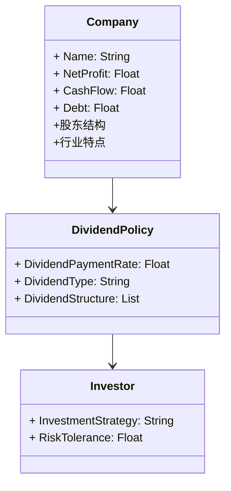
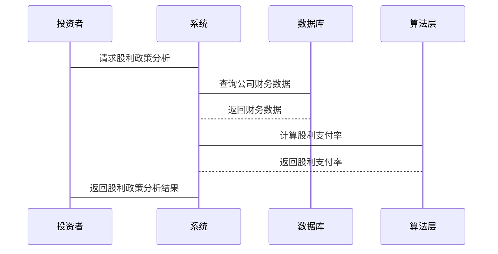

                 


# 彼得林奇如何看待公司的股利政策

> 关键词：彼得·林奇，股利政策，投资策略，价值投资，股利支付率，公司治理

> 摘要：本文深入探讨了彼得·林奇如何分析和看待公司的股利政策，结合其投资理念，分析了股利政策的核心概念、影响因素以及实际应用。通过详细讲解股利政策的决定因素、彼得·林奇的分析框架、案例分析和系统设计，本文为投资者提供了实用的指导和建议。

---

# 第一部分：股利政策的背景与重要性

## 第1章：股利政策的核心概念

### 1.1 股利政策的定义与类型

#### 1.1.1 股利政策的定义

股利政策是指公司对其利润分配方式所采取的策略，包括股利支付率、股利发放方式等。股利政策是公司治理中的重要组成部分，直接影响到公司的价值和股东的权益。

#### 1.1.2 股利政策的主要类型

股利政策可以分为以下几种类型：

- **固定股利政策**：公司每年按固定金额分配股利，无论利润多少。
- **固定股利增长政策**：股利逐年按固定比例增长。
- **可变股利政策**：根据公司利润情况调整股利分配。
- **高股利政策**：公司分配较高的股利，吸引注重收益的投资者。
- **低股利政策**：公司保留更多利润用于再投资，适合成长型企业。

#### 1.1.3 股利政策的影响因素

股利政策的制定受到多种因素的影响，包括：

- **公司盈利能力**：盈利能力强的公司能够支付较高的股利。
- **财务状况**：公司现金流是否充足，影响股利支付能力。
- **行业特点**：不同行业的利润模式和资金需求不同，影响股利政策。
- **股东结构**：不同类型的股东对股利的需求不同。
- **公司发展阶段**：初创期公司可能选择低股利政策，而成熟期公司可能选择高股利政策。

### 1.2 股利政策在公司治理中的作用

#### 1.2.1 股利政策与公司价值的关系

股利政策直接影响公司的市场价值。高股利支付率的公司通常会被视为低风险投资，从而提高公司价值。

#### 1.2.2 股利政策与股东权益的保护

合理的股利政策能够保护股东权益，避免公司过度分配利润导致财务危机。

#### 1.2.3 股利政策与公司长期发展的平衡

公司需要在股利分配和再投资之间找到平衡，确保公司长期发展和股东利益的双赢。

---

## 第2章：彼得·林奇的投资理念与股利政策

### 2.1 彼得·林奇的投资哲学

#### 2.1.1 投资的长期视角

彼得·林奇强调长期投资，注重公司基本面分析，寻找具有持续增长潜力的公司。

#### 2.1.2 价值投资的核心原则

价值投资的核心是寻找市场价格低于内在价值的公司，股利政策是公司内在价值的重要组成部分。

#### 2.1.3 股利政策在投资决策中的重要性

彼得·林奇认为，股利政策能够反映公司的财务健康状况和管理团队的股利分配策略，是投资决策的重要依据。

### 2.2 彼得·林奇对股利政策的重视

#### 2.2.1 股利政策与投资回报的关系

高股利支付率的公司通常能够提供稳定的回报，尤其是对于注重收益的投资者。

#### 2.2.2 高股息率股票的投资价值

彼得·林奇偏好高股息率的股票，认为这些股票通常具有稳定的收益和较低的风险。

#### 2.2.3 股利政策与公司财务健康状况的关联

通过分析股利政策，彼得·林奇能够判断公司的财务健康状况和管理团队的股利分配策略。

---

# 第二部分：股利政策的分析框架

## 第3章：股利政策的决定因素

### 3.1 公司财务状况的分析

#### 3.1.1 净利润与股利支付能力

净利润是公司利润分配的基础，净利润越高，股利支付能力越强。

#### 3.1.2 自由现金流与股利分配

自由现金流是公司用于股利分配和再投资的重要资金来源。

#### 3.1.3 负债水平与股利政策的关系

高负债公司通常会限制股利分配，以保证偿债能力。

### 3.2 行业特点与股利政策

#### 3.2.1 不同行业对股利政策的影响

例如，公用事业行业通常具有稳定的收益和较高的股利支付率，而高科技行业可能更注重再投资。

#### 3.2.2 行业周期性与股利政策的调整

周期性行业在高峰期可能增加股利分配，而在衰退期可能减少或暂停分配。

#### 3.2.3 行业竞争格局对股利政策的影响

垄断行业的公司可能因为高利润而倾向于高股利政策，而竞争激烈的行业可能更注重再投资。

### 3.3 股东结构与股利政策

#### 3.3.1 股东类型对股利政策的影响

机构投资者通常更注重长期收益和公司治理，而个人投资者可能更关注股利收益。

#### 3.3.2 股东需求与股利分配的平衡

公司需要在不同股东的需求之间找到平衡，确保股利政策的公平性和合理性。

#### 3.3.3 股东权益保护与股利政策的关系

合理的股利政策能够保护股东权益，避免公司过度分配利润导致财务危机。

## 第4章：彼得·林奇的股利政策分析框架

### 4.1 投资者如何分析股利政策

#### 4.1.1 股利支付率的计算与

股利支付率 = （股利总额 / 净利润）× 100%

#### 4.1.2 股利支付率的合理性分析

分析股利支付率是否合理，需要结合公司的盈利能力和财务状况。

#### 4.1.3 股利政策与公司成长性的平衡

公司需要在股利分配和再投资之间找到平衡，确保公司长期发展和股东利益的双赢。

### 4.2 彼得·林奇的股利政策分析方法

#### 4.2.1 股利支付率的稳定性分析

分析公司股利支付率的稳定性，判断公司财务状况的稳定性。

#### 4.2.2 股利政策与行业特点的匹配

分析公司的股利政策是否与其所处行业的特点相匹配。

#### 4.2.3 股利政策与公司治理结构的关联

分析公司的股利政策是否与其治理结构相匹配，判断公司管理团队的股利分配策略。

---

# 第三部分：股利政策的系统分析与架构设计

## 第5章：系统分析与架构设计方案

### 5.1 问题场景介绍

股利政策的分析需要综合考虑公司财务状况、行业特点和股东结构等多个因素。

### 5.2 系统功能设计

#### 5.2.1 领域模型Mermaid类图



#### 5.2.2 系统架构设计Mermaid架构图


#### 5.2.3 系统接口设计

系统接口包括：

- 股利政策查询接口
- 股利支付率计算接口
- 股利政策分析接口

#### 5.2.4 系统交互Mermaid序列图



---

## 第6章：项目实战

### 6.1 环境安装

需要安装Python和相关数据分析库（如Pandas、NumPy）。

### 6.2 系统核心实现源代码

以下是一个简单的股利支付率计算代码：

```python
import pandas as pd

# 假设df是包含公司财务数据的DataFrame
# 计算股利支付率
df['DividendPaymentRate'] = (df['股利总额'] / df['净利润']) * 100

# 展示结果
print(df[['Name', 'DividendPaymentRate']])
```

### 6.3 代码应用解读与分析

通过上述代码，投资者可以快速计算出公司的股利支付率，并根据结果判断公司的股利政策是否合理。

### 6.4 实际案例分析和详细讲解剖析

以某公司为例，假设其净利润为1000万元，股利总额为200万元，则股利支付率为20%。彼得·林奇会进一步分析公司的行业特点、财务状况和股东结构，判断该股利政策是否合理。

### 6.5 项目小结

通过实际案例分析，投资者可以更好地理解股利政策的分析方法，并能够在实际投资中灵活运用。

---

# 第四部分：总结与启示

## 第7章：总结与启示

### 7.1 投资者如何制定股利政策

投资者需要结合公司财务状况、行业特点和股东结构，综合分析股利政策的合理性。

### 7.2 投资中的注意事项

- 重视股利政策的长期影响
- 结合公司基本面分析股利政策
- 注意行业特点和公司发展阶段

### 7.3 拓展阅读

建议投资者阅读彼得·林奇的《股市长线法宝》等书籍，深入理解股利政策在投资中的重要性。

---

# 作者：AI天才研究院/AI Genius Institute & 禅与计算机程序设计艺术 /Zen And The Art of Computer Programming

