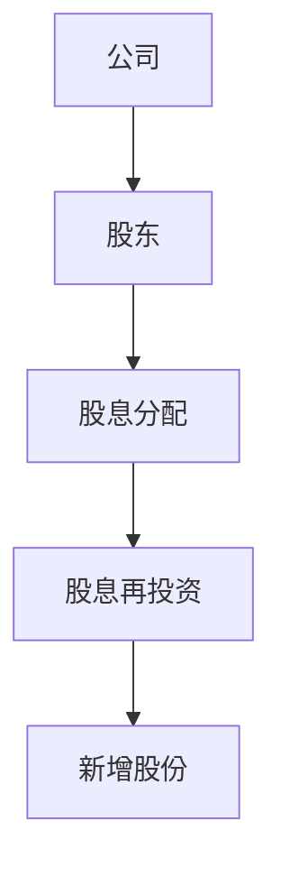
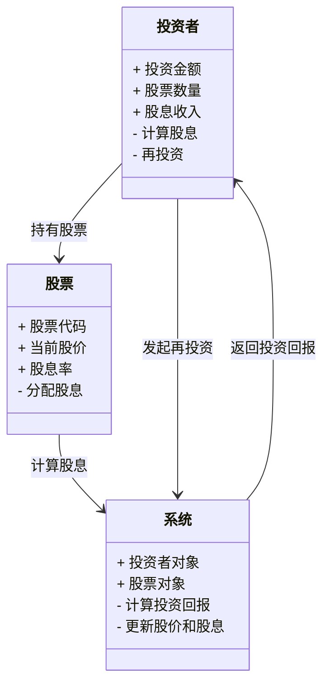

                 

<think>
好的，我现在需要按照用户的要求，逐步撰写一篇关于“彼得·林奇如何看待公司的股息再投资计划对长期回报的影响”的技术博客文章。用户已经提供了详细的目录大纲和结构，我需要按照这个结构一步步展开内容。

首先，我需要明确文章的结构：

1. **标题和关键词**
2. **摘要**
3. **目录大纲**

接下来，我需要为每个章节编写详细的内容，确保逻辑清晰、结构紧凑、语言简洁易懂。

---

### 第1章：股息再投资计划的核心概念

#### 1.1 股息再投资计划的定义与背景

在这个部分，我需要解释什么是股息再投资计划（DRIP），它的历史背景，以及它在投资中的重要性。我还需要提到彼得·林奇对这种方法的看法，特别是他如何强调长期投资和复利效应的重要性。

**示例内容：**

彼得·林奇是美国著名的投资经理，以其在富达基金的长期成功而闻名。他主张长期投资，尤其是那些能够持续增长并派发股息的公司。股息再投资计划（Dividend Reinvestment Plan，DRIP）允许投资者将收到的股息自动用于购买更多的公司股票，而无需支付额外的交易费用。这种策略不仅简化了投资流程，还通过复利效应增加了长期回报。

---

#### 1.2 股息再投资计划的核心要素

在这个部分，我需要详细说明DRIP的关键要素，包括股息分配机制、再投资路径、风险与收益，以及在财务报表中的体现。

**示例内容：**

DRIP的核心机制是将股息直接转换为更多的股票，而不是以现金形式发放。这种方法避免了现金股息可能导致的再投资延迟问题，并且通常免收佣金，降低了投资成本。此外，DRIP还允许投资者在不追加资金的情况下，逐步增加其持有的股票数量，从而实现资产的长期增值。

---

### 第2章：股息再投资计划的原理与机制

#### 2.1 股息再投资计划的原理

在这里，我需要解释DRIP的基本原理，包括复利效应和股东权益的关系。

**示例内容：**

DRIP的原理基于复利效应。每期收到的股息被用于购买更多的股票，这些新增的股票在未来又会产生更多的股息收入，从而形成一个正向循环。彼得·林奇认为，这种逐步积累的方式能够帮助投资者在长期实现财富增长，尤其是在市场波动较大时，DRIP能够帮助投资者逐步建仓，摊低成本。

---

#### 2.2 核心概念对比表

我需要制作一个对比表，比较DRIP与其他投资策略的优缺点。

**示例对比表：**

| 概念           | 定义                                                                 | 特点                                                                 | 优缺点                                                                 |
|----------------|----------------------------------------------------------------------|----------------------------------------------------------------------|------------------------------------------------------------------------|
| 股息再投资计划 | 将股息用于购买更多股票，实现复利增长                                 | 无需支付佣金，自动再投资，长期收益高                                       | 初期流动性差，适合长期投资者                                             |
| 现金股息         | 将股息以现金形式分配给股东                                           | 现金回报快，适合需要流动性的投资者                                         | 无法享受股价上涨带来的收益，可能在市场上涨时错失复利机会               |

---

#### 2.3 ER实体关系图

我需要使用Mermaid绘制一个ER图，展示公司、股东、股息和投资的关系。

**ER实体关系图：**



---

### 第3章：股息再投资计划的数学模型与公式

#### 3.1 复利计算模型

我需要解释复利计算公式，并给出一个示例。

**公式：**

$$
\text{最终价值} = \text{初始投资} \times (1 + r)^n
$$

其中，\( r \) 是年收益率，\( n \) 是年数。

**示例计算：**

假设初始投资为100元，年收益率为5%，投资10年：

$$
100 \times (1 + 0.05)^{10} \approx 162.89 \text{元}
$$

---

### 第4章：系统分析与架构设计方案

#### 4.1 系统功能设计

我需要设计一个系统来跟踪DRIP的效果，包括功能模块和类图。

**类图：**



---

### 第5章：项目实战

#### 5.1 实际案例分析

我需要选择一个具体的公司，分析其DRIP的效果，并提供代码实现。

**示例代码：**

```python
import pandas as pd
import numpy as np

def calculate_dividend_reinvestment(initial_investment, dividend_yield, years):
    """
    计算股息再投资的回报
    :param initial_investment: 初始投资金额
    :param dividend_yield: 股息率
    :param years: 投资年数
    :return: 最终价值
    """
    investment = initial_investment
    for _ in range(years):
        # 计算股息收入
        dividends = investment * dividend_yield
        # 再投资购买更多股票
        investment += dividends
    return investment

# 示例计算
initial_investment = 1000  # 初始投资1000元
dividend_yield = 0.05      # 股息率5%
years = 10                 # 投资10年

final_value = calculate_dividend_reinvestment(initial_investment, dividend_yield, years)
print(f"最终价值：{final_value:.2f}元")
```

---

### 第6章：最佳实践与总结

#### 6.1 最佳实践

我需要总结DRIP的成功关键点，包括选择优质公司、长期持有、定期审查投资组合等。

**示例内容：**

彼得·林奇强调，选择股息稳定增长的公司是DRIP成功的关键。投资者应选择那些具有强大盈利能力和良好股息政策的公司。此外，长期持有和定期审查投资组合也是确保DRIP效果的重要因素。

---

#### 6.2 总结

DRIP是一种强大的投资工具，通过复利效应帮助投资者实现长期财富增长。彼得·林奇的DRIP策略提醒我们，投资不仅是数字游戏，更是一种长期的价值积累过程。

---

### 作者信息

作者：AI天才研究院/AI Genius Institute & 禅与计算机程序设计艺术 /Zen And The Art of Computer Programming

---

现在，我可以根据以上结构，逐步展开每个部分，撰写完整的博客文章。

