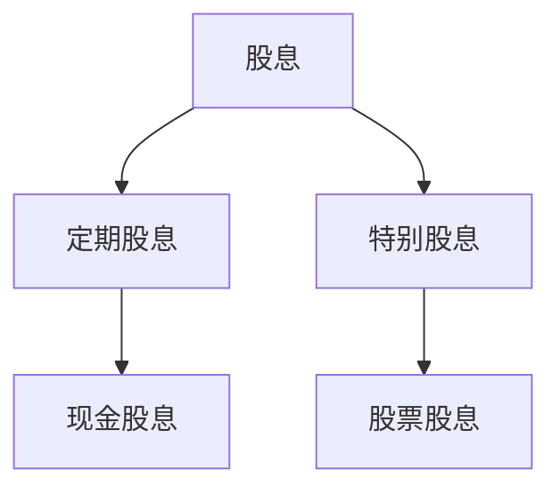
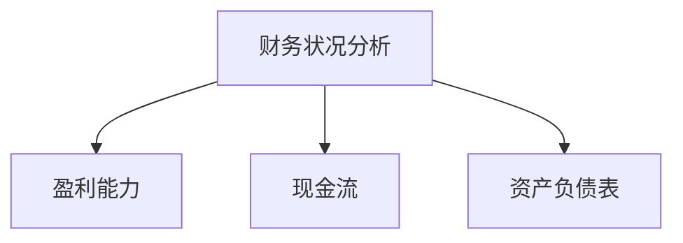
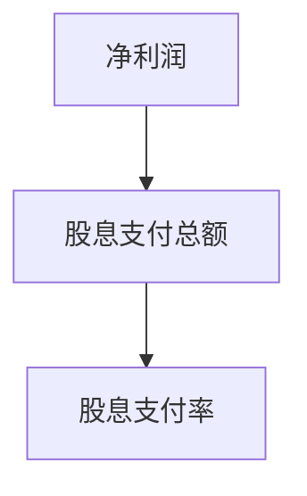
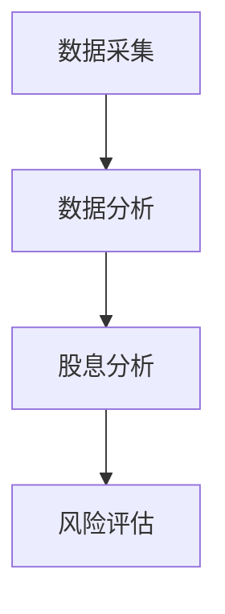
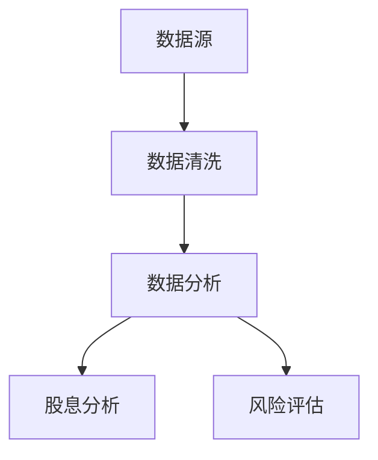
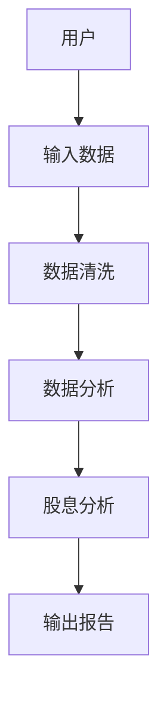

                 


# 彼得林奇如何看待公司的股息可持续性

## 关键词：股息可持续性，彼得·林奇，投资策略，股息分析，企业价值

## 摘要：本文深入探讨了彼得·林奇对股息可持续性的看法，结合股息投资的基本概念、影响股息可持续性的因素、股息分析的数学模型，以及系统架构设计等内容，全面解析了彼得·林奇的投资理念和股息分析方法。通过具体案例分析，展示了如何应用这些方法进行实际投资决策。

---

# 第一部分: 股息投资的背景与概念

## 第1章: 股息投资的背景与概念

### 1.1 股息投资的基本概念

#### 1.1.1 股息的定义与分类

股息是公司分配给股东的利润部分，通常以现金或股票形式支付。股息可以分为定期股息和特别股息，定期股息是公司按固定周期支付的股息，特别股息是在特定情况下额外支付的股息。

**mermaid图示：**



#### 1.1.2 股息投资的历史发展

股息投资起源于早期的资本主义经济，随着金融市场的成熟，股息投资逐渐成为一种重要的投资策略。20世纪，股息投资在巴菲特、彼得·林奇等投资大师的推动下，得到了进一步的发展和普及。

#### 1.1.3 股息投资的核心理念

股息投资的核心理念是通过投资于那些能够稳定或持续增长股息的公司，从而实现长期稳定的收益。投资者关注的是公司的股息支付能力、财务健康状况以及行业前景。

### 1.2 彼得·林奇的背景与投资理念

#### 1.2.1 彼得·林奇的生平简介

彼得·林奇（Peter Lynch）是美国著名的投资经理人，被誉为“股票投资之父”。他在富达投资集团管理麦哲伦基金期间，取得了卓越的投资业绩，基金资产从1977年的1600万美元增长到1990年的140亿美元。

#### 1.2.2 林奇的投资风格与核心思想

林奇的投资风格以选股为核心，注重分析公司的基本面，寻找那些具有竞争优势、管理良好且财务健康的公司。他强调分散投资，避免将所有资金投入单一行业或公司。

#### 1.2.3 林奇对股息投资的独特见解

林奇认为，股息是公司财务健康的重要指标，稳定的股息支付能力反映了公司的盈利能力和财务稳定性。然而，他更关注公司的成长性和股息的可持续增长，而不是单纯追求高股息率。

---

## 第2章: 股息可持续性的核心概念

### 2.1 股息可持续性的定义与特征

#### 2.1.1 股息可持续性的定义

股息可持续性是指公司在未来能够持续支付股息的能力，通常取决于公司的盈利状况、现金流、财务杠杆和行业环境等因素。

#### 2.1.2 可持续股息的特征分析

- **盈利稳定性**：公司具有稳定的盈利能力，能够覆盖股息支出。
- **现金流健康**：公司具备健康的现金流，能够支撑股息支付。
- **债务水平**：公司债务负担合理，不会影响股息支付能力。
- **行业前景**：公司所在行业具有良好的发展前景，能够支撑公司的持续增长。

#### 2.1.3 股息可持续性与企业价值的关系

股息可持续性与企业价值密切相关。持续的股息支付能力反映了公司的财务健康和盈利能力，能够提升公司的市场价值和股东信心。

### 2.2 影响股息可持续性的主要因素

#### 2.2.1 财务状况分析

- **盈利能力**：公司净利润是否足以支付股息。
- **现金流**：公司自由现金流是否充足。
- **资产负债表**：公司的资产状况和负债水平是否健康。

**mermaid图示：**



#### 2.2.2 行业环境与竞争格局

- **行业前景**：行业是否具有增长潜力。
- **竞争格局**：公司在行业中的竞争力和市场地位。

#### 2.2.3 公司治理结构

- **管理层能力**：公司管理层的素质和决策能力。
- **公司治理**：公司治理结构是否透明和有效。

#### 2.2.4 宏观经济环境的影响

- **经济周期**：经济周期对行业和公司的影响。
- **政策环境**：政府政策和法规对行业的影响。

---

## 第3章: 股息可持续性的分析框架

### 3.1 股息支付率与股息增长模型

#### 3.1.1 股息支付率的计算与分析

股息支付率是指公司实际支付的股息占净利润的比例。计算公式为：

$$ 股息支付率 = \frac{股息支付总额}{净利润} $$

**mermaid图示：**



#### 3.1.2 股息增长模型的应用

股息增长模型用于预测公司未来股息的增长情况，常用的模型包括股息增长模型（DDM）和股息贴现模型（DCF）。

**数学公式：**

$$ DDM：P = \frac{D_1}{r - g} $$

其中：
- \( D_1 \) 是第一期的股息
- \( r \) 是折现率
- \( g \) 是股息增长率

#### 3.1.3 股息支付率与股息增长的关系

股息支付率高并不一定意味着股息能够持续增长，关键在于公司的盈利能力和现金流状况。合理的股息支付率和股息增长相结合，才能确保股息的可持续性。

---

## 第4章: 股息可持续性与企业价值评估

### 4.1 股息在企业价值评估中的作用

#### 4.1.1 股息作为企业价值的核心指标

股息是衡量公司财务健康和盈利能力的重要指标，能够反映公司的盈利能力和股息支付能力。

#### 4.1.2 股息与企业成长性的平衡

公司需要在股息支付和企业成长之间找到平衡点，既要保证股东的收益，又要支持企业的持续增长。

#### 4.1.3 股息政策与股东价值最大化

合理的股息政策能够提高股东价值，但过度支付股息可能会损害公司的长期发展。

### 4.2 林奇对股息可持续性的独特分析方法

#### 4.2.1 林奇的“三重过滤法”在股息分析中的应用

- **第一重过滤**：筛选出具有稳定股息支付能力的公司。
- **第二重过滤**：分析公司的盈利能力和现金流状况。
- **第三重过滤**：评估公司的行业前景和竞争优势。

#### 4.2.2 林奇对企业盈利能力和股息支付能力的双重关注

林奇不仅关注公司的当前股息支付能力，还关注公司的盈利能力和现金流状况，以确保股息的可持续增长。

#### 4.2.3 林奇对行业周期性与股息政策的结合分析

林奇会综合考虑行业周期性对股息政策的影响，选择那些在行业周期波动中依然能够保持股息支付能力的公司。

---

## 第5章: 股息可持续性的系统分析与架构设计

### 5.1 系统分析框架

#### 5.1.1 问题场景介绍

股息可持续性分析是一个复杂的过程，需要综合考虑公司的财务状况、行业环境、公司治理等多个因素。

#### 5.1.2 项目介绍

通过构建一个股息可持续性分析系统，帮助投资者快速评估公司的股息支付能力。

#### 5.1.3 系统功能设计

- **数据采集**：收集公司的财务数据、行业信息等。
- **数据分析**：分析公司的盈利能力、现金流、资产负债表等。
- **股息分析**：计算股息支付率、股息增长模型等。
- **风险评估**：评估公司的财务风险和行业风险。

**mermaid图示：**



#### 5.1.4 系统架构设计

**mermaid图示：**



#### 5.1.5 系统接口设计

- **输入接口**：接收公司的财务数据和行业信息。
- **输出接口**：输出股息支付能力评估报告。

#### 5.1.6 系统交互流程

**mermaid图示：**



---

## 第6章: 项目实战

### 6.1 环境安装

#### 6.1.1 安装Python和相关库

```bash
pip install numpy pandas matplotlib
```

### 6.2 系统核心实现源代码

```python
import numpy as np
import pandas as pd
import matplotlib.pyplot as plt

# 数据加载
df = pd.read_csv('dividend_data.csv')

# 股息支付率计算
dividend_payout_ratio = df['股息支付总额'] / df['净利润']

# 股息增长模型应用
def calculate_ddm(dividend, growth_rate, discount_rate):
    return dividend / (discount_rate - growth_rate)

# 示例计算
dividend = 1.0
growth_rate = 0.05
discount_rate = 0.08
value = calculate_ddm(dividend, growth_rate, discount_rate)
print(f"股票价值：{value}")
```

### 6.3 代码应用解读与分析

上述代码展示了如何使用Python进行股息支付率计算和股息增长模型的应用。通过具体的数据分析，可以帮助投资者更好地理解公司的股息支付能力和股息增长潜力。

### 6.4 实际案例分析

以苹果公司为例，分析其股息政策和可持续性：

1. **股息支付率分析**：苹果公司近年来股息支付率稳定，显示出良好的财务状况。
2. **股息增长模型应用**：通过DDM模型计算苹果公司的股票价值。

### 6.5 项目小结

通过项目实战，我们可以看到股息可持续性分析的实际应用价值，以及如何利用技术手段辅助投资决策。

---

## 第7章: 最佳实践

### 7.1 小结

股息可持续性是投资决策中的重要因素，通过系统的分析和评估，可以帮助投资者选择那些具有稳定股息支付能力和良好成长性的公司。

### 7.2 注意事项

- **数据准确性**：确保数据来源可靠。
- **模型适用性**：根据实际情况选择合适的分析模型。
- **风险控制**：合理分散投资，降低风险。

### 7.3 拓展阅读

- 《彼得·林奇的投资哲学》
- 《股息投资实战指南》
- 《财务报表分析与投资决策》

---

## 作者：AI天才研究院/AI Genius Institute & 禅与计算机程序设计艺术 /Zen And The Art of Computer Programming

---

通过本文的分析，我们可以看到彼得·林奇对股息可持续性的深刻理解，以及如何将这些理念应用到实际投资中。希望本文能够为投资者提供有价值的参考和启示。

