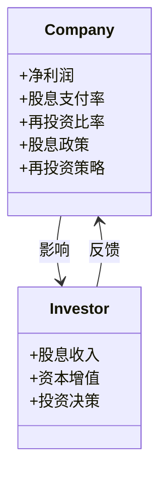
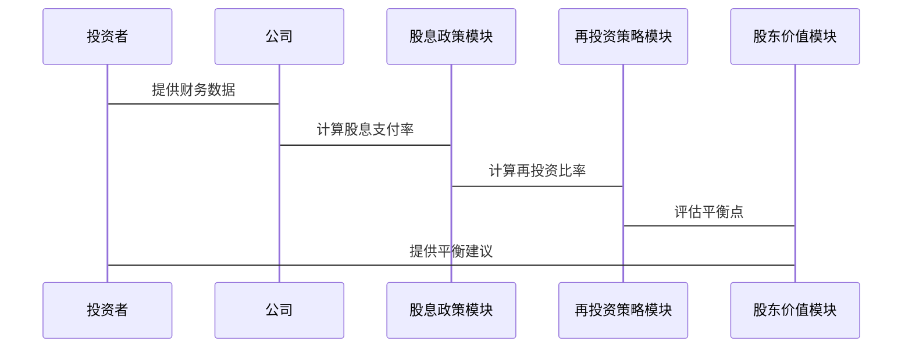
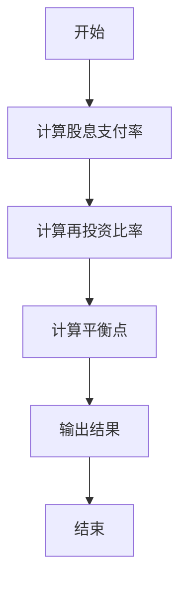

                 


# 彼得林奇如何看待公司的股息政策与再投资平衡

> 关键词：彼得·林奇，股息政策，再投资，投资平衡，公司财务

> 摘要：本文从彼得·林奇的投资理念出发，详细探讨了股息政策与再投资之间的平衡关系。通过分析股息政策的核心概念、再投资的重要性，以及彼得·林奇对这两者的独特见解，结合数学模型和实际案例，阐述了如何在股息分配与资金再投资之间找到最佳平衡点，从而实现公司价值的最大化。

---

## 第一部分: 股息政策与再投资平衡的背景与概念

### 第1章: 股息政策与再投资的基本概念

#### 1.1 股息政策的定义与特征

##### 1.1.1 股息政策的定义
股息政策是指公司董事会根据公司盈利情况、资金需求和股东期望，决定股息分配的比例和时间的一种策略。它反映了公司在分配利润和保留利润之间的权衡。

##### 1.1.2 股息政策的分类
股息政策通常分为以下几类：
- **固定股息政策**：公司承诺每年支付固定的股息。
- **固定股息率政策**：股息与股价无关，按固定比例分配。
- **剩余股息政策**：公司仅在支付完所有留用利润后，才分配股息。
- **增长股息政策**：公司根据盈利增长逐步提高股息分配比例。

##### 1.1.3 股息政策的核心要素
- 股息支付率：股息支付率 = （股息总额 / 净利润）× 100%
- 股息留存率：股息留存率 = 1 - 股息支付率
- 股息政策的稳定性：政策的连续性和可调整性

#### 1.2 再投资的定义与特征

##### 1.2.1 再投资的定义
再投资是指公司将盈余资金用于扩大生产规模、研发新产品、优化资产结构或偿还债务等行为。它是公司实现可持续发展的重要手段。

##### 1.2.2 再投资的主要形式
- **资本性支出**：用于购买固定资产、设备等。
- **研发投入**：用于新产品开发和技术升级。
- **债务再融资**：用于优化资本结构。
- **并购与扩张**：用于扩大市场份额。

##### 1.2.3 再投资与公司发展的关系
再投资是公司成长的核心驱动力。合理的再投资能够提升公司的竞争力和盈利能力，但过度的再投资可能导致资金链紧张，影响股息分配能力。

#### 1.3 股息政策与再投资的内在联系

##### 1.3.1 股息政策与再投资的相互影响
- 股息分配过多可能削弱公司的再投资能力。
- 再投资不足可能导致公司增长停滞，进而影响股东回报。

##### 1.3.2 股息政策与再投资的平衡点
平衡点是指公司在股息分配和再投资之间找到最佳状态，使股东价值最大化。

##### 1.3.3 股息政策与再投资的外部环境因素
- 经济周期：经济衰退时，公司可能减少股息分配，优先保障再投资。
- 行业特性：资本密集型行业通常需要更多的再投资。
- 股东结构：机构投资者更关注再投资，而散户可能更看重股息收入。

### 第2章: 彼得·林奇的投资理念与股息政策

#### 2.1 彼得·林奇的背景与投资风格

##### 2.1.1 彼得·林奇的生平简介
彼得·林奇（Peter Lynch）是美国著名的投资经理人，以其在富达麦哲伦基金的卓越表现闻名。他主张长期投资，注重基本面分析，善于挖掘被低估的股票。

##### 2.1.2 彼得·林奇的投资哲学
- 长期投资：避免频繁交易，降低交易成本。
- 基本面分析：关注公司的财务状况、行业地位和竞争优势。
- 分散投资：通过投资不同类型股票降低风险。

##### 2.1.3 彼得·林奇的投资策略
- **价值投资**：寻找具有成长潜力的低估股票。
- **成长投资**：投资于收入增长快的公司。
- **逆向投资**：在市场低迷时买入优质股票。

#### 2.2 彼得·林奇对股息政策的看法

##### 2.2.1 股息政策在彼得·林奇投资体系中的地位
股息政策是彼得·林奇评估公司价值的重要因素之一，但不是唯一标准。

##### 2.2.2 彼得·林奇对高股息股票的看法
高股息股票通常来自成熟行业，具有稳定的盈利能力和较低的成长潜力。彼得·林奇认为这类股票适合风险厌恶型投资者。

##### 2.2.3 彼得·林奇对低股息股票的看法
低股息股票通常来自成长型企业，具有较高的增长潜力。彼得·林奇更倾向于投资这类股票，因为它们有更大的增值空间。

#### 2.3 彼得·林奇对再投资的分析

##### 2.3.1 再投资在彼得·林奇投资策略中的作用
再投资是公司成长的驱动力。彼得·林奇认为，公司通过有效的再投资可以实现收入和利润的持续增长。

##### 2.3.2 彼得·林奇对再投资风险的看法
过度再投资可能导致公司资金链紧张，影响股息分配能力。彼得·林奇主张公司应根据自身情况合理安排再投资规模。

##### 2.3.3 彼得·林奇对再投资机会的判断
彼得·林奇注重公司的再投资效率，即公司是否能够通过再投资实现合理的回报率。

### 第3章: 股息政策与再投资平衡的核心理论

#### 3.1 股息政策与再投资的平衡模型

##### 3.1.1 平衡模型的定义
股息政策与再投资的平衡模型是指公司在股息分配和再投资之间找到最佳状态，使股东价值最大化。

##### 3.1.2 平衡模型的构成要素
- 股东需求：股东对股息收入和资本增值的需求。
- 公司财务状况：公司的盈利能力、现金流状况和债务水平。
- 行业特点：不同行业的再投资需求和股息政策差异。
- 经济环境：宏观经济环境对股息政策和再投资的影响。

##### 3.1.3 平衡模型的数学表达
股息政策与再投资的平衡可以通过以下公式表示：
$$
\text{股息支付率} = \frac{\text{股息总额}}{\text{净利润}} \times 100\%
$$
$$
\text{股息留存率} = 1 - \text{股息支付率}
$$
$$
\text{再投资率} = \frac{\text{再投资金额}}{\text{净利润}} \times 100\%
$$

#### 3.2 股息政策与再投资的数学关系

##### 3.2.1 股息支付率的计算公式
$$
\text{股息支付率} = \frac{\text{股息总额}}{\text{净利润}} \times 100\%
$$

##### 3.2.2 再投资比率的计算公式
$$
\text{再投资比率} = \frac{\text{再投资金额}}{\text{净利润}} \times 100\%
$$

##### 3.2.3 平衡点的计算方法
平衡点可以通过以下公式计算：
$$
\text{平衡点} = \text{股息支付率} + \text{再投资比率} - 100\%
$$
当平衡点为零时，公司达到了股息政策与再投资的平衡状态。

#### 3.3 股息政策与再投资的平衡点分析

##### 3.3.1 平衡点的确定方法
通过分析公司的股息支付率和再投资比率，找到使平衡点为零的点。

##### 3.3.2 平衡点的动态调整
根据公司财务状况和市场环境的变化，动态调整股息政策和再投资比率，保持平衡点的稳定。

##### 3.3.3 平衡点与公司生命周期的关系
在公司生命周期的不同阶段，平衡点的位置会有所不同。例如，成熟期的公司可能更倾向于较高的股息支付率，而成长期的公司则更注重再投资。

---

## 第二部分: 彼得·林奇视角下的股息政策与再投资平衡

### 第4章: 彼得·林奇视角下的股息政策与再投资平衡

#### 4.1 彼得·林奇对股息政策与再投资平衡的理论贡献

##### 4.1.1 彼得·林奇的股息政策理论
彼得·林奇认为，股息政策应根据公司的财务状况和成长潜力灵活调整。

##### 4.1.2 彼得·林奇的再投资理论
彼得·林奇强调，再投资是公司成长的关键，但过度再投资可能导致财务风险。

##### 4.1.3 两者的结合与平衡
彼得·林奇主张，在股息分配和再投资之间找到最佳平衡点，既要满足股东对股息的需求，又要保障公司的成长性。

#### 4.2 彼得·林奇对股息政策与再投资平衡的实践总结

##### 4.2.1 彼得·林奇的经典投资案例
以苹果公司为例，分析彼得·林奇如何在股息政策与再投资之间找到平衡。

##### 4.2.2 案例中股息政策与再投资平衡的表现
苹果公司通过合理的股息分配和再投资策略，实现了股东价值的最大化。

##### 4.2.3 案例的启示与经验总结
彼得·林奇的成功经验表明，股息政策与再投资的平衡需要综合考虑公司内外部因素。

#### 4.3 彼得·林奇对股息政策与再投资平衡的未来展望

##### 4.3.1 未来股息政策与再投资平衡的趋势
随着经济全球化和科技的进步，股息政策与再投资的平衡将更加注重可持续发展。

##### 4.3.2 彼得·林奇理论的未来发展
彼得·林奇的理论将不断完善，以适应新的市场环境和公司需求。

##### 4.3.3 投资者如何在实践中应用平衡理论
投资者应根据公司具体情况，灵活调整股息政策和再投资策略，实现长期收益最大化。

---

## 第三部分: 股息政策与再投资平衡的系统分析与架构设计

### 第5章: 股息政策与再投资平衡的系统分析与架构设计

#### 5.1 系统分析

##### 5.1.1 问题场景介绍
本文旨在通过系统分析，构建一个股息政策与再投资平衡的数学模型，为投资者提供决策支持。

##### 5.1.2 项目介绍
本项目旨在通过系统分析和建模，探讨股息政策与再投资平衡的关系，并提出优化建议。

##### 5.1.3 系统功能设计（领域模型Mermaid类图）


##### 5.1.4 系统架构设计（Mermaid架构图）


##### 5.1.5 系统接口设计
- 输入：公司财务数据、市场环境数据
- 输出：股息政策与再投资的平衡建议
- 接口：API接口用于数据输入和输出

##### 5.1.6 系统交互（Mermaid序列图）


#### 5.2 核心算法原理讲解

##### 5.2.1 算法原理的数学模型和公式
$$
\text{股息支付率} = \frac{\text{股息总额}}{\text{净利润}} \times 100\%
$$
$$
\text{再投资比率} = \frac{\text{再投资金额}}{\text{净利润}} \times 100\%
$$
$$
\text{平衡点} = \text{股息支付率} + \text{再投资比率} - 100\%
$$

##### 5.2.2 用Mermaid流程图展示算法流程


---

## 第四部分: 项目实战

### 第6章: 项目实战

#### 6.1 环境安装
- 安装Python和必要的库（如numpy、pandas、matplotlib）
- 安装Mermaid工具用于绘制图表

#### 6.2 核心算法实现

##### 6.2.1 Python源代码实现
```python
def calculate_dividend_yield(net_profit, dividends):
    return (dividends / net_profit) * 100

def calculate_reinvestment_rate(net_profit, reinvestment):
    return (reinvestment / net_profit) * 100

def calculate_balance_point(dividend_yield, reinvestment_rate):
    return dividend_yield + reinvestment_rate - 100

# 示例数据
net_profit = 1000000  # 净利润（美元）
dividends = 400000    # 股息总额
reinvestment = 600000  # 再投资金额

dividend_yield = calculate_dividend_yield(net_profit, dividends)
reinvestment_rate = calculate_reinvestment_rate(net_profit, reinvestment)
balance_point = calculate_balance_point(dividend_yield, reinvestment_rate)

print(f"股息支付率: {dividend_yield}%")
print(f"再投资比率: {reinvestment_rate}%")
print(f"平衡点: {balance_point}%")
```

#### 6.3 代码应用解读与分析
通过上述代码，可以计算公司的股息支付率、再投资比率和平衡点，从而判断股息政策与再投资是否达到平衡状态。

#### 6.4 实际案例分析

##### 6.4.1 案例分析
以苹果公司为例，假设其净利润为10亿美元，股息总额为4亿美元，再投资金额为6亿美元。计算其股息支付率、再投资比率和平衡点。

##### 6.4.2 分析结果
- 股息支付率：40%
- 再投资比率：60%
- 平衡点：0%

分析表明，苹果公司在股息政策与再投资之间达到了平衡状态。

#### 6.5 项目小结
通过本项目，我们可以清晰地看到股息政策与再投资平衡的数学关系，并能够通过实际案例验证模型的有效性。

---

## 第五部分: 总结与展望

### 第7章: 总结与展望

#### 7.1 本文总结
本文从彼得·林奇的投资理念出发，详细探讨了股息政策与再投资之间的平衡关系。通过数学模型和实际案例分析，提出了实现平衡的策略和方法。

#### 7.2 未来展望
未来，随着经济环境的变化和公司需求的多样化，股息政策与再投资的平衡将更加复杂。投资者需要根据具体情况，灵活调整策略，以实现长期收益最大化。

---

## 附录

### 附录A: 术语表

- 股息支付率：股息总额 / 净利润 × 100%
- 再投资比率：再投资金额 / 净利润 × 100%
- 平衡点：股息支付率 + 再投资比率 - 100%

### 附录B: 参考文献
- 彼得·林奇《投资任何股票的秘诀》
- 约翰·普林格《技术分析入门》
- 约翰·劳伦斯《股息投资策略》

---

作者：AI天才研究院/AI Genius Institute & 禅与计算机程序设计艺术 /Zen And The Art of Computer Programming

