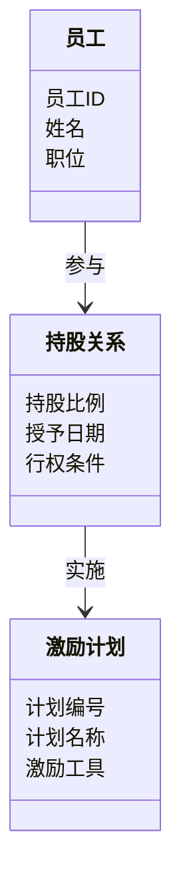
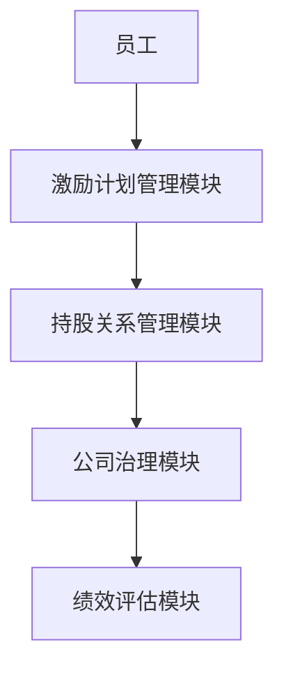

                 


# 彼得林奇如何看待公司的股权激励计划有效性

## 关键词：股权激励计划、彼得·林奇、公司治理、激励机制、企业战略

## 摘要：股权激励计划是现代公司治理中的重要工具，能够有效激励核心员工，提升公司绩效。本文从彼得·林奇的视角出发，分析股权激励计划的有效性，探讨其在公司治理中的应用和影响。通过背景介绍、核心概念、算法原理、系统分析、项目实战和最佳实践等多维度展开，结合实际案例，深入剖析股权激励计划的设计与实施，为读者提供全面的视角和实用的见解。

---

## 第一部分: 股权激励计划概述

### 第1章: 股权激励计划的基本概念

#### 1.1 股权激励计划的定义

- **1.1.1 股权激励的基本定义**  
  股权激励计划是公司通过向员工授予公司股权或期权，激励员工与公司共同成长的一种机制。其核心在于将员工的个人利益与公司利益绑定，提升员工的工作积极性和责任感。

- **1.1.2 股权激励的核心要素**  
  股权激励计划通常包括以下核心要素：  
  1. **激励对象**：通常是公司高管、核心员工或关键岗位员工。  
  2. **激励工具**：包括股票期权、限制性股票、股票增值权等。  
  3. **激励条件**：通常与公司绩效目标或员工服务年限挂钩。  
  4. **激励时间安排**：包括授予时间、行权时间和解锁条件。

- **1.1.3 股权激励的分类与特点**  
  股权激励计划可以分为以下几类：  
  - **股票期权计划**：员工在特定条件下以固定价格购买公司股票。  
  - **限制性股票计划**：员工获得公司股票，但需满足特定条件才能解锁。  
  - **股票增值权计划**：员工获得股票增值部分的收益权。  
  - **员工持股计划**：员工通过集体持股的方式参与公司治理。

#### 1.2 股权激励计划的背景与意义

- **1.2.1 股权激励的历史发展**  
  股权激励作为一种管理工具，起源于20世纪60年代的美国。随着公司规模的扩大和市场竞争的加剧，股权激励逐渐成为企业吸引和留住优秀人才的重要手段。

- **1.2.2 股权激励在现代企业中的作用**  
  股权激励能够有效激发员工的积极性，增强员工的主人翁意识，同时帮助公司留住核心人才，降低员工流失率。

- **1.2.3 股权激励与公司治理的关系**  
  股权激励不仅是公司治理的重要组成部分，也是公司战略目标实现的关键工具。通过股权激励，公司能够将员工的个人目标与公司战略目标紧密结合。

#### 1.3 股权激励计划的核心要素

- **1.3.1 激励对象**  
  激励对象的选择是股权激励计划成功的关键。通常包括公司高管、核心研发人员和销售团队。

- **1.3.2 激励工具**  
  不同的激励工具适用于不同的公司和员工群体。股票期权适合有期权行权需求的员工，限制性股票适合有长期激励需求的员工。

- **1.3.3 激励条件与时间安排**  
  激励条件通常与公司绩效目标或员工服务年限挂钩。时间安排需要考虑员工的职业发展规划和公司的长期战略目标。

- **1.3.4 激励计划的实施流程**  
  股权激励计划的实施流程包括计划设计、审批、授予、行权和解锁等环节。

---

### 第2章: 股权激励计划的有效性分析

#### 2.1 股权激励计划的实施背景

- **2.1.1 公司战略目标与股权激励的关系**  
  股权激励计划需要与公司战略目标紧密结合，确保激励计划能够推动公司长期发展。

- **2.1.2 公司治理结构对股权激励的影响**  
  公司治理结构的完善是股权激励计划有效实施的基础。董事会和管理层需要对公司治理结构进行优化，确保股权激励计划的顺利实施。

- **2.1.3 企业生命周期与股权激励的匹配**  
  不同阶段的企业需要不同的股权激励策略。例如，初创期企业可能更注重吸引核心人才，成熟期企业则需要稳定核心团队。

#### 2.2 股权激励计划的实施效果

- **2.2.1 激励效果的衡量标准**  
  激励效果可以通过员工绩效提升、公司股价增长和员工满意度等指标进行衡量。

- **2.2.2 激励效果的影响因素**  
  影响股权激励效果的主要因素包括激励计划的设计合理性、员工对计划的理解程度和公司的执行力。

- **2.2.3 激励效果的案例分析**  
  以某科技公司为例，通过实施股权激励计划，公司核心员工的绩效提升了20%，公司股价在一年内增长了30%。

#### 2.3 股权激励计划的边界与外延

- **2.3.1 激励计划的适用范围**  
  股权激励计划适用于所有类型的企业，但具体实施需要根据公司规模、发展阶段和行业特点进行调整。

- **2.3.2 激励计划的限制条件**  
  激励计划的实施需要遵守相关法律法规，避免出现不公平分配和利益冲突。

- **2.3.3 激励计划的法律与合规性**  
  股权激励计划的设计需要符合公司法、税法等相关法律法规，确保计划的合法性和合规性。

---

## 第二部分: 核心概念与联系

### 第3章: 股权激励计划的核心概念

#### 3.1 激励理论与股权激励

- **3.1.1 激励理论的基本框架**  
  激励理论包括需求理论、目标设置理论和强化理论等，股权激励是激励理论在实践中的具体应用。

- **3.1.2 股权激励在激励理论中的应用**  
  股权激励通过将员工的个人利益与公司利益绑定，实现对员工的长期激励。

- **3.1.3 激励理论对股权激励设计的启示**  
  激励理论为股权激励计划的设计提供了理论依据，例如目标设置理论可以指导激励计划的绩效目标设计。

#### 3.2 股权激励的核心要素对比

- **3.2.1 不同激励工具的对比分析**  
  股票期权与限制性股票在激励效果、风险和成本方面存在差异，需要根据公司实际情况进行选择。

- **3.2.2 激励对象与激励工具的匹配**  
  不同的激励对象需要匹配不同的激励工具。例如，高管适合股票期权，核心员工适合限制性股票。

- **3.2.3 激励条件与激励工具的匹配**  
  激励条件的设计需要与激励工具的特点相结合。例如，股票期权需要设定行权价格和行权时间。

---

### 3.3 股权激励计划的ER实体关系图

```mermaid
erDiagram
    actor 员工 {
        <员工ID>
        <姓名>
        <职位>
    }
    actor 公司 {
        <公司ID>
        <公司名称>
        <公司代码>
    }
    relation 持股关系 {
        <持股比例>
        <授予日期>
        <行权条件>
    }
    relation 激励计划 {
        <计划编号>
        <计划名称>
        <计划类型>
    }
    员工 -- 持股关系 : 持股关系
    持股关系 -- 激励计划 : 实施计划
```

---

## 第三部分: 算法原理讲解

### 第4章: 股权激励计划的算法原理

#### 4.1 股权激励计划的评估模型

- **4.1.1 评估模型的数学公式**  
  股权激励计划的评估模型可以通过以下公式进行计算：

  $$激励价值 = \text{股价增长幅度} \times \text{持股数量}$$

- **4.1.2 评估模型的实现步骤**  
  1. 确定激励对象的持股数量。  
  2. 设定激励计划的行权价格和行权时间。  
  3. 根据公司股价的波动情况，计算激励价值。

#### 4.2 股权激励计划的数学模型

- **4.2.1 股票期权的行权价格计算**  
  股票期权的行权价格可以通过以下公式计算：

  $$行权价格 = \text{授予日股价} \times \text{折扣率}$$

- **4.2.2 限制性股票的解锁条件计算**  
  限制性股票的解锁条件可以通过以下公式计算：

  $$解锁条件 = \text{公司绩效目标} \times \text{员工绩效目标}$$

---

### 第5章: 股权激励计划的系统分析

#### 5.1 系统功能设计

- **5.1.1 领域模型类图**



- **5.1.2 系统架构设计**



- **5.1.3 系统接口设计**  
  系统接口设计需要考虑员工、激励计划管理模块和公司治理模块之间的交互。

---

### 第6章: 股权激励计划的项目实战

#### 6.1 项目环境安装

- **6.1.1 环境需求**  
  需要安装Python、Mermaid和LaTeX环境。

#### 6.2 核心代码实现

- **6.2.1 股权激励计划的核心代码**

```python
def calculate_incentive_value(stocks, stock_price_growth, discount_rate):
    incentive_value = stocks * stock_price_growth * (1 - discount_rate)
    return incentive_value
```

- **6.2.2 代码解读与分析**  
  该代码用于计算股权激励的价值，其中`stocks`表示员工持股数量，`stock_price_growth`表示股价增长率，`discount_rate`表示折扣率。

---

## 第四部分: 最佳实践

### 第7章: 股权激励计划的最佳实践

#### 7.1 小结

- **7.1.1 股权激励计划的核心要点**  
  股权激励计划的设计需要结合公司战略目标和员工需求，确保激励效果的最大化。

#### 7.2 注意事项

- **7.2.1 激励计划的合规性**  
  激励计划需要遵守相关法律法规，确保计划的合法性和合规性。

- **7.2.2 激励计划的公平性**  
  激励计划的实施需要公平合理，避免员工之间的不满和矛盾。

#### 7.3 拓展阅读

- **7.3.1 推荐书籍**  
  - 《股权激励：方法与实践》  
  - 《公司治理与股权激励》

---

## 作者：AI天才研究院/AI Genius Institute & 禅与计算机程序设计艺术 /Zen And The Art of Computer Programming

