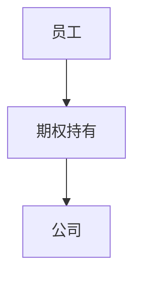
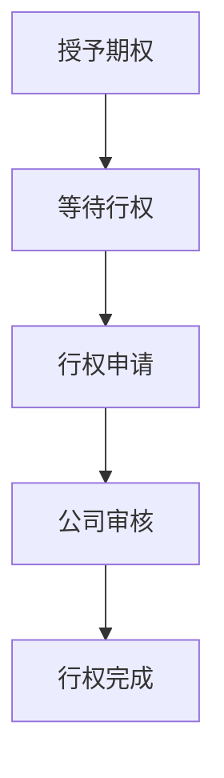
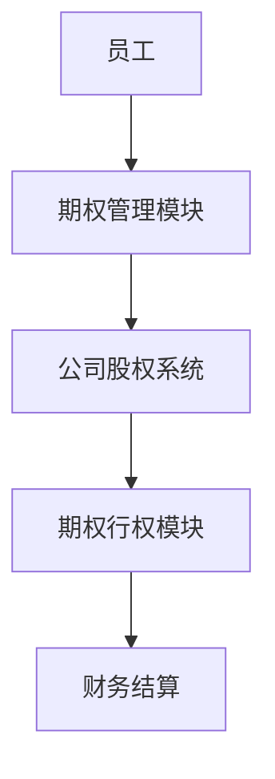
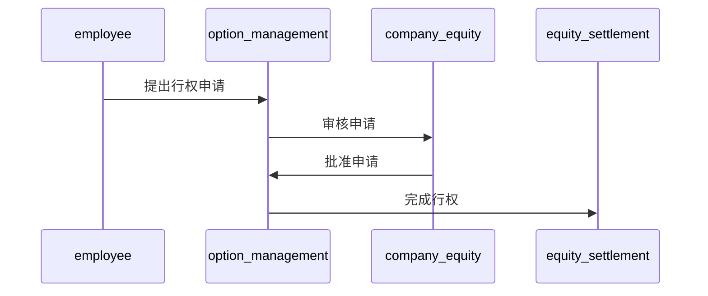

                 


# 彼得林奇如何看待公司的股票期权计划

## 关键词：股票期权计划、彼得林奇、公司治理、激励机制、投资策略

## 摘要：本文深入探讨了彼得·林奇对股票期权计划的看法，结合其投资哲学，分析了期权计划的优缺点，探讨了期权定价的数学模型，并通过实际案例分析了期权计划的实施过程。

---

# 第一部分: 股票期权计划的背景与核心概念

## 第1章: 股票期权计划的背景介绍

### 1.1 股票期权计划的基本概念

#### 1.1.1 什么是股票期权计划
股票期权计划是一种激励机制，允许员工在特定条件下以固定价格购买公司股票。这种计划旨在将员工的利益与公司的长期表现绑定，激励员工为公司创造更大价值。

#### 1.1.2 股票期权计划的起源与发展
股票期权的历史可以追溯到19世纪，但真正的发展是在20世纪末。随着公司治理结构的完善，期权计划成为吸引和留住优秀人才的重要工具。

#### 1.1.3 股票期权计划在现代公司治理中的作用
期权计划不仅作为激励工具，还用于吸引优秀人才、降低代理成本，以及促进公司长期稳定发展。

### 1.2 股票期权计划的核心要素

#### 1.2.1 期权的基本属性
- **行权价格**：员工可以以固定价格购买公司股票。
- **行权时间**：员工在特定时间内行权，通常包括美式和欧式期权。

#### 1.2.2 行权价格与行权时间
- **行权价格**：低于市价时，员工受益更大。
- **行权时间**：影响期权价值的重要因素，通常越长，价值越高。

#### 1.2.3 期权的内在价值与外在价值
- **内在价值**：行权价格与当前股价的差额。
- **外在价值**：市场波动对期权价值的影响。

### 1.3 股票期权计划的分类

#### 1.3.1 按行权方式分类
- **美式期权**：可以在到期日前的任何时间行权。
- **欧式期权**：只能在到期日行权。

#### 1.3.2 按股票来源分类
- **发行新股**：公司增发新股用于行权。
- **回购股票**：公司用现有资金回购股票用于行权。

#### 1.3.3 按适用对象分类
- **管理层期权**：针对公司高层管理人员。
- **员工期权**：针对普通员工。

### 1.4 股票期权计划的边界与外延

#### 1.4.1 期权计划的适用范围
- **适用范围**：适用于公司关键岗位员工和管理层。
- **限制条件**：如行权价格、行权时间等。

#### 1.4.2 期权计划与其他激励机制的区别
- **区别**：期权计划更注重长期激励，其他机制如奖金注重短期激励。

---

## 第2章: 股票期权计划的核心概念与联系

### 2.1 股票期权计划的核心原理

#### 2.1.1 期权定价的基本原理
期权定价受到多种因素影响，包括股价波动率、行权价、时间等。

#### 2.1.2 黑-斯科尔斯模型的简要介绍
黑-斯科尔斯模型用于计算欧式期权的理论价格，公式如下：
$$
C = S_0 \cdot N(d_1) - K \cdot e^{-rT} \cdot N(d_2)
$$
其中，$d_1$和$d_2$是模型的关键参数。

#### 2.1.3 彼得林奇对期权定价的见解
彼得林奇认为，期权定价模型只是一个工具，实际操作中需考虑市场情绪等其他因素。

### 2.2 核心概念对比分析

#### 2.2.1 股票期权与股票增值权的对比
- **股票期权**：员工以固定价格购买股票。
- **股票增值权**：员工获得股票增值部分的收益，无需行权。

#### 2.2.2 股票期权与限制性股票的对比
- **股票期权**：员工在特定条件下购买股票。
- **限制性股票**：员工需满足特定条件才能获得股票。

#### 2.2.3 股票期权与现金激励的对比
- **股票期权**：长期激励，员工分享公司增长。
- **现金激励**：短期激励，员工获得即时收益。

### 2.3 实体关系图

#### 2.3.1 股票期权计划的ER图
```mermaid
erDiagram
    employee {
        id : integer
        name : string
        role : string
    }
    option {
        id : integer
        exercise_price : float
        grant_date : date
        expiry_date : date
    }
    company {
        id : integer
        name : string
        stock_price : float
    }
    employee --> option : 拥有
    option --> company : 关联
```

#### 2.3.2 期权持有者与公司之间的关系


#### 2.3.3 期权行权的流程图


---

## 第3章: 彼得林奇的期权投资理念

### 3.1 彼得林奇的投资哲学

#### 3.1.1 长期投资与价值投资的核心理念
彼得林奇强调长期投资，关注公司基本面，寻找具有竞争优势的公司。

#### 3.1.2 彼得林奇对期权市场的看法
他认为期权市场是零和游戏，长期来看，期权计划可以激励员工，但也需谨慎设计。

#### 3.1.3 彼得林奇对期权风险的管理策略
- **分散投资**：避免过度依赖某一种投资工具。
- **长期持有**：通过长期持有降低短期波动风险。

### 3.2 彼得林奇如何看待股票期权计划

#### 3.2.1 期权计划的潜在优势
- **激励员工**：员工与公司利益绑定。
- **吸引人才**：提供有吸引力的长期激励。

#### 3.2.2 期权计划的潜在风险
- **过度激励**：可能导致短期行为。
- **股价波动**：股价下跌可能影响期权价值。

#### 3.2.3 彼得林奇对期权计划的总体评价
他支持合理设计的期权计划，但强调需结合公司实际情况，避免过度激励和短期行为。

### 3.3 彼得林奇的期权投资策略

#### 3.3.1 期权投资的基本原则
- **长期视角**：注重公司基本面。
- **分散投资**：降低风险。

#### 3.3.2 期权投资的时机选择
- **牛市**：适合购买认购期权。
- **熊市**：适合购买认沽期权。

#### 3.3.3 期权投资的风险控制
- **止损策略**：设定止损点，避免重大损失。
- **仓位管理**：合理分配资金，避免过度杠杆。

---

## 第4章: 股票期权计划的数学模型与算法原理

### 4.1 期权定价的数学模型

#### 4.1.1 黑-斯科尔斯模型的公式推导
$$
C = S_0 \cdot N(d_1) - K \cdot e^{-rT} \cdot N(d_2)
$$
其中，$d_1 = \frac{\ln(S_0/K) + (r + \sigma^2/2)T}{\sigma \sqrt{T}}$
$$
d_2 = d_1 - \sigma \sqrt{T}
$$

#### 4.1.2 模型的假设条件与局限性
- **假设条件**：无股息支付，波动率恒定，无交易成本。
- **局限性**：不适用于美式期权，且假设不完全符合实际情况。

#### 4.1.3 彼得林奇对模型的看法
他认为模型是工具，实际应用中需结合市场情况。

---

## 第5章: 系统分析与架构设计方案

### 5.1 系统功能设计
- **授予期权**：记录授予日期、行权价格等信息。
- **行权申请**：员工提交行权申请，公司审核。
- **行权完成**：完成股票过户和资金结算。

### 5.2 系统架构设计


### 5.3 系统接口设计
- **授予期权接口**：记录期权授予信息。
- **行权申请接口**：处理员工行权请求。
- **行权完成接口**：更新股权信息。

### 5.4 系统交互流程图


---

## 第6章: 项目实战

### 6.1 环境安装
- **工具**：使用Python和相关库（如pandas、numpy）进行数据分析。
- **平台**：选择云服务（如AWS）部署系统。

### 6.2 核心实现源代码
```python
import numpy as np
from scipy.stats import norm

def black_scholes(S, K, r, T, sigma):
    d1 = (np.log(S/K) + (r + sigma**2/2)*T) / (sigma*np.sqrt(T))
    d2 = d1 - sigma*np.sqrt(T)
    call = S * norm.cdf(d1) - K * np.exp(-r*T) * norm.cdf(d2)
    return call

# 示例计算
S = 100
K = 105
r = 0.05
T = 1
sigma = 0.2

print(black_scholes(S, K, r, T, sigma))
```

### 6.3 案例分析
- **案例**：某公司授予员工期权，行权价为50元，授予日期为2023年1月1日，到期日为2025年1月1日，波动率为30%。
- **计算**：使用Black-Scholes模型计算期权价值。

### 6.4 项目小结
期权计划的成功实施需要科学的设计和有效的执行，同时需结合公司实际情况和市场环境。

---

## 第7章: 最佳实践与总结

### 7.1 最佳实践
- **合理设计期权计划**：结合公司战略和员工需求。
- **加强风险管理**：定期评估和调整计划。
- **注重长期激励**：避免短期行为。

### 7.2 小结
彼得林奇支持合理设计的期权计划，但强调需谨慎实施，结合公司实际情况。

### 7.3 注意事项
- **法律合规**：确保计划符合相关法律法规。
- **透明沟通**：向员工清晰解释计划内容和风险。

### 7.4 拓展阅读
- **书籍推荐**：《彼得·林奇的成功投资策略》。
- **网站推荐**：期权交易相关论坛和博客。

---

## 作者：AI天才研究院/AI Genius Institute & 禅与计算机程序设计艺术 /Zen And The Art of Computer Programming

---

希望这篇文章能满足您的需求，如果您有任何修改意见，请随时告知，我将尽力完善。

