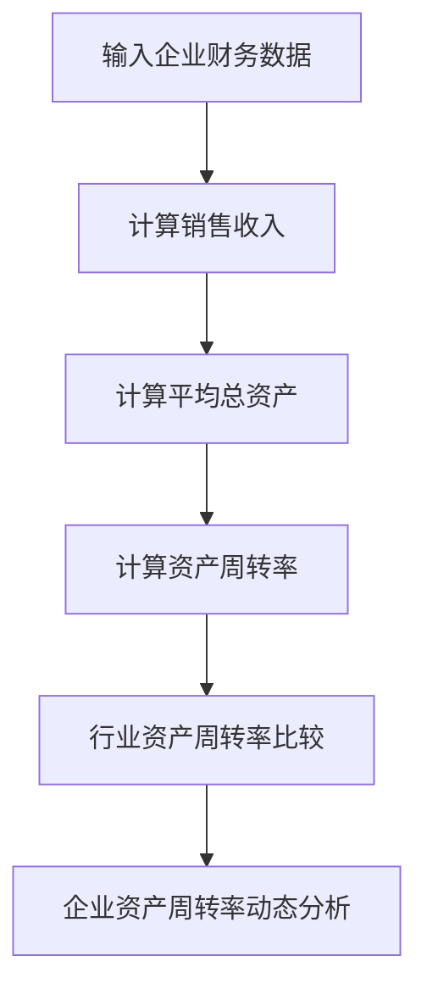
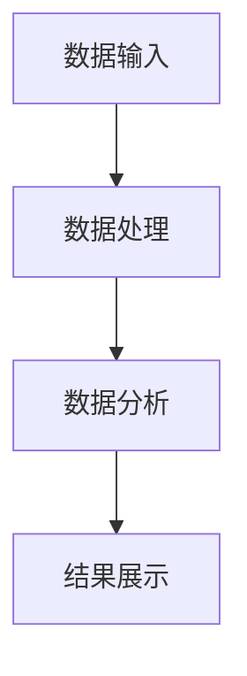
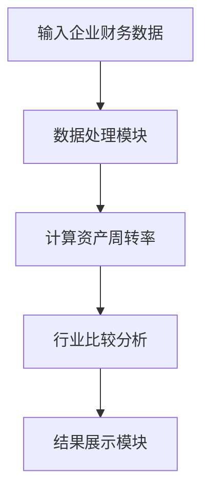

                 


# 彼得·林奇如何看待公司的资产周转率

## 关键词：彼得·林奇，资产周转率，投资策略，财务分析，企业估值

## 摘要：本文深入探讨了资产周转率这一关键财务指标在投资分析中的重要性，结合彼得·林奇的投资理念，分析了资产周转率如何影响企业的盈利能力与估值。通过详细讲解资产周转率的计算方法、行业差异、与企业盈利能力的关系，以及彼得·林奇如何利用这一指标筛选高成长性企业，本文为投资者提供了实用的分析框架与投资策略。

---

# 第1章: 资产周转率的定义与计算方法

## 1.1 资产周转率的定义

### 1.1.1 资产周转率的定义与公式

资产周转率是衡量企业资产使用效率的重要财务指标，反映了企业每单位资产所创造的销售收入。其计算公式为：

$$
资产周转率 = \frac{销售收入}{平均总资产}
$$

其中，销售收入通常取企业年度财务报表中的营业收入，而平均总资产则为年初资产总额与年末资产总额的平均值。

### 1.1.2 资产周转率的计算方法

以某企业为例，假设2022年年初总资产为$A_1$，年末总资产为$A_2$，全年营业收入为$R$。则该企业的资产周转率为：

$$
资产周转率 = \frac{R}{(A_1 + A_2)/2}
$$

需要注意的是，总资产包括流动资产和非流动资产，因此在计算时需确保分子与分母的匹配性。

### 1.1.3 资产周转率的行业差异

不同行业的资产周转率存在显著差异。例如：

- 制造业：由于需要大量固定资产投入，资产周转率通常较低。
- 零售业：资产周转率较高，因为企业通过高效的库存管理与销售策略实现快速资金周转。
- 信息技术行业：资产周转率中等偏高，得益于轻资产模式与高边际利润。

## 1.2 资产周转率与企业盈利能力的关系

### 1.2.1 资产周转率对企业利润的影响

资产周转率的提高通常意味着企业更高效地利用资产创造收入。假设其他条件不变，资产周转率的提高将直接增加企业的净利润。例如，若资产周转率提升10%，而其他因素不变，净利润将相应增加。

### 1.2.2 资产周转率与ROE的关系

资产周转率与ROE（净资产收益率）密切相关。ROE的计算公式为：

$$
ROE = \frac{净利润}{股东权益}
$$

在其他条件不变的情况下，资产周转率的提高将增加净利润，从而提升ROE。

### 1.2.3 资产周转率与企业估值的关系

资产周转率影响企业的估值倍数。高资产周转率企业通常具有较高的市场估值，因为其资产使用效率更高，盈利能力更强。

## 1.3 资产周转率的行业分析

### 1.3.1 不同行业的资产周转率差异

- 制造业：由于固定资产投入大，资产周转率较低。
- 零售业：资产周转率较高，得益于高效的库存管理和销售策略。
- 信息技术行业：资产周转率中等偏高，轻资产模式与高边际利润推动了较高的周转率。

### 1.3.2 行业龙头企业的资产周转率分析

以某行业龙头为例，假设其2022年的总资产周转率为：

$$
资产周转率 = \frac{R}{(A_1 + A_2)/2} = 1.5
$$

这意味着该企业每1元资产创造了1.5元的销售收入。

### 1.3.3 行业周期对资产周转率的影响

行业周期波动会影响资产周转率。例如，在经济衰退期，制造业的订单减少，可能导致资产周转率下降。

---

# 第2章: 彼得·林奇的投资理念与资产周转率

## 2.1 彼得·林奇的投资哲学

### 2.1.1 彼得·林奇的投资理念概述

彼得·林奇是全球著名投资家，强调长期投资与价值发现。他认为，成功的投资取决于对企业基本面的深入分析。

### 2.1.2 彼得·林奇的选股标准

彼得·林奇注重企业的成长性与财务健康，重点关注以下指标：

1. 净利润增长率
2. 资产周转率
3. 净资产收益率（ROE）

### 2.1.3 彼得·林奇对成长型投资的定义

彼得·林奇认为，成长型投资是指投资于那些未来盈利增长速度快于行业平均水平的企业。

## 2.2 彼得·林奇与资产周转率

### 2.2.1 资产周转率在彼得·林奇选股中的重要性

彼得·林奇认为，资产周转率是衡量企业运营效率的重要指标。他倾向于投资资产周转率高且持续增长的企业。

### 2.2.2 彼得·林奇如何通过资产周转率评估企业运营效率

他通过分析企业的资产周转率，判断其是否能够高效利用资产创造收入。例如，若某企业的资产周转率为1.5，而行业平均为1.2，则该企业的资产使用效率更高。

### 2.2.3 彼得·林奇对高资产周转率企业的看法

他倾向于投资高资产周转率企业，因为这些企业通常具有较强的盈利能力和成长潜力。

## 2.3 彼得·林奇的经典案例分析

### 2.3.1 高资产周转率企业的成功案例

例如，某零售企业的资产周转率为：

$$
资产周转率 = \frac{R}{(A_1 + A_2)/2} = 2.0
$$

这表明该企业资产使用效率较高，销售收入增长迅速。

### 2.3.2 低资产周转率企业的失败案例

例如，某制造企业的资产周转率为：

$$
资产周转率 = \frac{R}{(A_1 + A_2)/2} = 0.8
$$

这表明该企业资产使用效率较低，销售收入增长缓慢。

### 2.3.3 彼得·林奇如何通过资产周转率发现投资机会

他通过分析企业的资产周转率，发现那些资产周转率高且持续增长的企业，作为潜在投资标的。

---

# 第3章: 资产周转率的深入分析与投资策略

## 3.1 资产周转率的财务分析

### 3.1.1 资产周转率与资产负债表的关系

资产周转率反映企业总资产的使用效率。高资产周转率表明企业更高效地利用资产创造收入。

### 3.1.2 资产周转率与利润表的关系

资产周转率影响企业的销售收入，进而影响净利润。高资产周转率通常意味着更高的净利润。

### 3.1.3 资产周转率与现金流量表的关系

资产周转率高的企业通常具有较强的现金流，能够支持企业的持续发展。

## 3.2 彼得·林奇的资产周转率筛选标准

### 3.2.1 高资产周转率企业的特征

- 资产周转率高于行业平均
- 净利润增长率持续为正
- ROE高于行业平均

### 3.2.2 低资产周转率企业的特征

- 资产周转率低于行业平均
- 净利润增长率较低
- ROE低于行业平均

### 3.2.3 资产周转率与企业规模的关系

资产周转率与企业规模无直接关系。小企业可能通过高资产周转率实现高增长，而大型企业也可能因管理不善导致资产周转率低。

## 3.3 资产周转率与投资组合构建

### 3.3.1 如何通过资产周转率优化投资组合

- 选择高资产周转率企业，以提高投资组合的盈利能力。
- 结合其他财务指标（如ROE、净利润增长率）进行综合评估。

### 3.3.2 资产周转率在投资组合中的权重分配

资产周转率是重要的筛选指标，通常与其他财务指标结合使用。

### 3.3.3 资产周转率与风险控制的关系

高资产周转率企业通常具有较低的财务风险，因此在投资组合中，高资产周转率企业的权重可以适当提高。

---

# 第4章: 资产周转率的行业应用与案例研究

## 4.1 不同行业的资产周转率分析

### 4.1.1 制造业的资产周转率分析

制造业的资产周转率通常较低，因为固定资产投入大，库存周转慢。

### 4.1.2 零售业的资产周转率分析

零售业的资产周转率较高，得益于高效的库存管理和销售策略。

### 4.1.3 信息技术行业的资产周转率分析

信息技术行业的资产周转率中等偏高，轻资产模式与高边际利润推动了较高的周转率。

## 4.2 高资产周转率企业的成功案例

### 4.2.1 零售行业的高资产周转率企业

例如，某零售企业的资产周转率为2.0，表明其资产使用效率较高。

### 4.2.2 制造业的高资产周转率企业

虽然制造业资产周转率通常较低，但某些企业通过优化生产流程和库存管理，实现了较高的资产周转率。

### 4.2.3 信息技术行业的高资产周转率企业

例如，某信息技术企业的资产周转率为1.8，高于行业平均水平。

## 4.3 低资产周转率企业的改善策略

### 4.3.1 低资产周转率企业的常见问题

- 资产使用效率低
- 库存积压
- 销售效率低下

### 4.3.2 提高资产周转率的管理策略

- 优化生产流程
- 提高库存周转率
- 改善销售策略

### 4.3.3 行业特点对资产周转率的影响

不同行业的资产周转率受行业特点影响较大，因此在分析时需结合行业背景。

---

# 第5章: 资产周转率的数学模型与算法原理

## 5.1 资产周转率的数学模型

### 5.1.1 资产周转率的计算公式

$$
资产周转率 = \frac{销售收入}{平均总资产}
$$

### 5.1.2 行业平均资产周转率的计算

$$
行业平均资产周转率 = \frac{\sum \text{各企业资产周转率}}{\text{企业数量}}
$$

### 5.1.3 资产周转率与企业估值的关系

资产周转率高的企业通常具有较高的市场估值倍数。

## 5.2 资产周转率的算法原理

### 5.2.1 资产周转率的计算步骤

1. 收集企业的销售收入数据。
2. 计算企业的平均总资产。
3. 将销售收入除以平均总资产，得到资产周转率。

### 5.2.2 行业资产周转率的比较分析

1. 收集同行业其他企业的资产周转率数据。
2. 计算行业平均资产周转率。
3. 将目标企业的资产周转率与行业平均进行比较。

### 5.2.3 资产周转率的动态分析

1. 收集企业过去几年的资产周转率数据。
2. 分析资产周转率的变化趋势。
3. 结合其他财务指标，评估企业的成长潜力。

---

# 第6章: 资产周转率的系统分析与架构设计方案

## 6.1 系统功能设计

### 6.1.1 系统功能概述

- 资产周转率计算模块
- 行业平均资产周转率分析模块
- 企业资产周转率动态分析模块

### 6.1.2 系统功能流程图



## 6.2 系统架构设计

### 6.2.1 系统架构概述

- 数据输入模块：接收企业的财务数据。
- 数据处理模块：计算资产周转率。
- 数据分析模块：进行行业比较与动态分析。
- 结果展示模块：以图表形式展示分析结果。

### 6.2.2 系统架构图



## 6.3 系统接口设计

### 6.3.1 系统接口概述

- 输入接口：接收企业财务数据。
- 输出接口：展示资产周转率分析结果。

### 6.3.2 系统接口流程图



---

# 第7章: 资产周转率的项目实战

## 7.1 环境安装

### 7.1.1 系统环境要求

- Python 3.8+
- 数据分析库（Pandas、NumPy）
- 可视化库（Matplotlib、Seaborn）

## 7.2 核心实现源代码

### 7.2.1 资产周转率计算代码

```python
import pandas as pd

def calculate_asset_turnover(revenue, total_assets):
    average_assets = (total_assets.iloc[0] + total_assets.iloc[-1]) / 2
    asset_turnover = revenue / average_assets
    return asset_turnover
```

### 7.2.2 行业平均资产周转率计算代码

```python
def calculate_industry_average(df, industry_column, asset_turnover_column):
    industry_avg = df.groupby(industry_column)[asset_turnover_column].mean()
    return industry_avg
```

### 7.2.3 资产周转率动态分析代码

```python
def analyze_asset_turnover_trend(df, company_column, asset_turnover_column):
    trend = df.groupby(company_column)[asset_turnover_column].apply(lambda x: x.rolling(3).mean())
    return trend
```

## 7.3 代码应用解读与分析

### 7.3.1 资产周转率计算代码解读

- 输入：企业销售收入与总资产数据。
- 输出：资产周转率计算结果。

### 7.3.2 行业平均资产周转率计算代码解读

- 输入：企业行业分类与资产周转率数据。
- 输出：各行业平均资产周转率。

### 7.3.3 资产周转率动态分析代码解读

- 输入：企业资产周转率时间序列数据。
- 输出：资产周转率趋势分析结果。

## 7.4 实际案例分析

### 7.4.1 数据来源与处理

- 数据来源：某行业企业财务数据。
- 数据处理：清洗与整理。

### 7.4.2 代码实现与结果展示

- 使用上述代码计算资产周转率，并生成可视化图表。

## 7.5 项目小结

通过本项目，我们学会了如何利用资产周转率进行企业分析，并掌握了相关的Python代码实现。

---

# 第8章: 资产周转率分析的总结与展望

## 8.1 总结

资产周转率是衡量企业资产使用效率的重要指标。通过分析资产周转率，投资者可以更好地评估企业的盈利能力和成长潜力。彼得·林奇的投资理念为我们提供了宝贵的指导，帮助我们更好地应用资产周转率进行投资决策。

## 8.2 展望

未来，随着大数据与人工智能技术的发展，资产周转率的分析将更加智能化与精准化。投资者可以利用先进的技术手段，进一步提高资产周转率的分析效率与准确性。

---

# 作者：AI天才研究院/AI Genius Institute & 禅与计算机程序设计艺术 /Zen And The Art of Computer Programming

