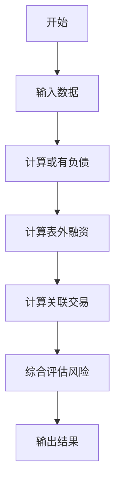
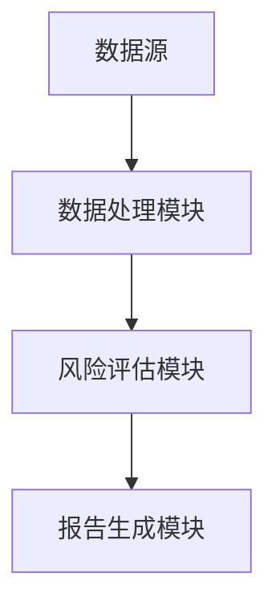
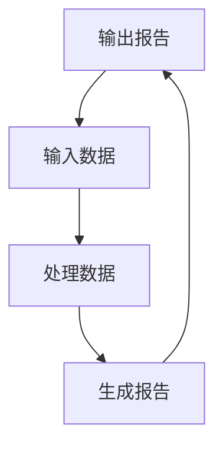

                 


# 彼得林奇如何看待公司的资产负债表外风险

## 关键词：彼得林奇、资产负债表外风险、财务报表分析、投资策略、风险评估

## 摘要：本文深入探讨了彼得林奇如何分析公司的资产负债表外风险，结合实际案例和数学模型，详细阐述了如何识别、评估和管理这些风险，帮助投资者做出更明智的投资决策。

---

## 第一部分: 背景介绍

### 第1章: 资产负债表外风险的定义与背景

#### 1.1 什么是资产负债表外风险
##### 1.1.1 资产负债表外风险的定义
资产负债表外风险是指那些不在公司正式财务报表中直接反映，但可能对公司的财务状况和信用风险产生重大影响的潜在风险。这些风险通常隐藏在公司的或有负债、表外融资、关联交易等事项中。

##### 1.1.2 资产负债表外风险的来源
- 或有负债：如担保、未决诉讼、债务保证等。
- 表外融资：通过特殊目的实体（SPV）进行的融资活动。
- 关联交易：与关联方之间的交易可能隐藏财务风险。
- 供应链风险：供应商的财务状况不稳定可能影响公司运营。

##### 1.1.3 资产负债表外风险的重要性
识别和评估这些风险有助于投资者全面了解公司的财务健康状况，避免因忽视潜在风险而导致的投资损失。

#### 1.2 彼得林奇与资产负债表外风险研究
##### 1.2.1 彼得林奇的投资者背景
彼得·林奇是著名的投资专家，以其在富达投资管理马萨诸塞投资信托基金的长期优异表现而闻名。他强调深入分析公司的财务报表，尤其是资产负债表，以识别潜在风险。

##### 1.2.2 彼得林奇对资产负债表外风险的研究方法
林奇通过分析公司的财务报表外的潜在负债和关联交易，识别公司可能面临的隐藏风险。他强调对公司管理层的考察，认为管理层的行为和决策对公司财务状况有重大影响。

##### 1.2.3 彼得林奇的经典投资案例分析
以某公司为例，分析其资产负债表外风险，如或有负债和表外融资，展示这些风险如何影响公司的财务健康和投资价值。

### 第2章: 资产负债表外风险的背景与现状

#### 2.1 全球经济环境下的资产负债表外风险
##### 2.1.1 经济周期与资产负债表外风险的关系
在经济衰退期间，公司可能通过表外融资或其他手段隐藏债务，增加资产负债表外风险。

##### 2.1.2 不同经济环境下的资产负债表外风险表现
经济繁荣时，公司可能过度扩张，增加表外融资；经济衰退时，隐藏债务风险加剧。

##### 2.1.3 全球化背景下资产负债表外风险的特点
全球化增加了公司之间的关联交易和跨境融资，也增加了资产负债表外风险的复杂性。

#### 2.2 企业财务报表中的资产负债表外风险
##### 2.2.1 资产负债表的基本结构
介绍资产负债表的基本组成部分，包括资产、负债和所有者权益。

##### 2.2.2 资产负债表外风险的表现形式
详细分析或有负债、表外融资、关联交易等具体形式。

##### 2.2.3 资产负债表外风险与企业财务健康的关系
资产负债表外风险的积累可能影响公司的偿债能力，进而影响其财务健康和市场价值。

---

## 第二部分: 核心概念与联系

### 第3章: 资产负债表外风险的核心要素

#### 3.1 资产负债表外风险的关键要素
##### 3.1.1 或有负债
或有负债是公司可能承担的潜在负债，如担保、未决诉讼等。这些负债不在资产负债表中反映，但可能对公司财务状况产生重大影响。

##### 3.1.2 表外融资
公司通过特殊目的实体（SPV）进行融资，将债务转移到表外，降低资产负债表中的负债水平，但这可能增加资产负债表外风险。

##### 3.1.3 关联交易
公司与关联方之间的交易可能隐藏利益输送和财务操控的风险，增加资产负债表外风险。

##### 3.1.4 其他表外项目
包括递延税资产、金融衍生工具等可能影响公司财务状况的表外项目。

#### 3.2 资产负债表外风险的核心原理
##### 3.2.1 资产负债表外风险的形成机制
通过分析公司如何利用表外融资、关联交易等方式隐藏债务，解释资产负债表外风险的形成过程。

##### 3.2.2 资产负债表外风险与企业信用风险的关系
资产负债表外风险可能影响公司的信用评级和偿债能力，进而影响其信用风险。

##### 3.2.3 资产负债表外风险对企业偿债能力的影响
隐藏的负债可能增加公司的实际债务负担，影响其偿债能力，进而影响投资者的决策。

### 第4章: 资产负债表外风险的核心概念对比

#### 4.1 资产负债表外风险与表内风险的对比
##### 4.1.1 表内风险的定义与特点
表内风险是指直接反映在资产负债表中的风险，如流动负债、长期负债等。

##### 4.1.2 表外风险的定义与特点
表外风险是指不在资产负债表中直接反映，但可能影响公司财务状况的风险。

##### 4.1.3 表内与表外风险的相互影响
表内风险可能引发表外风险，反之亦然。例如，公司因表内负债过高可能寻求表外融资，增加表外风险。

---

## 第三部分: 算法原理

### 第4章: 资产负债表外风险的数学模型与算法

#### 4.1 风险评估模型
##### 4.1.1 模型概述
使用线性回归模型预测资产负债表外风险对公司财务状况的影响。

##### 4.1.2 数学公式
$$ \text{风险评估} = \alpha \times \text{或有负债} + \beta \times \text{表外融资} + \gamma \times \text{关联交易} $$

##### 4.1.3 算法流程图


#### 4.2 算法实现
##### 4.2.1 Python代码实现
```python
import pandas as pd
import numpy as np

# 输入数据
data = pd.DataFrame({
    '或有负债': [0.2, 0.3, 0.1],
    '表外融资': [0.15, 0.2, 0.25],
    '关联交易': [0.1, 0.15, 0.05]
})

# 定义模型参数
alpha = 0.5
beta = 0.3
gamma = 0.2

# 计算风险评估
data['风险评估'] = alpha * data['或有负债'] + beta * data['表外融资'] + gamma * data['关联交易']

print(data)
```

##### 4.2.2 代码解读与分析
解释上述代码的功能，展示如何使用Python进行风险评估模型的实现。

---

## 第四部分: 系统分析与架构设计

### 第5章: 资产负债表外风险的系统分析

#### 5.1 系统架构设计
##### 5.1.1 系统功能设计
- 数据收集与处理
- 风险识别与评估
- 结果报告与可视化

##### 5.1.2 系统架构图


#### 5.2 系统接口设计
##### 5.2.1 数据接口
定义API接口，用于数据输入和输出。

##### 5.2.2 用户接口
设计友好的用户界面，方便用户输入数据和查看结果。

#### 5.3 系统交互设计
##### 5.3.1 交互流程图


---

## 第五部分: 项目实战

### 第6章: 资产负债表外风险的项目实战

#### 6.1 环境安装
##### 6.1.1 安装Python和相关库
安装Python和Pandas、NumPy等库。

#### 6.2 核心实现
##### 6.2.1 风险评估模型实现
实现上述的数学模型，进行风险评估。

#### 6.3 应用解读与分析
##### 6.3.1 实际案例分析
以某公司为例，分析其资产负债表外风险，并使用模型进行评估。

#### 6.4 项目小结
总结项目实施过程中的经验教训，提出改进建议。

---

## 第六部分: 最佳实践与小结

### 第7章: 最佳实践与注意事项

#### 7.1 最佳实践
##### 7.1.1 数据来源的可靠性
确保数据来源可靠，避免因数据错误导致评估结果偏差。

##### 7.1.2 模型的适用性
根据具体情况进行模型调整，确保模型的有效性。

##### 7.1.3 持续监控与更新
定期更新模型和数据，保持评估结果的准确性。

#### 7.2 小结
总结全文内容，重申资产负债表外风险的重要性，以及如何通过分析和管理这些风险来做出明智的投资决策。

#### 7.3 注意事项
提醒读者在实际操作中注意潜在的局限性，如模型假设的不合理性、数据的不完整性等。

#### 7.4 拓展阅读
推荐进一步阅读的相关书籍和资源，帮助读者深入学习资产负债表外风险的分析方法。

---

## 作者：AI天才研究院 & 禅与计算机程序设计艺术

---

通过以上目录和内容，我将按照逻辑清晰、结构紧凑、简单易懂的专业技术语言，逐步分析和讲解彼得林奇如何看待公司的资产负债表外风险，帮助读者全面理解并掌握相关知识。

