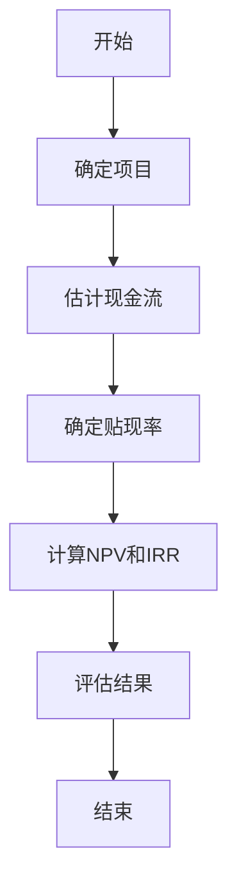
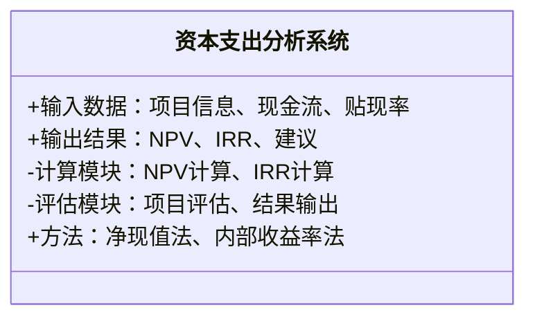
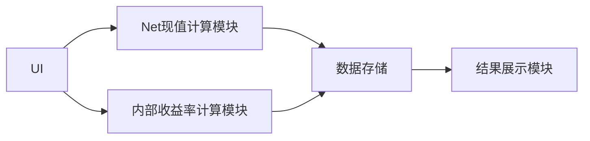

                 


# 彼得林奇如何看待公司的资本支出

## 关键词：资本支出，彼得·林奇，投资策略，净现值，内部收益率

## 摘要：本文探讨彼得·林奇如何评估公司资本支出，分析其对投资决策的影响，并通过数学模型和实际案例展示资本支出的评估方法。文章从定义、原理到系统设计，最后通过实战案例，帮助读者理解资本支出在投资中的重要性。

---

## 第1章：资本支出的背景与定义

### 1.1 资本支出的定义与特点

资本支出（CapEx）是企业在长期资产上的投资，包括购买设备、建筑物和无形资产等。其特点包括长期性、高价值和战略性，与运营费用（OpEx）不同，后者是日常运营中的支出。

### 1.2 彼得·林奇的投资理念

彼得·林奇强调投资于具备持续增长潜力的公司，关注其资本支出是否合理。他认为有效的资本支出应提高公司竞争力和未来收益。

---

## 第2章：资本支出的核心概念与联系

### 2.1 资本支出的构成与影响因素

资本支出包括设备、厂房和研发投入等，其影响因素有市场需求、技术进步和竞争环境等。

### 2.2 资本支出与公司财务健康的关系

资本支出与公司盈利能力、成长性密切相关。合理的资本支出能提升效率，过高的支出可能影响短期利润。

---

## 第3章：资本支出的算法原理

### 3.1 资本支出评估的算法原理

#### 净现值（NPV）计算

$$ NPV = \sum_{t=0}^{n} \frac{CF_t}{(1 + r)^t} $$

其中，CF_t是第t年的现金流，r是贴现率。

#### 内部收益率（IRR）计算

$$ IRR = r \text{ 使得 } NPV = 0 $$

### 3.2 资本支出评估的流程图



---

## 第4章：资本支出的数学模型与公式

### 4.1 净现值（NPV）公式

$$ NPV = \sum_{t=0}^{n} \frac{CF_t}{(1 + r)^t} $$

### 4.2 内部收益率（IRR）公式

$$ IRR = r \text{ 使得 } NPV = 0 $$

---

## 第5章：资本支出分析系统的架构设计

### 5.1 系统功能设计



### 5.2 系统架构设计



---

## 第6章：资本支出分析系统的项目实战

### 6.1 环境搭建与数据收集

使用Python的pandas和numpy库进行数据处理，安装Anaconda和相关库。

### 6.2 核心实现源代码

```python
import numpy as np
import pandas as pd

def calculate_npv(cash_flows, discount_rate):
    return np.npv(discount_rate, cash_flows)

def calculate_irr(cash_flows):
    return np.irr(cash_flows)

# 示例数据
cash_flows = [-100, 30, 30, 30]
discount_rate = 0.1

npv = calculate_npv(cash_flows, discount_rate)
irr = calculate_irr(cash_flows)

print(f"净现值：{npv:.2f}")
print(f"内部收益率：{irr:.2%}")
```

### 6.3 实际案例分析

以亚马逊为例，分析其资本支出如何推动业务增长，展示如何使用上述模型评估其投资。

---

## 第7章：最佳实践与总结

### 7.1 投资建议与注意事项

- 选择资本支出合理的公司
- 结合ROCE评估投资回报
- 长期关注资本支出效果

### 7.2 项目小结

资本支出分析是投资决策的关键，合理评估可提高投资成功率。

---

## 作者信息

作者：AI天才研究院 & 禅与计算机程序设计艺术

---

## 参考文献

- 彼得·林奇著述
- 投资分析相关书籍和文献

---

希望这篇文章能帮助读者深入了解彼得·林奇的资本支出观点，并通过系统的方法和实际案例，掌握资本支出的评估技巧。

