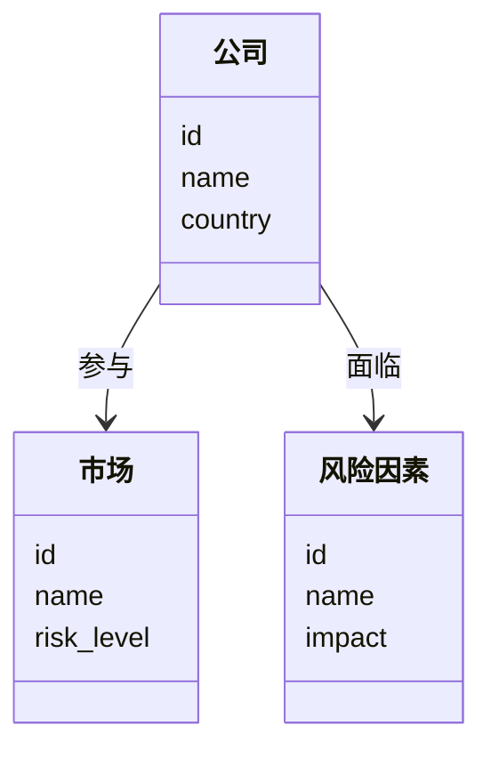
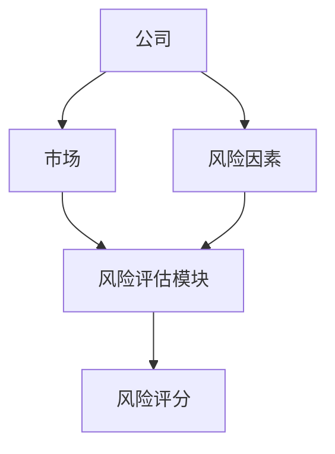
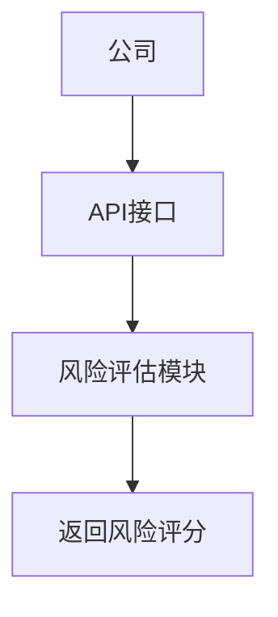
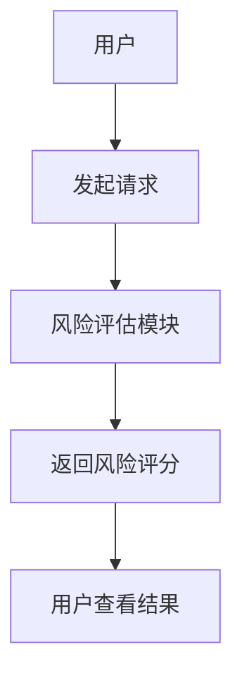

                 


# 彼得林奇如何看待公司的跨国经营风险

**关键词**：跨国经营风险，彼得·林奇，投资策略，风险管理，企业全球化

**摘要**：本文深入分析了彼得·林奇在跨国经营风险评估与管理方面的独特见解。通过系统化的分析框架、数学模型和实际案例，文章探讨了跨国经营中的主要风险类型，并结合彼得·林奇的投资哲学，提出了一套基于SWOT和PEST分析的评估方法。同时，文章还结合了实际项目案例，展示了如何将理论应用于实践，为读者提供了从理论到实践的完整指南。

---

# 第一部分: 背景介绍

## # 第1章: 跨国經營風險的背景與重要性

### ## 1.1 跨国經營風險的核心概念

#### ### 1.1.1 跨国經營的定義與邊界

跨国经营是指企业跨越国界进行业务活动，涉及国际市场、跨文化管理、全球化战略等多个方面。跨国经营的核心在于企业在不同国家市场中寻求增长和利润，但同时也伴随着复杂的风险。

跨国经营风险的边界包括市场风险、汇率风险、法律风险、文化风险等，这些风险可能相互作用，影响企业的整体经营稳定性。

#### ### 1.1.2 跨国經營風險的問題背景

在全球化背景下，跨国经营已成为企业拓展市场、获取资源的重要手段。然而，跨国经营的风险往往被低估或忽视，导致企业在全球化过程中面临重大损失。例如，汇率波动可能导致利润大幅缩水，市场环境的不确定性可能使企业难以适应当地市场。

#### ### 1.1.3 跨国經營風險的核心要素與結構

跨国经营风险的核心要素包括：

1. **市场风险**：市场需求波动、竞争环境变化。
2. **汇率风险**：汇率波动对企业财务的影响。
3. **法律与政策风险**：当地法律法规的变化对企业经营的影响。
4. **文化与管理风险**：跨文化管理中的冲突与适应问题。

这些要素相互关联，共同构成了跨国经营风险的结构。

---

### ## 1.2 彼得·林奇的投資哲學

#### ### 1.2.1 彼得·林奇的投資風格與成功經驗

彼得·林奇是美国著名的投资经理人，以其独特的选股策略和风险控制能力闻名。他强调基本面分析，注重企业内在价值，并善于从复杂的风险中发现投资机会。

#### ### 1.2.2 彼得·林奇如何看待風險與機會

彼得·林奇认为，风险是投资的一部分，但成功的投资在于识别和管理风险。他强调通过深入分析企业的财务状况、市场地位和管理层能力，来降低投资风险。

#### ### 1.2.3 彼得·林奇的投資標准與選股策略

彼得·林奇的选股标准包括：

1. **企业基本面**：关注企业的盈利能力、成长性和财务健康。
2. **管理层能力**：管理层是否具备良好的决策能力和道德水平。
3. **市场环境**：企业的市场地位和竞争优势。

---

# 第二部分: 核心概念與分析方法

## # 第2章: 跨国經營風險的核心概念與分析框架

### ## 2.1 跨国經營風險的定義與分類

#### ### 2.1.1 跨国經營風險的定義

跨国经营风险是指企业在跨国经营过程中，由于外部环境和内部管理的不确定性所导致的潜在损失。

#### ### 2.1.2 跨国經營風險的主要類型

1. **市场风险**：市场需求波动、竞争加剧。
2. **汇率风险**：汇率波动对企业财务的影响。
3. **法律与政策风险**：法律法规变化对企业的影响。
4. **文化与管理风险**：跨文化管理中的冲突与适应问题。

#### ### 2.1.3 跨国經營風險的邊界與外延

跨国经营风险的边界包括企业在全球市场中的直接和间接风险，外延则涉及企业在全球供应链、合作伙伴关系中的潜在风险。

---

### ## 2.2 彼得·林奇的風險分析框架

#### ### 2.2.1 風險評估的核心要素

1. **企业基本面**：企业的财务状况、盈利能力。
2. **市场环境**：目标市场的竞争情况、政策环境。
3. **管理层能力**：企业高层的决策能力和战略眼光。

#### ### 2.2.2 彼得·林奇的風險評估方法

彼得·林奇提出的风险评估方法包括：

1. **SWOT分析**：分析企业的优势、劣势、机会和威胁。
2. **PEST分析**：分析政治、经济、社会和技术环境。

#### ### 2.2.3 風險與回報的平衡之道

彼得·林奇强调在风险与回报之间找到平衡点，通过深入分析企业的潜在风险，选择具有高成长性和低风险的标的进行投资。

---

# 第三部分: 算法原理

## # 第3章: 跨国經營風險的算法原理

### ## 3.1 跨国經營風險的風險評估模型

#### ### 3.1.1 基于SWOT分析的风险评估流程

以下是基于SWOT分析的跨国经营风险评估流程图：

```mermaid
graph TD
    A[开始] -> B[确定目标市场]
    B -> C[分析优势（S）]
    C -> D[分析劣势（W）]
    D -> E[分析机会（O）]
    E -> F[分析威胁（T）]
    F -> G[制定风险应对策略]
    G -> H[结束]
```

#### ### 3.1.2 基于PEST分析的数学模型

PEST分析的数学模型如下：

$$
\text{风险评分} = \frac{\text{政治风险} + \text{经济风险} + \text{社会风险} + \text{技术风险}}{4}
$$

---

### ## 3.2 彼得·林奇的风险评估算法

#### ### 3.2.1 基于企业基本面的评估算法

以下是彼得·林奇的风险评估算法流程图：

```mermaid
graph TD
    A[开始] -> B[分析企业基本面]
    B -> C[评估管理层能力]
    C -> D[分析市场环境]
    D -> E[计算风险评分]
    E -> F[制定投资策略]
    F -> G[结束]
```

---

# 第四部分: 系統分析與架構設計

## # 第4章: 跨国經營風險的系統分析與架構設計

### ## 4.1 系統分析

#### ### 4.1.1 题目簡述

本文将通过一个跨国公司进入新兴市场的案例，分析其在全球化过程中可能面临的跨国经营风险。

#### ### 4.1.2 項目介紹

假设一家美国科技公司计划进入中国市场，我们需分析其在全球化过程中可能面临的跨国经营风险。

#### ### 4.1.3 系統功能設計

以下是系统功能设计的领域模型：



---

### ## 4.2 系統架構設計

#### ### 4.2.1 系統架構圖

以下是系统架构设计图：



---

### ## 4.3 系統接口設計

#### ### 4.3.1 接口設計

以下是系统接口设计图：



---

### ## 4.4 系統交互設計

#### ### 4.4.1 交互流程圖

以下是系统交互流程图：



---

# 第五部分: 項目實戰

## # 第5章: 跨国經營風險的項目實戰

### ## 5.1 環境安裝

以下是项目环境安装步骤：

1. 安装Python和相关库（如pandas、numpy）。
2. 下载跨国经营风险评估模型的代码。

---

### ## 5.2 系統核心實現源代碼

以下是核心代码实现：

```python
import pandas as pd

def calculate_risk(company_financials, market_conditions):
    # 计算企业基本面风险评分
    financial_risk = (company_financials['profit_margin'] + company_financials['debt_ratio']) / 2
    # 计算市场环境风险评分
    market_risk = (market_conditions['economic_growth'] + market_conditions['political_stability']) / 2
    # 总体风险评分
    total_risk = (financial_risk + market_risk) / 2
    return total_risk

# 示例数据
company_financials = {
    'profit_margin': 0.2,
    'debt_ratio': 0.3
}
market_conditions = {
    'economic_growth': 3,
    'political_stability': 4
}

# 计算风险评分
risk_score = calculate_risk(company_financials, market_conditions)
print(f"风险评分: {risk_score}")
```

---

### ## 5.3 代碼應用解讀與分析

上述代码通过输入企业的财务数据和市场环境数据，计算出企业的总体风险评分。风险评分越低，表示企业的跨国经营风险越小。

---

### ## 5.4 案例分析與詳細解剖

以下是一个具体的案例分析：

假设一家公司进入一个新兴市场，其财务数据和市场环境数据如下：

```python
company_financials = {
    'profit_margin': 0.15,
    'debt_ratio': 0.2
}
market_conditions = {
    'economic_growth': 5,
    'political_stability': 3
}
```

计算风险评分：

```python
risk_score = calculate_risk(company_financials, market_conditions)
print(f"风险评分: {risk_score}")
```

---

### ## 5.5 項目小結

通过上述案例分析，我们可以看到，跨国经营风险的评估需要结合企业的财务状况和市场环境，同时需要考虑多种风险因素。

---

# 第六部分: 总结與展望

## # 第6章: 跨国經營風險的總結與展望

### ## 6.1 彼得·林奇的投資策略總結

彼得·林奇的跨国经营风险分析方法具有以下特点：

1. **注重基本面分析**：通过对企业财务状况和市场环境的深入分析，识别潜在风险。
2. **注重管理层能力**：选择具备优秀管理能力的企业进行投资。
3. **注重风险控制**：通过多元化投资和风险评分模型，降低投资风险。

### ## 6.2 本書的核心內容總結

本文通过系统化的分析框架和实际案例，深入探讨了跨国经营风险的评估与管理方法。结合彼得·林奇的投资哲学，提出了一套基于SWOT和PEST分析的风险评估方法。

---

### ## 6.3 未來的發展與展望

随着全球化进程的加快，跨国经营风险的评估与管理将变得更加复杂。未来，可以通过大数据和人工智能技术，进一步提升风险评估的精准性和效率。

---

# 第七部分: 最佳實踐與小結

## # 第7章: 最佳實踐與小結

### ## 7.1 最佳實踐 Tips

1. 在进行跨国经营之前，企业需要进行全面的风险评估。
2. 选择具备优秀管理能力和良好财务状况的企业进行投资。
3. 通过多元化投资和风险控制，降低跨国经营风险。

### ## 7.2 小結

通过本文的分析，我们可以看到，跨国经营风险的评估与管理是一个复杂而重要的过程。通过彼得·林奇的投资哲学和系统化的分析方法，我们可以更好地识别和管理跨国经营风险。

---

# 作者：AI天才研究院/AI Genius Institute & 禅与计算机程序设计艺术 /Zen And The Art of Computer Programming

---

**总结**：本文从理论到实践，详细探讨了彼得·林奇在跨国经营风险评估与管理方面的独特见解。通过系统化的分析框架、数学模型和实际案例，文章为读者提供了从理论到实践的完整指南。

