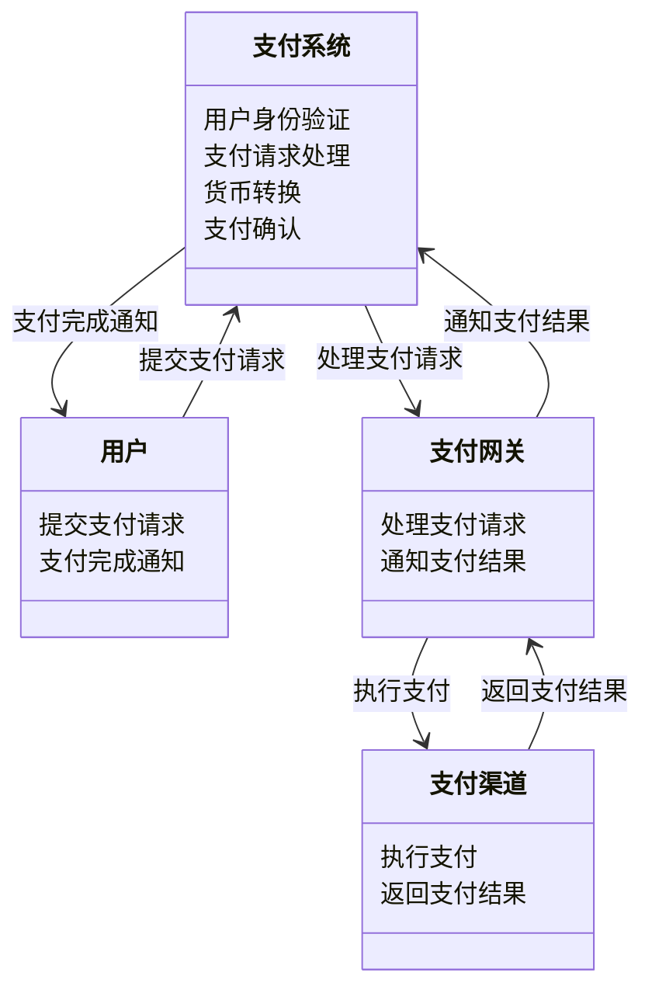
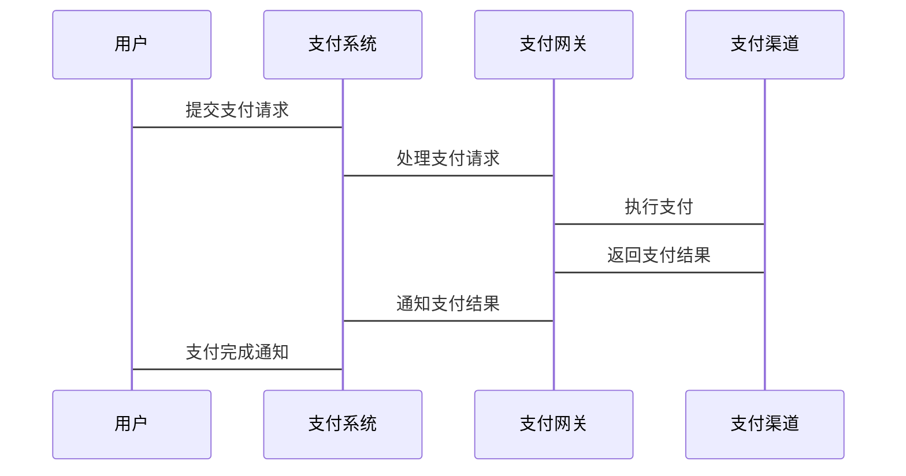

                 


# 彼得林奇如何看待公司的跨境支付策略对增长的影响

## 关键词
跨境支付、支付策略、彼得林奇、公司增长、支付技术

## 摘要
本文深入探讨了彼得林奇对于公司跨境支付策略在促进企业增长方面的影响。从跨境支付的基本概念、市场环境到具体策略的实施，以及支付技术的创新，文章详细分析了这些因素如何共同作用，为企业带来增长动力。通过案例分析和理论探讨，本文揭示了跨境支付策略在企业战略中的重要性，并提供了可操作的建议。

---

# 第一部分: 背景介绍

## 第1章: 跨境支付的定义与现状

### 1.1 跨境支付的定义

跨境支付是指在不同国家或地区之间进行的货币转移或资金结算活动。其核心目的是满足国际贸易、旅游、投资等多种需求，实现资金在全球范围内的流通。跨境支付的范围涵盖个人、企业和政府机构，涉及的金额从小额交易到大额资金转移不等。

#### 跨境支付的分类与特点
- **国际支付**：涉及不同国家的货币兑换和资金转移。
- **跨境电子支付**：通过电子渠道（如在线支付平台）完成的支付活动。
- **本地支付**：在特定国家或地区的支付活动，但涉及跨国企业的业务扩展。

### 1.2 跨境支付的现状与趋势

跨境支付的市场规模庞大，近年来随着全球化和电子商务的快速发展，其增长趋势显著。根据统计，2023年全球跨境支付市场规模超过数万亿美元，年增长率保持在5%以上。支付技术的创新，如区块链和人工智能的应用，进一步推动了跨境支付的效率和安全性。

---

## 第2章: 跨境支付的市场环境

### 2.1 跨境支付的主要参与者

- **传统银行**：作为跨境支付的主要渠道，提供汇款、信用证等服务。
- **支付平台**：如 PayPal、支付宝等，通过互联网技术提供便捷的支付服务。
- **第三方支付机构**：提供支付处理、清算等服务，帮助企业和个人完成跨境支付。

### 2.2 跨境支付的区域特点

不同国家或地区的支付习惯、法规和货币政策差异显著。例如，欧元区的跨境支付相对统一，而新兴市场的支付系统则可能更加复杂，涉及多种货币和多层次的监管机构。

### 2.3 跨境支付的监管环境

跨境支付受到各国中央银行和国际监管机构的严格监管。例如，欧盟的支付服务指令（PSD2）要求支付机构提高透明度并保护用户数据安全。

---

# 第二部分: 跨境支付策略对增长的影响

## 第3章: 跨境支付策略的核心要素

### 3.1 跨境支付策略的定义

跨境支付策略是企业在全球化背景下，为了实现资金的有效流动和管理而制定的一系列计划和措施。它包括支付方式的选择、风险控制、成本优化等内容。

#### 跨境支付策略的核心要素
- **支付目标**：明确支付的目的，如支持国际贸易、优化资金流动。
- **支付渠道**：选择合适的支付工具和平台。
- **风险管理**：防范汇率波动、支付失败等风险。
- **成本控制**：通过优化支付流程降低交易成本。

### 3.2 跨境支付策略的实施步骤

- **确定支付目标与范围**：明确支付的目的和涉及的国家或地区。
- **选择支付工具与渠道**：根据业务需求选择合适的支付平台。
- **制定风险管理策略**：建立风险预警机制和应对措施。
- **监测与优化支付策略**：定期评估支付效果并进行调整。

---

## 第4章: 跨境支付策略对增长的影响

### 4.1 跨境支付策略对企业的直接影响

- **提升支付效率与降低成本**：通过选择高效的支付工具，减少交易时间并降低成本。
- **扩大市场覆盖与客户群体**：支持企业进入新市场，吸引更多的客户。
- **提高客户满意度与忠诚度**：便捷的支付体验增强客户对企业的信任。

### 4.2 跨境支付策略对行业的间接影响

- **促进跨境贸易的便利化**：降低交易成本和时间，推动国际贸易增长。
- **推动支付技术的创新与普及**：新技术的应用提升了支付效率和安全性。
- **带动相关产业的发展与增长**：支付技术的进步促进了金融科技的发展。

---

# 第三部分: 跨境支付策略的实施与优化

## 第5章: 跨境支付策略的实施步骤

### 5.1 确定支付目标与范围

- **支付目标的设定**：明确支付是为了支持国际贸易还是内部资金管理。
- **支付范围的界定**：确定支付涉及的国家或地区。
- **目标与范围的可行性分析**：评估支付目标是否可行，支付范围是否合理。

### 5.2 选择支付工具与渠道

- **支付工具的分类与选择**：根据交易规模和需求选择合适的支付工具。
- **支付渠道的评估与优化**：比较不同支付渠道的优缺点，选择最适合的渠道。
- **支付工具与渠道的整合与协调**：确保支付工具与渠道的协同工作，提升支付效率。

### 5.3 制定支付风险管理策略

- **跨境支付的主要风险**：包括汇率波动、支付失败、欺诈风险等。
- **风险管理策略的制定**：建立风险预警机制，制定应对措施。
- **风险管理工具与方法**：使用保险、备用支付渠道等工具降低风险。

### 5.4 监测与优化支付策略

- **支付策略的监测与评估**：定期监测支付效果，评估策略的有效性。
- **支付策略的优化与调整**：根据监测结果优化支付策略，调整支付工具和渠道。

---

## 第四部分: 超级系统分析与架构设计方案

### 4.1 问题场景介绍

在制定跨境支付策略时，企业需要考虑支付系统的整体架构，确保支付过程的安全性和高效性。

### 4.2 项目介绍

以某跨国企业为例，其支付系统需要支持多货币、多地区的支付需求。

### 4.3 系统功能设计（领域模型Mermaid类图）



### 4.4 系统架构设计（Mermaid架构图）


### 4.5 系统接口设计

- **支付请求接口**：用户提交支付请求，系统处理并转发给支付网关。
- **支付结果接口**：支付网关返回支付结果，系统通知用户。

### 4.6 系统交互设计（Mermaid序列图）



---

## 第五部分: 项目实战

### 5.1 环境安装

- 安装Python和相关库（如 requests、json）

### 5.2 系统核心实现源代码

```python
import requests
import json

def submit_payment_request(amount, currency, recipient):
    # 提交支付请求
    data = {
        'amount': amount,
        'currency': currency,
        'recipient': recipient
    }
    response = requests.post('https://paymentsystem/api/pay', json=data)
    return response.json()

def process_payment(amount, currency, recipient):
    try:
        response = submit_payment_request(amount, currency, recipient)
        if response['status'] == 'success':
            return 'Payment completed successfully.'
        else:
            return 'Payment failed. Please try again.'
    except Exception as e:
        return f'Payment error: {str(e)}'

# 示例调用
print(process_payment(100, 'USD', 'recipient@example.com'))
```

### 5.3 代码应用解读与分析

- **submit_payment_request**：向支付系统提交支付请求，返回响应结果。
- **process_payment**：处理支付请求，处理成功或失败的情况，并返回相应的结果。

### 5.4 实际案例分析和详细讲解

假设一家企业需要向海外供应商支付货款，使用上述代码提交支付请求。系统会通过支付网关将请求转发给支付渠道，完成支付后返回结果。

### 5.5 项目小结

通过代码实现，我们可以看到支付流程的高效性和安全性。企业可以根据实际需求调整代码，实现个性化的支付策略。

---

## 第六部分: 最佳实践 tips、小结、注意事项、拓展阅读

### 6.1 小结

彼得林奇强调，跨境支付策略是企业全球化战略的重要组成部分。通过优化支付流程、降低风险、提高效率，企业可以实现更快的增长。

### 6.2 注意事项

- **风险管理**：始终将风险管理放在首位，防范支付失败和欺诈风险。
- **技术选择**：选择合适的支付技术，确保系统的安全性和高效性。
- **合规性**：遵守相关法规和监管要求，确保支付活动的合法性。

### 6.3 拓展阅读

- 《支付系统设计与实现》
- 《区块链与跨境支付的创新应用》
- 彼得林奇关于投资策略的经典著作

---

## 作者：AI天才研究院 & 禅与计算机程序设计艺术

---

通过以上结构和内容，文章全面分析了彼得林奇对跨境支付策略的见解，并结合实际案例和技术实现，为企业制定有效的支付策略提供了参考。

