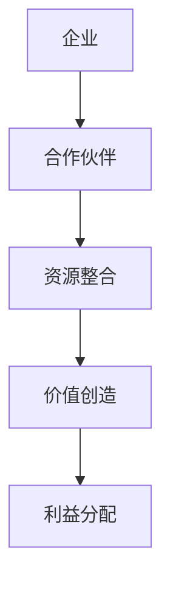
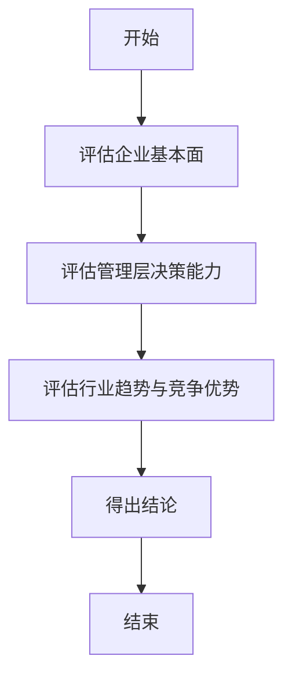
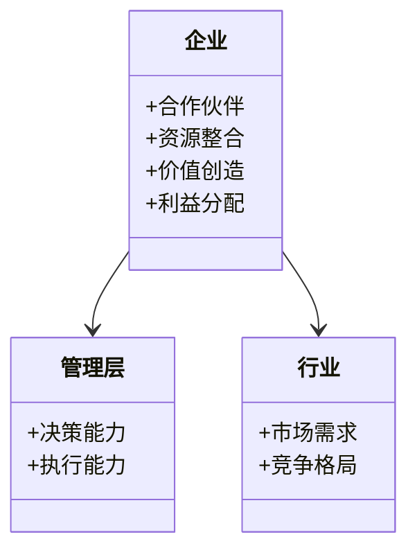
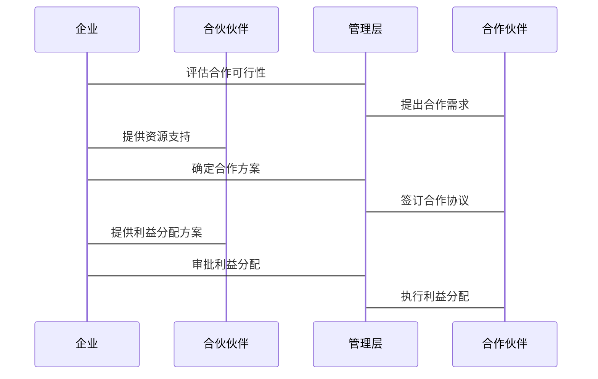

                 


# 彼得林奇如何看待公司的跨界合作策略

## 关键词：彼得·林奇，跨界合作，投资策略，企业合作，风险管理，价值创造

## 摘要：本文深入分析了彼得·林奇在投资过程中如何看待公司的跨界合作策略。通过详细阐述跨界合作的定义、类型、成功要素，以及彼得·林奇的核心分析框架，本文为投资者和企业管理者提供了深刻的投资洞察和实践指南。结合实际案例和数学模型，本文揭示了如何通过有效的跨界合作策略实现企业价值最大化，帮助读者在复杂多变的商业环境中做出明智决策。

---

## 第一部分: 背景介绍

### 第1章: 跨界合作的定义与背景

#### 1.1 跨界合作的定义
##### 1.1.1 跨界合作的定义与内涵
跨界合作是指不同行业或领域的组织或个人通过资源共享、优势互补，共同开发新产品、开拓新市场或解决复杂问题的合作模式。其核心在于突破行业界限，创造协同效应。

##### 1.1.2 跨界合作的背景与现状
在数字化时代，技术进步和市场竞争的加剧使得企业单靠自身资源难以应对复杂挑战。跨界合作成为企业创新和增长的重要驱动力。例如，科技公司与传统制造业的合作催生了许多智能化产品。

##### 1.1.3 跨界合作对企业发展的意义
跨界合作能够帮助企业快速获取新资源、拓展市场、降低风险，并在新兴领域占据先机。通过合作，企业可以实现从传统模式向创新模式的转型，增强竞争力。

#### 1.2 彼得·林奇与投资策略
##### 1.2.1 彼得·林奇的投資理念
彼得·林奇是全球著名投资家，强调长期价值投资和基本面分析。他认为，企业跨界合作是判断公司未来发展潜力的重要指标。

##### 1.2.2 彼得·林奇对企业跨界合作的关注
林奇认为，成功的跨界合作能够为公司带来新的增长点，并提升其在行业中的竞争力。他特别关注合作的可行性和长期价值。

##### 1.2.3 彼得·林奇的投資成功案例
例如，林奇曾投资于一家与科技公司合作的传统制造企业，通过技术整合实现了业绩翻倍。

#### 1.3 跨界合作的驱动因素
##### 1.3.1 技术进步与跨界合作
技术的快速发展推动了跨界合作，例如人工智能与医疗行业的结合。

##### 1.3.2 市场竞争与跨界合作
市场竞争的加剧促使企业寻求外部合作以保持竞争优势。

##### 1.3.3 企业战略调整与跨界合作
企业为了适应市场变化，通过跨界合作调整战略，实现多元化发展。

#### 1.4 本章小结
本章通过定义跨界合作，分析其背景和意义，并结合彼得·林奇的投资理念，揭示了跨界合作在企业发展中的重要性。

---

## 第二部分: 核心概念与联系

### 第2章: 跨界合作的核心要素

#### 2.1 跨界合作的类型
##### 2.1.1 横向跨界合作
指同一行业内的企业之间的合作，例如两家科技公司共同开发新技术。

##### 2.1.2 纵向跨界合作
指不同行业之间的企业合作，例如科技公司与传统制造业的合作。

##### 2.1.3 混合跨界合作
结合横向和纵向的合作模式，形成复杂的协同效应。

#### 2.2 跨界合作的核心要素对比
##### 2.2.1 合作伙伴的选择标准
- 财务状况
- 技术能力
- 市场地位

##### 2.2.2 资源整合的关键点
- 技术资源
- 市场资源
- 人力资源

##### 2.2.3 风险分担与利益分配
- 风险分担机制
- 利益分配比例

#### 2.3 跨界合作的ER实体关系图


---

## 第三部分: 算法原理讲解

### 第3章: 彼得·林奇的跨界合作评估算法

#### 3.1 算法原理
##### 3.1.1 企业基本面分析
- 净利润增长率
- 营业收入增长率
- 资产负债率

##### 3.1.2 管理层决策能力评估
- 管理团队的经验
- 决策的透明度
- 执行力

##### 3.1.3 行业趋势与竞争优势
- 市场需求
- 行业竞争格局
- 企业的核心竞争力

#### 3.2 算法流程图


#### 3.3 数学模型与公式
##### 3.3.1 净利润增长率公式
$$ 净利润增长率 = \frac{净利润增长量}{净利润基期} \times 100\% $$

##### 3.3.2 市盈率计算公式
$$ 市盈率 = \frac{股价}{每股收益} $$

#### 3.4 通俗易懂的举例说明
##### 3.4.1 净利润增长率的实例
假设某公司去年净利润为100万，今年净利润为120万，净利润增长率为20%。

##### 3.4.2 市盈率的实例
假设某公司每股收益为2元，股价为40元，则市盈率为20。

---

## 第四部分: 系统分析与架构设计

### 第4章: 跨界合作的系统分析与架构设计

#### 4.1 问题场景介绍
如何通过系统化的方法评估和实施跨界合作，以实现企业价值最大化。

#### 4.2 系统功能设计
##### 4.2.1 领域模型mermaid类图


#### 4.3 系统架构设计
##### 4.3.1 系统架构图


#### 4.4 系统接口设计
##### 4.4.1 接口描述
- 合作伙伴接口：用于资源整合和价值创造。
- 利益分配接口：用于分配合作收益。

#### 4.5 系统交互mermaid序列图


---

## 第五部分: 项目实战

### 第5章: 跨界合作的项目实战

#### 5.1 环境安装
- 安装必要的开发工具和依赖库。

#### 5.2 核心代码实现
##### 5.2.1 企业基本面分析代码
```python
def calculate_profit_growth(last_year_profit, current_year_profit):
    return (current_year_profit - last_year_profit) / last_year_profit * 100
```

##### 5.2.2 市盈率计算代码
```python
def calculate_pe_ratio(stock_price, earnings_per_share):
    return stock_price / earnings_per_share
```

#### 5.3 代码应用解读与分析
##### 5.3.1 企业基本面分析的应用
通过上述代码，投资者可以快速计算企业的净利润增长率，评估其盈利能力。

##### 5.3.2 市盈率计算的应用
市盈率帮助企业评估企业的估值是否合理，为投资决策提供依据。

#### 5.4 案例分析
##### 5.4.1 案例背景
某科技公司与传统制造企业的合作项目。

##### 5.4.2 实施步骤
1. 评估企业基本面。
2. 确定合作伙伴。
3. 签订合作协议。
4. 实施资源整合。
5. 分配利益。

##### 5.4.3 分析结果
通过合作，双方实现了技术创新和市场拓展，提升了企业价值。

#### 5.5 项目小结
本项目展示了如何通过系统化的跨界合作策略实现企业价值最大化，为投资者和企业管理者提供了宝贵的实践经验。

---

## 第六部分: 最佳实践 tips

### 第6章: 跨界合作的最佳实践 tips

#### 6.1 小结
成功的跨界合作需要企业具备清晰的战略目标、强大的执行力和灵活的应对能力。

#### 6.2 注意事项
- 合作伙伴的选择至关重要。
- 风险分担与利益分配需明确。
- 合作过程中需保持良好的沟通与协调。

#### 6.3 拓展阅读
推荐阅读彼得·林奇的相关著作，深入了解其投资理念和跨界合作策略。

---

## 作者：AI天才研究院/AI Genius Institute & 禅与计算机程序设计艺术 /Zen And The Art of Computer Programming

---

**全文完**

