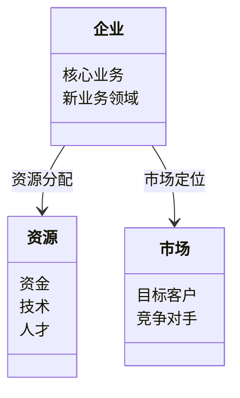

                 


# 彼得林奇如何看待公司的跨界经营策略

## 关键词：彼得林奇、跨界经营、投资策略、企业战略、风险管理

## 摘要：本文深入探讨了彼得林奇对公司的跨界经营策略的看法，结合其投资理念，分析了跨界经营的成功案例、失败教训、理论模型和实际操作中的关键因素。通过系统分析和项目实战，总结了跨界经营中的最佳实践和注意事项，为读者提供了全面的视角和实用的建议。

---

# 第一部分: 背景介绍

## 第1章: 跨界經營的定义与背景

### 1.1 跨界經營的定义

跨界经营（Cross-Business Strategy）是指企业在原有核心业务的基础上，拓展到与主业相关或不完全相关的领域，以实现多元化发展和竞争优势。其本质是通过资源整合和能力扩展，提升企业的市场影响力和抗风险能力。

### 1.2 跨界經營的背景与动因

#### 1.2.1 当前经济环境的变化
- 经济全球化和信息化的推动，企业需要不断拓展新的市场和领域。
- 行业界限模糊，跨界经营成为企业创新的重要手段。
- 技术进步和客户需求的变化，促使企业寻求新的增长点。

#### 1.2.2 企业发展的新趋势
- 从单一业务向多元化业务转型，提升企业竞争力。
- 通过跨界经营实现规模经济和协同效应。
- 应对市场竞争加剧，寻找新的利润增长点。

#### 1.2.3 跨界經營的动因分析
- 市场机会：新兴领域的崛起为企业提供了跨界的机会。
- 资源利用：充分利用现有资源，提升资产利用率。
- 竞争压力：避免单一业务的风险，分散投资。

### 1.3 跨界經營的核心要素

#### 核心概念组成
| 核心要素 | 描述 |
|----------|------|
| 核心能力 | 企业在某一领域的竞争优势和专长。 |
| 资源配置 | 资金、技术、人才等资源的合理分配。 |
| 市场定位 | 明确新领域的目标市场和竞争对手。 |
| 协同效应 | 各业务之间的资源共享和优势互补。 |
| 风险管理 | 识别、评估和控制跨界经营中的风险。 |

#### 1.3.1 跨界經營的边界与外延
- 跨界經營的边界：企业核心业务与新领域的界定。
- 跨界經營的外延：从相关领域到完全不相关的领域。

#### 1.3.2 跨界經營的模式分类
- 横向扩展：在同一产业链中扩展。
- 纵向整合：上下游产业的整合。
- 多元化发展：进入完全不同的领域。

---

# 第二部分: 彼得林奇的投资理念

## 第2章: 彼得林奇的投资哲学

### 2.1 投资的核心理念

#### 2.1.1 投资的本质
- 投资是通过购买和持有资产，以获得未来收益的行为。
- 价值投资：寻找被市场低估的优质企业。

#### 2.1.2 投资的长期视角
- 长期投资：关注企业的长期价值，而非短期波动。
- 耐心持有：持有优质资产，等待其价值增长。

#### 2.1.3 投资的纪律性原则
- 遵循投资策略，避免情绪化决策。
- 严格止损：控制风险，避免重大损失。

### 2.2 彼得林奇的选股标准

#### 2.2.1 选股的三大标准
- 好行业：选择具有增长潜力的行业。
- 好公司：管理优秀、财务健康的企业。
- 好价格：低于内在价值的市场价格。

#### 2.2.2 财务健康状况的评估
- 盈利能力：ROE（净资产收益率）高。
- 财务杠杆：低负债率。
- 现金流：稳定的正现金流。

#### 2.2.3 管理层的品质要求
- 诚信可靠：管理层无重大违规记录。
- 专注专业：专注于主业，不断创新。
- 透明沟通：与投资者保持良好沟通。

### 2.3 跨界經營在投资中的意义

#### 2.3.1 跨界經營对企业价值的影响
- 提升企业抗风险能力。
- 增强企业综合竞争力。
- 为投资者创造更多价值。

#### 2.3.2 跨界經營对投资决策的启示
- 关注企业的跨界能力：是否具备核心竞争力。
- 评估跨界风险：是否超出企业能力范围。
- 考察管理层的战略眼光：是否能有效整合资源。

#### 2.3.3 跨界經營的风险与机会
- 机会：开拓新市场，创造新利润。
- 风险：资源分散，管理难度增加。

---

# 第三部分: 跨界經營的成功案例分析

## 第3章: 跨界經營的成功案例

### 3.1 苹果公司的跨界經營

#### 3.1.1 从科技到音乐的跨界
- iTunes的推出：改变数字音乐分销方式。
- iPod的成功：将音乐播放器与科技结合。
- 苹果音乐的整合：构建完整的音乐生态。

#### 3.1.2 从音乐到金融的跨界
- Apple Pay的推出：进入移动支付领域。
- 智能手表的金融服务：整合支付功能。
- 金融科技的创新：推动金融服务数字化。

#### 3.1.3 跨界經營的成功经验
- 核心能力的延展：基于技术创新，扩展新领域。
- 用户体验的统一：保持品牌一致性。
- 生态系统的构建：形成协同效应。

### 3.2 谷歌的跨界經營

#### 3.2.1 从搜索引擎到人工智能的跨界
- Google Search的优化：提升搜索算法。
- Google Ads的推广：发展在线广告业务。
- 谷歌大脑的开发：推动AI技术进步。

#### 3.2.2 从人工智能到自动驾驶的跨界
- Waymo的成立：专注自动驾驶技术。
- 谷歌地图的扩展：整合自动驾驶数据。
- 谷歌助手的推出：将AI应用于生活助手。

#### 3.2.3 跨界經營的战略布局
- 技术驱动：依托AI技术，扩展新领域。
- 开放合作：与多家企业合作，共享资源。
- 长期投入：持续研发投入，保持技术领先。

### 3.3 亚马逊的跨界經營

#### 3.3.1 从电商到云计算的跨界
- 亚马逊AWS的推出：提供云服务。
- SaaS模式的推广：构建软件服务平台。
- 云计算生态的建设：形成完整的云服务体系。

#### 3.3.2 从云计算到智能硬件的跨界
- Alexa的推出：智能音箱领域的开拓。
- 智能家居的整合：构建物联网生态。
- 亚马逊设备的多样化：扩展硬件产品线。

#### 3.3.3 跨界經營的协同效应
- 电商与云服务的协同：数据共享，提升用户体验。
- 云计算与智能硬件的协同：形成完整的智能解决方案。
- 全球化布局：拓展国际市场，实现规模效应。

---

# 第四部分: 跨界經營的理论模型

## 第4章: 跨界經營的理论模型

### 4.1 跨界經營的核心能力

#### 4.1.1 核心能力的定义
- 核心能力：企业在某一领域中独特的竞争优势。
- 核心竞争力：难以被竞争对手模仿的能力。

#### 4.1.2 核心能力的构建
- 技术创新：研发投入，保持技术领先。
- 人才培养：引进和培养核心人才。
- 品牌建设：提升品牌影响力，增强客户忠诚度。

#### 4.1.3 核心能力的维持
- 持续创新：适应市场变化，不断优化产品。
- 资源整合：充分利用内部资源，提升效率。
- 战略调整：根据市场变化，及时调整战略。

### 4.2 跨界經營的市场定位

#### 4.2.1 市场定位的策略选择
- 价格定位：根据目标市场的价格敏感性，制定合理的价格策略。
- 产品定位：明确产品的核心卖点，满足目标客户的需求。
- 品牌定位：建立独特的品牌形象，增强市场竞争力。

#### 4.2.2 市场定位的动态调整
- 市场变化：根据市场变化，及时调整定位。
- 竞争分析：分析竞争对手的定位，找到差异化策略。
- 客户反馈：通过客户反馈，优化市场定位。

#### 4.2.3 市场定位与企业战略的关系
- 战略决定定位：企业战略指导市场定位的选择。
- 定位影响战略：市场定位影响企业的资源分配和业务拓展。

### 4.3 跨界經營的协同效应

#### 4.3.1 协同效应的定义
- 协同效应：企业各业务之间资源整合带来的效益提升。
- 1+1>2：通过协同效应，实现效益最大化。

#### 4.3.2 协同效应的实现路径
- 资源共享：共享技术、人才、渠道等资源。
- 优势互补：各业务之间互相支持，形成合力。
- 流程优化：优化业务流程，提升效率。

#### 4.3.3 协同效应的衡量
- 效益提升：业务协同后，整体效益的提升。
- 成本降低：资源共享后，成本的降低。
- 市场扩展：协同效应带来的市场份额增加。

---

## 第5章: 跨界經營的策略分析

### 5.1 跨界經營的风险管理

#### 5.1.1 风险评估
- 市场风险：新领域市场的不确定性。
- 运营风险：跨界经营可能带来的管理难度增加。
- 财务风险：资金投入和回报的不确定性。

#### 5.1.2 风险控制
- 风险分散：通过多元化投资，分散风险。
- 风险预警：建立风险预警机制，及时发现潜在风险。
- 风险应对：制定应对策略，降低风险影响。

### 5.2 跨界經營的竞争优势

#### 5.2.1 核心竞争优势
- 技术优势：拥有核心技术，形成壁垒。
- 资源优势：丰富的资源储备，支持业务扩展。
- 品牌优势：强大的品牌影响力，吸引客户。

#### 5.2.2 竞争策略
- 差异化策略：通过独特的产品或服务，吸引目标客户。
- 成本领先策略：通过规模化生产，降低成本，提高竞争力。
- 快速迭代策略：快速响应市场需求，及时调整产品和服务。

### 5.3 跨界經營的实施步骤

#### 5.3.1 业务评估
- 评估现有业务的核心竞争力。
- 分析新领域的市场潜力和风险。

#### 5.3.2 资源规划
- 制定资源分配计划，确保资源充足。
- 优化资源配置，提高效率。

#### 5.3.3 战略执行
- 制定详细的实施计划，明确各阶段目标。
- 组建专业团队，确保执行力。

#### 5.3.4 监控与调整
- 定期监控业务进展，评估效果。
- 根据市场反馈，及时调整策略。

---

## 第六部分: 跨界經營的系统分析

## 第6章: 跨界經營的系统架构设计

### 6.1 系统功能设计

#### 6.1.1 领域模型
- 领域模型：企业跨界经营的业务领域和功能模块。
- 实体关系：各实体之间的关系和交互。



### 6.2 系统架构设计

#### 6.2.1 架构设计
- 分层架构：将系统划分为业务层、数据层和表现层。
- 微服务架构：各业务模块独立开发和部署。


### 6.3 系统接口设计

#### 6.3.1 接口设计
- RESTful API：用于不同系统之间的数据交互。
- WebSocket：实时通信，支持动态数据更新。

### 6.4 系统交互流程

#### 6.4.1 交互流程
- 用户请求：通过API Gateway发送请求。
- 服务层处理：解析请求，调用相应的服务。
- 数据库操作：进行数据查询或更新。
- 响应返回：将结果返回给用户。

---

## 第七部分: 跨界經營的项目实战

## 第7章: 跨界經營的项目实战

### 7.1 环境搭建

#### 7.1.1 开发环境
- 操作系统：Linux或Windows。
- 开发工具：IntelliJ IDEA或PyCharm。
- 依赖管理：使用Maven或pip管理依赖。

### 7.2 核心代码实现

#### 7.2.1 业务逻辑实现
- 跨界經營的核心算法实现。
- 资源分配和风险管理的代码实现。

```python
def cross_business_strategy():
    # 资源分配
    resources = allocate_resources()
    # 风险评估
    risk = assess_risk(resources)
    # 竞争分析
    competition = analyze_competition()
    return resources, risk, competition

# 示例代码
resources, risk, competition = cross_business_strategy()
print(f"资源分配：{resources}")
print(f"风险评估：{risk}")
print(f"竞争分析：{competition}")
```

#### 7.2.2 算法实现
- 使用机器学习算法进行市场预测。
- 优化算法：遗传算法、模拟退火等。

### 7.3 案例分析

#### 7.3.1 案例选择
- 选择具有代表性的企业跨界案例，如苹果、谷歌、亚马逊。
- 分析其跨界策略的实施过程和效果。

#### 7.3.2 项目总结
- 项目目标：通过分析成功案例，总结跨界经营的关键成功因素。
- 项目成果：提出可行的跨界经营策略，为其他企业提供借鉴。

---

## 第八部分: 跨界經營的最佳实践

## 第8章: 跨界經營的最佳实践

### 8.1 成功的关键因素

#### 8.1.1 核心能力的延展
- 基于现有核心能力，扩展新领域。
- 确保新业务与现有业务的协同。

#### 8.1.2 风险管理
- 建立完善的风险评估和控制体系。
- 定期监控，及时调整策略。

### 8.2 小结

#### 8.2.1 跨界經營的总结
- 跨界經營是企业发展的必然趋势。
- 成功的跨界经营需要战略规划和风险管理。

#### 8.2.2 跨界經營的未来展望
- 技术驱动的跨界经营将成为主流。
- 数据和人工智能将在跨界经营中发挥重要作用。

---

## 作者：AI天才研究院/AI Genius Institute & 禅与计算机程序设计艺术/Zen And The Art of Computer Programming

---

通过本文的系统分析和深入探讨，我们可以看到，彼得林奇对跨界经营的策略有着独到的见解。跨界经营不仅是企业发展的趋势，更是企业实现多元化发展、提升竞争力的重要手段。然而，跨界经营也伴随着巨大的风险和挑战，企业需要在战略规划、资源配置和风险管理等方面做好充分准备。希望本文能为企业在跨界经营中的决策提供有价值的参考和启发。

