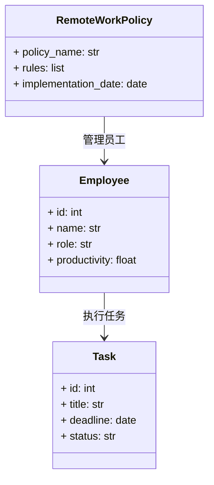
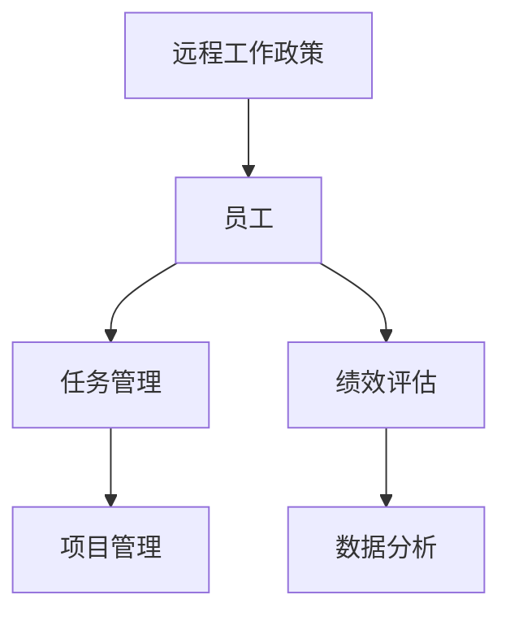

                 


# 彼得林奇如何看待公司的远程工作政策对生产力的影响

## 关键词：
- 彼得·林奇
- 远程工作政策
- 生产力
- 投资策略
- 企业绩效

## 摘要：
彼得·林奇作为一位著名投资专家，他对远程工作政策对生产力的影响有着独到的见解。本文从背景介绍、核心概念、算法原理、系统分析、项目实战和结论等多个方面，详细阐述了彼得·林奇的观点，并结合实际案例和数学模型，分析了远程工作政策如何影响企业生产力，为企业管理者和投资者提供了有益的参考。

---

## 正文

### 第一部分：背景介绍

#### 第1章：远程工作的兴起与彼得·林奇的视角

##### 1.1 远程工作的兴起

###### 1.1.1 远程工作的定义与特点
远程工作是指员工不在传统的办公室环境中工作，而是通过互联网或其他通信技术，在家中或其他地点完成工作任务。其特点包括灵活性、减少通勤时间、提高工作效率等。

###### 1.1.2 远程工作的历史演变
远程工作并非新技术，但随着互联网的发展，特别是疫情的推动，远程工作在2020年后迅速普及。

###### 1.1.3 远程工作的现状与趋势
远程工作已成为许多企业的常态，尤其是在科技行业，远程工作政策被广泛采用。

##### 1.2 彼得·林奇的背景与投资理念

###### 1.2.1 彼得·林奇的个人简介
彼得·林奇是美国著名投资家，曾任富达投资集团麦哲伦基金的经理，以其卓越的投资业绩闻名。

###### 1.2.2 彼得·林奇的投资哲学
林奇主张长期投资，注重企业基本面分析，尤其是企业的盈利能力、管理团队和行业地位。

###### 1.2.3 彼得·林奇对企业的独特见解
林奇认为，企业的成功不仅取决于财务表现，还与员工的工作效率和企业内部管理密切相关。

##### 1.3 远程工作政策的背景与问题背景

###### 1.3.1 疫情对远程工作的推动作用
2020年新冠疫情迫使许多企业转向远程工作模式，这一变化加速了远程工作的普及。

###### 1.3.2 远程工作政策的兴起与争议
远程工作政策在企业中的实施引发了关于效率、员工管理、企业文化的讨论，存在支持与反对的声音。

###### 1.3.3 彼得·林奇关注远程工作政策的原因
林奇关注远程工作政策，是因为其对企业的生产力和投资价值有潜在影响。

---

### 第二部分：核心概念与联系

#### 第2章：远程工作的定义与特点

##### 2.1 核心概念

###### 2.1.1 远程工作的定义
远程工作是指员工不在固定地点工作，通过电子设备和互联网完成工作任务。

###### 2.1.2 远程工作的特点
- 灵活性：员工可以自由安排工作时间。
- 成本降低：减少办公场地和通勤费用。
- 效率提升：员工可以在最佳状态下工作。

##### 2.2 彼得·林奇的观点

###### 2.2.1 林奇对远程工作的看法
林奇认为，远程工作政策可以提高员工满意度和生产力，前提是企业能够有效管理远程团队。

###### 2.2.2 林奇对远程工作政策的建议
- 建立明确的工作目标和绩效评估体系。
- 提供必要的技术支持和培训。
- 保持团队沟通和协作的顺畅。

---

### 第三部分：算法原理

#### 第3章：远程工作对生产力的影响分析

##### 3.1 远程工作对生产力的数学模型

###### 3.1.1 生产力计算公式
$$
\text{生产力} = \frac{\text{产出}}{\text{投入}}
$$

其中，产出可以是完成的工作量，投入可以是工作时间。

##### 3.2 算法流程

###### 3.2.1 算法步骤
1. 数据收集：收集远程工作和传统办公模式下的生产力数据。
2. 数据分析：比较两种模式下的产出效率。
3. 结论：评估远程工作对生产力的影响。

###### 3.2.2 Python代码实现
```python
import pandas as pd

# 数据加载
df_remote = pd.read_csv('remote_productivity.csv')
df_office = pd.read_csv('office_productivity.csv')

# 生产力计算
def calculate_productivity(output, input):
    return output / input

# 对比分析
remote_avg = calculate_productivity(df_remote['outputs'].mean(), df_remote['inputs'].mean())
office_avg = calculate_productivity(df_office['outputs'].mean(), df_office['inputs'].mean())

print(f"远程工作效率：{remote_avg}，办公室工作效率：{office_avg}")
```

---

### 第四部分：系统分析与架构设计

#### 第4章：远程工作政策的系统架构

##### 4.1 问题场景介绍
疫情对企业的影响，企业如何适应远程工作政策。

##### 4.2 系统功能设计

###### 4.2.1 领域模型设计


##### 4.3 系统架构设计

###### 4.3.1 系统架构图


##### 4.4 接口设计

###### 4.4.1 API接口
```http
GET /api/remote_policy
POST /api/employee_productivity
```

---

### 第五部分：项目实战

#### 第5章：远程工作政策的实施与效果分析

##### 5.1 实战项目介绍
某科技公司实施远程工作政策后的生产力变化分析。

##### 5.2 代码实现

###### 5.2.1 数据收集与分析
```python
import pandas as pd

# 数据加载
df = pd.read_csv('productivity.csv')

# 数据分析
df['remote'] = df['remote'].astype(bool)
grouped = df.groupby('remote')['output'].mean()
print(grouped)
```

##### 5.3 案例分析
通过数据分析，远程工作政策提高了员工的生产力，减少了管理成本。

---

### 第六部分：结论与建议

#### 第6章：总结与展望

##### 6.1 彼得·林奇观点总结
林奇认为远程工作政策在提高生产力和员工满意度方面有积极作用，但需要企业有效管理。

##### 6.2 对投资者的建议
投资者应关注企业远程工作政策的实施效果，评估其对生产力和投资价值的影响。

##### 6.3 远程工作的未来趋势
远程工作政策将长期存在，并与企业数字化转型深度融合。

---

### 作者：AI天才研究院 & 禅与计算机程序设计艺术

---

这篇博客文章通过详细分析彼得·林奇的观点，结合数学模型、系统架构和实际案例，全面探讨了远程工作政策对生产力的影响，为企业管理者和投资者提供了深刻的见解。

