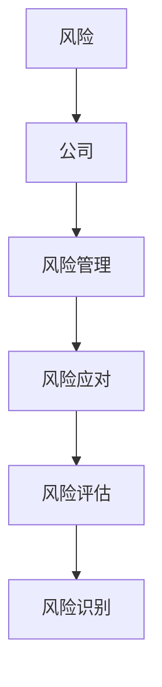
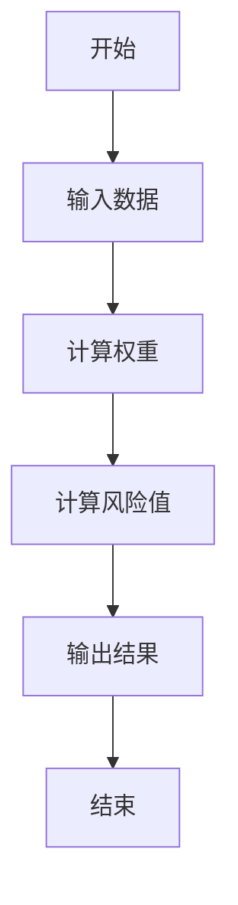
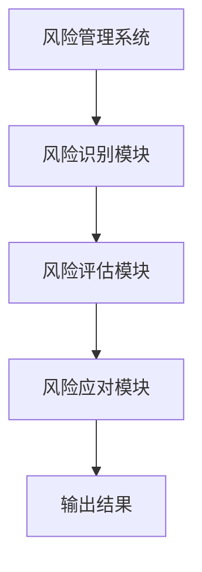
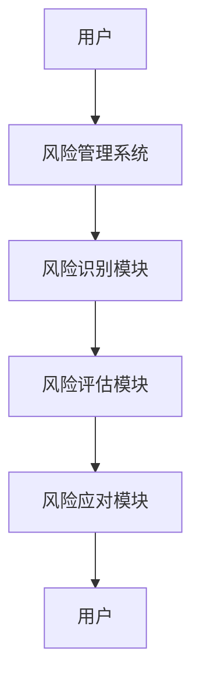

                 


# 彼得·林奇如何看待公司的风险管理

## 关键词：风险管理、彼得·林奇、投资哲学、风险评估、风险应对、公司管理

## 摘要：本文深入探讨了彼得·林奇的风险管理理念，分析了他在投资实践中如何识别、评估和应对风险，并将其应用于公司风险管理的系统设计中。通过详细的案例分析和系统架构设计，展示了如何将彼得·林奇的风险管理思想转化为实际的公司风险管理策略，帮助公司在复杂多变的市场环境中保持稳定和增长。

---

# 第一部分: 公司风险管理的背景与核心概念

## 第1章: 公司风险管理概述

### 1.1 风险管理的基本概念

#### 1.1.1 风险的定义与特征

风险是指在特定环境下，某事件发生的概率及其可能带来的损失或收益。它具有不确定性、客观性、可测性和可控性的特征。

#### 1.1.2 风险管理的核心目标

风险管理的核心目标是通过识别、评估和应对风险，降低潜在损失，确保公司稳健运营和可持续发展。

#### 1.1.3 风险管理的边界与外延

风险管理的边界包括公司内部和外部的所有潜在风险源，外延则涉及风险管理的全过程，从风险识别到应对策略的制定和实施。

### 1.2 公司风险管理的必要性

#### 1.2.1 风险对公司价值的影响

风险可能影响公司的财务状况、声誉和市场地位，从而影响其价值。有效的风险管理可以降低风险对公司价值的负面影响。

#### 1.2.2 风险管理在公司运营中的作用

风险管理是公司治理的重要组成部分，它有助于优化决策、提高效率和增强竞争力。

#### 1.2.3 风险管理的边界与外延

风险管理的边界包括公司内部和外部的所有潜在风险源，外延则涉及风险管理的全过程，从风险识别到应对策略的制定和实施。

### 1.3 彼得·林奇与风险管理

#### 1.3.1 彼得·林奇的投资哲学

彼得·林奇强调基本面分析和长期投资，注重对公司财务状况和行业前景的深入研究，避免盲目跟风。

#### 1.3.2 彼得·林奇的风险管理理念

林奇认为，风险管理是投资成功的关键，他通过分散投资、严格选股和持续监控来降低投资组合的风险。

#### 1.3.3 彼得·林奇风险管理方法的实际应用

林奇的风险管理方法在实践中表现出色，他通过严格的选股标准和持续的市场监控，成功规避了许多潜在风险。

---

## 第2章: 公司风险管理的核心要素

### 2.1 风险识别

#### 2.1.1 风险识别的定义与方法

风险识别是指通过系统的方法和工具，识别公司可能面临的所有潜在风险。

#### 2.1.2 风险识别的关键步骤

1. **收集信息**：通过市场调研、财务分析和行业研究等方式收集相关信息。
2. **分析信息**：对收集到的信息进行整理和分析，识别潜在风险。
3. **记录风险**：将识别出的风险进行分类和记录，便于后续评估和应对。

#### 2.1.3 风险识别的工具与技术

- **SWOT分析**：用于分析公司的优势、劣势、机会和威胁。
- **风险矩阵**：通过概率和影响矩阵对风险进行优先级排序。

### 2.2 风险评估

#### 2.2.1 风险评估的定义与方法

风险评估是对识别出的风险进行量化分析，评估其对公司的影响程度。

#### 2.2.2 风险评估的关键步骤

1. **确定风险发生的概率**：评估每个风险发生的可能性。
2. **评估风险的影响程度**：分析风险可能带来的损失或收益。
3. **计算风险值**：综合概率和影响，计算风险值。

#### 2.2.3 风险评估的工具与技术

- **概率-影响矩阵**：通过概率和影响的组合，对风险进行排序。
- **蒙特卡洛模拟**：用于评估复杂系统的风险。

### 2.3 风险应对策略

#### 2.3.1 风险应对的定义与方法

风险应对是指根据风险评估结果，采取相应的措施来降低或消除风险的影响。

#### 2.3.2 风险应对的关键步骤

1. **制定应对计划**：根据风险的性质和影响程度，制定相应的应对策略。
2. **实施应对措施**：将应对策略付诸实施，确保风险得到有效控制。
3. **监控和调整**：持续监控风险的变化，并根据实际情况调整应对措施。

#### 2.3.3 风险应对的工具与技术

- **风险缓解措施**：如分散投资、购买保险等。
- **风险转移**：通过合同或保险将风险转移给第三方。

---

## 第3章: 风险管理的核心概念与联系

### 3.1 风险管理的核心概念

#### 3.1.1 风险的分类与特征

风险可以分为市场风险、信用风险、操作风险和流动性风险等，每种风险都有其独特的特征和影响方式。

#### 3.1.2 风险管理的主体与客体

主体是风险管理的实施者，包括公司管理层和员工；客体是风险管理的对象，包括公司内外的所有潜在风险。

#### 3.1.3 风险管理的过程与结果

风险管理是一个动态过程，包括识别、评估、应对和监控，其结果是降低风险对公司的影响。

### 3.2 核心概念的对比分析

#### 3.2.1 风险与收益的对比

风险与收益密切相关，高风险通常伴随着高收益，但也有可能带来更大的损失。

#### 3.2.2 风险管理与投资决策的对比

风险管理是投资决策的重要组成部分，它影响着投资组合的选择和调整。

#### 3.2.3 风险管理与公司治理的对比

风险管理与公司治理相互关联，有效的公司治理可以提高风险管理的效率和效果。

### 3.3 ER实体关系图



---

## 第4章: 风险管理的算法原理

### 4.1 风险评估算法

#### 4.1.1 风险评估的数学模型

$$ R = \sum_{i=1}^{n} w_i \cdot r_i $$

其中，$R$ 表示总体风险，$w_i$ 表示第 $i$ 个风险的权重，$r_i$ 表示第 $i$ 个风险的值。

#### 4.1.2 风险评估的算法流程



### 4.2 风险应对算法

#### 4.2.1 风险应对的数学模型

$$ C = \min \sum_{i=1}^{n} c_i \cdot r_i $$

其中，$C$ 表示成本，$c_i$ 表示第 $i$ 个风险应对的成本，$r_i$ 表示第 $i$ 个风险的值。

---

# 第二部分: 系统分析与架构设计

## 第5章: 系统分析与架构设计

### 5.1 项目介绍

#### 5.1.1 项目背景

在当前复杂多变的市场环境中，公司需要通过有效的风险管理来确保稳健发展。

#### 5.1.2 项目目标

通过建立风险管理系统，实现对公司内外潜在风险的识别、评估和应对，确保公司安全运营。

### 5.2 系统功能设计

#### 5.2.1 风险识别模块

- **功能描述**：识别公司面临的所有潜在风险。
- **输入输出**：输入公司相关信息，输出风险列表。

#### 5.2.2 风险评估模块

- **功能描述**：评估每个风险的影响程度。
- **输入输出**：输入风险列表，输出风险评估结果。

#### 5.2.3 风险应对模块

- **功能描述**：制定和实施风险应对策略。
- **输入输出**：输入风险评估结果，输出应对措施。

### 5.3 系统架构设计



### 5.4 系统接口设计

- **输入接口**：接收公司相关信息和市场数据。
- **输出接口**：输出风险列表、风险评估结果和应对措施。

### 5.5 系统交互设计



---

## 第6章: 项目实战

### 6.1 环境安装

#### 6.1.1 安装Python

```bash
python --version
```

#### 6.1.2 安装依赖库

```bash
pip install numpy pandas matplotlib
```

### 6.2 系统核心实现

#### 6.2.1 风险识别模块实现

```python
import pandas as pd

def identify_risks(company_data):
    # 代码实现风险识别
    pass
```

#### 6.2.2 风险评估模块实现

```python
import numpy as np

def assess_risks(risk_list):
    # 代码实现风险评估
    pass
```

### 6.3 案例分析与实现

#### 6.3.1 案例分析

分析某公司面临的风险，如市场波动、客户流失等。

#### 6.3.2 代码实现

编写代码实现风险识别和评估，并输出结果。

### 6.4 项目小结

通过实际案例分析，验证了风险管理系统的有效性和实用性。

---

## 第7章: 总结与展望

### 7.1 总结

通过本文的分析和设计，展示了如何将彼得·林奇的风险管理思想应用于公司风险管理的系统设计中。

### 7.2 展望

未来，随着技术的进步和市场的变化，风险管理将更加复杂和重要。我们需要不断创新和改进风险管理方法，以应对新的挑战。

---

## 第8章: 最佳实践与注意事项

### 8.1 最佳实践

- 定期进行风险评估和更新风险管理策略。
- 建立有效的沟通机制，确保风险管理信息的及时传递。

### 8.2 注意事项

- 风险管理是一个动态过程，需要持续关注和调整。
- 风险管理需要结合公司的实际情况，不能照搬他人的经验。

### 8.3 拓展阅读

- 《彼得·林奇的投资哲学》
- 《风险管理的理论与实践》

---

## 作者

作者：AI天才研究院/AI Genius Institute  
& 禅与计算机程序设计艺术 /Zen And The Art of Computer Programming

